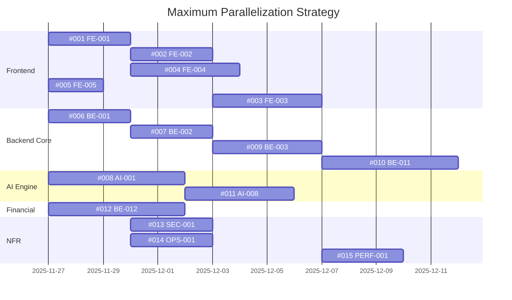
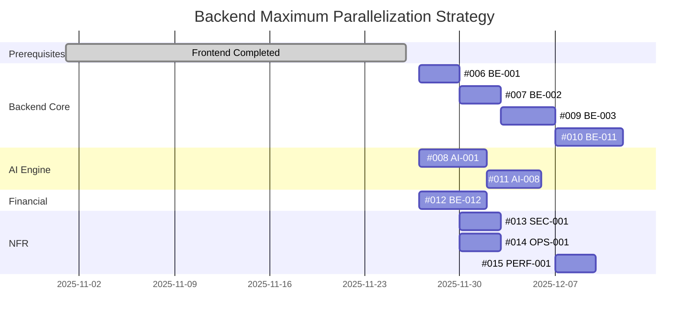

# ì‘ì—… ì˜ì¡´ 관계 ë° ì´ìŠˆ 문서 ì‘성
_Exported on 2025. 11. 29. at 12시 55분 27초 GMT+9 from Cursor (2.1.39)_

---

**User**

@docs/INTEGRATED_WBS_DAG.md ì— ëª…ì‹œëœ ì˜ì¡´ 관계를 정확하게 ì‘ì—…ì˜ ì„ í›„ 관계로 ì ìš©í•  수 ìˆëŠ” 구조로, @tasks ê²½ë¡œì— ìˆëŠ” ì‘ì—…ì˜ ëª…ì„¸ë“¤ì„ GitHub ì›ê²© ì €ì¥ì†Œ 프로ì íŠ¸ì—ì„œ 관리할 수 ìˆëŠ” í˜•íƒœì˜ Issue 문서로 ì‘성하고 싶어.

ì‘ì„±ëœ ë¬¸ì„œëŠ” @github-issues ê²½ë¡œì— ì‘ì—… 순서를 ì´ìŠˆ 넘버ë§ì— ë°˜ì˜í•œ 형태로 ì €ì¥í•´ì¤˜.
그리고 ì´ìŠˆ 수행 순서 (병렬 개발 가능한 정보까지 í¬í•¨)를 명시한 ë¬¸ì„œë„ ë³„ë„ë¡œ 하나 만들어줘.

---

**Cursor**

먼저 `tasks/` í´ë”ì˜ ëª¨ë“  ì‘ì—… 명세 파ì¼ë“¤ì„ ì½ì–´ì„œ GitHub Issueë¡œ 변환하겠습니다.

ì´ì œ 모든 ì‘ì—… 명세를 ì½ì—ˆìŠµë‹ˆë‹¤. ì˜ì¡´ 관계를 분ì„하여 GitHub Issue 형태로 변환하고 ì‘ì—… 순서를 ë°˜ì˜í•œ 넘버ë§ìœ¼ë¡œ ì €ì¥í•˜ê² ìŠµë‹ˆë‹¤.

```markdown
# [#001] 프로ì íŠ¸ ìƒì„± ë° Wizard 기본 ë ˆì´ì•„웃 PoC 구현

## Labels
`epic:EPIC_0_FE_PROTOTYPE`, `type:frontend`, `type:poc`, `priority:Must`, `effort:S`

## Description
사용ìê°€ ë¡œê·¸ì¸ í›„ '새 프로ì íŠ¸ 만들기'를 통해 템플릿(예비창업패키지 등)ì„ ì„ íƒí•˜ê³ , Wizardì˜ ê¸°ë³¸ 단계(Step) 네비게ì´ì…˜ì´ ë™ì‘하는 í™”ë©´ì„ êµ¬í˜„í•©ë‹ˆë‹¤.

## Scope
- 프로ì íŠ¸ ìƒì„± 모달/í˜ì´ì§€
- 템플릿 ì„ íƒ UI (ì¹´ë“œ 형태)
- Wizard ë ˆì´ì•„웃 (사ì´ë“œë°”/ìƒë‹¨ 단계 표시 + ë©”ì¸ ì»¨í…츠 ì˜ì—­)
- Mock API ì—°ë™ (프로ì íŠ¸ ìƒì„±, 조회)

### Out of Scope
- 실제 ë¡œê·¸ì¸ ì¸ì¦(하드코딩 í† í° ì‚¬ìš©)
- 세부 í¼ í•„ë“œ 구현(ë‹¤ìŒ Task)
- ëª¨ë°”ì¼ ë°˜ì‘형 완벽 지ì›

## Requirements
- **템플릿 ì„ íƒ**: '예비창업패키지', '초기창업패키지', 'ì€í–‰ìš©' 3가지 ë”미 옵션 제공
- **Wizard 프레ì„**: ì¢Œì¸¡ì— '1. 문제정ì˜', '2. 해결방안', '3. ì‹œì¥ë¶„ì„' 등 챕터 목ë¡ì´ ë³´ì´ê³ , í´ë¦­ ì‹œ ë©”ì¸ ì˜ì—­ì´ 전환
- **ìƒíƒœ 관리**: `useProjectStore`(Zustand 등)를 통해 í˜„ì¬ ì„ íƒëœ 단계와 프로ì íŠ¸ 메타ë°ì´í„° 관리

## Technical Stack
- React + Vite + TypeScript
- Tailwind CSS (스타ì¼ë§)
- React Router (ë¼ìš°íŒ…)
- Zustand (ìƒíƒœ 관리)

## Implementation Steps
1. React Routerë¡œ `/projects/new` ë° `/projects/:id/wizard` 경로 설정
2. 템플릿 ì„ íƒ ì¹´ë“œ ì»´í¬ë„ŒíŠ¸ 구현
3. WizardLayout ì»´í¬ë„ŒíŠ¸ 구현 (Sidebar + Content Area)
4. Zustand Storeì— createProject ì•¡ì…˜ 구현 (Mock)

## Acceptance Criteria
- [ ] 사용ìê°€ í…œí”Œë¦¿ì„ ì„ íƒí•˜ë©´ Wizard 첫 화면으로 ì´ë™
- [ ] 사ì´ë“œë°” 메뉴 í´ë¦­ ì‹œ URLê³¼ ë©”ì¸ ì»¨í…츠가 변경
- [ ] React+Vite 기본 프로ì íŠ¸ê°€ ì…‹ì—…ë˜ì–´ ìˆìŒ

## Dependencies
- None (ì‹œì‘ì )

## Related Requirements
REQ-FUNC-001, REQ-FUNC-002

```

```markdown
# [#002] Wizard ì…ë ¥ í¼ ë° ìë™ì €ì¥ UI PoC 구현

## Labels
`epic:EPIC_0_FE_PROTOTYPE`, `type:frontend`, `type:poc`, `priority:Must`, `effort:S`

## Description
Wizardì˜ ê° ë‹¨ê³„(Step) ë‚´ì—ì„œ ì§ˆë¬¸ì— ë‹µë³€ì„ ì…력하는 í¼(Form)ì„ êµ¬í˜„í•˜ê³ , ì…ë ¥ ì‹œ ìë™ì €ì¥ ìƒíƒœ(ì €ì¥ ì¤‘... -> ì €ì¥ë¨)를 표시합니다.

## Scope
- Textarea, Input 등 기본 ì…ë ¥ ì»´í¬ë„ŒíŠ¸
- 필수 항목(Required) ê²€ì¦ UI
- Debounce ëœ ìë™ì €ì¥ Mocking
- 'ë‹¤ìŒ ë‹¨ê³„' 버튼 ë™ì‘ (Validation ì²´í¬)

### Out of Scope
- ë³µì¡í•œ Rich Text Editor
- 서버 실제 ì €ì¥(Mock으로 처리)

## Requirements
- **í¼ êµ¬ì„±**: ê° Stepì€ ì—¬ëŸ¬ ê°œì˜ ì§ˆë¬¸(Question)으로 구성
- **유효성 검사**: 필수 ì§ˆë¬¸ì´ ë¹„ì–´ìˆì„ 경우 '다ìŒ' 버튼 í´ë¦­ ì‹œ ì—러 메시지 표시하고 í¬ì»¤ìŠ¤ ì´ë™
- **ìë™ ì €ì¥**: 사용ìê°€ 타ì´í•‘ì„ ë©ˆì¶”ë©´ 1ì´ˆ ë’¤ 'ì €ì¥ ì¤‘...' 표시 후 'ì €ì¥ë¨'으로 변경 (Console 로그로 확ì¸)

## Technical Stack
- React Hook Form (í¼ ìƒíƒœ 관리)
- Zod (스키마 ê²€ì¦)
- UI Components (기존 공통 ì»´í¬ë„ŒíŠ¸ 활용)

## Implementation Steps
1. React Hook Formì„ ì‚¬ìš©í•˜ì—¬ StepForm ì»´í¬ë„ŒíŠ¸ 구현
2. AutoSaveIndicator ì»´í¬ë„ŒíŠ¸ 구현 (State 기반)
3. useDebounce í›…ì„ ì‚¬ìš©í•´ ì…ë ¥ 변경 ê°ì§€ ë° Mock Save 호출
4. Next 버튼 í´ë¦­ ì‹œ triggerValidation 호출 ë° ì—러 핸들ë§

## Acceptance Criteria
- [ ] EPIC0-FE-001ì˜ WizardLayoutì´ ì¤€ë¹„ë˜ì–´ ìˆìŒ
- [ ] 필수 항목 미ì…ë ¥ ì‹œ ë‹¤ìŒ ë‹¨ê³„ ì§„í–‰ì´ ì°¨ë‹¨ë¨
- [ ] ì…ë ¥ 중단 ì‹œ ìë™ìœ¼ë¡œ 'ì €ì¥ë¨' ìƒíƒœë¡œ 변경ë¨

## Dependencies
- #001 (EPIC0-FE-001)

## Related Requirements
REQ-FUNC-002, REQ-FUNC-007, REQ-FUNC-013

```

```markdown
# [#003] 사업계íšì„œ 초안 ìƒì„± ë° ë·°ì–´ UI PoC 구현

## Labels
`epic:EPIC_0_FE_PROTOTYPE`, `type:frontend`, `type:poc`, `priority:Must`, `effort:M`

## Description
ì…ë ¥ëœ ë°ì´í„°ë¥¼ 바탕으로 '초안 ìƒì„±'ì„ ìš”ì²­í•˜ê³ , ìƒì„±ëœ 문서(í…스트)를 í™”ë©´ì— ë³´ì—¬ì£¼ëŠ” ë·°ì–´/ì—디터를 구현합니다.

## Scope
- '초안 ìƒì„±' 버튼 ë° ë¡œë”© UI (Spinner/Progress)
- ìƒì„±ëœ 문서 ë·°ì–´ (Markdown ë˜ëŠ” Textarea)
- '내보내기(HWP/PDF)' 버튼 (Mock Alert)
- 섹션별 'AI 다시 쓰기' 버튼 UI

### Out of Scope
- 실제 LLM ì—°ë™(Dummy í…스트 반환)
- 실제 HWP 변환

## Requirements
- **ìƒì„± 트리거**: Wizard 마지막 단계 ë˜ëŠ” ë³„ë„ ë©”ë‰´ì—ì„œ '초안 ìƒì„±' 버튼 제공
- **ê²°ê³¼ 표시**: ìƒì„± 완료 후, 챕터별로 êµ¬ì¡°í™”ëœ í…스트가 ì—ë””í„°ì— ì±„ì›Œì§
- **AI ë³´ì¡°**: ê° í…스트 ë¸”ë¡ ì˜†ì— 'AI 보완' ì•„ì´ì½˜ 배치 (í´ë¦­ ì‹œ 예시 í…스트 변경)

## Technical Stack
- React Markdown (ë·°ì–´ìš©) ë˜ëŠ” Toast UI Editor (ì—디터용)
- Suspense / Loading State 처리

## Implementation Steps
1. DraftGenerationPage ì»´í¬ë„ŒíŠ¸ ìƒì„±
2. API 요청 시뮬레ì´ì…˜ (3ì´ˆ ë”œë ˆì´ í›„ Dummy Text 반환)
3. DocumentViewer ì»´í¬ë„ŒíŠ¸ 구현 (섹션별 í¸ì§‘ 가능)
4. Export 버튼 í´ë¦­ ì´ë²¤íŠ¸ 핸들러 (window.alert)

## Acceptance Criteria
- [ ] EPIC0-FE-002 완료 (ì…ë ¥ ë°ì´í„°ê°€ ìˆì–´ì•¼ 함)
- [ ] ìƒì„± 버튼 í´ë¦­ ì‹œ 로딩 후 ê²°ê³¼ í…스트가 표시ë¨
- [ ] 내보내기 버튼 í´ë¦­ ì‹œ 성공 메시지가 뜸

## Dependencies
- #002 (EPIC0-FE-002)

## Related Requirements
REQ-FUNC-003, REQ-FUNC-004, REQ-FUNC-011

```

```markdown
# [#004] ì¬ë¬´ ì…ë ¥ ë° ìœ ë‹› ì´ì½”노믹스 ì‹œê°í™” UI PoC 구현

## Labels
`epic:EPIC_0_FE_PROTOTYPE`, `type:frontend`, `type:poc`, `priority:Must`, `effort:M`

## Description
매출, 비용, ê³ ê° íšë“ 비용(CAC) 등 ì¬ë¬´ ë°ì´í„°ë¥¼ ì…력받고, ì´ë¥¼ ê·¸ë˜í”„(ì†ìµë¶„기ì , LTV/CAC)ë¡œ ì‹œê°í™”합니다.

## Scope
- ì¬ë¬´ ì „ìš© ì…ë ¥ í…Œì´ë¸” (ì—‘ì…€ ìŠ¤íƒ€ì¼ ë˜ëŠ” í¼)
- Chart.js / Recharts 를 활용한 ê·¸ë˜í”„ ë Œë”ë§
- 주요 지표(LTV, CAC, BEP) 카드 표시

### Out of Scope
- ë³µì¡í•œ ì—‘ì…€ ìˆ˜ì‹ ê³„ì‚°(간단한 사칙연산만 JSë¡œ 처리)

## Requirements
- **ì…ë ¥**: ê³ ê° ìˆ˜, ê°ë‹¨ê°€, ë³€ë™ë¹„, 고정비 ì…ë ¥ í•„ë“œ
- **즉시 ë°˜ì‘**: ì…ë ¥ ê°’ 변경 ì‹œ ì˜ˆìƒ ë§¤ì¶œ ë° ì´ìµ ê·¸ë˜í”„ê°€ 즉시 ì—…ë°ì´íŠ¸
- **경고**: LTV/CAC < 3 ì¸ ê²½ìš° 경고 뱃지 표시

## Technical Stack
- Recharts (차트 ë¼ì´ë¸ŒëŸ¬ë¦¬)
- React Table (ì„ íƒ ì‚¬í•­)

## Implementation Steps
1. FinancialInputForm ì»´í¬ë„ŒíŠ¸ 구현
2. Recharts 설치 ë° BreakEvenPointChart ì»´í¬ë„ŒíŠ¸ 구현
3. ì…ë ¥ ê°’ ë³€ê²½ì— ë”°ë¥¸ íŒŒìƒ ë³€ìˆ˜(매출, ì´ìµ) 계산 ë¡œì§ ì‘성 (util 함수)
4. DashboardLayoutì— í†µí•©

## Acceptance Criteria
- [ ] 프로ì íŠ¸ ìƒì„± 플로우(EPIC0-FE-001)와 ë…립ì ìœ¼ë¡œ 개발 가능하나, 네비게ì´ì…˜ ì—°ê²° í•„ìš”
- [ ] ì…ë ¥ ê°’ì„ ë°”ê¾¸ë©´ ê·¸ë˜í”„ê°€ 다시 그려ì§

## Dependencies
- #001 (EPIC0-FE-001) - 네비게ì´ì…˜ ì—°ê²°ìš©

## Parallelizable With
- #002, #003, #005 (ë…ë¦½ì  ê°œë°œ 가능)

## Related Requirements
REQ-FUNC-009, REQ-FUNC-012

```

```markdown
# [#005] PMF 진단 설문 ë° ë¦¬í¬íŠ¸ UI PoC 구현

## Labels
`epic:EPIC_0_FE_PROTOTYPE`, `type:frontend`, `type:poc`, `priority:Should`, `effort:S`

## Description
PMF ì§„ë‹¨ì„ ìœ„í•œ 설문(ê°ê´€ì‹/주관ì‹)ì„ ì œê³µí•˜ê³ , 진단 ê²°ê³¼ 리í¬íŠ¸(등급, 리스í¬, 제언)를 보여주는 í™”ë©´ì„ êµ¬í˜„í•©ë‹ˆë‹¤.

## Scope
- PMF 진단 설문 í˜ì´ì§€ (Wizard 형태 ë˜ëŠ” ë‹¨ì¼ í˜ì´ì§€)
- ë°ì´í„° 부족 경고 모달
- 진단 ê²°ê³¼ 리í¬íŠ¸ í˜ì´ì§€ (Score Gauge, 리스트 ë·°)

### Out of Scope
- 실제 진단 알고리즘

## Requirements
- **설문**: 약 10ê°œì˜ PMF 관련 문항 제공
- **ê²€ì¦**: 5ê°œ 미만 답변 ì‹œ '진단 불가' 메시지 표시
- **리í¬íŠ¸**: 'Product-Solution Fit' ë“±ì˜ ë‹¨ê³„ 표시와 함께 '주ì˜ì‚¬í•­' 리스트를 ì¹´ë“œ UIë¡œ 표시

## Technical Stack
- UI Components (Card, Gauge Chart 등)

## Implementation Steps
1. PMFSurveyPage ì»´í¬ë„ŒíŠ¸ 구현
2. Validation ë¡œì§ (답변 개수 ì²´í¬)
3. PMFReportView ì»´í¬ë„ŒíŠ¸ 구현 (게ì´ì§€ 차트, ë¦¬ìŠ¤í¬ ì¹´ë“œ)
4. Mock API (generatePmfReport) ì—°ë™

## Acceptance Criteria
- [ ] 설문 완료 ì‹œ 리í¬íŠ¸ í˜ì´ì§€ë¡œ ì´ë™í•¨
- [ ] 답변 수 부족 시 진단 불가 메시지 표시

## Dependencies
- None (ë…립 í˜ì´ì§€ë¡œ 구성 가능)

## Parallelizable With
- #001, #002, #003, #004 (ë…ë¦½ì  ê°œë°œ 가능)

## Related Requirements
REQ-FUNC-008, REQ-FUNC-010

```

```markdown
# [#006] 프로ì íŠ¸ ìƒì„± ë° í…œí”Œë¦¿ ëª©ë¡ API 구현

## Labels
`epic:EPIC_1_PASS_THE_TEST`, `type:backend`, `component:api`, `priority:Must`, `effort:M`

## Description
사용ìê°€ 프로ì íŠ¸ë¥¼ ìƒì„±í•  ë•Œ ì„ íƒí•  수 ìˆëŠ” 템플릿 목ë¡ì„ 제공하고, ì„ íƒëœ 템플릿으로 프로ì íŠ¸ 엔티티를 ìƒì„±í•˜ëŠ” 백엔드 API를 구현합니다.

## Scope
- `GET /projects/templates`: ì§€ì› í…œí”Œë¦¿ ëª©ë¡ ë°˜í™˜
- `POST /projects`: 프로ì íŠ¸ ìƒì„± (Project 엔티티, 초기 메타ë°ì´í„°)

### Out of Scope
- 사용ì ì¸ì¦ ë¡œì§(User ID는 토í°ì—ì„œ 추출 ë˜ëŠ” Mocking)

## Requirements
- **템플릿 ë°ì´í„°**: í•˜ë“œì½”ë”©ëœ ëª©ë¡ ì œê³µ ('KSTARTUP_2025', 'BANK_LOAN_2025' 등)
- **프로ì íŠ¸ ìƒì„±**: UUID ìƒì„±, `created_at` 설정, `status='draft'` 설정

## Technical Stack
- Java 17 + Spring Boot 3.x
- Spring Data JPA
- MySQL 8.x

## API Specification

### GET /projects/templates
**Response (200 OK):**
```json
[
  {
    "code": "KSTARTUP_2025",
    "name": "예비창업패키지",
    "description": "중소벤처기업부 예비창업패키지 ì–‘ì‹"
  }
]
```

### POST /projects
**Request:**
```json
{
  "template_code": "KSTARTUP_2025"
}
```

**Response (201 Created):**
```json
{
  "project_id": "uuid",
  "template_code": "KSTARTUP_2025",
  "status": "draft",
  "created_at": "2025-11-26T10:00:00Z"
}
```

## Implementation Steps
1. TemplateService: 템플릿 ëª©ë¡ í•˜ë“œì½”ë”© 반환 ë¡œì§ êµ¬í˜„
2. ProjectEntity: JPA/Hibernate 엔티티 ì •ì˜
3. ProjectController: POST /projects 엔드í¬ì¸íŠ¸ 구현
4. DB ì €ì¥ ë¡œì§ êµ¬í˜„

## Acceptance Criteria
- [ ] MySQL DB가 실행 중
- [ ] DBì— ìƒˆ Project 레코드가 ìƒì„±ë¨
- [ ] API 호출 ì‹œ 201 ìƒíƒœ 코드와 함께 프로ì íŠ¸ ì •ë³´ 반환

## Dependencies
- TASK-BE-INIT (프로ì íŠ¸ 초기 설정 - 완료 가정)

## Enables
- #007, #013, #014

## Related Requirements
REQ-FUNC-001

```

```markdown
# [#007] Wizard 단계별 답변 ì €ì¥/조회 API 구현

## Labels
`epic:EPIC_1_PASS_THE_TEST`, `type:backend`, `component:api`, `priority:Must`, `effort:M`

## Description
Wizardì˜ ê° ë‹¨ê³„ì—ì„œ 사용ìê°€ ì…력한 답변 ë°ì´í„°ë¥¼ ì €ì¥í•˜ê³  불러오는 API를 구현합니다.

## Scope
- `POST /projects/{id}/wizard/steps`: 답변 ì €ì¥ (Upsert)
- `GET /projects/{id}`: 프로ì íŠ¸ ì „ì²´ ìƒíƒœ ë° ë‹µë³€ 조회

### Out of Scope
- ë³µì¡í•œ 유효성 검사(단순 ì €ì¥ ìœ„ì£¼)

## Requirements
- **ë°ì´í„° 구조**: `wizard_answers` 컬럼(JSONB)ì— Key-Value 형태로 ì €ì¥
- **부분 ì—…ë°ì´íŠ¸**: 기존 ë‹µë³€ì„ ìœ ì§€í•˜ë©´ì„œ 새로운 답변만 병합(Merge)하거나 ë®ì–´ì“°ê¸°

## Technical Stack
- Java 17 + Spring Boot 3.x
- Spring Data JPA
- MySQL 8.x JSON 타ì…
- Hibernate Types (JSONB 매핑)

## API Specification

### POST /projects/{id}/wizard/steps
**Request:**
```json
{
  "step_id": "step_1_problem",
  "answers": {
    "q1": "창업 ë™ê¸°...",
    "q2": "해결하고ì 하는 문제..."
  }
}
```

**Response (200 OK):**
```json
{
  "status": "success",
  "updated_at": "2025-11-26T10:05:00Z"
}
```

### GET /projects/{id}
**Response (200 OK):**
```json
{
  "project_id": "uuid",
  "template_code": "KSTARTUP_2025",
  "wizard_answers": {
    "step_1_problem": {
      "q1": "...",
      "q2": "..."
    }
  }
}
```

## Implementation Steps
1. Project ì—”í‹°í‹°ì˜ wizard_answers í•„ë“œ(JSONB) 매핑 (Hibernate Types)
2. 답변 병합 ë¡œì§ êµ¬í˜„ (Service Layer)
3. Controller 엔드í¬ì¸íŠ¸ 구현
4. 단위 테스트 ì‘성

## Acceptance Criteria
- [ ] REQ-FUNC-001-BE-001 완료 (Project 엔티티 ì¡´ì¬)
- [ ] DBì˜ JSONB ì»¬ëŸ¼ì— ë‹µë³€ì´ ì €ì¥/ì—…ë°ì´íŠ¸ë¨
- [ ] 부분 ì—…ë°ì´íŠ¸ ì‹œ 기존 ë‹µë³€ì´ ìœ ì§€ë¨

## Dependencies
- #006 (REQ-FUNC-001-BE-001)

## Enables
- #009

## Related Requirements
REQ-FUNC-002, REQ-FUNC-013

```

```markdown
# [#008] 사업계íšì„œ ìƒì„± LLM 엔진 ë° í”„ë¡¬í”„íŠ¸ 구현

## Labels
`epic:EPIC_1_PASS_THE_TEST`, `type:ai`, `type:backend`, `component:ai-engine`, `priority:Must`, `effort:L`

## Description
Wizard 답변(JSON)ì„ ì…력받아, LangChain ë° LLM(Gemini)ì„ ì‚¬ìš©í•˜ì—¬ 섹션별 사업계íšì„œ ì´ˆì•ˆì„ ìƒì„±í•˜ëŠ” Python API를 구현합니다.

## Scope
- FastAPI 서버 구축
- `POST /generate`: 문서 ìƒì„± 엔드í¬ì¸íŠ¸
- Prompt Template 관리 (섹션별 프롬프트)
- LLM Gateway(Gemini) ì—°ë™

### Out of Scope
- ë³µì¡í•œ RAG(검색 ì¦ê°•)
- Fine-tuning

## Requirements
- **프롬프트 ì „ëµ**: 'Role: 전문 컨설턴트', 'Context: 사용ì 답변', 'Task: 섹션별 초안 ì‘성' êµ¬ì¡°ì˜ í”„ë¡¬í”„íŠ¸ ì²´ì´ë‹
- **출력 í¬ë§·**: JSON 형태로 `{ "section_1": "...", "section_2": "..." }` 반환
- **안정성**: LLM 오류 ì‹œ ì¬ì‹œë„ ë¡œì§(LangChain 기능 활용)

## Technical Stack
- Python 3.10+
- FastAPI
- LangChain
- Google Gemini API

## API Specification

### POST /generate
**Request:**
```json
{
  "answers": {
    "step_1_problem": {
      "q1": "...",
      "q2": "..."
    }
  },
  "template_type": "KSTARTUP_2025"
}
```

**Response (200 OK):**
```json
{
  "sections": {
    "problem_definition": "사업 ì•„ì´í…œì˜ 필요성...",
    "solution_approach": "해결 방안...",
    "market_analysis": "ì‹œì¥ ë¶„ì„..."
  },
  "generated_at": "2025-11-26T10:10:00Z"
}
```

## Implementation Steps
1. FastAPI 프로ì íŠ¸ ì…‹ì—…
2. LangChain Gemini ChatModel ì—°ë™
3. PromptTemplate ì •ì˜ (섹션별)
4. LLMChain 구성 ë° ì‹¤í–‰ ë¡œì§
5. ì—러 í•¸ë“¤ë§ ë° ì¬ì‹œë„ ë¡œì§

## Acceptance Criteria
- [ ] Google Gemini API Key 발급 ë° í™˜ê²½ë³€ìˆ˜ 설정
- [ ] API 호출 ì‹œ 유ì˜ë¯¸í•œ 사업계íšì„œ í…스트가 반환ë¨
- [ ] LLM 오류 ì‹œ ì¬ì‹œë„ 후 실패 ì‹œ ì—러 ì‘답

## Dependencies
- None (ë…립ì ìœ¼ë¡œ ì‹œì‘ ê°€ëŠ¥)

## Enables
- #009, #011

## Parallelizable With
- #006, #007 (ë…ë¦½ì  ê°œë°œ 가능)

## Related Requirements
REQ-FUNC-003, REQ-FUNC-004

```

```markdown
# [#009] 사업계íšì„œ ìƒì„± 오케스트레ì´ì…˜ API 구현

## Labels
`epic:EPIC_1_PASS_THE_TEST`, `type:backend`, `component:api`, `priority:Must`, `effort:M`

## Description
í´ë¼ì´ì–¸íŠ¸ì˜ '사업계íšì„œ ìƒì„±' ìš”ì²­ì„ ë°›ì•„, Python LLM 엔진으로 ìƒì„±ì„ 위ì„하고 결과를 ì €ì¥í•˜ëŠ” 오케스트레ì´ì…˜ API를 구현합니다.

## Scope
- `POST /projects/{id}/documents/business-plan:generate`
- LLM 엔진(FastAPI) 호출 (RestTemplate/WebClient)
- ê²°ê³¼(`BusinessPlanDocument`) ì €ì¥

### Out of Scope
- 실제 프롬프트 엔지니어ë§(AI 엔진ì—ì„œ 수행)

## Requirements
- **ì…ë ¥ ì¡°í•©**: 프로ì íŠ¸ì˜ `wizard_answers`를 조회하여 LLM ì—”ì§„ì— ì „ë‹¬í•  Context 구성
- **비ë™ê¸°/ë™ê¸°**: MVP는 ë™ê¸°(Timeout 60s+) ë˜ëŠ” Polling ë°©ì‹ì„ 고려하ë˜, 여기서는 **HTTP ë™ê¸° 호출**ë¡œ 단순화(추후 Async 전환)
- **ì €ì¥**: ìƒì„±ëœ 섹션별 í…스트를 `BusinessPlanDocument` í…Œì´ë¸”ì— ì €ì¥

## Technical Stack
- Java 17 + Spring Boot 3.x
- WebClient (비ë™ê¸° HTTP í´ë¼ì´ì–¸íŠ¸)
- Spring Data JPA

## API Specification

### POST /projects/{id}/documents/business-plan:generate
**Response (200 OK):**
```json
{
  "document_id": "uuid",
  "project_id": "uuid",
  "sections": {
    "problem_definition": "...",
    "solution_approach": "...",
    "market_analysis": "..."
  },
  "generated_at": "2025-11-26T10:15:00Z"
}
```

**Response (500 Internal Server Error):**
```json
{
  "error": "LLM_ENGINE_ERROR",
  "message": "AI 엔진 ì‘답 실패"
}
```

## Implementation Steps
1. ProjectService: wizard_answers 조회
2. LlmClient: Python 엔진 API (POST /generate) 호출 구현
3. BusinessPlanDocument 엔티티 설계 ë° ì €ì¥ ë¡œì§
4. Transaction 관리 (외부 호출 í¬í•¨ 주ì˜)
5. 타ì„아웃 ë° ì—러 핸들ë§

## Acceptance Criteria
- [ ] REQ-FUNC-002-BE-001 완료 (답변 ë°ì´í„° ì¡´ì¬)
- [ ] Python LLM 엔진(REQ-FUNC-003-AI-001) ì¸í„°í˜ì´ìŠ¤ ì •ì˜ í•„ìš”
- [ ] 새 BusinessPlanDocument 레코드가 ìƒì„±ë¨
- [ ] LLM 엔진 실패 ì‹œ ì ì ˆí•œ ì—러 ì‘답 반환

## Dependencies
- #007 (REQ-FUNC-002-BE-001)
- #008 (REQ-FUNC-003-AI-001)

## Enables
- #010, #015

## Related Requirements
REQ-FUNC-003, REQ-FUNC-004

```

```markdown
# [#010] 사업계íšì„œ HWP/PDF 내보내기 기능 구현

## Labels
`epic:EPIC_1_PASS_THE_TEST`, `type:backend`, `component:core`, `priority:Must`, `effort:L`

## Description
ì €ì¥ëœ 사업계íšì„œ ë°ì´í„°ë¥¼ 템플릿 파ì¼(.hwp, .docx)ì— ë³‘í•©(Merge)하여 다운로드 가능한 파ì¼ì„ ìƒì„±í•©ë‹ˆë‹¤.

## Scope
- HWP ë¼ì´ë¸ŒëŸ¬ë¦¬(kr.dogfoot.hwplib 등) ë˜ëŠ” 변환 솔루션 ì—°ë™
- PDF 변환 (LibreOffice, wkhtmltopdf 등 활용)
- `GET /projects/{id}/export` API

### Out of Scope
- 완벽한 스타ì¼ë§(초안 수준 í¬ë§·íŒ…)
- í‘œ/ì´ë¯¸ì§€ 삽ì…(í…스트 위주)

## Requirements
- **HWP í•„ë“œ 매핑**: 미리 ì¤€ë¹„ëœ HWP í…œí”Œë¦¿ì˜ ëˆ„ë¦„í‹€(Field)ì— ë°ì´í„° 삽ì…
- **PDF ìƒì„±**: HTML 템플릿 ë Œë”ë§ í›„ PDFë¡œ 변환하거나, HWP를 PDFë¡œ 변환

## Technical Stack
- Java 17 + Spring Boot 3.x
- kr.dogfoot.hwplib (HWP ë¼ì´ë¸ŒëŸ¬ë¦¬)
- Apache PDFBox ë˜ëŠ” wkhtmltopdf

## API Specification

### GET /projects/{id}/export?format=hwp
**Response (200 OK):**
```
Content-Type: application/octet-stream
Content-Disposition: attachment; filename="business-plan.hwp"

[Binary File Stream]
```

### GET /projects/{id}/export?format=pdf
**Response (200 OK):**
```
Content-Type: application/pdf
Content-Disposition: attachment; filename="business-plan.pdf"

[Binary File Stream]
```

## Implementation Steps
1. HWP 템플릿 íŒŒì¼ ì¤€ë¹„ ë° ëˆ„ë¦„í‹€ ì •ì˜
2. Java HWP ë¼ì´ë¸ŒëŸ¬ë¦¬(hwplib) ì˜ì¡´ì„± 추가
3. ExportService: ë°ì´í„°-누름틀 매핑 ë° íŒŒì¼ ìƒì„±
4. Controller: íŒŒì¼ ë‹¤ìš´ë¡œë“œ ì‘답 처리
5. PDF 변환 ë¡œì§ êµ¬í˜„

## Acceptance Criteria
- [ ] ì„œë²„ì— í°íŠ¸ ë° í…œí”Œë¦¿ 파ì¼ì´ ë°°í¬ë˜ì–´ ìˆìŒ
- [ ] ìƒì„±ëœ HWP 파ì¼ì„ ì—´ì—ˆì„ ë•Œ í…스트가 올바른 ìœ„ì¹˜ì— ë“¤ì–´ê°€ ìˆìŒ
- [ ] PDF 파ì¼ì´ ì •ìƒì ìœ¼ë¡œ ìƒì„±ë˜ê³  다운로드ë¨

## Dependencies
- #009 (REQ-FUNC-003-BE-001)

## Related Requirements
REQ-FUNC-011

```

```markdown
# [#011] PMF 진단 ë° ë¦¬í¬íŠ¸ ìƒì„± LLM 엔진 구현

## Labels
`epic:EPIC_2_AVOID_FAILURE`, `type:ai`, `type:backend`, `component:ai-engine`, `priority:Should`, `effort:M`

## Description
사용ìì˜ PMF 설문 ì‘ë‹µì„ ë¶„ì„하여 PMF 단계(Stage), 리스í¬, 개선 권고를 ë„출하는 LLM 기반 진단 ì—”ì§„ì„ êµ¬í˜„í•©ë‹ˆë‹¤.

## Scope
- `POST /pmf/analyze`: 진단 요청 처리
- PMF 진단 프롬프트 ì—”ì§€ë‹ˆì–´ë§ (Persona: 스타트업 액셀러레ì´í„° 심사역)
- ì‘답 ë°ì´í„° 부족 ì‹œ 예외 처리 (Rule Base + LLM)

### Out of Scope
- 진단 ì´ë ¥ 관리(Backend DB ì—­í• )

## Requirements
- **진단 ë¡œì§**: 10ê°œ ì´ìƒì˜ 문항 ë‹µë³€ì„ ì¢…í•©í•˜ì—¬ 'Problem-Solution Fit', 'Product-Market Fit', 'Scale-up' 중 단계 íŒì •
- **ë¦¬ìŠ¤í¬ ì¶”ì¶œ**: 답변 ë‚´ìš© 중 ë…¼ë¦¬ì  ë¹„ì•½ì´ë‚˜ ì‹œì¥ì„± 부족 신호를 찾아 Top 3 리스í¬ë¡œ 정리

## Technical Stack
- Python 3.10+
- FastAPI (REQ-FUNC-003-AI-001ê³¼ ë™ì¼ 환경 공유)
- LangChain
- Google Gemini API

## API Specification

### POST /pmf/analyze
**Request:**
```json
{
  "answers": [
    {
      "question_id": "pmf_q1",
      "answer": "ê³ ê°ì´ 매우 만족함"
    }
  ]
}
```

**Response (200 OK):**
```json
{
  "stage": "Product-Market Fit",
  "score": 75,
  "risks": [
    "ì‹œì¥ ê·œëª¨ ê²€ì¦ ë¶€ì¡±",
    "ê²½ìŸì‚¬ ë¶„ì„ ë¯¸ë¹„",
    "ìˆ˜ìµ ëª¨ë¸ ë¶ˆëª…í™•"
  ],
  "recommendations": [
    "ì‹œì¥ ì¡°ì‚¬ ê°•í™” í•„ìš”",
    "ê²½ìŸì‚¬ 벤치마킹 수행",
    "ìˆ˜ìµ ëª¨ë¸ êµ¬ì²´í™”"
  ]
}
```

**Response (400 Bad Request):**
```json
{
  "error": "INSUFFICIENT_DATA",
  "message": "ì§„ë‹¨ì„ ìœ„í•´ 최소 5ê°œ ì´ìƒì˜ ë‹µë³€ì´ í•„ìš”í•©ë‹ˆë‹¤."
}
```

## Implementation Steps
1. PMF 진단용 System Prompt ì‘성
2. 답변 개수 부족 ì‹œ Early Return ë¡œì§ êµ¬í˜„
3. LangChain Chain 구성 (JSON Output Parser 활용)
4. FastAPI 엔드í¬ì¸íŠ¸ ì—°ë™
5. ì—러 핸들ë§

## Acceptance Criteria
- [ ] REQ-FUNC-003-AI-001 환경(FastAPI/Gemini) 공용 사용
- [ ] 설문 답변 ì…ë ¥ ì‹œ 분ì„ëœ ë¦¬í¬íŠ¸ JSONì´ ë°˜í™˜ë¨
- [ ] 답변 수 부족 ì‹œ ì ì ˆí•œ ì—러 ì‘답

## Dependencies
- #008 (REQ-FUNC-003-AI-001) - FastAPI 환경 공유

## Parallelizable With
- #009, #010, #012 (ë…ë¦½ì  ê¸°ëŠ¥)

## Related Requirements
REQ-FUNC-008, REQ-FUNC-010

```

```markdown
# [#012] ì¬ë¬´ 추정 ë° ìœ ë‹› ì´ì½”노믹스 계산 엔진 구현

## Labels
`epic:EPIC_2_AVOID_FAILURE`, `type:backend`, `component:core`, `priority:Must`, `effort:L`

## Description
매출, 비용, ê³ ê° ìˆ˜ 등 핵심 변수를 ì…력받아 3년치 ì†ìµê³„ì‚°ì„œ(PL)와 현금í름표를 ìë™ìœ¼ë¡œ 계산하는 ë¡œì§ì„ 구현합니다.

## Scope
- `FinancialCalculationService`: 계산 ë¡œì§ ì½”ì–´
- 유닛 ì´ì½”노믹스(LTV, CAC, BEP) 계산 ë¡œì§
- `POST /projects/{id}/financials:generate` API

### Out of Scope
- ë³µì¡í•œ 회계 처리(ê°ê°€ìƒê° ë“±ì€ ë‹¨ìˆœí™”)
- 세금 계산 ì •ë°€ë„

## Requirements
- **ì…ë ¥ 변수**: 초기 ì본금, ì›” í‰ê·  ê°ë‹¨ê°€, 월간 마케팅 예산, CAC, ì´íƒˆë¥ , 고정비(ì¸ê±´ë¹„/ì„대료)
- **계산 ë¡œì§**:
  - ì›” 매출 = 활성 ê³ ê° ìˆ˜ * ê°ë‹¨ê°€
  - 활성 ê³ ê° ìˆ˜ = ì „ì›” ê³ ê° + ì‹ ê·œ ê³ ê° - ì´íƒˆ ê³ ê°
  - ì‹ ê·œ ê³ ê° = 마케팅 예산 / CAC
  - ì´ìµ = 매출 - (ë³€ë™ë¹„ + 고정비)

## Technical Stack
- Java 17 + Spring Boot 3.x
- Pure Java Logic (비즈니스 ë¡œì§ ì¤‘ì‹¬)

## API Specification

### POST /projects/{id}/financials:generate
**Request:**
```json
{
  "assumptions": {
    "initial_capital": 50000000,
    "avg_price_per_customer": 30000,
    "monthly_marketing_budget": 2000000,
    "cac": 50000,
    "churn_rate": 0.05,
    "fixed_costs": {
      "salary": 10000000,
      "rent": 2000000
    }
  }
}
```

**Response (200 OK):**
```json
{
  "monthly_pl": [
    {
      "month": 1,
      "revenue": 1200000,
      "costs": 12500000,
      "profit": -11300000,
      "active_customers": 40
    }
  ],
  "yearly_summary": [
    {
      "year": 1,
      "total_revenue": 50000000,
      "total_costs": 150000000,
      "net_profit": -100000000
    }
  ],
  "unit_economics": {
    "ltv": 600000,
    "cac": 50000,
    "ltv_cac_ratio": 12.0,
    "break_even_point_month": 15
  }
}
```

## Implementation Steps
1. FinancialModel í´ë˜ìŠ¤ 설계 (Input/Output DTO)
2. CalculationService 구현 (월별 Loop 계산)
3. LTV, CAC, BEP 계산 메서드 구현
4. 단위 테스트 (Excel 계산 결과와 ë¹„êµ ê²€ì¦)
5. Controller 엔드í¬ì¸íŠ¸ 구현

## Acceptance Criteria
- [ ] ì…ë ¥ ë³€ìˆ˜ì— ë”°ë¼ ì •í™•í•œ 3년치 ì¬ë¬´ 수치가 반환ë¨
- [ ] Excelë¡œ 계산한 결과와 ì¼ì¹˜í•¨ (단위 테스트)
- [ ] LTV/CAC ë¹„ìœ¨ì´ ì •í™•íˆ ê³„ì‚°ë¨

## Dependencies
- None (Pure Logic, ë…립ì ìœ¼ë¡œ 개발 가능)

## Parallelizable With
- #006, #007, #008, #009, #010, #011 (모든 ì‘ì—…ê³¼ 병렬 가능)

## Related Requirements
REQ-FUNC-012, REQ-FUNC-009

```

```markdown
# [#013] ë°ì´í„° ì €ì¥/전송 암호화 ë° ë³´ì•ˆ 구성

## Labels
`epic:EPIC_3_NFR`, `type:security`, `type:backend`, `component:security`, `priority:Must`, `effort:M`

## Description
ë¯¼ê° ë°ì´í„°(사업계íšì„œ, ê°œì¸ì •ë³´)ì˜ ì €ì¥ ì‹œ 암호화 ë° ì „ì†¡ 구간 암호화를 ì ìš©í•©ë‹ˆë‹¤.

## Scope
- DB 컬럼 암호화 (AES-256) ë˜ëŠ” ì•”í˜¸í™”ëœ íŒŒì¼ ì‹œìŠ¤í…œ 사용 확ì¸
- Spring Security HTTPS 강제 설정
- 비밀번호 단방향 해시 (BCrypt)

### Out of Scope
- KMS(Key Management Service) ì—°ë™ (MVPì—서는 환경변수/Secret 사용)

## Requirements
- **ì €ì¥ ì•”í˜¸í™”**: `wizard_answers`, `financial_model` 등 비즈니스 ë°ì´í„°ëŠ” 암호화하여 ì €ì¥ (App 레벨 컨버터 권ì¥)
- **전송 보안**: 모든 API는 HTTPS만 허용
- **비밀번호 보안**: BCrypt 해싱 ì ìš©

## Technical Stack
- Spring Security
- JPA AttributeConverter (AES-256)
- BCrypt PasswordEncoder

## Security Requirements
- 모든 ë¯¼ê° ë°ì´í„°ëŠ” í‰ë¬¸ìœ¼ë¡œ ì €ì¥ë˜ì–´ì„œëŠ” 안 ë¨
- 보안 ê°ì‚¬ ì§€ì  ì‚¬í•­ 0ê±´

## Implementation Steps
1. Spring Security: PasswordEncoder(BCrypt) 빈 등ë¡
2. JPA AttributeConverter를 ì´ìš©í•œ AES-256 암호화 구현
3. application.yml: server.ssl.enabled=true 설정 (Self-signed for local)
4. 암호화 키 관리 (환경변수)
5. 보안 설정 테스트

## Acceptance Criteria
- [ ] DB 조회 ì‹œ ë¯¼ê° ì»¬ëŸ¼ì´ ì•”í˜¸ë¬¸ìœ¼ë¡œ ë³´ì„
- [ ] HTTPS로만 API 접근 가능
- [ ] 비밀번호가 BCryptë¡œ 해싱ë˜ì–´ ì €ì¥ë¨

## Dependencies
- #006 (REQ-FUNC-001-BE-001) - 프로ì íŠ¸ 엔티티 ì¡´ì¬ í•„ìš”

## Related Requirements
REQ-NF-006, REQ-NF-007

```

```markdown
# [#014] êµ¬ì¡°í™”ëœ ë¡œê¹… ë° Prometheus/Grafana ëª¨ë‹ˆí„°ë§ êµ¬ì¶•

## Labels
`epic:EPIC_3_NFR`, `type:observability`, `type:infra`, `component:monitoring`, `priority:Should`, `effort:M`

## Description
시스템 ìš´ì˜ ìƒíƒœë¥¼ 파악할 수 ìˆëŠ” êµ¬ì¡°í™”ëœ ë¡œê¹…ê³¼ 기초 ëª¨ë‹ˆí„°ë§ ëŒ€ì‹œë³´ë“œë¥¼ 구축합니다.

## Scope
- Logback 설정 (JSON í¬ë§·, TraceId í¬í•¨)
- Prometheus Actuator Endpoint 노출
- Grafana 대시보드 (JVM, HTTP Request Rate/Error/Duration)

### Out of Scope
- ì •êµí•œ 알림 룰셋(MVP는 Error 로그 기반 기본 알림만)

## Requirements
- **로깅**: `timestamp`, `level`, `trace_id`, `user_id`, `message`, `context` í•„ë“œ í¬í•¨
- **메트릭**: 문서 ìƒì„± API 호출 수, í‰ê·  소요 시간, ì—러율 ì‹œê°í™”
- **SLO**: ì¥ì•  ë°œìƒ ì‹œ 1분 ì´ë‚´ì— 로그 ë° ë©”íŠ¸ë¦­ìœ¼ë¡œ í™•ì¸ ê°€ëŠ¥

## Technical Stack
- Logback + Logstash Encoder (JSON 로그)
- Spring Boot Actuator
- Micrometer + Prometheus
- Grafana

## Observability Requirements
- 로그 ì¸ë±ì‹± 지연 < 1min
- API 호출 ì¶”ì  ê°€ëŠ¥
- ì—러 ë°œìƒ ì‹œ 즉시 í™•ì¸ ê°€ëŠ¥

## Implementation Steps
1. Logback xml 설정: LogstashEncoder 등 사용해 JSON 출력
2. Spring Boot Actuator ë° Micrometer Prometheus ì˜ì¡´ì„± 추가
3. docker-compose.ymlì— Prometheus/Grafana 추가 ë° ì—°ë™
4. 기본 대시보드(Request, Error, JVM) 구성
5. 알림 설정 (ì„ íƒ ì‚¬í•­)

## Acceptance Criteria
- [ ] Docker 환경 권ì¥
- [ ] API 호출 ì‹œ JSON 로그가 남ìŒ
- [ ] Grafanaì—ì„œ ê·¸ë˜í”„ê°€ 그려ì§
- [ ] ì—러 로그가 구조화ë˜ì–´ ì €ì¥ë¨

## Dependencies
- #006 (REQ-FUNC-001-BE-001) - API ì¡´ì¬ í•„ìš”

## Related Requirements
REQ-NF-012, REQ-NF-004

```

```markdown
# [#015] API 성능 목표 ê²€ì¦ì„ 위한 k6 부하 테스트 구현

## Labels
`epic:EPIC_3_NFR`, `type:performance`, `type:testing`, `component:test`, `priority:Should`, `effort:M`

## Description
Wizard 단계 전환, 문서 ìƒì„± 등 주요 ì‹œë‚˜ë¦¬ì˜¤ì— ëŒ€í•œ 부하 테스트 스í¬ë¦½íŠ¸ë¥¼ ì‘성하고, p95 ì‘답시간 목표 달성 여부를 ê²€ì¦í•©ë‹ˆë‹¤.

## Scope
- k6 부하 테스트 스í¬ë¦½íŠ¸ ì‘성
- CI 파ì´í”„ë¼ì¸ ì—°ë™ (ì„ íƒ ì‚¬í•­)
- 성능 리í¬íŠ¸ ìƒì„±

### Out of Scope
- ê·¹í•œì˜ DDoS 테스트

## Requirements
- **목표치**:
  - Wizard 단계 전환: p95 ≤ 800ms
  - 문서 ìƒì„±: p95 ≤ 10s (Async Polling í¬í•¨)
- **시나리오**: "ë¡œê·¸ì¸ -> 프로ì íŠ¸ ìƒì„± -> Wizard 답변 5ê°œ ì…ë ¥ -> 초안 ìƒì„±" í름 반복

## Technical Stack
- k6 (부하 테스트 ë„구)
- Docker (테스트 환경)

## Performance Requirements
- ë™ì‹œ ì ‘ì† 1,000명(가정) ìƒí™©ì—ì„œë„ p95 목표 준수
- Wizard API p95 < 800ms
- Generation API p95 < 10s

## Implementation Steps
1. k6 설치 ë° ê¸°ë³¸ 시나리오 스í¬ë¦½íŠ¸(script.js) ì‘성
2. ê°€ìƒ ìœ ì €(VU) ë¨í”„ì—… 설정
3. Threshold(ì„계값) 설정 (p95 > 800ms ì‹œ Fail)
4. 테스트 실행 ë° ë¦¬í¬íŠ¸ 분ì„
5. 병목 ì§€ì  ì‹ë³„ ë° ê°œì„  방안 문서화

## Test Scenarios

### Scenario 1: Wizard Step Transition
```javascript
export default function() {
  // POST /projects/{id}/wizard/steps
  // Target: p95 < 800ms
}
```

### Scenario 2: Document Generation
```javascript
export default function() {
  // POST /projects/{id}/documents/business-plan:generate
  // Target: p95 < 10s
}
```

## Acceptance Criteria
- [ ] 백엔드 API 서버가 ë°°í¬ë˜ì–´ ìˆê±°ë‚˜ 로컬 실행 가능
- [ ] 부하 테스트 ê²°ê³¼ 리í¬íŠ¸ê°€ ìƒì„±ë¨
- [ ] 성능 병목 êµ¬ê°„ì´ ì‹ë³„ë¨
- [ ] p95 목표 달성 여부 확ì¸

## Dependencies
- #009 (REQ-FUNC-003-BE-001) - 주요 API 구현 완료 필요

## Related Requirements
REQ-NF-001, REQ-NF-002, REQ-NF-009

```

ì´ì œ ì´ìŠˆ 수행 순서와 병렬 개발 가능 정보를 명시한 문서를 ìƒì„±í•˜ê² ìŠµë‹ˆë‹¤.

```markdown
# GitHub Issues Execution Plan

## Overview
ì´ ë¬¸ì„œëŠ” `docs/INTEGRATED_WBS_DAG.md`ì˜ ì˜ì¡´ 관계를 기반으로 ì‘ì„±ëœ GitHub Issueë“¤ì˜ ì‹¤í–‰ 순서와 병렬 개발 가능 정보를 명시합니다.

## Issue Numbering Strategy
ì´ìŠˆ 번호는 실행 가능 순서를 ë°˜ì˜í•˜ì—¬ 할당ë˜ì—ˆìŠµë‹ˆë‹¤:
- #001 ~ #005: Frontend PoC (EPIC 0)
- #006 ~ #010: Core Backend & AI Implementation (EPIC 1)
- #011 ~ #012: Special Features (EPIC 2)
- #013 ~ #015: Non-Functional Requirements (EPIC 3)

---

## Phase 1: Frontend PoC (EPIC 0)
**목표**: UI/UX ê²€ì¦ ë° ì‚¬ìš©ì 플로우 확ì¸

### Wave 1.1 (ì‹œì‘ì )
- **#001** - EPIC0-FE-001: 프로ì íŠ¸ ìƒì„± ë° Wizard 기본 ë ˆì´ì•„웃 PoC
  - ì˜ì¡´ì„±: ì—†ìŒ
  - 병렬 가능: #005, #006 (ë…립ì ì¸ 백엔드 ì‘ì—…ê³¼ 병렬 가능)

### Wave 1.2 (Wave 1.1 완료 후)
**병렬 개발 가능한 ì‘업들:**
- **#002** - EPIC0-FE-002: Wizard ì…ë ¥ í¼ ë° ìë™ì €ì¥ UI PoC
  - ì˜ì¡´ì„±: #001
  - 병렬 가능: #004, #005
  
- **#004** - EPIC0-FE-004: ì¬ë¬´ ì…ë ¥ ë° ìœ ë‹› ì´ì½”노믹스 ì‹œê°í™” UI PoC
  - ì˜ì¡´ì„±: #001 (네비게ì´ì…˜ ì—°ê²°)
  - 병렬 가능: #002, #005

- **#005** - EPIC0-FE-005: PMF 진단 설문 ë° ë¦¬í¬íŠ¸ UI PoC
  - ì˜ì¡´ì„±: ì—†ìŒ (ë…립 í˜ì´ì§€)
  - 병렬 가능: #001, #002, #004

### Wave 1.3 (Wave 1.2ì˜ #002 완료 후)
- **#003** - EPIC0-FE-003: 사업계íšì„œ 초안 ìƒì„± ë° ë·°ì–´ UI PoC
  - ì˜ì¡´ì„±: #002
  - 병렬 가능: ì—†ìŒ (ì´ ë‹¨ê³„ëŠ” UI 완결)

---

## Phase 2: Core Backend & AI Implementation (EPIC 1)
**목표**: 핵심 API ë° AI 파ì´í”„ë¼ì¸ 구축

### Wave 2.1 (ì‹œì‘ì )
**병렬 개발 가능한 ì‘업들:**
- **#006** - REQ-FUNC-001-BE-001: 프로ì íŠ¸ ìƒì„± ë° í…œí”Œë¦¿ ëª©ë¡ API
  - ì˜ì¡´ì„±: TASK-BE-INIT (프로ì íŠ¸ 초기 설정 완료 가정)
  - 병렬 가능: #008, #012
  - 활성화: #007, #013, #014

- **#008** - REQ-FUNC-003-AI-001: 사업계íšì„œ ìƒì„± LLM 엔진 구현
  - ì˜ì¡´ì„±: ì—†ìŒ
  - 병렬 가능: #006, #012
  - 활성화: #009, #011

- **#012** - REQ-FUNC-012-BE-001: ì¬ë¬´ 추정 ë° ìœ ë‹› ì´ì½”노믹스 계산 엔진
  - ì˜ì¡´ì„±: ì—†ìŒ (Pure Logic)
  - 병렬 가능: #006, #008 (모든 ì‘ì—…ê³¼ 병렬 가능)

### Wave 2.2 (Wave 2.1ì˜ #006 완료 후)
- **#007** - REQ-FUNC-002-BE-001: Wizard 단계별 답변 ì €ì¥/조회 API
  - ì˜ì¡´ì„±: #006
  - 병렬 가능: #008, #012 (진행 ì¤‘ì¸ ì‘ì—…)
  - 활성화: #009

### Wave 2.3 (Wave 2.2ì˜ #007 + Wave 2.1ì˜ #008 완료 후)
- **#009** - REQ-FUNC-003-BE-001: 사업계íšì„œ ìƒì„± 오케스트레ì´ì…˜ API
  - ì˜ì¡´ì„±: #007, #008
  - 병렬 가능: #012 (진행 ì¤‘ì¼ ê²½ìš°)
  - 활성화: #010, #015

### Wave 2.4 (Wave 2.3ì˜ #009 완료 후)
- **#010** - REQ-FUNC-011-BE-001: HWP/PDF 내보내기 기능
  - ì˜ì¡´ì„±: #009
  - 병렬 가능: #011 (AI ì‘ì—…), #012 (진행 ì¤‘ì¼ ê²½ìš°)

---

## Phase 3: Special Features (EPIC 2)
**목표**: PMF 진단 등 부가 기능 개발

### Wave 3.1 (Wave 2.1ì˜ #008 완료 후)
- **#011** - REQ-FUNC-008-AI-001: PMF 진단 ë° ë¦¬í¬íŠ¸ ìƒì„± LLM 엔진
  - ì˜ì¡´ì„±: #008 (FastAPI 환경 공유)
  - 병렬 가능: #009, #010, #012

---

## Phase 4: Non-Functional Requirements (EPIC 3)
**목표**: 보안, 모니터ë§, 성능 ê²€ì¦

### Wave 4.1 (Wave 2.1ì˜ #006 완료 후)
**병렬 개발 가능한 ì‘업들:**
- **#013** - REQ-NF-006-SEC-001: ë°ì´í„° ì €ì¥/전송 암호화 ë° ë³´ì•ˆ 구성
  - ì˜ì¡´ì„±: #006
  - 병렬 가능: #014

- **#014** - REQ-NF-012-OPS-001: êµ¬ì¡°í™”ëœ ë¡œê¹… ë° Prometheus/Grafana 모니터ë§
  - ì˜ì¡´ì„±: #006
  - 병렬 가능: #013

### Wave 4.2 (Wave 2.3ì˜ #009 완료 후)
- **#015** - REQ-NF-001-PERF-001: API 성능 목표 ê²€ì¦ì„ 위한 k6 부하 테스트
  - ì˜ì¡´ì„±: #009 (주요 API 구현 완료 í•„ìš”)
  - 병렬 가능: #010, #011, #012, #013, #014

---

## Execution Strategies

### Strategy 1: Maximum Parallelization
**목표**: 최단 기간 내 개발 완료 (팀 리소스 충분 시)



**ì¸ë ¥ 배치 (최대 6명 병렬):**
- **Week 1 (Day 1-3):**
  - Developer 1: #001
  - Developer 2: #005
  - Developer 3: #006
  - Developer 4: #008
  - Developer 5: #012

- **Week 1 (Day 4-7):**
  - Developer 1: #002, #004 (병렬)
  - Developer 2: #011 (준비)
  - Developer 3: #007 → #013, #014 (병렬)
  - Developer 4: #009 준비
  - Developer 5: #012 계ì†

- **Week 2:**
  - Developer 1: #003
  - Developer 2: #011
  - Developer 3: #013, #014 완료
  - Developer 4: #009 → #010
  - Developer 5: #015

### Strategy 2: Sequential with Limited Resources
**목표**: 2-3ëª…ì˜ ì†Œê·œëª¨ 팀으로 ì•ˆì •ì  ê°œë°œ

```
Week 1:
  Day 1-3: #001 (Frontend Base)
  Day 4-7: #006 (Backend Base)

Week 2:
  Day 1-3: #008 (AI Engine)
  Day 4-7: #002 + #004 (병렬 가능 시)

Week 3:
  Day 1-3: #007 (Backend API)
  Day 4-7: #005 + #012 (병렬)

Week 4:
  Day 1-3: #009 (Orchestration)
  Day 4-7: #003 (Frontend 완결)

Week 5:
  Day 1-3: #010 (Export) + #011 (PMF)
  Day 4-7: #013 + #014 (NFR)

Week 6:
  Day 1-3: #015 (Performance Test)
  Day 4-7: Buffer / QA
```

### Strategy 3: Feature-First
**목표**: 기능별 ì™„ê²°ë„ ìš°ì„  (ë°ëª¨ 준비 ì‹œ)

1. **Sprint 1 (Wizard Flow):** #001 → #002 → #006 → #007 → #003
2. **Sprint 2 (Document Generation):** #008 → #009 → #010
3. **Sprint 3 (Financial & PMF):** #004 → #012, #005 → #011
4. **Sprint 4 (NFR):** #013 → #014 → #015

---

## Dependency Matrix

| Issue | Depends On | Enables | Parallelizable With |
|-------|------------|---------|---------------------|
| #001  | -          | #002, #004 | #005, #006, #008, #012 |
| #002  | #001       | #003    | #004, #005 |
| #003  | #002       | -       | - |
| #004  | #001       | -       | #002, #005 |
| #005  | -          | -       | All |
| #006  | BE-INIT    | #007, #013, #014 | #008, #012 |
| #007  | #006       | #009    | #008, #012 |
| #008  | -          | #009, #011 | #006, #007, #012 |
| #009  | #007, #008 | #010, #015 | #012 |
| #010  | #009       | -       | #011, #012 |
| #011  | #008       | -       | #009, #010, #012 |
| #012  | -          | -       | All |
| #013  | #006       | -       | #014 |
| #014  | #006       | -       | #013 |
| #015  | #009       | -       | #010, #011, #012, #013, #014 |

---

## Critical Path Analysis

**최단 완료 경로 (Critical Path):**
```
#006 → #007 → #009 → #010 → #015
```

**ì˜ˆìƒ ì†Œìš” 기간 (순차 실행 ì‹œ):**
- #006: 3ì¼
- #007: 3ì¼
- #009: 4ì¼ (AI #008ê³¼ ë™ê¸°í™” í•„ìš”)
- #010: 5ì¼
- #015: 3ì¼
- **Total: 18ì¼** (약 3.5주)

**병렬화 시 최단 기간:**
- Wave 1: 5ì¼ (#008 AI ì—”ì§„ì´ ê°€ì¥ ê¸´ ì‘ì—…)
- Wave 2: 3ì¼ (#007)
- Wave 3: 4ì¼ (#009)
- Wave 4: 5ì¼ (#010)
- Wave 5: 3ì¼ (#015)
- **Total: 20ì¼** (약 4주) - ì•½ê°„ì˜ ëŒ€ê¸° 시간 í¬í•¨

---

## Recommended Execution Order

### For Backend-Focused Team
1. **Phase 1**: #006 → #007 (Core Backend Setup)
2. **Phase 2**: #008 (AI Engine, 병렬 ì‹œì‘ ê°€ëŠ¥)
3. **Phase 3**: #009 → #010 (Document Pipeline)
4. **Phase 4**: #012 (Financial, 병렬 가능)
5. **Phase 5**: #013, #014 (Security & Monitoring, 병렬)
6. **Phase 6**: #015 (Performance Test)
7. **Phase 7**: Frontend (#001 → #002 → #003 → #004 → #005)

### For Full-Stack Team (Recommended)
1. **Sprint 1**: #001, #006, #008, #012 (병렬)
2. **Sprint 2**: #002, #004, #007, #013, #014 (병렬)
3. **Sprint 3**: #003, #009, #011 (병렬)
4. **Sprint 4**: #005, #010, #015 (병렬/순차)

---

## Notes
- **병렬 개발 ì‹œ 주ì˜ì‚¬í•­**:
  - API ì¸í„°í˜ì´ìŠ¤(Contract)를 ì‚¬ì „ì— ì •ì˜ (#007 ↔ #009, #008 ↔ #009)
  - Mock/Stubì„ í™œìš©í•˜ì—¬ ì˜ì¡´ì„± ì—†ì´ ê°œë°œ 진행
  - 통합 테스트는 ê° Wave 완료 후 수행

- **ë¦¬ìŠ¤í¬ ê´€ë¦¬**:
  - #008 (AI Engine): LLM ì—°ë™ ì‹œ 예ìƒì¹˜ 못한 ì´ìŠˆ 가능 → ë²„í¼ 2ì¼ ì¶”ê°€ 권ì¥
  - #010 (HWP Export): ë¼ì´ë¸ŒëŸ¬ë¦¬ 호환성 ì´ìŠˆ → PoC ì„ í–‰ 권ì¥
  - #012 (Financial): ë³µì¡í•œ 비즈니스 ë¡œì§ â†’ 단위 테스트 ì² ì €íˆ

- **우선순위**:
  - Must: #001~#010, #013 (ì´ 11ê°œ)
  - Should: #011, #014, #015 (ì´ 3ê°œ)
  - MVP 최소 범위: #001, #006, #007, #008, #009 (Wizard + Document Generation)

---

## Version History
- v1.0 (2025-11-26): Initial execution plan based on INTEGRATED_WBS_DAG.md

```

마지막으로 GitHub Issues í´ë”ì˜ README 문서를 ìƒì„±í•˜ê² ìŠµë‹ˆë‹¤.

```markdown
# GitHub Issues for Bizplan Backend

## Overview
ì´ í´ë”ì—는 `docs/INTEGRATED_WBS_DAG.md`ì˜ ì˜ì¡´ 관계를 기반으로 ì‘ì„±ëœ GitHub Issue í˜•íƒœì˜ ì‘ì—… 명세가 í¬í•¨ë˜ì–´ ìˆìŠµë‹ˆë‹¤.

## Structure

```
github-issues/
├── README.md                          # ì´ íŒŒì¼
├── ISSUE_EXECUTION_PLAN.md           # ì´ìŠˆ 실행 순서 ë° ë³‘ë ¬ 개발 ì „ëµ
├── issue-001-EPIC0-FE-001.md        # Frontend PoC Issues
├── issue-002-EPIC0-FE-002.md
├── issue-003-EPIC0-FE-003.md
├── issue-004-EPIC0-FE-004.md
├── issue-005-EPIC0-FE-005.md
├── issue-006-REQ-FUNC-001-BE-001.md # Backend Core Issues
├── issue-007-REQ-FUNC-002-BE-001.md
├── issue-008-REQ-FUNC-003-AI-001.md # AI Engine Issues
├── issue-009-REQ-FUNC-003-BE-001.md
├── issue-010-REQ-FUNC-011-BE-001.md
├── issue-011-REQ-FUNC-008-AI-001.md
├── issue-012-REQ-FUNC-012-BE-001.md
├── issue-013-REQ-NF-006-SEC-001.md  # Non-Functional Issues
├── issue-014-REQ-NF-012-OPS-001.md
└── issue-015-REQ-NF-001-PERF-001.md
```

## Issue Numbering Convention

ì´ìŠˆ 번호는 ì˜ì¡´ 관계를 고려한 실행 가능 순서를 ë°˜ì˜í•©ë‹ˆë‹¤:

| Range | Phase | Description |
|-------|-------|-------------|
| #001-#005 | Phase 1 | Frontend PoC (EPIC 0) |
| #006-#010 | Phase 2 | Core Backend & AI (EPIC 1) |
| #011-#012 | Phase 3 | Special Features (EPIC 2) |
| #013-#015 | Phase 4 | Non-Functional Requirements (EPIC 3) |

## How to Use

### 1. Creating Issues in GitHub

ê° ì´ìŠˆ 파ì¼ì„ GitHubì— ë“±ë¡í•˜ë ¤ë©´:

```bash
# GitHub CLI 사용
gh issue create -F tasks/github-issues/issue-001-EPIC0-FE-001.md

# ë˜ëŠ” ì¼ê´„ ìƒì„± 스í¬ë¦½íŠ¸
for file in tasks/github-issues/issue-*.md; do
  gh issue create -F "$file"
done
```

### 2. Adding Labels

ê° ì´ìŠˆ íŒŒì¼ ìƒë‹¨ì— ëª…ì‹œëœ ë¼ë²¨ì„ 추가:

```bash
# 예시: #001 ì´ìŠˆì— ë¼ë²¨ 추가
gh issue edit 1 --add-label "epic:EPIC_0_FE_PROTOTYPE,type:frontend,priority:Must,effort:S"
```

### 3. Setting Milestones

Phase별로 마ì¼ìŠ¤í†¤ 설정:

```bash
# 마ì¼ìŠ¤í†¤ ìƒì„±
gh milestone create "Phase 1: Frontend PoC" --due-date 2025-12-15
gh milestone create "Phase 2: Core Backend & AI" --due-date 2026-01-15
gh milestone create "Phase 3: Special Features" --due-date 2026-01-31
gh milestone create "Phase 4: NFR" --due-date 2026-02-15

# ì´ìŠˆì— 마ì¼ìŠ¤í†¤ 할당
gh issue edit 1 --milestone "Phase 1: Frontend PoC"
```

### 4. Creating Project Board

GitHub Projects V2를 사용한 칸반 보드 구성:

```bash
# 프로ì íŠ¸ ìƒì„±
gh project create --title "Bizplan MVP Development" --owner @me

# ì´ìŠˆë¥¼ 프로ì íŠ¸ì— 추가
gh project item-add <PROJECT_ID> --url https://github.com/<OWNER>/<REPO>/issues/1
```

### 5. Tracking Dependencies

ê° ì´ìŠˆì˜ "Dependencies" ì„¹ì…˜ì„ ì°¸ê³ í•˜ì—¬:

```markdown
## Dependencies
- #006 (REQ-FUNC-001-BE-001)
- #008 (REQ-FUNC-003-AI-001)
```

GitHubì—ì„œ Tasklist 형태로 관리:

```markdown
## Blocked By
- [ ] #006
- [ ] #008
```

## Execution Strategies

ì세한 실행 ì „ëµì€ `ISSUE_EXECUTION_PLAN.md`를 참조하세요.

### Quick Reference

**Critical Path (순차 실행 필수):**
```
#006 → #007 → #009 → #010 → #015
```

**Maximum Parallelization (6명 팀):**
- Wave 1: #001, #005, #006, #008, #012 (병렬)
- Wave 2: #002, #004, #007, #013, #014 (병렬)
- Wave 3: #003, #009, #011 (병렬)
- Wave 4: #010, #015 (순차)

**Small Team (2-3명):**
- Sprint 1: #001 → #002 → #003
- Sprint 2: #006 → #007 → #009
- Sprint 3: #008 → #010
- Sprint 4: #004, #005, #012 (병렬)
- Sprint 5: #011, #013, #014, #015

## Issue Template Structure

ê° ì´ìŠˆëŠ” ë‹¤ìŒ êµ¬ì¡°ë¥¼ 따릅니다:

```markdown
# [#NNN] Task Title

## Labels
`epic:XXX`, `type:YYY`, `priority:ZZZ`

## Description
ê°„ëµí•œ 설명

## Scope
- í¬í•¨ 항목
- Out of Scope

## Requirements
ìƒì„¸ 요구사항

## Technical Stack
사용 기술

## API Specification (해당 시)
Request/Response 예시

## Implementation Steps
1. Step 1
2. Step 2

## Acceptance Criteria
- [ ] 완료 조건 1
- [ ] 완료 조건 2

## Dependencies
- #XXX (Issue Title)

## Parallelizable With (해당 시)
- #YYY

## Related Requirements
REQ-FUNC-XXX
```

## Label Taxonomy

### Epic Labels
- `epic:EPIC_0_FE_PROTOTYPE` - Frontend PoC
- `epic:EPIC_1_PASS_THE_TEST` - Core Features
- `epic:EPIC_2_AVOID_FAILURE` - Special Features
- `epic:EPIC_3_NFR` - Non-Functional Requirements

### Type Labels
- `type:frontend` - React/TypeScript ì‘ì—…
- `type:backend` - Spring Boot/Java ì‘ì—…
- `type:ai` - Python/LangChain ì‘ì—…
- `type:poc` - Proof of Concept
- `type:security` - 보안 관련
- `type:testing` - 테스트 관련
- `type:infra` - ì¸í”„ë¼/DevOps

### Component Labels
- `component:api` - REST API 개발
- `component:core` - 비즈니스 ë¡œì§
- `component:ai-engine` - AI/LLM 엔진
- `component:security` - 보안 ì»´í¬ë„ŒíŠ¸
- `component:monitoring` - 모니터ë§/로깅
- `component:test` - 테스트 ì¸í”„ë¼

### Priority Labels
- `priority:Must` - MVP 필수 기능
- `priority:Should` - ê¶Œì¥ ê¸°ëŠ¥
- `priority:Could` - ì„ íƒ ê¸°ëŠ¥

### Effort Labels
- `effort:S` - Small (1-3ì¼)
- `effort:M` - Medium (3-5ì¼)
- `effort:L` - Large (5-10ì¼)

## Integration with Workflow

### Branch Naming
ì´ìŠˆ 번호를 브ëœì¹˜ëª…ì— í¬í•¨:

```bash
git checkout -b feature/#001-project-wizard-layout
git checkout -b feature/#006-project-api
git checkout -b fix/#009-llm-timeout
```

### Commit Convention
ì´ìŠˆ 번호를 커밋 ë©”ì‹œì§€ì— í¬í•¨:

```bash
git commit -m "feat(#001): implement project creation modal"
git commit -m "fix(#009): add timeout handling for LLM calls"
```

### Pull Request Template

```markdown
## Related Issue
Closes #XXX

## Changes
- 변경 사항 1
- 변경 사항 2

## Testing
- [ ] Unit Tests
- [ ] Integration Tests
- [ ] Manual Testing

## Screenshots (if applicable)
```

## Automation Scripts

### Bulk Issue Creation

```bash
#!/bin/bash
# scripts/create_all_issues.sh

for i in {001..015}; do
  issue_file="tasks/github-issues/issue-$i-*.md"
  if [ -f $issue_file ]; then
    echo "Creating issue from $issue_file"
    gh issue create -F "$issue_file"
    sleep 2  # API rate limiting
  fi
done
```

### Issue Status Sync

```bash
#!/bin/bash
# scripts/sync_issue_status.sh

# ì™„ë£Œëœ ì´ìŠˆë¥¼ ìë™ìœ¼ë¡œ 닫기
gh issue list --state open --json number,title,labels | \
  jq -r '.[] | select(.labels[].name == "status:done") | .number' | \
  xargs -I {} gh issue close {}
```

## Best Practices

1. **ì˜ì¡´ì„± 확ì¸**: ì´ìŠˆ ì‹œì‘ ì „ Dependencies 섹션 확ì¸
2. **병렬 ì‘ì—…**: Parallelizable With ì„¹ì…˜ì„ ì°¸ê³ í•˜ì—¬ 효율ì ìœ¼ë¡œ ì‘ì—… 분배
3. **Acceptance Criteria**: 모든 항목 ì²´í¬ í›„ ì´ìŠˆ 종료
4. **블로커 관리**: Blocked ìƒíƒœ ì´ìŠˆëŠ” 즉시 íŒ€ì— ê³µìœ 
5. **문서 ì—…ë°ì´íŠ¸**: 구현 중 ë°œê²¬ëœ ì œì•½ì‚¬í•­ì€ ì´ìŠˆì— 코멘트로 기ë¡

## References

- [INTEGRATED_WBS_DAG.md](../../docs/INTEGRATED_WBS_DAG.md) - ì›ë³¸ WBS ë° ì˜ì¡´ì„± ê·¸ë˜í”„
- [ISSUE_EXECUTION_PLAN.md](./ISSUE_EXECUTION_PLAN.md) - ìƒì„¸ 실행 계íš
- [AI_AGENT_TASKS_USAGE_GUIDE.md](../../docs/AI_AGENT_TASKS_USAGE_GUIDE.md) - AI Agent ì‘ì—… ê°€ì´ë“œ

## Questions?

Issues 관련 ì§ˆë¬¸ì´ ìˆìœ¼ë©´:
1. `ISSUE_EXECUTION_PLAN.md`ì˜ FAQ 섹션 확ì¸
2. GitHub Discussionsì— ì§ˆë¬¸ 등ë¡
3. 프로ì íŠ¸ 리드ì—게 문ì˜

---

**Last Updated**: 2025-11-26  
**Version**: 1.0

```

완료했습니다! `docs/INTEGRATED_WBS_DAG.md`ì˜ ì˜ì¡´ 관계를 기반으로 15ê°œì˜ GitHub Issue 문서와 실행 ê³„íš ë¬¸ì„œë¥¼ ìƒì„±í–ˆìŠµë‹ˆë‹¤.

## 📋 ìƒì„±ëœ íŒŒì¼ ìš”ì•½

### GitHub Issue 문서 (15개)
**Frontend PoC (5개):**
- `issue-001-EPIC0-FE-001.md` - 프로ì íŠ¸ ìƒì„± ë° Wizard ë ˆì´ì•„웃
- `issue-002-EPIC0-FE-002.md` - Wizard ì…ë ¥ í¼ ë° ìë™ì €ì¥
- `issue-003-EPIC0-FE-003.md` - 사업계íšì„œ 초안 ìƒì„± ë·°ì–´
- `issue-004-EPIC0-FE-004.md` - ì¬ë¬´ ì…ë ¥ ë° ì‹œê°í™”
- `issue-005-EPIC0-FE-005.md` - PMF 진단 설문 ë° ë¦¬í¬íŠ¸

**Backend Core (5개):**
- `issue-006-REQ-FUNC-001-BE-001.md` - 프로ì íŠ¸ ìƒì„± API
- `issue-007-REQ-FUNC-002-BE-001.md` - Wizard 답변 ì €ì¥ API
- `issue-008-REQ-FUNC-003-AI-001.md` - LLM 문서 ìƒì„± 엔진
- `issue-009-REQ-FUNC-003-BE-001.md` - 문서 ìƒì„± 오케스트레ì´ì…˜
- `issue-010-REQ-FUNC-011-BE-001.md` - HWP/PDF 내보내기

**Special Features (2개):**
- `issue-011-REQ-FUNC-008-AI-001.md` - PMF 진단 LLM 엔진
- `issue-012-REQ-FUNC-012-BE-001.md` - ì¬ë¬´ 계산 엔진

**Non-Functional (3개):**
- `issue-013-REQ-NF-006-SEC-001.md` - ë°ì´í„° 암호화 ë° ë³´ì•ˆ
- `issue-014-REQ-NF-012-OPS-001.md` - 로깅 ë° ëª¨ë‹ˆí„°ë§
- `issue-015-REQ-NF-001-PERF-001.md` - 성능 테스트

### 실행 ê³„íš ë¬¸ì„œ

**`ISSUE_EXECUTION_PLAN.md`** - í¬í•¨ ë‚´ìš©:
- ✅ Phase별 Wave 구조 (병렬 개발 가능 ì‘ì—… 명시)
- ✅ 3가지 실행 ì „ëµ (최대 병렬화 / 소규모 팀 / 기능 ìš°ì„ )
- ✅ Gantt 차트 (Mermaid 다ì´ì–´ê·¸ë¨)
- ✅ ì˜ì¡´ì„± 매트릭스 í…Œì´ë¸”
- ✅ Critical Path 분ì„
- ✅ ê¶Œì¥ ì‹¤í–‰ 순서

**`README.md`** - 사용 ê°€ì´ë“œ:
- ✅ GitHub CLI 명령어 예시
- ✅ Label/Milestone/Project 설정 방법
- ✅ 브ëœì¹˜/커밋 컨벤션
- ✅ ìë™í™” 스í¬ë¦½íŠ¸ 예시

## 🯠주요 특징

### 1. ì‘ì—… 순서 ë°˜ì˜
ì´ìŠˆ 번호가 ì˜ì¡´ 관계를 고려한 실행 가능 순서를 나타냅니다:
- **#001-#005**: Frontend PoC
- **#006-#010**: Backend Core & AI
- **#011-#012**: Special Features
- **#013-#015**: NFR

### 2. 병렬 개발 정보 명시
ê° ì´ìŠˆì— ë‹¤ìŒ ì •ë³´ í¬í•¨:
- **Dependencies**: ì„ í–‰ ì‘ì—…
- **Enables**: í›„ì† ì‘ì—…
- **Parallelizable With**: ë™ì‹œ 진행 가능 ì‘ì—…

### 3. 실행 ì „ëµ ì œì‹œ
- **최대 병렬화**: 6명 팀, 약 4주 완료
- **소규모 팀**: 2-3명 팀, 약 6주 완료
- **기능 우선**: Sprint 단위 완결형

### 4. Critical Path
```
#006 → #007 → #009 → #010 → #015
(Backend 기본 → 답변 ì €ì¥ â†’ 문서 ìƒì„± → 내보내기 → 성능 테스트)
```

## 📌 ë‹¤ìŒ ë‹¨ê³„

### GitHubì— ì´ìŠˆ 등ë¡
```bash
# 개별 등ë¡
gh issue create -F tasks/github-issues/issue-001-EPIC0-FE-001.md

# ì¼ê´„ 등ë¡
for file in tasks/github-issues/issue-*.md; do
  gh issue create -F "$file"
done
```

### 프로ì íŠ¸ ë³´ë“œ 구성
```bash
gh project create --title "Bizplan MVP Development" --owner @me
```

모든 파ì¼ì´ `tasks/github-issues/` í´ë”ì— ì €ì¥ë˜ì—ˆìŠµë‹ˆë‹¤!

```plaintext
#006 → #007 → #009 → #010 → #015
(Backend 기본 → 답변 ì €ì¥ â†’ 문서 ìƒì„± → 내보내기 → 성능 테스트)
```

```shellscript
# 개별 등ë¡
gh issue create -F tasks/github-issues/issue-001-EPIC0-FE-001.md

# ì¼ê´„ 등ë¡
for file in tasks/github-issues/issue-*.md; do
  gh issue create -F "$file"
done
```

```shellscript
gh project create --title "Bizplan MVP Development" --owner @me
```

---

**User**

í˜„ì¬ FE ì‘ì—…ì— í•´ë‹¹í•˜ëŠ” EPIC0 ì´ìŠˆë“¤ì€ ë³„ë„ í”„ë¡œì íŠ¸ì—ì„œ ëª¨ë‘ ì™„ìˆ˜í–ˆì–´.

ì´ ì ì„ ì‘ì„±ëœ @github-issues 하위 파ì¼ë“¤ì˜ ë‚´ìš©ì— ë°˜ì˜í•´ì¤˜.

ì´í›„ ê¹ƒí—ˆë¸Œì— ì´ìŠˆë¥¼ 발행할 ë•Œ 제외하려고 í•´.

---

**Cursor**

EPIC0 (Frontend PoC) ì‘ì—…ë“¤ì´ ì™„ë£Œë˜ì—ˆë‹¤ëŠ” ì ì„ ë°˜ì˜í•˜ì—¬ 관련 파ì¼ë“¤ì„ 정리하고 문서를 ì—…ë°ì´íŠ¸í•˜ê² ìŠµë‹ˆë‹¤.

```markdown
# Completed Issues

## EPIC 0: Frontend PoC Prototype

ì´ í´ë”ì˜ ì´ìŠˆë“¤ì€ ë³„ë„ í”„ë¡œì íŠ¸ì—ì„œ ì´ë¯¸ 완료ë˜ì—ˆìŠµë‹ˆë‹¤.

### Completed Issues

- **#001** - EPIC0-FE-001: 프로ì íŠ¸ ìƒì„± ë° Wizard 기본 ë ˆì´ì•„웃 PoC ✅
- **#002** - EPIC0-FE-002: Wizard ì…ë ¥ í¼ ë° ìë™ì €ì¥ UI PoC ✅
- **#003** - EPIC0-FE-003: 사업계íšì„œ 초안 ìƒì„± ë° ë·°ì–´ UI PoC ✅
- **#004** - EPIC0-FE-004: ì¬ë¬´ ì…ë ¥ ë° ìœ ë‹› ì´ì½”노믹스 ì‹œê°í™” UI PoC ✅
- **#005** - EPIC0-FE-005: PMF 진단 설문 ë° ë¦¬í¬íŠ¸ UI PoC ✅

## Status

- **완료 ì‹œì **: 2025-11-26 ì´ì „
- **완료 프로ì íŠ¸**: ë³„ë„ Frontend 프로ì íŠ¸
- **GitHub Issues 발행**: 불필요 (ì´ë¯¸ 완료ë¨)

## Notes

Backend ì‘ì—… ì‹œì‘ ì‹œì ì— Frontend UI/UX는 ì´ë¯¸ 준비ë˜ì–´ ìˆìœ¼ë¯€ë¡œ:
- Backend API는 Frontend ì¸í„°í˜ì´ìŠ¤ì— ë§ì¶° 개발
- Mock ë°ì´í„° 대신 실제 API ì—°ë™ í•„ìš”
- API Contract (Request/Response 스í™)는 Frontend와 사전 í•©ì˜ ì™„ë£Œ

## Impact on Backend Issues

Frontend 완료로 ì¸í•œ Backend ì‘ì—… ì˜í–¥:
- ✅ UI ê²€ì¦ ì™„ë£Œë¡œ API ìŠ¤í™ í™•ì •
- ✅ Frontend íŒ€ê³¼ì˜ í†µí•© 테스트 즉시 가능
- ✅ 사용ì 시나리오 기반 개발 가능

```

```markdown
# GitHub Issues Execution Plan

## Overview
ì´ ë¬¸ì„œëŠ” `docs/INTEGRATED_WBS_DAG.md`ì˜ ì˜ì¡´ 관계를 기반으로 ì‘ì„±ëœ GitHub Issueë“¤ì˜ ì‹¤í–‰ 순서와 병렬 개발 가능 정보를 명시합니다.

## ✅ Status Update
**Frontend PoC (EPIC 0) - COMPLETED**
- #001 ~ #005 ì´ìŠˆë“¤ì€ ë³„ë„ í”„ë¡œì íŠ¸ì—ì„œ 완료ë¨
- UI/UX ê²€ì¦ ì™„ë£Œë¡œ Backend API 개발 즉시 착수 가능
- ì™„ë£Œëœ ì´ìŠˆ 파ì¼ë“¤ì€ `completed/` í´ë”ë¡œ ì´ë™ë¨

## Issue Numbering Strategy
ì´ìŠˆ 번호는 실행 가능 순서를 ë°˜ì˜í•˜ì—¬ 할당ë˜ì—ˆìŠµë‹ˆë‹¤:
- #001 ~ #005: Frontend PoC (EPIC 0) ✅ **COMPLETED**
- #006 ~ #010: Core Backend & AI Implementation (EPIC 1) 🔄 **IN SCOPE**
- #011 ~ #012: Special Features (EPIC 2) 🔄 **IN SCOPE**
- #013 ~ #015: Non-Functional Requirements (EPIC 3) 🔄 **IN SCOPE**

---

## Phase 1: Frontend PoC (EPIC 0)
**목표**: UI/UX ê²€ì¦ ë° ì‚¬ìš©ì 플로우 확ì¸

### Wave 1.1 (ì‹œì‘ì )
- **#001** - EPIC0-FE-001: 프로ì íŠ¸ ìƒì„± ë° Wizard 기본 ë ˆì´ì•„웃 PoC
  - ì˜ì¡´ì„±: ì—†ìŒ
  - 병렬 가능: #005, #006 (ë…립ì ì¸ 백엔드 ì‘ì—…ê³¼ 병렬 가능)

### Wave 1.2 (Wave 1.1 완료 후)
**병렬 개발 가능한 ì‘업들:**
- **#002** - EPIC0-FE-002: Wizard ì…ë ¥ í¼ ë° ìë™ì €ì¥ UI PoC
  - ì˜ì¡´ì„±: #001
  - 병렬 가능: #004, #005
  
- **#004** - EPIC0-FE-004: ì¬ë¬´ ì…ë ¥ ë° ìœ ë‹› ì´ì½”노믹스 ì‹œê°í™” UI PoC
  - ì˜ì¡´ì„±: #001 (네비게ì´ì…˜ ì—°ê²°)
  - 병렬 가능: #002, #005

- **#005** - EPIC0-FE-005: PMF 진단 설문 ë° ë¦¬í¬íŠ¸ UI PoC
  - ì˜ì¡´ì„±: ì—†ìŒ (ë…립 í˜ì´ì§€)
  - 병렬 가능: #001, #002, #004

### Wave 1.3 (Wave 1.2ì˜ #002 완료 후)
- **#003** - EPIC0-FE-003: 사업계íšì„œ 초안 ìƒì„± ë° ë·°ì–´ UI PoC
  - ì˜ì¡´ì„±: #002
  - 병렬 가능: ì—†ìŒ (ì´ ë‹¨ê³„ëŠ” UI 완결)

---

## Phase 2: Core Backend & AI Implementation (EPIC 1)
**목표**: 핵심 API ë° AI 파ì´í”„ë¼ì¸ 구축

### Wave 2.1 (ì‹œì‘ì )
**병렬 개발 가능한 ì‘업들:**
- **#006** - REQ-FUNC-001-BE-001: 프로ì íŠ¸ ìƒì„± ë° í…œí”Œë¦¿ ëª©ë¡ API
  - ì˜ì¡´ì„±: TASK-BE-INIT (프로ì íŠ¸ 초기 설정 완료 가정)
  - 병렬 가능: #008, #012
  - 활성화: #007, #013, #014

- **#008** - REQ-FUNC-003-AI-001: 사업계íšì„œ ìƒì„± LLM 엔진 구현
  - ì˜ì¡´ì„±: ì—†ìŒ
  - 병렬 가능: #006, #012
  - 활성화: #009, #011

- **#012** - REQ-FUNC-012-BE-001: ì¬ë¬´ 추정 ë° ìœ ë‹› ì´ì½”노믹스 계산 엔진
  - ì˜ì¡´ì„±: ì—†ìŒ (Pure Logic)
  - 병렬 가능: #006, #008 (모든 ì‘ì—…ê³¼ 병렬 가능)

### Wave 2.2 (Wave 2.1ì˜ #006 완료 후)
- **#007** - REQ-FUNC-002-BE-001: Wizard 단계별 답변 ì €ì¥/조회 API
  - ì˜ì¡´ì„±: #006
  - 병렬 가능: #008, #012 (진행 ì¤‘ì¸ ì‘ì—…)
  - 활성화: #009

### Wave 2.3 (Wave 2.2ì˜ #007 + Wave 2.1ì˜ #008 완료 후)
- **#009** - REQ-FUNC-003-BE-001: 사업계íšì„œ ìƒì„± 오케스트레ì´ì…˜ API
  - ì˜ì¡´ì„±: #007, #008
  - 병렬 가능: #012 (진행 ì¤‘ì¼ ê²½ìš°)
  - 활성화: #010, #015

### Wave 2.4 (Wave 2.3ì˜ #009 완료 후)
- **#010** - REQ-FUNC-011-BE-001: HWP/PDF 내보내기 기능
  - ì˜ì¡´ì„±: #009
  - 병렬 가능: #011 (AI ì‘ì—…), #012 (진행 ì¤‘ì¼ ê²½ìš°)

---

## Phase 3: Special Features (EPIC 2)
**목표**: PMF 진단 등 부가 기능 개발

### Wave 3.1 (Wave 2.1ì˜ #008 완료 후)
- **#011** - REQ-FUNC-008-AI-001: PMF 진단 ë° ë¦¬í¬íŠ¸ ìƒì„± LLM 엔진
  - ì˜ì¡´ì„±: #008 (FastAPI 환경 공유)
  - 병렬 가능: #009, #010, #012

---

## Phase 4: Non-Functional Requirements (EPIC 3)
**목표**: 보안, 모니터ë§, 성능 ê²€ì¦

### Wave 4.1 (Wave 2.1ì˜ #006 완료 후)
**병렬 개발 가능한 ì‘업들:**
- **#013** - REQ-NF-006-SEC-001: ë°ì´í„° ì €ì¥/전송 암호화 ë° ë³´ì•ˆ 구성
  - ì˜ì¡´ì„±: #006
  - 병렬 가능: #014

- **#014** - REQ-NF-012-OPS-001: êµ¬ì¡°í™”ëœ ë¡œê¹… ë° Prometheus/Grafana 모니터ë§
  - ì˜ì¡´ì„±: #006
  - 병렬 가능: #013

### Wave 4.2 (Wave 2.3ì˜ #009 완료 후)
- **#015** - REQ-NF-001-PERF-001: API 성능 목표 ê²€ì¦ì„ 위한 k6 부하 테스트
  - ì˜ì¡´ì„±: #009 (주요 API 구현 완료 í•„ìš”)
  - 병렬 가능: #010, #011, #012, #013, #014

---

## Execution Strategies

### Strategy 1: Maximum Parallelization
**목표**: 최단 기간 내 개발 완료 (팀 리소스 충분 시)


**ì¸ë ¥ 배치 (최대 6명 병렬):**
- **Week 1 (Day 1-3):**
  - Developer 1: #001
  - Developer 2: #005
  - Developer 3: #006
  - Developer 4: #008
  - Developer 5: #012

- **Week 1 (Day 4-7):**
  - Developer 1: #002, #004 (병렬)
  - Developer 2: #011 (준비)
  - Developer 3: #007 → #013, #014 (병렬)
  - Developer 4: #009 준비
  - Developer 5: #012 계ì†

- **Week 2:**
  - Developer 1: #003
  - Developer 2: #011
  - Developer 3: #013, #014 완료
  - Developer 4: #009 → #010
  - Developer 5: #015

### Strategy 2: Sequential with Limited Resources
**목표**: 2-3ëª…ì˜ ì†Œê·œëª¨ 팀으로 ì•ˆì •ì  ê°œë°œ

```
Week 1:
  Day 1-3: #001 (Frontend Base)
  Day 4-7: #006 (Backend Base)

Week 2:
  Day 1-3: #008 (AI Engine)
  Day 4-7: #002 + #004 (병렬 가능 시)

Week 3:
  Day 1-3: #007 (Backend API)
  Day 4-7: #005 + #012 (병렬)

Week 4:
  Day 1-3: #009 (Orchestration)
  Day 4-7: #003 (Frontend 완결)

Week 5:
  Day 1-3: #010 (Export) + #011 (PMF)
  Day 4-7: #013 + #014 (NFR)

Week 6:
  Day 1-3: #015 (Performance Test)
  Day 4-7: Buffer / QA
```

### Strategy 3: Feature-First
**목표**: 기능별 ì™„ê²°ë„ ìš°ì„  (ë°ëª¨ 준비 ì‹œ)

1. **Sprint 1 (Wizard Flow):** #001 → #002 → #006 → #007 → #003
2. **Sprint 2 (Document Generation):** #008 → #009 → #010
3. **Sprint 3 (Financial & PMF):** #004 → #012, #005 → #011
4. **Sprint 4 (NFR):** #013 → #014 → #015

---

## Dependency Matrix

| Issue | Depends On | Enables | Parallelizable With |
|-------|------------|---------|---------------------|
| #001  | -          | #002, #004 | #005, #006, #008, #012 |
| #002  | #001       | #003    | #004, #005 |
| #003  | #002       | -       | - |
| #004  | #001       | -       | #002, #005 |
| #005  | -          | -       | All |
| #006  | BE-INIT    | #007, #013, #014 | #008, #012 |
| #007  | #006       | #009    | #008, #012 |
| #008  | -          | #009, #011 | #006, #007, #012 |
| #009  | #007, #008 | #010, #015 | #012 |
| #010  | #009       | -       | #011, #012 |
| #011  | #008       | -       | #009, #010, #012 |
| #012  | -          | -       | All |
| #013  | #006       | -       | #014 |
| #014  | #006       | -       | #013 |
| #015  | #009       | -       | #010, #011, #012, #013, #014 |

---

## Critical Path Analysis

**최단 완료 경로 (Critical Path):**
```
#006 → #007 → #009 → #010 → #015
```

**ì˜ˆìƒ ì†Œìš” 기간 (순차 실행 ì‹œ):**
- #006: 3ì¼
- #007: 3ì¼
- #009: 4ì¼ (AI #008ê³¼ ë™ê¸°í™” í•„ìš”)
- #010: 5ì¼
- #015: 3ì¼
- **Total: 18ì¼** (약 3.5주)

**병렬화 시 최단 기간:**
- Wave 1: 5ì¼ (#008 AI ì—”ì§„ì´ ê°€ì¥ ê¸´ ì‘ì—…)
- Wave 2: 3ì¼ (#007)
- Wave 3: 4ì¼ (#009)
- Wave 4: 5ì¼ (#010)
- Wave 5: 3ì¼ (#015)
- **Total: 20ì¼** (약 4주) - ì•½ê°„ì˜ ëŒ€ê¸° 시간 í¬í•¨

---

## Recommended Execution Order

### For Backend-Focused Team
1. **Phase 1**: #006 → #007 (Core Backend Setup)
2. **Phase 2**: #008 (AI Engine, 병렬 ì‹œì‘ ê°€ëŠ¥)
3. **Phase 3**: #009 → #010 (Document Pipeline)
4. **Phase 4**: #012 (Financial, 병렬 가능)
5. **Phase 5**: #013, #014 (Security & Monitoring, 병렬)
6. **Phase 6**: #015 (Performance Test)
7. **Phase 7**: Frontend (#001 → #002 → #003 → #004 → #005)

### For Full-Stack Team (Recommended)
1. **Sprint 1**: #001, #006, #008, #012 (병렬)
2. **Sprint 2**: #002, #004, #007, #013, #014 (병렬)
3. **Sprint 3**: #003, #009, #011 (병렬)
4. **Sprint 4**: #005, #010, #015 (병렬/순차)

---

## Notes
- **병렬 개발 ì‹œ 주ì˜ì‚¬í•­**:
  - API ì¸í„°í˜ì´ìŠ¤(Contract)를 ì‚¬ì „ì— ì •ì˜ (#007 ↔ #009, #008 ↔ #009)
  - Mock/Stubì„ í™œìš©í•˜ì—¬ ì˜ì¡´ì„± ì—†ì´ ê°œë°œ 진행
  - 통합 테스트는 ê° Wave 완료 후 수행

- **ë¦¬ìŠ¤í¬ ê´€ë¦¬**:
  - #008 (AI Engine): LLM ì—°ë™ ì‹œ 예ìƒì¹˜ 못한 ì´ìŠˆ 가능 → ë²„í¼ 2ì¼ ì¶”ê°€ 권ì¥
  - #010 (HWP Export): ë¼ì´ë¸ŒëŸ¬ë¦¬ 호환성 ì´ìŠˆ → PoC ì„ í–‰ 권ì¥
  - #012 (Financial): ë³µì¡í•œ 비즈니스 ë¡œì§ â†’ 단위 테스트 ì² ì €íˆ

- **우선순위**:
  - Must: #001~#010, #013 (ì´ 11ê°œ)
  - Should: #011, #014, #015 (ì´ 3ê°œ)
  - MVP 최소 범위: #001, #006, #007, #008, #009 (Wizard + Document Generation)

---

## Version History
- v1.0 (2025-11-26): Initial execution plan based on INTEGRATED_WBS_DAG.md


```

```markdown
# GitHub Issues Execution Plan

## Overview
ì´ ë¬¸ì„œëŠ” `docs/INTEGRATED_WBS_DAG.md`ì˜ ì˜ì¡´ 관계를 기반으로 ì‘ì„±ëœ GitHub Issueë“¤ì˜ ì‹¤í–‰ 순서와 병렬 개발 가능 정보를 명시합니다.

## ✅ Status Update
**Frontend PoC (EPIC 0) - COMPLETED**
- #001 ~ #005 ì´ìŠˆë“¤ì€ ë³„ë„ í”„ë¡œì íŠ¸ì—ì„œ 완료ë¨
- UI/UX ê²€ì¦ ì™„ë£Œë¡œ Backend API 개발 즉시 착수 가능
- ì™„ë£Œëœ ì´ìŠˆ 파ì¼ë“¤ì€ `completed/` í´ë”ë¡œ ì´ë™ë¨

## Issue Numbering Strategy
ì´ìŠˆ 번호는 실행 가능 순서를 ë°˜ì˜í•˜ì—¬ 할당ë˜ì—ˆìŠµë‹ˆë‹¤:
- #001 ~ #005: Frontend PoC (EPIC 0) ✅ **COMPLETED**
- #006 ~ #010: Core Backend & AI Implementation (EPIC 1) 🔄 **IN SCOPE**
- #011 ~ #012: Special Features (EPIC 2) 🔄 **IN SCOPE**
- #013 ~ #015: Non-Functional Requirements (EPIC 3) 🔄 **IN SCOPE**

---

## ✅ Phase 1: Frontend PoC (EPIC 0) - COMPLETED

**ìƒíƒœ**: ë³„ë„ í”„ë¡œì íŠ¸ì—ì„œ ì™„ë£Œë¨ (2025-11-26 ì´ì „)

ì™„ë£Œëœ ì‘ì—…:
- ✅ #001 - 프로ì íŠ¸ ìƒì„± ë° Wizard 기본 ë ˆì´ì•„웃 PoC
- ✅ #002 - Wizard ì…ë ¥ í¼ ë° ìë™ì €ì¥ UI PoC
- ✅ #003 - 사업계íšì„œ 초안 ìƒì„± ë° ë·°ì–´ UI PoC
- ✅ #004 - ì¬ë¬´ ì…ë ¥ ë° ìœ ë‹› ì´ì½”노믹스 ì‹œê°í™” UI PoC
- ✅ #005 - PMF 진단 설문 ë° ë¦¬í¬íŠ¸ UI PoC

**ê²°ê³¼**:
- Frontend UI/UX ê²€ì¦ ì™„ë£Œ
- API Contract 확정
- Backend 개발 즉시 착수 가능

---

## Phase 2: Core Backend & AI Implementation (EPIC 1)
**목표**: 핵심 API ë° AI 파ì´í”„ë¼ì¸ 구축

### Wave 2.1 (ì‹œì‘ì )
**병렬 개발 가능한 ì‘업들:**
- **#006** - REQ-FUNC-001-BE-001: 프로ì íŠ¸ ìƒì„± ë° í…œí”Œë¦¿ ëª©ë¡ API
  - ì˜ì¡´ì„±: TASK-BE-INIT (프로ì íŠ¸ 초기 설정 완료 가정)
  - 병렬 가능: #008, #012
  - 활성화: #007, #013, #014

- **#008** - REQ-FUNC-003-AI-001: 사업계íšì„œ ìƒì„± LLM 엔진 구현
  - ì˜ì¡´ì„±: ì—†ìŒ
  - 병렬 가능: #006, #012
  - 활성화: #009, #011

- **#012** - REQ-FUNC-012-BE-001: ì¬ë¬´ 추정 ë° ìœ ë‹› ì´ì½”노믹스 계산 엔진
  - ì˜ì¡´ì„±: ì—†ìŒ (Pure Logic)
  - 병렬 가능: #006, #008 (모든 ì‘ì—…ê³¼ 병렬 가능)

### Wave 2.2 (Wave 2.1ì˜ #006 완료 후)
- **#007** - REQ-FUNC-002-BE-001: Wizard 단계별 답변 ì €ì¥/조회 API
  - ì˜ì¡´ì„±: #006
  - 병렬 가능: #008, #012 (진행 ì¤‘ì¸ ì‘ì—…)
  - 활성화: #009

### Wave 2.3 (Wave 2.2ì˜ #007 + Wave 2.1ì˜ #008 완료 후)
- **#009** - REQ-FUNC-003-BE-001: 사업계íšì„œ ìƒì„± 오케스트레ì´ì…˜ API
  - ì˜ì¡´ì„±: #007, #008
  - 병렬 가능: #012 (진행 ì¤‘ì¼ ê²½ìš°)
  - 활성화: #010, #015

### Wave 2.4 (Wave 2.3ì˜ #009 완료 후)
- **#010** - REQ-FUNC-011-BE-001: HWP/PDF 내보내기 기능
  - ì˜ì¡´ì„±: #009
  - 병렬 가능: #011 (AI ì‘ì—…), #012 (진행 ì¤‘ì¼ ê²½ìš°)

---

## Phase 3: Special Features (EPIC 2)
**목표**: PMF 진단 등 부가 기능 개발

### Wave 3.1 (Wave 2.1ì˜ #008 완료 후)
- **#011** - REQ-FUNC-008-AI-001: PMF 진단 ë° ë¦¬í¬íŠ¸ ìƒì„± LLM 엔진
  - ì˜ì¡´ì„±: #008 (FastAPI 환경 공유)
  - 병렬 가능: #009, #010, #012

---

## Phase 4: Non-Functional Requirements (EPIC 3)
**목표**: 보안, 모니터ë§, 성능 ê²€ì¦

### Wave 4.1 (Wave 2.1ì˜ #006 완료 후)
**병렬 개발 가능한 ì‘업들:**
- **#013** - REQ-NF-006-SEC-001: ë°ì´í„° ì €ì¥/전송 암호화 ë° ë³´ì•ˆ 구성
  - ì˜ì¡´ì„±: #006
  - 병렬 가능: #014

- **#014** - REQ-NF-012-OPS-001: êµ¬ì¡°í™”ëœ ë¡œê¹… ë° Prometheus/Grafana 모니터ë§
  - ì˜ì¡´ì„±: #006
  - 병렬 가능: #013

### Wave 4.2 (Wave 2.3ì˜ #009 완료 후)
- **#015** - REQ-NF-001-PERF-001: API 성능 목표 ê²€ì¦ì„ 위한 k6 부하 테스트
  - ì˜ì¡´ì„±: #009 (주요 API 구현 완료 í•„ìš”)
  - 병렬 가능: #010, #011, #012, #013, #014

---

## Execution Strategies

### Strategy 1: Maximum Parallelization
**목표**: 최단 기간 내 개발 완료 (팀 리소스 충분 시)


**ì¸ë ¥ 배치 (최대 6명 병렬):**
- **Week 1 (Day 1-3):**
  - Developer 1: #001
  - Developer 2: #005
  - Developer 3: #006
  - Developer 4: #008
  - Developer 5: #012

- **Week 1 (Day 4-7):**
  - Developer 1: #002, #004 (병렬)
  - Developer 2: #011 (준비)
  - Developer 3: #007 → #013, #014 (병렬)
  - Developer 4: #009 준비
  - Developer 5: #012 계ì†

- **Week 2:**
  - Developer 1: #003
  - Developer 2: #011
  - Developer 3: #013, #014 완료
  - Developer 4: #009 → #010
  - Developer 5: #015

### Strategy 2: Sequential with Limited Resources
**목표**: 2-3ëª…ì˜ ì†Œê·œëª¨ 팀으로 ì•ˆì •ì  ê°œë°œ

```
Week 1:
  Day 1-3: #001 (Frontend Base)
  Day 4-7: #006 (Backend Base)

Week 2:
  Day 1-3: #008 (AI Engine)
  Day 4-7: #002 + #004 (병렬 가능 시)

Week 3:
  Day 1-3: #007 (Backend API)
  Day 4-7: #005 + #012 (병렬)

Week 4:
  Day 1-3: #009 (Orchestration)
  Day 4-7: #003 (Frontend 완결)

Week 5:
  Day 1-3: #010 (Export) + #011 (PMF)
  Day 4-7: #013 + #014 (NFR)

Week 6:
  Day 1-3: #015 (Performance Test)
  Day 4-7: Buffer / QA
```

### Strategy 3: Feature-First
**목표**: 기능별 ì™„ê²°ë„ ìš°ì„  (ë°ëª¨ 준비 ì‹œ)

1. **Sprint 1 (Wizard Flow):** #001 → #002 → #006 → #007 → #003
2. **Sprint 2 (Document Generation):** #008 → #009 → #010
3. **Sprint 3 (Financial & PMF):** #004 → #012, #005 → #011
4. **Sprint 4 (NFR):** #013 → #014 → #015

---

## Dependency Matrix

| Issue | Depends On | Enables | Parallelizable With |
|-------|------------|---------|---------------------|
| #001  | -          | #002, #004 | #005, #006, #008, #012 |
| #002  | #001       | #003    | #004, #005 |
| #003  | #002       | -       | - |
| #004  | #001       | -       | #002, #005 |
| #005  | -          | -       | All |
| #006  | BE-INIT    | #007, #013, #014 | #008, #012 |
| #007  | #006       | #009    | #008, #012 |
| #008  | -          | #009, #011 | #006, #007, #012 |
| #009  | #007, #008 | #010, #015 | #012 |
| #010  | #009       | -       | #011, #012 |
| #011  | #008       | -       | #009, #010, #012 |
| #012  | -          | -       | All |
| #013  | #006       | -       | #014 |
| #014  | #006       | -       | #013 |
| #015  | #009       | -       | #010, #011, #012, #013, #014 |

---

## Critical Path Analysis

**최단 완료 경로 (Critical Path):**
```
#006 → #007 → #009 → #010 → #015
```

**ì˜ˆìƒ ì†Œìš” 기간 (순차 실행 ì‹œ):**
- #006: 3ì¼
- #007: 3ì¼
- #009: 4ì¼ (AI #008ê³¼ ë™ê¸°í™” í•„ìš”)
- #010: 5ì¼
- #015: 3ì¼
- **Total: 18ì¼** (약 3.5주)

**병렬화 시 최단 기간:**
- Wave 1: 5ì¼ (#008 AI ì—”ì§„ì´ ê°€ì¥ ê¸´ ì‘ì—…)
- Wave 2: 3ì¼ (#007)
- Wave 3: 4ì¼ (#009)
- Wave 4: 5ì¼ (#010)
- Wave 5: 3ì¼ (#015)
- **Total: 20ì¼** (약 4주) - ì•½ê°„ì˜ ëŒ€ê¸° 시간 í¬í•¨

---

## Recommended Execution Order

### For Backend-Focused Team
1. **Phase 1**: #006 → #007 (Core Backend Setup)
2. **Phase 2**: #008 (AI Engine, 병렬 ì‹œì‘ ê°€ëŠ¥)
3. **Phase 3**: #009 → #010 (Document Pipeline)
4. **Phase 4**: #012 (Financial, 병렬 가능)
5. **Phase 5**: #013, #014 (Security & Monitoring, 병렬)
6. **Phase 6**: #015 (Performance Test)
7. **Phase 7**: Frontend (#001 → #002 → #003 → #004 → #005)

### For Full-Stack Team (Recommended)
1. **Sprint 1**: #001, #006, #008, #012 (병렬)
2. **Sprint 2**: #002, #004, #007, #013, #014 (병렬)
3. **Sprint 3**: #003, #009, #011 (병렬)
4. **Sprint 4**: #005, #010, #015 (병렬/순차)

---

## Notes
- **병렬 개발 ì‹œ 주ì˜ì‚¬í•­**:
  - API ì¸í„°í˜ì´ìŠ¤(Contract)를 ì‚¬ì „ì— ì •ì˜ (#007 ↔ #009, #008 ↔ #009)
  - Mock/Stubì„ í™œìš©í•˜ì—¬ ì˜ì¡´ì„± ì—†ì´ ê°œë°œ 진행
  - 통합 테스트는 ê° Wave 완료 후 수행

- **ë¦¬ìŠ¤í¬ ê´€ë¦¬**:
  - #008 (AI Engine): LLM ì—°ë™ ì‹œ 예ìƒì¹˜ 못한 ì´ìŠˆ 가능 → ë²„í¼ 2ì¼ ì¶”ê°€ 권ì¥
  - #010 (HWP Export): ë¼ì´ë¸ŒëŸ¬ë¦¬ 호환성 ì´ìŠˆ → PoC ì„ í–‰ 권ì¥
  - #012 (Financial): ë³µì¡í•œ 비즈니스 ë¡œì§ â†’ 단위 테스트 ì² ì €íˆ

- **우선순위**:
  - Must: #001~#010, #013 (ì´ 11ê°œ)
  - Should: #011, #014, #015 (ì´ 3ê°œ)
  - MVP 최소 범위: #001, #006, #007, #008, #009 (Wizard + Document Generation)

---

## Version History
- v1.0 (2025-11-26): Initial execution plan based on INTEGRATED_WBS_DAG.md


```

```markdown
# GitHub Issues Execution Plan

## Overview
ì´ ë¬¸ì„œëŠ” `docs/INTEGRATED_WBS_DAG.md`ì˜ ì˜ì¡´ 관계를 기반으로 ì‘ì„±ëœ GitHub Issueë“¤ì˜ ì‹¤í–‰ 순서와 병렬 개발 가능 정보를 명시합니다.

## ✅ Status Update
**Frontend PoC (EPIC 0) - COMPLETED**
- #001 ~ #005 ì´ìŠˆë“¤ì€ ë³„ë„ í”„ë¡œì íŠ¸ì—ì„œ 완료ë¨
- UI/UX ê²€ì¦ ì™„ë£Œë¡œ Backend API 개발 즉시 착수 가능
- ì™„ë£Œëœ ì´ìŠˆ 파ì¼ë“¤ì€ `completed/` í´ë”ë¡œ ì´ë™ë¨

## Issue Numbering Strategy
ì´ìŠˆ 번호는 실행 가능 순서를 ë°˜ì˜í•˜ì—¬ 할당ë˜ì—ˆìŠµë‹ˆë‹¤:
- #001 ~ #005: Frontend PoC (EPIC 0) ✅ **COMPLETED**
- #006 ~ #010: Core Backend & AI Implementation (EPIC 1) 🔄 **IN SCOPE**
- #011 ~ #012: Special Features (EPIC 2) 🔄 **IN SCOPE**
- #013 ~ #015: Non-Functional Requirements (EPIC 3) 🔄 **IN SCOPE**

---

## ✅ Phase 1: Frontend PoC (EPIC 0) - COMPLETED

**ìƒíƒœ**: ë³„ë„ í”„ë¡œì íŠ¸ì—ì„œ ì™„ë£Œë¨ (2025-11-26 ì´ì „)

ì™„ë£Œëœ ì‘ì—…:
- ✅ #001 - 프로ì íŠ¸ ìƒì„± ë° Wizard 기본 ë ˆì´ì•„웃 PoC
- ✅ #002 - Wizard ì…ë ¥ í¼ ë° ìë™ì €ì¥ UI PoC
- ✅ #003 - 사업계íšì„œ 초안 ìƒì„± ë° ë·°ì–´ UI PoC
- ✅ #004 - ì¬ë¬´ ì…ë ¥ ë° ìœ ë‹› ì´ì½”노믹스 ì‹œê°í™” UI PoC
- ✅ #005 - PMF 진단 설문 ë° ë¦¬í¬íŠ¸ UI PoC

**ê²°ê³¼**:
- Frontend UI/UX ê²€ì¦ ì™„ë£Œ
- API Contract 확정
- Backend 개발 즉시 착수 가능

---

## Phase 2: Core Backend & AI Implementation (EPIC 1)
**목표**: 핵심 API ë° AI 파ì´í”„ë¼ì¸ 구축

### Wave 2.1 (ì‹œì‘ì )
**병렬 개발 가능한 ì‘업들:**
- **#006** - REQ-FUNC-001-BE-001: 프로ì íŠ¸ ìƒì„± ë° í…œí”Œë¦¿ ëª©ë¡ API
  - ì˜ì¡´ì„±: TASK-BE-INIT (프로ì íŠ¸ 초기 설정 완료 가정)
  - 병렬 가능: #008, #012
  - 활성화: #007, #013, #014

- **#008** - REQ-FUNC-003-AI-001: 사업계íšì„œ ìƒì„± LLM 엔진 구현
  - ì˜ì¡´ì„±: ì—†ìŒ
  - 병렬 가능: #006, #012
  - 활성화: #009, #011

- **#012** - REQ-FUNC-012-BE-001: ì¬ë¬´ 추정 ë° ìœ ë‹› ì´ì½”노믹스 계산 엔진
  - ì˜ì¡´ì„±: ì—†ìŒ (Pure Logic)
  - 병렬 가능: #006, #008 (모든 ì‘ì—…ê³¼ 병렬 가능)

### Wave 2.2 (Wave 2.1ì˜ #006 완료 후)
- **#007** - REQ-FUNC-002-BE-001: Wizard 단계별 답변 ì €ì¥/조회 API
  - ì˜ì¡´ì„±: #006
  - 병렬 가능: #008, #012 (진행 ì¤‘ì¸ ì‘ì—…)
  - 활성화: #009

### Wave 2.3 (Wave 2.2ì˜ #007 + Wave 2.1ì˜ #008 완료 후)
- **#009** - REQ-FUNC-003-BE-001: 사업계íšì„œ ìƒì„± 오케스트레ì´ì…˜ API
  - ì˜ì¡´ì„±: #007, #008
  - 병렬 가능: #012 (진행 ì¤‘ì¼ ê²½ìš°)
  - 활성화: #010, #015

### Wave 2.4 (Wave 2.3ì˜ #009 완료 후)
- **#010** - REQ-FUNC-011-BE-001: HWP/PDF 내보내기 기능
  - ì˜ì¡´ì„±: #009
  - 병렬 가능: #011 (AI ì‘ì—…), #012 (진행 ì¤‘ì¼ ê²½ìš°)

---

## Phase 3: Special Features (EPIC 2)
**목표**: PMF 진단 등 부가 기능 개발

### Wave 3.1 (Wave 2.1ì˜ #008 완료 후)
- **#011** - REQ-FUNC-008-AI-001: PMF 진단 ë° ë¦¬í¬íŠ¸ ìƒì„± LLM 엔진
  - ì˜ì¡´ì„±: #008 (FastAPI 환경 공유)
  - 병렬 가능: #009, #010, #012

---

## Phase 4: Non-Functional Requirements (EPIC 3)
**목표**: 보안, 모니터ë§, 성능 ê²€ì¦

### Wave 4.1 (Wave 2.1ì˜ #006 완료 후)
**병렬 개발 가능한 ì‘업들:**
- **#013** - REQ-NF-006-SEC-001: ë°ì´í„° ì €ì¥/전송 암호화 ë° ë³´ì•ˆ 구성
  - ì˜ì¡´ì„±: #006
  - 병렬 가능: #014

- **#014** - REQ-NF-012-OPS-001: êµ¬ì¡°í™”ëœ ë¡œê¹… ë° Prometheus/Grafana 모니터ë§
  - ì˜ì¡´ì„±: #006
  - 병렬 가능: #013

### Wave 4.2 (Wave 2.3ì˜ #009 완료 후)
- **#015** - REQ-NF-001-PERF-001: API 성능 목표 ê²€ì¦ì„ 위한 k6 부하 테스트
  - ì˜ì¡´ì„±: #009 (주요 API 구현 완료 í•„ìš”)
  - 병렬 가능: #010, #011, #012, #013, #014

---

## Execution Strategies

### Strategy 1: Maximum Parallelization
**목표**: 최단 기간 내 개발 완료 (팀 리소스 충분 시)


**ì¸ë ¥ 배치 (최대 6명 병렬):**
- **Week 1 (Day 1-3):**
  - Developer 1: #001
  - Developer 2: #005
  - Developer 3: #006
  - Developer 4: #008
  - Developer 5: #012

- **Week 1 (Day 4-7):**
  - Developer 1: #002, #004 (병렬)
  - Developer 2: #011 (준비)
  - Developer 3: #007 → #013, #014 (병렬)
  - Developer 4: #009 준비
  - Developer 5: #012 계ì†

- **Week 2:**
  - Developer 1: #003
  - Developer 2: #011
  - Developer 3: #013, #014 완료
  - Developer 4: #009 → #010
  - Developer 5: #015

### Strategy 2: Sequential with Limited Resources
**목표**: 2-3ëª…ì˜ ì†Œê·œëª¨ 팀으로 ì•ˆì •ì  ê°œë°œ

```
Week 1:
  Day 1-3: #001 (Frontend Base)
  Day 4-7: #006 (Backend Base)

Week 2:
  Day 1-3: #008 (AI Engine)
  Day 4-7: #002 + #004 (병렬 가능 시)

Week 3:
  Day 1-3: #007 (Backend API)
  Day 4-7: #005 + #012 (병렬)

Week 4:
  Day 1-3: #009 (Orchestration)
  Day 4-7: #003 (Frontend 완결)

Week 5:
  Day 1-3: #010 (Export) + #011 (PMF)
  Day 4-7: #013 + #014 (NFR)

Week 6:
  Day 1-3: #015 (Performance Test)
  Day 4-7: Buffer / QA
```

### Strategy 3: Feature-First
**목표**: 기능별 ì™„ê²°ë„ ìš°ì„  (ë°ëª¨ 준비 ì‹œ)

1. **Sprint 1 (Wizard Flow):** #001 → #002 → #006 → #007 → #003
2. **Sprint 2 (Document Generation):** #008 → #009 → #010
3. **Sprint 3 (Financial & PMF):** #004 → #012, #005 → #011
4. **Sprint 4 (NFR):** #013 → #014 → #015

---

## Dependency Matrix (Backend Issues Only)

| Issue | Depends On | Enables | Parallelizable With |
|-------|------------|---------|---------------------|
| #006  | BE-INIT    | #007, #013, #014 | #008, #012 |
| #007  | #006       | #009    | #008, #012 |
| #008  | -          | #009, #011 | #006, #007, #012 |
| #009  | #007, #008 | #010, #015 | #012 |
| #010  | #009       | -       | #011, #012 |
| #011  | #008       | -       | #009, #010, #012 |
| #012  | -          | -       | All |
| #013  | #006       | -       | #014 |
| #014  | #006       | -       | #013 |
| #015  | #009       | -       | #010, #011, #012, #013, #014 |

**Note**: Frontend ì´ìŠˆ(#001-#005)는 ì´ë¯¸ 완료ë˜ì–´ ì˜ì¡´ì„±ì—ì„œ 제외ë¨

---

## Critical Path Analysis

**최단 완료 경로 (Critical Path):**
```
#006 → #007 → #009 → #010 → #015
```

**ì˜ˆìƒ ì†Œìš” 기간 (순차 실행 ì‹œ):**
- #006: 3ì¼
- #007: 3ì¼
- #009: 4ì¼ (AI #008ê³¼ ë™ê¸°í™” í•„ìš”)
- #010: 5ì¼
- #015: 3ì¼
- **Total: 18ì¼** (약 3.5주)

**병렬화 시 최단 기간:**
- Wave 1: 5ì¼ (#008 AI ì—”ì§„ì´ ê°€ì¥ ê¸´ ì‘ì—…)
- Wave 2: 3ì¼ (#007)
- Wave 3: 4ì¼ (#009)
- Wave 4: 5ì¼ (#010)
- Wave 5: 3ì¼ (#015)
- **Total: 20ì¼** (약 4주) - ì•½ê°„ì˜ ëŒ€ê¸° 시간 í¬í•¨

---

## Recommended Execution Order

### For Backend-Focused Team
1. **Phase 1**: #006 → #007 (Core Backend Setup)
2. **Phase 2**: #008 (AI Engine, 병렬 ì‹œì‘ ê°€ëŠ¥)
3. **Phase 3**: #009 → #010 (Document Pipeline)
4. **Phase 4**: #012 (Financial, 병렬 가능)
5. **Phase 5**: #013, #014 (Security & Monitoring, 병렬)
6. **Phase 6**: #015 (Performance Test)
7. **Phase 7**: Frontend (#001 → #002 → #003 → #004 → #005)

### For Full-Stack Team (Recommended)
1. **Sprint 1**: #001, #006, #008, #012 (병렬)
2. **Sprint 2**: #002, #004, #007, #013, #014 (병렬)
3. **Sprint 3**: #003, #009, #011 (병렬)
4. **Sprint 4**: #005, #010, #015 (병렬/순차)

---

## Notes
- **병렬 개발 ì‹œ 주ì˜ì‚¬í•­**:
  - API ì¸í„°í˜ì´ìŠ¤(Contract)를 ì‚¬ì „ì— ì •ì˜ (#007 ↔ #009, #008 ↔ #009)
  - Mock/Stubì„ í™œìš©í•˜ì—¬ ì˜ì¡´ì„± ì—†ì´ ê°œë°œ 진행
  - 통합 테스트는 ê° Wave 완료 후 수행

- **ë¦¬ìŠ¤í¬ ê´€ë¦¬**:
  - #008 (AI Engine): LLM ì—°ë™ ì‹œ 예ìƒì¹˜ 못한 ì´ìŠˆ 가능 → ë²„í¼ 2ì¼ ì¶”ê°€ 권ì¥
  - #010 (HWP Export): ë¼ì´ë¸ŒëŸ¬ë¦¬ 호환성 ì´ìŠˆ → PoC ì„ í–‰ 권ì¥
  - #012 (Financial): ë³µì¡í•œ 비즈니스 ë¡œì§ â†’ 단위 테스트 ì² ì €íˆ

- **우선순위**:
  - Must: #001~#010, #013 (ì´ 11ê°œ)
  - Should: #011, #014, #015 (ì´ 3ê°œ)
  - MVP 최소 범위: #001, #006, #007, #008, #009 (Wizard + Document Generation)

---

## Version History
- v1.0 (2025-11-26): Initial execution plan based on INTEGRATED_WBS_DAG.md


```

```markdown
# GitHub Issues Execution Plan

## Overview
ì´ ë¬¸ì„œëŠ” `docs/INTEGRATED_WBS_DAG.md`ì˜ ì˜ì¡´ 관계를 기반으로 ì‘ì„±ëœ GitHub Issueë“¤ì˜ ì‹¤í–‰ 순서와 병렬 개발 가능 정보를 명시합니다.

## ✅ Status Update
**Frontend PoC (EPIC 0) - COMPLETED**
- #001 ~ #005 ì´ìŠˆë“¤ì€ ë³„ë„ í”„ë¡œì íŠ¸ì—ì„œ 완료ë¨
- UI/UX ê²€ì¦ ì™„ë£Œë¡œ Backend API 개발 즉시 착수 가능
- ì™„ë£Œëœ ì´ìŠˆ 파ì¼ë“¤ì€ `completed/` í´ë”ë¡œ ì´ë™ë¨

## Issue Numbering Strategy
ì´ìŠˆ 번호는 실행 가능 순서를 ë°˜ì˜í•˜ì—¬ 할당ë˜ì—ˆìŠµë‹ˆë‹¤:
- #001 ~ #005: Frontend PoC (EPIC 0) ✅ **COMPLETED**
- #006 ~ #010: Core Backend & AI Implementation (EPIC 1) 🔄 **IN SCOPE**
- #011 ~ #012: Special Features (EPIC 2) 🔄 **IN SCOPE**
- #013 ~ #015: Non-Functional Requirements (EPIC 3) 🔄 **IN SCOPE**

---

## ✅ Phase 1: Frontend PoC (EPIC 0) - COMPLETED

**ìƒíƒœ**: ë³„ë„ í”„ë¡œì íŠ¸ì—ì„œ ì™„ë£Œë¨ (2025-11-26 ì´ì „)

ì™„ë£Œëœ ì‘ì—…:
- ✅ #001 - 프로ì íŠ¸ ìƒì„± ë° Wizard 기본 ë ˆì´ì•„웃 PoC
- ✅ #002 - Wizard ì…ë ¥ í¼ ë° ìë™ì €ì¥ UI PoC
- ✅ #003 - 사업계íšì„œ 초안 ìƒì„± ë° ë·°ì–´ UI PoC
- ✅ #004 - ì¬ë¬´ ì…ë ¥ ë° ìœ ë‹› ì´ì½”노믹스 ì‹œê°í™” UI PoC
- ✅ #005 - PMF 진단 설문 ë° ë¦¬í¬íŠ¸ UI PoC

**ê²°ê³¼**:
- Frontend UI/UX ê²€ì¦ ì™„ë£Œ
- API Contract 확정
- Backend 개발 즉시 착수 가능

---

## Phase 2: Core Backend & AI Implementation (EPIC 1)
**목표**: 핵심 API ë° AI 파ì´í”„ë¼ì¸ 구축

### Wave 2.1 (ì‹œì‘ì )
**병렬 개발 가능한 ì‘업들:**
- **#006** - REQ-FUNC-001-BE-001: 프로ì íŠ¸ ìƒì„± ë° í…œí”Œë¦¿ ëª©ë¡ API
  - ì˜ì¡´ì„±: TASK-BE-INIT (프로ì íŠ¸ 초기 설정 완료 가정)
  - 병렬 가능: #008, #012
  - 활성화: #007, #013, #014

- **#008** - REQ-FUNC-003-AI-001: 사업계íšì„œ ìƒì„± LLM 엔진 구현
  - ì˜ì¡´ì„±: ì—†ìŒ
  - 병렬 가능: #006, #012
  - 활성화: #009, #011

- **#012** - REQ-FUNC-012-BE-001: ì¬ë¬´ 추정 ë° ìœ ë‹› ì´ì½”노믹스 계산 엔진
  - ì˜ì¡´ì„±: ì—†ìŒ (Pure Logic)
  - 병렬 가능: #006, #008 (모든 ì‘ì—…ê³¼ 병렬 가능)

### Wave 2.2 (Wave 2.1ì˜ #006 완료 후)
- **#007** - REQ-FUNC-002-BE-001: Wizard 단계별 답변 ì €ì¥/조회 API
  - ì˜ì¡´ì„±: #006
  - 병렬 가능: #008, #012 (진행 ì¤‘ì¸ ì‘ì—…)
  - 활성화: #009

### Wave 2.3 (Wave 2.2ì˜ #007 + Wave 2.1ì˜ #008 완료 후)
- **#009** - REQ-FUNC-003-BE-001: 사업계íšì„œ ìƒì„± 오케스트레ì´ì…˜ API
  - ì˜ì¡´ì„±: #007, #008
  - 병렬 가능: #012 (진행 ì¤‘ì¼ ê²½ìš°)
  - 활성화: #010, #015

### Wave 2.4 (Wave 2.3ì˜ #009 완료 후)
- **#010** - REQ-FUNC-011-BE-001: HWP/PDF 내보내기 기능
  - ì˜ì¡´ì„±: #009
  - 병렬 가능: #011 (AI ì‘ì—…), #012 (진행 ì¤‘ì¼ ê²½ìš°)

---

## Phase 3: Special Features (EPIC 2)
**목표**: PMF 진단 등 부가 기능 개발

### Wave 3.1 (Wave 2.1ì˜ #008 완료 후)
- **#011** - REQ-FUNC-008-AI-001: PMF 진단 ë° ë¦¬í¬íŠ¸ ìƒì„± LLM 엔진
  - ì˜ì¡´ì„±: #008 (FastAPI 환경 공유)
  - 병렬 가능: #009, #010, #012

---

## Phase 4: Non-Functional Requirements (EPIC 3)
**목표**: 보안, 모니터ë§, 성능 ê²€ì¦

### Wave 4.1 (Wave 2.1ì˜ #006 완료 후)
**병렬 개발 가능한 ì‘업들:**
- **#013** - REQ-NF-006-SEC-001: ë°ì´í„° ì €ì¥/전송 암호화 ë° ë³´ì•ˆ 구성
  - ì˜ì¡´ì„±: #006
  - 병렬 가능: #014

- **#014** - REQ-NF-012-OPS-001: êµ¬ì¡°í™”ëœ ë¡œê¹… ë° Prometheus/Grafana 모니터ë§
  - ì˜ì¡´ì„±: #006
  - 병렬 가능: #013

### Wave 4.2 (Wave 2.3ì˜ #009 완료 후)
- **#015** - REQ-NF-001-PERF-001: API 성능 목표 ê²€ì¦ì„ 위한 k6 부하 테스트
  - ì˜ì¡´ì„±: #009 (주요 API 구현 완료 í•„ìš”)
  - 병렬 가능: #010, #011, #012, #013, #014

---

## Execution Strategies

### Strategy 1: Maximum Parallelization
**목표**: 최단 기간 내 개발 완료 (팀 리소스 충분 시)


**ì¸ë ¥ 배치 (최대 6명 병렬):**
- **Week 1 (Day 1-3):**
  - Developer 1: #001
  - Developer 2: #005
  - Developer 3: #006
  - Developer 4: #008
  - Developer 5: #012

- **Week 1 (Day 4-7):**
  - Developer 1: #002, #004 (병렬)
  - Developer 2: #011 (준비)
  - Developer 3: #007 → #013, #014 (병렬)
  - Developer 4: #009 준비
  - Developer 5: #012 계ì†

- **Week 2:**
  - Developer 1: #003
  - Developer 2: #011
  - Developer 3: #013, #014 완료
  - Developer 4: #009 → #010
  - Developer 5: #015

### Strategy 2: Sequential with Limited Resources
**목표**: 2-3ëª…ì˜ ì†Œê·œëª¨ 팀으로 ì•ˆì •ì  ê°œë°œ

```
Week 1:
  Day 1-3: #001 (Frontend Base)
  Day 4-7: #006 (Backend Base)

Week 2:
  Day 1-3: #008 (AI Engine)
  Day 4-7: #002 + #004 (병렬 가능 시)

Week 3:
  Day 1-3: #007 (Backend API)
  Day 4-7: #005 + #012 (병렬)

Week 4:
  Day 1-3: #009 (Orchestration)
  Day 4-7: #003 (Frontend 완결)

Week 5:
  Day 1-3: #010 (Export) + #011 (PMF)
  Day 4-7: #013 + #014 (NFR)

Week 6:
  Day 1-3: #015 (Performance Test)
  Day 4-7: Buffer / QA
```

### Strategy 3: Feature-First
**목표**: 기능별 ì™„ê²°ë„ ìš°ì„  (ë°ëª¨ 준비 ì‹œ)

1. **Sprint 1 (Wizard Flow):** #001 → #002 → #006 → #007 → #003
2. **Sprint 2 (Document Generation):** #008 → #009 → #010
3. **Sprint 3 (Financial & PMF):** #004 → #012, #005 → #011
4. **Sprint 4 (NFR):** #013 → #014 → #015

---

## Dependency Matrix (Backend Issues Only)

| Issue | Depends On | Enables | Parallelizable With |
|-------|------------|---------|---------------------|
| #006  | BE-INIT    | #007, #013, #014 | #008, #012 |
| #007  | #006       | #009    | #008, #012 |
| #008  | -          | #009, #011 | #006, #007, #012 |
| #009  | #007, #008 | #010, #015 | #012 |
| #010  | #009       | -       | #011, #012 |
| #011  | #008       | -       | #009, #010, #012 |
| #012  | -          | -       | All |
| #013  | #006       | -       | #014 |
| #014  | #006       | -       | #013 |
| #015  | #009       | -       | #010, #011, #012, #013, #014 |

**Note**: Frontend ì´ìŠˆ(#001-#005)는 ì´ë¯¸ 완료ë˜ì–´ ì˜ì¡´ì„±ì—ì„œ 제외ë¨

---

## Critical Path Analysis

**최단 완료 경로 (Critical Path):**
```
#006 → #007 → #009 → #010 → #015
```

**ì˜ˆìƒ ì†Œìš” 기간 (순차 실행 ì‹œ):**
- #006: 3ì¼
- #007: 3ì¼
- #009: 4ì¼ (AI #008ê³¼ ë™ê¸°í™” í•„ìš”)
- #010: 5ì¼
- #015: 3ì¼
- **Total: 18ì¼** (약 3.5주)

**병렬화 시 최단 기간:**
- Wave 1: 5ì¼ (#008 AI ì—”ì§„ì´ ê°€ì¥ ê¸´ ì‘ì—…)
- Wave 2: 3ì¼ (#007)
- Wave 3: 4ì¼ (#009)
- Wave 4: 5ì¼ (#010)
- Wave 5: 3ì¼ (#015)
- **Total: 20ì¼** (약 4주) - ì•½ê°„ì˜ ëŒ€ê¸° 시간 í¬í•¨

---

## Recommended Execution Order (Backend Only)

### ✅ Prerequisites
Frontend PoC (#001-#005) ì™„ë£Œë¨ â†’ Backend 개발 즉시 ì‹œì‘ ê°€ëŠ¥

### For Backend-Focused Team (Recommended)
1. **Phase 1**: #006 → #007 (Core Backend Setup)
2. **Phase 2**: #008 (AI Engine, 병렬 ì‹œì‘ ê°€ëŠ¥)
3. **Phase 3**: #009 → #010 (Document Pipeline)
4. **Phase 4**: #012 (Financial, 병렬 가능)
5. **Phase 5**: #013, #014 (Security & Monitoring, 병렬)
6. **Phase 6**: #015 (Performance Test)

### For Small Backend Team (2-3명)
1. **Sprint 1**: #006 → #007 (Core Backend Setup)
2. **Sprint 2**: #008 (AI Engine) + #012 (Financial, 병렬)
3. **Sprint 3**: #009 → #010 (Document Pipeline)
4. **Sprint 4**: #011 (PMF) + #013, #014 (NFR, 병렬)
5. **Sprint 5**: #015 (Performance Test) + Frontend 통합 테스트

---

## Notes
- **병렬 개발 ì‹œ 주ì˜ì‚¬í•­**:
  - API ì¸í„°í˜ì´ìŠ¤(Contract)를 ì‚¬ì „ì— ì •ì˜ (#007 ↔ #009, #008 ↔ #009)
  - Mock/Stubì„ í™œìš©í•˜ì—¬ ì˜ì¡´ì„± ì—†ì´ ê°œë°œ 진행
  - 통합 테스트는 ê° Wave 완료 후 수행

- **ë¦¬ìŠ¤í¬ ê´€ë¦¬**:
  - #008 (AI Engine): LLM ì—°ë™ ì‹œ 예ìƒì¹˜ 못한 ì´ìŠˆ 가능 → ë²„í¼ 2ì¼ ì¶”ê°€ 권ì¥
  - #010 (HWP Export): ë¼ì´ë¸ŒëŸ¬ë¦¬ 호환성 ì´ìŠˆ → PoC ì„ í–‰ 권ì¥
  - #012 (Financial): ë³µì¡í•œ 비즈니스 ë¡œì§ â†’ 단위 테스트 ì² ì €íˆ

- **우선순위**:
  - Must: #001~#010, #013 (ì´ 11ê°œ)
  - Should: #011, #014, #015 (ì´ 3ê°œ)
  - MVP 최소 범위: #001, #006, #007, #008, #009 (Wizard + Document Generation)

---

## Version History
- v1.0 (2025-11-26): Initial execution plan based on INTEGRATED_WBS_DAG.md


```

```markdown
# GitHub Issues Execution Plan

## Overview
ì´ ë¬¸ì„œëŠ” `docs/INTEGRATED_WBS_DAG.md`ì˜ ì˜ì¡´ 관계를 기반으로 ì‘ì„±ëœ GitHub Issueë“¤ì˜ ì‹¤í–‰ 순서와 병렬 개발 가능 정보를 명시합니다.

## ✅ Status Update
**Frontend PoC (EPIC 0) - COMPLETED**
- #001 ~ #005 ì´ìŠˆë“¤ì€ ë³„ë„ í”„ë¡œì íŠ¸ì—ì„œ 완료ë¨
- UI/UX ê²€ì¦ ì™„ë£Œë¡œ Backend API 개발 즉시 착수 가능
- ì™„ë£Œëœ ì´ìŠˆ 파ì¼ë“¤ì€ `completed/` í´ë”ë¡œ ì´ë™ë¨

## Issue Numbering Strategy
ì´ìŠˆ 번호는 실행 가능 순서를 ë°˜ì˜í•˜ì—¬ 할당ë˜ì—ˆìŠµë‹ˆë‹¤:
- #001 ~ #005: Frontend PoC (EPIC 0) ✅ **COMPLETED**
- #006 ~ #010: Core Backend & AI Implementation (EPIC 1) 🔄 **IN SCOPE**
- #011 ~ #012: Special Features (EPIC 2) 🔄 **IN SCOPE**
- #013 ~ #015: Non-Functional Requirements (EPIC 3) 🔄 **IN SCOPE**

---

## ✅ Phase 1: Frontend PoC (EPIC 0) - COMPLETED

**ìƒíƒœ**: ë³„ë„ í”„ë¡œì íŠ¸ì—ì„œ ì™„ë£Œë¨ (2025-11-26 ì´ì „)

ì™„ë£Œëœ ì‘ì—…:
- ✅ #001 - 프로ì íŠ¸ ìƒì„± ë° Wizard 기본 ë ˆì´ì•„웃 PoC
- ✅ #002 - Wizard ì…ë ¥ í¼ ë° ìë™ì €ì¥ UI PoC
- ✅ #003 - 사업계íšì„œ 초안 ìƒì„± ë° ë·°ì–´ UI PoC
- ✅ #004 - ì¬ë¬´ ì…ë ¥ ë° ìœ ë‹› ì´ì½”노믹스 ì‹œê°í™” UI PoC
- ✅ #005 - PMF 진단 설문 ë° ë¦¬í¬íŠ¸ UI PoC

**ê²°ê³¼**:
- Frontend UI/UX ê²€ì¦ ì™„ë£Œ
- API Contract 확정
- Backend 개발 즉시 착수 가능

---

## Phase 2: Core Backend & AI Implementation (EPIC 1)
**목표**: 핵심 API ë° AI 파ì´í”„ë¼ì¸ 구축

### Wave 2.1 (ì‹œì‘ì )
**병렬 개발 가능한 ì‘업들:**
- **#006** - REQ-FUNC-001-BE-001: 프로ì íŠ¸ ìƒì„± ë° í…œí”Œë¦¿ ëª©ë¡ API
  - ì˜ì¡´ì„±: TASK-BE-INIT (프로ì íŠ¸ 초기 설정 완료 가정)
  - 병렬 가능: #008, #012
  - 활성화: #007, #013, #014

- **#008** - REQ-FUNC-003-AI-001: 사업계íšì„œ ìƒì„± LLM 엔진 구현
  - ì˜ì¡´ì„±: ì—†ìŒ
  - 병렬 가능: #006, #012
  - 활성화: #009, #011

- **#012** - REQ-FUNC-012-BE-001: ì¬ë¬´ 추정 ë° ìœ ë‹› ì´ì½”노믹스 계산 엔진
  - ì˜ì¡´ì„±: ì—†ìŒ (Pure Logic)
  - 병렬 가능: #006, #008 (모든 ì‘ì—…ê³¼ 병렬 가능)

### Wave 2.2 (Wave 2.1ì˜ #006 완료 후)
- **#007** - REQ-FUNC-002-BE-001: Wizard 단계별 답변 ì €ì¥/조회 API
  - ì˜ì¡´ì„±: #006
  - 병렬 가능: #008, #012 (진행 ì¤‘ì¸ ì‘ì—…)
  - 활성화: #009

### Wave 2.3 (Wave 2.2ì˜ #007 + Wave 2.1ì˜ #008 완료 후)
- **#009** - REQ-FUNC-003-BE-001: 사업계íšì„œ ìƒì„± 오케스트레ì´ì…˜ API
  - ì˜ì¡´ì„±: #007, #008
  - 병렬 가능: #012 (진행 ì¤‘ì¼ ê²½ìš°)
  - 활성화: #010, #015

### Wave 2.4 (Wave 2.3ì˜ #009 완료 후)
- **#010** - REQ-FUNC-011-BE-001: HWP/PDF 내보내기 기능
  - ì˜ì¡´ì„±: #009
  - 병렬 가능: #011 (AI ì‘ì—…), #012 (진행 ì¤‘ì¼ ê²½ìš°)

---

## Phase 3: Special Features (EPIC 2)
**목표**: PMF 진단 등 부가 기능 개발

### Wave 3.1 (Wave 2.1ì˜ #008 완료 후)
- **#011** - REQ-FUNC-008-AI-001: PMF 진단 ë° ë¦¬í¬íŠ¸ ìƒì„± LLM 엔진
  - ì˜ì¡´ì„±: #008 (FastAPI 환경 공유)
  - 병렬 가능: #009, #010, #012

---

## Phase 4: Non-Functional Requirements (EPIC 3)
**목표**: 보안, 모니터ë§, 성능 ê²€ì¦

### Wave 4.1 (Wave 2.1ì˜ #006 완료 후)
**병렬 개발 가능한 ì‘업들:**
- **#013** - REQ-NF-006-SEC-001: ë°ì´í„° ì €ì¥/전송 암호화 ë° ë³´ì•ˆ 구성
  - ì˜ì¡´ì„±: #006
  - 병렬 가능: #014

- **#014** - REQ-NF-012-OPS-001: êµ¬ì¡°í™”ëœ ë¡œê¹… ë° Prometheus/Grafana 모니터ë§
  - ì˜ì¡´ì„±: #006
  - 병렬 가능: #013

### Wave 4.2 (Wave 2.3ì˜ #009 완료 후)
- **#015** - REQ-NF-001-PERF-001: API 성능 목표 ê²€ì¦ì„ 위한 k6 부하 테스트
  - ì˜ì¡´ì„±: #009 (주요 API 구현 완료 í•„ìš”)
  - 병렬 가능: #010, #011, #012, #013, #014

---

## Execution Strategies

### Strategy 1: Maximum Parallelization (Backend)
**목표**: 최단 기간 내 Backend 개발 완료 (팀 리소스 충분 시)



**ì¸ë ¥ 배치 (최대 4-5명 병렬):**
- **Week 1 (Day 1-3):**
  - Developer 1: #006 (Backend Core)
  - Developer 2: #008 (AI Engine)
  - Developer 3: #012 (Financial)

- **Week 1 (Day 4-7):**
  - Developer 1: #007 → #013, #014 (병렬)
  - Developer 2: #009 준비 (AI와 협업)
  - Developer 3: #012 계ì†

- **Week 2:**
  - Developer 1: #013, #014 완료 → Frontend 통합 테스트
  - Developer 2: #009 → #010
  - Developer 3: #011 (PMF) → #015 (Performance Test)

### Strategy 2: Sequential with Limited Resources
**목표**: 2-3ëª…ì˜ ì†Œê·œëª¨ 팀으로 ì•ˆì •ì  ê°œë°œ

```
Week 1:
  Day 1-3: #001 (Frontend Base)
  Day 4-7: #006 (Backend Base)

Week 2:
  Day 1-3: #008 (AI Engine)
  Day 4-7: #002 + #004 (병렬 가능 시)

Week 3:
  Day 1-3: #007 (Backend API)
  Day 4-7: #005 + #012 (병렬)

Week 4:
  Day 1-3: #009 (Orchestration)
  Day 4-7: #003 (Frontend 완결)

Week 5:
  Day 1-3: #010 (Export) + #011 (PMF)
  Day 4-7: #013 + #014 (NFR)

Week 6:
  Day 1-3: #015 (Performance Test)
  Day 4-7: Buffer / QA
```

### Strategy 3: Feature-First
**목표**: 기능별 ì™„ê²°ë„ ìš°ì„  (ë°ëª¨ 준비 ì‹œ)

1. **Sprint 1 (Wizard Flow):** #001 → #002 → #006 → #007 → #003
2. **Sprint 2 (Document Generation):** #008 → #009 → #010
3. **Sprint 3 (Financial & PMF):** #004 → #012, #005 → #011
4. **Sprint 4 (NFR):** #013 → #014 → #015

---

## Dependency Matrix (Backend Issues Only)

| Issue | Depends On | Enables | Parallelizable With |
|-------|------------|---------|---------------------|
| #006  | BE-INIT    | #007, #013, #014 | #008, #012 |
| #007  | #006       | #009    | #008, #012 |
| #008  | -          | #009, #011 | #006, #007, #012 |
| #009  | #007, #008 | #010, #015 | #012 |
| #010  | #009       | -       | #011, #012 |
| #011  | #008       | -       | #009, #010, #012 |
| #012  | -          | -       | All |
| #013  | #006       | -       | #014 |
| #014  | #006       | -       | #013 |
| #015  | #009       | -       | #010, #011, #012, #013, #014 |

**Note**: Frontend ì´ìŠˆ(#001-#005)는 ì´ë¯¸ 완료ë˜ì–´ ì˜ì¡´ì„±ì—ì„œ 제외ë¨

---

## Critical Path Analysis

**최단 완료 경로 (Critical Path):**
```
#006 → #007 → #009 → #010 → #015
```

**ì˜ˆìƒ ì†Œìš” 기간 (순차 실행 ì‹œ):**
- #006: 3ì¼
- #007: 3ì¼
- #009: 4ì¼ (AI #008ê³¼ ë™ê¸°í™” í•„ìš”)
- #010: 5ì¼
- #015: 3ì¼
- **Total: 18ì¼** (약 3.5주)

**병렬화 시 최단 기간:**
- Wave 1: 5ì¼ (#008 AI ì—”ì§„ì´ ê°€ì¥ ê¸´ ì‘ì—…)
- Wave 2: 3ì¼ (#007)
- Wave 3: 4ì¼ (#009)
- Wave 4: 5ì¼ (#010)
- Wave 5: 3ì¼ (#015)
- **Total: 20ì¼** (약 4주) - ì•½ê°„ì˜ ëŒ€ê¸° 시간 í¬í•¨

---

## Recommended Execution Order (Backend Only)

### ✅ Prerequisites
Frontend PoC (#001-#005) ì™„ë£Œë¨ â†’ Backend 개발 즉시 ì‹œì‘ ê°€ëŠ¥

### For Backend-Focused Team (Recommended)
1. **Phase 1**: #006 → #007 (Core Backend Setup)
2. **Phase 2**: #008 (AI Engine, 병렬 ì‹œì‘ ê°€ëŠ¥)
3. **Phase 3**: #009 → #010 (Document Pipeline)
4. **Phase 4**: #012 (Financial, 병렬 가능)
5. **Phase 5**: #013, #014 (Security & Monitoring, 병렬)
6. **Phase 6**: #015 (Performance Test)

### For Small Backend Team (2-3명)
1. **Sprint 1**: #006 → #007 (Core Backend Setup)
2. **Sprint 2**: #008 (AI Engine) + #012 (Financial, 병렬)
3. **Sprint 3**: #009 → #010 (Document Pipeline)
4. **Sprint 4**: #011 (PMF) + #013, #014 (NFR, 병렬)
5. **Sprint 5**: #015 (Performance Test) + Frontend 통합 테스트

---

## Notes
- **병렬 개발 ì‹œ 주ì˜ì‚¬í•­**:
  - API ì¸í„°í˜ì´ìŠ¤(Contract)를 ì‚¬ì „ì— ì •ì˜ (#007 ↔ #009, #008 ↔ #009)
  - Mock/Stubì„ í™œìš©í•˜ì—¬ ì˜ì¡´ì„± ì—†ì´ ê°œë°œ 진행
  - 통합 테스트는 ê° Wave 완료 후 수행

- **ë¦¬ìŠ¤í¬ ê´€ë¦¬**:
  - #008 (AI Engine): LLM ì—°ë™ ì‹œ 예ìƒì¹˜ 못한 ì´ìŠˆ 가능 → ë²„í¼ 2ì¼ ì¶”ê°€ 권ì¥
  - #010 (HWP Export): ë¼ì´ë¸ŒëŸ¬ë¦¬ 호환성 ì´ìŠˆ → PoC ì„ í–‰ 권ì¥
  - #012 (Financial): ë³µì¡í•œ 비즈니스 ë¡œì§ â†’ 단위 테스트 ì² ì €íˆ

- **우선순위**:
  - Must: #001~#010, #013 (ì´ 11ê°œ)
  - Should: #011, #014, #015 (ì´ 3ê°œ)
  - MVP 최소 범위: #001, #006, #007, #008, #009 (Wizard + Document Generation)

---

## Version History
- v1.0 (2025-11-26): Initial execution plan based on INTEGRATED_WBS_DAG.md


```

```markdown
# GitHub Issues Execution Plan

## Overview
ì´ ë¬¸ì„œëŠ” `docs/INTEGRATED_WBS_DAG.md`ì˜ ì˜ì¡´ 관계를 기반으로 ì‘ì„±ëœ GitHub Issueë“¤ì˜ ì‹¤í–‰ 순서와 병렬 개발 가능 정보를 명시합니다.

## ✅ Status Update
**Frontend PoC (EPIC 0) - COMPLETED**
- #001 ~ #005 ì´ìŠˆë“¤ì€ ë³„ë„ í”„ë¡œì íŠ¸ì—ì„œ 완료ë¨
- UI/UX ê²€ì¦ ì™„ë£Œë¡œ Backend API 개발 즉시 착수 가능
- ì™„ë£Œëœ ì´ìŠˆ 파ì¼ë“¤ì€ `completed/` í´ë”ë¡œ ì´ë™ë¨

## Issue Numbering Strategy
ì´ìŠˆ 번호는 실행 가능 순서를 ë°˜ì˜í•˜ì—¬ 할당ë˜ì—ˆìŠµë‹ˆë‹¤:
- #001 ~ #005: Frontend PoC (EPIC 0) ✅ **COMPLETED**
- #006 ~ #010: Core Backend & AI Implementation (EPIC 1) 🔄 **IN SCOPE**
- #011 ~ #012: Special Features (EPIC 2) 🔄 **IN SCOPE**
- #013 ~ #015: Non-Functional Requirements (EPIC 3) 🔄 **IN SCOPE**

---

## ✅ Phase 1: Frontend PoC (EPIC 0) - COMPLETED

**ìƒíƒœ**: ë³„ë„ í”„ë¡œì íŠ¸ì—ì„œ ì™„ë£Œë¨ (2025-11-26 ì´ì „)

ì™„ë£Œëœ ì‘ì—…:
- ✅ #001 - 프로ì íŠ¸ ìƒì„± ë° Wizard 기본 ë ˆì´ì•„웃 PoC
- ✅ #002 - Wizard ì…ë ¥ í¼ ë° ìë™ì €ì¥ UI PoC
- ✅ #003 - 사업계íšì„œ 초안 ìƒì„± ë° ë·°ì–´ UI PoC
- ✅ #004 - ì¬ë¬´ ì…ë ¥ ë° ìœ ë‹› ì´ì½”노믹스 ì‹œê°í™” UI PoC
- ✅ #005 - PMF 진단 설문 ë° ë¦¬í¬íŠ¸ UI PoC

**ê²°ê³¼**:
- Frontend UI/UX ê²€ì¦ ì™„ë£Œ
- API Contract 확정
- Backend 개발 즉시 착수 가능

---

## Phase 2: Core Backend & AI Implementation (EPIC 1)
**목표**: 핵심 API ë° AI 파ì´í”„ë¼ì¸ 구축

### Wave 2.1 (ì‹œì‘ì )
**병렬 개발 가능한 ì‘업들:**
- **#006** - REQ-FUNC-001-BE-001: 프로ì íŠ¸ ìƒì„± ë° í…œí”Œë¦¿ ëª©ë¡ API
  - ì˜ì¡´ì„±: TASK-BE-INIT (프로ì íŠ¸ 초기 설정 완료 가정)
  - 병렬 가능: #008, #012
  - 활성화: #007, #013, #014

- **#008** - REQ-FUNC-003-AI-001: 사업계íšì„œ ìƒì„± LLM 엔진 구현
  - ì˜ì¡´ì„±: ì—†ìŒ
  - 병렬 가능: #006, #012
  - 활성화: #009, #011

- **#012** - REQ-FUNC-012-BE-001: ì¬ë¬´ 추정 ë° ìœ ë‹› ì´ì½”노믹스 계산 엔진
  - ì˜ì¡´ì„±: ì—†ìŒ (Pure Logic)
  - 병렬 가능: #006, #008 (모든 ì‘ì—…ê³¼ 병렬 가능)

### Wave 2.2 (Wave 2.1ì˜ #006 완료 후)
- **#007** - REQ-FUNC-002-BE-001: Wizard 단계별 답변 ì €ì¥/조회 API
  - ì˜ì¡´ì„±: #006
  - 병렬 가능: #008, #012 (진행 ì¤‘ì¸ ì‘ì—…)
  - 활성화: #009

### Wave 2.3 (Wave 2.2ì˜ #007 + Wave 2.1ì˜ #008 완료 후)
- **#009** - REQ-FUNC-003-BE-001: 사업계íšì„œ ìƒì„± 오케스트레ì´ì…˜ API
  - ì˜ì¡´ì„±: #007, #008
  - 병렬 가능: #012 (진행 ì¤‘ì¼ ê²½ìš°)
  - 활성화: #010, #015

### Wave 2.4 (Wave 2.3ì˜ #009 완료 후)
- **#010** - REQ-FUNC-011-BE-001: HWP/PDF 내보내기 기능
  - ì˜ì¡´ì„±: #009
  - 병렬 가능: #011 (AI ì‘ì—…), #012 (진행 ì¤‘ì¼ ê²½ìš°)

---

## Phase 3: Special Features (EPIC 2)
**목표**: PMF 진단 등 부가 기능 개발

### Wave 3.1 (Wave 2.1ì˜ #008 완료 후)
- **#011** - REQ-FUNC-008-AI-001: PMF 진단 ë° ë¦¬í¬íŠ¸ ìƒì„± LLM 엔진
  - ì˜ì¡´ì„±: #008 (FastAPI 환경 공유)
  - 병렬 가능: #009, #010, #012

---

## Phase 4: Non-Functional Requirements (EPIC 3)
**목표**: 보안, 모니터ë§, 성능 ê²€ì¦

### Wave 4.1 (Wave 2.1ì˜ #006 완료 후)
**병렬 개발 가능한 ì‘업들:**
- **#013** - REQ-NF-006-SEC-001: ë°ì´í„° ì €ì¥/전송 암호화 ë° ë³´ì•ˆ 구성
  - ì˜ì¡´ì„±: #006
  - 병렬 가능: #014

- **#014** - REQ-NF-012-OPS-001: êµ¬ì¡°í™”ëœ ë¡œê¹… ë° Prometheus/Grafana 모니터ë§
  - ì˜ì¡´ì„±: #006
  - 병렬 가능: #013

### Wave 4.2 (Wave 2.3ì˜ #009 완료 후)
- **#015** - REQ-NF-001-PERF-001: API 성능 목표 ê²€ì¦ì„ 위한 k6 부하 테스트
  - ì˜ì¡´ì„±: #009 (주요 API 구현 완료 í•„ìš”)
  - 병렬 가능: #010, #011, #012, #013, #014

---

## Execution Strategies

### Strategy 1: Maximum Parallelization (Backend)
**목표**: 최단 기간 내 Backend 개발 완료 (팀 리소스 충분 시)


**ì¸ë ¥ 배치 (최대 4-5명 병렬):**
- **Week 1 (Day 1-3):**
  - Developer 1: #006 (Backend Core)
  - Developer 2: #008 (AI Engine)
  - Developer 3: #012 (Financial)

- **Week 1 (Day 4-7):**
  - Developer 1: #007 → #013, #014 (병렬)
  - Developer 2: #009 준비 (AI와 협업)
  - Developer 3: #012 계ì†

- **Week 2:**
  - Developer 1: #013, #014 완료 → Frontend 통합 테스트
  - Developer 2: #009 → #010
  - Developer 3: #011 (PMF) → #015 (Performance Test)

### Strategy 2: Sequential with Limited Resources (Backend)
**목표**: 2-3ëª…ì˜ ì†Œê·œëª¨ Backend 팀으로 ì•ˆì •ì  ê°œë°œ

```
Week 1:
  Day 1-3: #006 (Backend Base)
  Day 4-7: #007 (Wizard API)

Week 2:
  Day 1-3: #008 (AI Engine)
  Day 4-7: #012 (Financial, 병렬 가능 시)

Week 3:
  Day 1-3: #009 (Orchestration)
  Day 4-7: #010 (Export)

Week 4:
  Day 1-3: #011 (PMF) + #013 (Security, 병렬)
  Day 4-7: #014 (Monitoring)

Week 5:
  Day 1-3: #015 (Performance Test)
  Day 4-7: Frontend 통합 테스트 & QA
```

### Strategy 3: Feature-First
**목표**: 기능별 ì™„ê²°ë„ ìš°ì„  (ë°ëª¨ 준비 ì‹œ)

1. **Sprint 1 (Wizard Flow):** #001 → #002 → #006 → #007 → #003
2. **Sprint 2 (Document Generation):** #008 → #009 → #010
3. **Sprint 3 (Financial & PMF):** #004 → #012, #005 → #011
4. **Sprint 4 (NFR):** #013 → #014 → #015

---

## Dependency Matrix (Backend Issues Only)

| Issue | Depends On | Enables | Parallelizable With |
|-------|------------|---------|---------------------|
| #006  | BE-INIT    | #007, #013, #014 | #008, #012 |
| #007  | #006       | #009    | #008, #012 |
| #008  | -          | #009, #011 | #006, #007, #012 |
| #009  | #007, #008 | #010, #015 | #012 |
| #010  | #009       | -       | #011, #012 |
| #011  | #008       | -       | #009, #010, #012 |
| #012  | -          | -       | All |
| #013  | #006       | -       | #014 |
| #014  | #006       | -       | #013 |
| #015  | #009       | -       | #010, #011, #012, #013, #014 |

**Note**: Frontend ì´ìŠˆ(#001-#005)는 ì´ë¯¸ 완료ë˜ì–´ ì˜ì¡´ì„±ì—ì„œ 제외ë¨

---

## Critical Path Analysis

**최단 완료 경로 (Critical Path):**
```
#006 → #007 → #009 → #010 → #015
```

**ì˜ˆìƒ ì†Œìš” 기간 (순차 실행 ì‹œ):**
- #006: 3ì¼
- #007: 3ì¼
- #009: 4ì¼ (AI #008ê³¼ ë™ê¸°í™” í•„ìš”)
- #010: 5ì¼
- #015: 3ì¼
- **Total: 18ì¼** (약 3.5주)

**병렬화 시 최단 기간:**
- Wave 1: 5ì¼ (#008 AI ì—”ì§„ì´ ê°€ì¥ ê¸´ ì‘ì—…)
- Wave 2: 3ì¼ (#007)
- Wave 3: 4ì¼ (#009)
- Wave 4: 5ì¼ (#010)
- Wave 5: 3ì¼ (#015)
- **Total: 20ì¼** (약 4주) - ì•½ê°„ì˜ ëŒ€ê¸° 시간 í¬í•¨

---

## Recommended Execution Order (Backend Only)

### ✅ Prerequisites
Frontend PoC (#001-#005) ì™„ë£Œë¨ â†’ Backend 개발 즉시 ì‹œì‘ ê°€ëŠ¥

### For Backend-Focused Team (Recommended)
1. **Phase 1**: #006 → #007 (Core Backend Setup)
2. **Phase 2**: #008 (AI Engine, 병렬 ì‹œì‘ ê°€ëŠ¥)
3. **Phase 3**: #009 → #010 (Document Pipeline)
4. **Phase 4**: #012 (Financial, 병렬 가능)
5. **Phase 5**: #013, #014 (Security & Monitoring, 병렬)
6. **Phase 6**: #015 (Performance Test)

### For Small Backend Team (2-3명)
1. **Sprint 1**: #006 → #007 (Core Backend Setup)
2. **Sprint 2**: #008 (AI Engine) + #012 (Financial, 병렬)
3. **Sprint 3**: #009 → #010 (Document Pipeline)
4. **Sprint 4**: #011 (PMF) + #013, #014 (NFR, 병렬)
5. **Sprint 5**: #015 (Performance Test) + Frontend 통합 테스트

---

## Notes
- **병렬 개발 ì‹œ 주ì˜ì‚¬í•­**:
  - API ì¸í„°í˜ì´ìŠ¤(Contract)를 ì‚¬ì „ì— ì •ì˜ (#007 ↔ #009, #008 ↔ #009)
  - Mock/Stubì„ í™œìš©í•˜ì—¬ ì˜ì¡´ì„± ì—†ì´ ê°œë°œ 진행
  - 통합 테스트는 ê° Wave 완료 후 수행

- **ë¦¬ìŠ¤í¬ ê´€ë¦¬**:
  - #008 (AI Engine): LLM ì—°ë™ ì‹œ 예ìƒì¹˜ 못한 ì´ìŠˆ 가능 → ë²„í¼ 2ì¼ ì¶”ê°€ 권ì¥
  - #010 (HWP Export): ë¼ì´ë¸ŒëŸ¬ë¦¬ 호환성 ì´ìŠˆ → PoC ì„ í–‰ 권ì¥
  - #012 (Financial): ë³µì¡í•œ 비즈니스 ë¡œì§ â†’ 단위 테스트 ì² ì €íˆ

- **우선순위**:
  - Must: #001~#010, #013 (ì´ 11ê°œ)
  - Should: #011, #014, #015 (ì´ 3ê°œ)
  - MVP 최소 범위: #001, #006, #007, #008, #009 (Wizard + Document Generation)

---

## Version History
- v1.0 (2025-11-26): Initial execution plan based on INTEGRATED_WBS_DAG.md


```

```markdown
# GitHub Issues Execution Plan

## Overview
ì´ ë¬¸ì„œëŠ” `docs/INTEGRATED_WBS_DAG.md`ì˜ ì˜ì¡´ 관계를 기반으로 ì‘ì„±ëœ GitHub Issueë“¤ì˜ ì‹¤í–‰ 순서와 병렬 개발 가능 정보를 명시합니다.

## ✅ Status Update
**Frontend PoC (EPIC 0) - COMPLETED**
- #001 ~ #005 ì´ìŠˆë“¤ì€ ë³„ë„ í”„ë¡œì íŠ¸ì—ì„œ 완료ë¨
- UI/UX ê²€ì¦ ì™„ë£Œë¡œ Backend API 개발 즉시 착수 가능
- ì™„ë£Œëœ ì´ìŠˆ 파ì¼ë“¤ì€ `completed/` í´ë”ë¡œ ì´ë™ë¨

## Issue Numbering Strategy
ì´ìŠˆ 번호는 실행 가능 순서를 ë°˜ì˜í•˜ì—¬ 할당ë˜ì—ˆìŠµë‹ˆë‹¤:
- #001 ~ #005: Frontend PoC (EPIC 0) ✅ **COMPLETED**
- #006 ~ #010: Core Backend & AI Implementation (EPIC 1) 🔄 **IN SCOPE**
- #011 ~ #012: Special Features (EPIC 2) 🔄 **IN SCOPE**
- #013 ~ #015: Non-Functional Requirements (EPIC 3) 🔄 **IN SCOPE**

---

## ✅ Phase 1: Frontend PoC (EPIC 0) - COMPLETED

**ìƒíƒœ**: ë³„ë„ í”„ë¡œì íŠ¸ì—ì„œ ì™„ë£Œë¨ (2025-11-26 ì´ì „)

ì™„ë£Œëœ ì‘ì—…:
- ✅ #001 - 프로ì íŠ¸ ìƒì„± ë° Wizard 기본 ë ˆì´ì•„웃 PoC
- ✅ #002 - Wizard ì…ë ¥ í¼ ë° ìë™ì €ì¥ UI PoC
- ✅ #003 - 사업계íšì„œ 초안 ìƒì„± ë° ë·°ì–´ UI PoC
- ✅ #004 - ì¬ë¬´ ì…ë ¥ ë° ìœ ë‹› ì´ì½”노믹스 ì‹œê°í™” UI PoC
- ✅ #005 - PMF 진단 설문 ë° ë¦¬í¬íŠ¸ UI PoC

**ê²°ê³¼**:
- Frontend UI/UX ê²€ì¦ ì™„ë£Œ
- API Contract 확정
- Backend 개발 즉시 착수 가능

---

## Phase 2: Core Backend & AI Implementation (EPIC 1)
**목표**: 핵심 API ë° AI 파ì´í”„ë¼ì¸ 구축

### Wave 2.1 (ì‹œì‘ì )
**병렬 개발 가능한 ì‘업들:**
- **#006** - REQ-FUNC-001-BE-001: 프로ì íŠ¸ ìƒì„± ë° í…œí”Œë¦¿ ëª©ë¡ API
  - ì˜ì¡´ì„±: TASK-BE-INIT (프로ì íŠ¸ 초기 설정 완료 가정)
  - 병렬 가능: #008, #012
  - 활성화: #007, #013, #014

- **#008** - REQ-FUNC-003-AI-001: 사업계íšì„œ ìƒì„± LLM 엔진 구현
  - ì˜ì¡´ì„±: ì—†ìŒ
  - 병렬 가능: #006, #012
  - 활성화: #009, #011

- **#012** - REQ-FUNC-012-BE-001: ì¬ë¬´ 추정 ë° ìœ ë‹› ì´ì½”노믹스 계산 엔진
  - ì˜ì¡´ì„±: ì—†ìŒ (Pure Logic)
  - 병렬 가능: #006, #008 (모든 ì‘ì—…ê³¼ 병렬 가능)

### Wave 2.2 (Wave 2.1ì˜ #006 완료 후)
- **#007** - REQ-FUNC-002-BE-001: Wizard 단계별 답변 ì €ì¥/조회 API
  - ì˜ì¡´ì„±: #006
  - 병렬 가능: #008, #012 (진행 ì¤‘ì¸ ì‘ì—…)
  - 활성화: #009

### Wave 2.3 (Wave 2.2ì˜ #007 + Wave 2.1ì˜ #008 완료 후)
- **#009** - REQ-FUNC-003-BE-001: 사업계íšì„œ ìƒì„± 오케스트레ì´ì…˜ API
  - ì˜ì¡´ì„±: #007, #008
  - 병렬 가능: #012 (진행 ì¤‘ì¼ ê²½ìš°)
  - 활성화: #010, #015

### Wave 2.4 (Wave 2.3ì˜ #009 완료 후)
- **#010** - REQ-FUNC-011-BE-001: HWP/PDF 내보내기 기능
  - ì˜ì¡´ì„±: #009
  - 병렬 가능: #011 (AI ì‘ì—…), #012 (진행 ì¤‘ì¼ ê²½ìš°)

---

## Phase 3: Special Features (EPIC 2)
**목표**: PMF 진단 등 부가 기능 개발

### Wave 3.1 (Wave 2.1ì˜ #008 완료 후)
- **#011** - REQ-FUNC-008-AI-001: PMF 진단 ë° ë¦¬í¬íŠ¸ ìƒì„± LLM 엔진
  - ì˜ì¡´ì„±: #008 (FastAPI 환경 공유)
  - 병렬 가능: #009, #010, #012

---

## Phase 4: Non-Functional Requirements (EPIC 3)
**목표**: 보안, 모니터ë§, 성능 ê²€ì¦

### Wave 4.1 (Wave 2.1ì˜ #006 완료 후)
**병렬 개발 가능한 ì‘업들:**
- **#013** - REQ-NF-006-SEC-001: ë°ì´í„° ì €ì¥/전송 암호화 ë° ë³´ì•ˆ 구성
  - ì˜ì¡´ì„±: #006
  - 병렬 가능: #014

- **#014** - REQ-NF-012-OPS-001: êµ¬ì¡°í™”ëœ ë¡œê¹… ë° Prometheus/Grafana 모니터ë§
  - ì˜ì¡´ì„±: #006
  - 병렬 가능: #013

### Wave 4.2 (Wave 2.3ì˜ #009 완료 후)
- **#015** - REQ-NF-001-PERF-001: API 성능 목표 ê²€ì¦ì„ 위한 k6 부하 테스트
  - ì˜ì¡´ì„±: #009 (주요 API 구현 완료 í•„ìš”)
  - 병렬 가능: #010, #011, #012, #013, #014

---

## Execution Strategies

### Strategy 1: Maximum Parallelization (Backend)
**목표**: 최단 기간 내 Backend 개발 완료 (팀 리소스 충분 시)


**ì¸ë ¥ 배치 (최대 4-5명 병렬):**
- **Week 1 (Day 1-3):**
  - Developer 1: #006 (Backend Core)
  - Developer 2: #008 (AI Engine)
  - Developer 3: #012 (Financial)

- **Week 1 (Day 4-7):**
  - Developer 1: #007 → #013, #014 (병렬)
  - Developer 2: #009 준비 (AI와 협업)
  - Developer 3: #012 계ì†

- **Week 2:**
  - Developer 1: #013, #014 완료 → Frontend 통합 테스트
  - Developer 2: #009 → #010
  - Developer 3: #011 (PMF) → #015 (Performance Test)

### Strategy 2: Sequential with Limited Resources (Backend)
**목표**: 2-3ëª…ì˜ ì†Œê·œëª¨ Backend 팀으로 ì•ˆì •ì  ê°œë°œ

```
Week 1:
  Day 1-3: #006 (Backend Base)
  Day 4-7: #007 (Wizard API)

Week 2:
  Day 1-3: #008 (AI Engine)
  Day 4-7: #012 (Financial, 병렬 가능 시)

Week 3:
  Day 1-3: #009 (Orchestration)
  Day 4-7: #010 (Export)

Week 4:
  Day 1-3: #011 (PMF) + #013 (Security, 병렬)
  Day 4-7: #014 (Monitoring)

Week 5:
  Day 1-3: #015 (Performance Test)
  Day 4-7: Frontend 통합 테스트 & QA
```

### Strategy 3: Feature-First (Backend)
**목표**: 기능별 ì™„ê²°ë„ ìš°ì„  (ë°ëª¨/통합 테스트 준비 ì‹œ)

1. **Sprint 1 (Core Backend API):** #006 → #007
2. **Sprint 2 (Document Generation Pipeline):** #008 → #009 → #010
3. **Sprint 3 (Financial & PMF):** #012, #011 (병렬)
4. **Sprint 4 (NFR & Integration):** #013 → #014 → #015 → Frontend 통합 테스트

---

## Dependency Matrix (Backend Issues Only)

| Issue | Depends On | Enables | Parallelizable With |
|-------|------------|---------|---------------------|
| #006  | BE-INIT    | #007, #013, #014 | #008, #012 |
| #007  | #006       | #009    | #008, #012 |
| #008  | -          | #009, #011 | #006, #007, #012 |
| #009  | #007, #008 | #010, #015 | #012 |
| #010  | #009       | -       | #011, #012 |
| #011  | #008       | -       | #009, #010, #012 |
| #012  | -          | -       | All |
| #013  | #006       | -       | #014 |
| #014  | #006       | -       | #013 |
| #015  | #009       | -       | #010, #011, #012, #013, #014 |

**Note**: Frontend ì´ìŠˆ(#001-#005)는 ì´ë¯¸ 완료ë˜ì–´ ì˜ì¡´ì„±ì—ì„œ 제외ë¨

---

## Critical Path Analysis

**최단 완료 경로 (Critical Path):**
```
#006 → #007 → #009 → #010 → #015
```

**ì˜ˆìƒ ì†Œìš” 기간 (순차 실행 ì‹œ):**
- #006: 3ì¼
- #007: 3ì¼
- #009: 4ì¼ (AI #008ê³¼ ë™ê¸°í™” í•„ìš”)
- #010: 5ì¼
- #015: 3ì¼
- **Total: 18ì¼** (약 3.5주)

**병렬화 시 최단 기간:**
- Wave 1: 5ì¼ (#008 AI ì—”ì§„ì´ ê°€ì¥ ê¸´ ì‘ì—…)
- Wave 2: 3ì¼ (#007)
- Wave 3: 4ì¼ (#009)
- Wave 4: 5ì¼ (#010)
- Wave 5: 3ì¼ (#015)
- **Total: 20ì¼** (약 4주) - ì•½ê°„ì˜ ëŒ€ê¸° 시간 í¬í•¨

---

## Recommended Execution Order (Backend Only)

### ✅ Prerequisites
Frontend PoC (#001-#005) ì™„ë£Œë¨ â†’ Backend 개발 즉시 ì‹œì‘ ê°€ëŠ¥

### For Backend-Focused Team (Recommended)
1. **Phase 1**: #006 → #007 (Core Backend Setup)
2. **Phase 2**: #008 (AI Engine, 병렬 ì‹œì‘ ê°€ëŠ¥)
3. **Phase 3**: #009 → #010 (Document Pipeline)
4. **Phase 4**: #012 (Financial, 병렬 가능)
5. **Phase 5**: #013, #014 (Security & Monitoring, 병렬)
6. **Phase 6**: #015 (Performance Test)

### For Small Backend Team (2-3명)
1. **Sprint 1**: #006 → #007 (Core Backend Setup)
2. **Sprint 2**: #008 (AI Engine) + #012 (Financial, 병렬)
3. **Sprint 3**: #009 → #010 (Document Pipeline)
4. **Sprint 4**: #011 (PMF) + #013, #014 (NFR, 병렬)
5. **Sprint 5**: #015 (Performance Test) + Frontend 통합 테스트

---

## Notes
- **병렬 개발 ì‹œ 주ì˜ì‚¬í•­**:
  - API ì¸í„°í˜ì´ìŠ¤(Contract)를 ì‚¬ì „ì— ì •ì˜ (#007 ↔ #009, #008 ↔ #009)
  - Mock/Stubì„ í™œìš©í•˜ì—¬ ì˜ì¡´ì„± ì—†ì´ ê°œë°œ 진행
  - 통합 테스트는 ê° Wave 완료 후 수행

- **ë¦¬ìŠ¤í¬ ê´€ë¦¬**:
  - #008 (AI Engine): LLM ì—°ë™ ì‹œ 예ìƒì¹˜ 못한 ì´ìŠˆ 가능 → ë²„í¼ 2ì¼ ì¶”ê°€ 권ì¥
  - #010 (HWP Export): ë¼ì´ë¸ŒëŸ¬ë¦¬ 호환성 ì´ìŠˆ → PoC ì„ í–‰ 권ì¥
  - #012 (Financial): ë³µì¡í•œ 비즈니스 ë¡œì§ â†’ 단위 테스트 ì² ì €íˆ

- **우선순위**:
  - Must: #001~#010, #013 (ì´ 11ê°œ)
  - Should: #011, #014, #015 (ì´ 3ê°œ)
  - MVP 최소 범위: #001, #006, #007, #008, #009 (Wizard + Document Generation)

---

## Version History
- v1.0 (2025-11-26): Initial execution plan based on INTEGRATED_WBS_DAG.md


```

```markdown
# GitHub Issues Execution Plan

## Overview
ì´ ë¬¸ì„œëŠ” `docs/INTEGRATED_WBS_DAG.md`ì˜ ì˜ì¡´ 관계를 기반으로 ì‘ì„±ëœ GitHub Issueë“¤ì˜ ì‹¤í–‰ 순서와 병렬 개발 가능 정보를 명시합니다.

## ✅ Status Update
**Frontend PoC (EPIC 0) - COMPLETED**
- #001 ~ #005 ì´ìŠˆë“¤ì€ ë³„ë„ í”„ë¡œì íŠ¸ì—ì„œ 완료ë¨
- UI/UX ê²€ì¦ ì™„ë£Œë¡œ Backend API 개발 즉시 착수 가능
- ì™„ë£Œëœ ì´ìŠˆ 파ì¼ë“¤ì€ `completed/` í´ë”ë¡œ ì´ë™ë¨

## Issue Numbering Strategy
ì´ìŠˆ 번호는 실행 가능 순서를 ë°˜ì˜í•˜ì—¬ 할당ë˜ì—ˆìŠµë‹ˆë‹¤:
- #001 ~ #005: Frontend PoC (EPIC 0) ✅ **COMPLETED**
- #006 ~ #010: Core Backend & AI Implementation (EPIC 1) 🔄 **IN SCOPE**
- #011 ~ #012: Special Features (EPIC 2) 🔄 **IN SCOPE**
- #013 ~ #015: Non-Functional Requirements (EPIC 3) 🔄 **IN SCOPE**

---

## ✅ Phase 1: Frontend PoC (EPIC 0) - COMPLETED

**ìƒíƒœ**: ë³„ë„ í”„ë¡œì íŠ¸ì—ì„œ ì™„ë£Œë¨ (2025-11-26 ì´ì „)

ì™„ë£Œëœ ì‘ì—…:
- ✅ #001 - 프로ì íŠ¸ ìƒì„± ë° Wizard 기본 ë ˆì´ì•„웃 PoC
- ✅ #002 - Wizard ì…ë ¥ í¼ ë° ìë™ì €ì¥ UI PoC
- ✅ #003 - 사업계íšì„œ 초안 ìƒì„± ë° ë·°ì–´ UI PoC
- ✅ #004 - ì¬ë¬´ ì…ë ¥ ë° ìœ ë‹› ì´ì½”노믹스 ì‹œê°í™” UI PoC
- ✅ #005 - PMF 진단 설문 ë° ë¦¬í¬íŠ¸ UI PoC

**ê²°ê³¼**:
- Frontend UI/UX ê²€ì¦ ì™„ë£Œ
- API Contract 확정
- Backend 개발 즉시 착수 가능

---

## Phase 2: Core Backend & AI Implementation (EPIC 1)
**목표**: 핵심 API ë° AI 파ì´í”„ë¼ì¸ 구축

### Wave 2.1 (ì‹œì‘ì )
**병렬 개발 가능한 ì‘업들:**
- **#006** - REQ-FUNC-001-BE-001: 프로ì íŠ¸ ìƒì„± ë° í…œí”Œë¦¿ ëª©ë¡ API
  - ì˜ì¡´ì„±: TASK-BE-INIT (프로ì íŠ¸ 초기 설정 완료 가정)
  - 병렬 가능: #008, #012
  - 활성화: #007, #013, #014

- **#008** - REQ-FUNC-003-AI-001: 사업계íšì„œ ìƒì„± LLM 엔진 구현
  - ì˜ì¡´ì„±: ì—†ìŒ
  - 병렬 가능: #006, #012
  - 활성화: #009, #011

- **#012** - REQ-FUNC-012-BE-001: ì¬ë¬´ 추정 ë° ìœ ë‹› ì´ì½”노믹스 계산 엔진
  - ì˜ì¡´ì„±: ì—†ìŒ (Pure Logic)
  - 병렬 가능: #006, #008 (모든 ì‘ì—…ê³¼ 병렬 가능)

### Wave 2.2 (Wave 2.1ì˜ #006 완료 후)
- **#007** - REQ-FUNC-002-BE-001: Wizard 단계별 답변 ì €ì¥/조회 API
  - ì˜ì¡´ì„±: #006
  - 병렬 가능: #008, #012 (진행 ì¤‘ì¸ ì‘ì—…)
  - 활성화: #009

### Wave 2.3 (Wave 2.2ì˜ #007 + Wave 2.1ì˜ #008 완료 후)
- **#009** - REQ-FUNC-003-BE-001: 사업계íšì„œ ìƒì„± 오케스트레ì´ì…˜ API
  - ì˜ì¡´ì„±: #007, #008
  - 병렬 가능: #012 (진행 ì¤‘ì¼ ê²½ìš°)
  - 활성화: #010, #015

### Wave 2.4 (Wave 2.3ì˜ #009 완료 후)
- **#010** - REQ-FUNC-011-BE-001: HWP/PDF 내보내기 기능
  - ì˜ì¡´ì„±: #009
  - 병렬 가능: #011 (AI ì‘ì—…), #012 (진행 ì¤‘ì¼ ê²½ìš°)

---

## Phase 3: Special Features (EPIC 2)
**목표**: PMF 진단 등 부가 기능 개발

### Wave 3.1 (Wave 2.1ì˜ #008 완료 후)
- **#011** - REQ-FUNC-008-AI-001: PMF 진단 ë° ë¦¬í¬íŠ¸ ìƒì„± LLM 엔진
  - ì˜ì¡´ì„±: #008 (FastAPI 환경 공유)
  - 병렬 가능: #009, #010, #012

---

## Phase 4: Non-Functional Requirements (EPIC 3)
**목표**: 보안, 모니터ë§, 성능 ê²€ì¦

### Wave 4.1 (Wave 2.1ì˜ #006 완료 후)
**병렬 개발 가능한 ì‘업들:**
- **#013** - REQ-NF-006-SEC-001: ë°ì´í„° ì €ì¥/전송 암호화 ë° ë³´ì•ˆ 구성
  - ì˜ì¡´ì„±: #006
  - 병렬 가능: #014

- **#014** - REQ-NF-012-OPS-001: êµ¬ì¡°í™”ëœ ë¡œê¹… ë° Prometheus/Grafana 모니터ë§
  - ì˜ì¡´ì„±: #006
  - 병렬 가능: #013

### Wave 4.2 (Wave 2.3ì˜ #009 완료 후)
- **#015** - REQ-NF-001-PERF-001: API 성능 목표 ê²€ì¦ì„ 위한 k6 부하 테스트
  - ì˜ì¡´ì„±: #009 (주요 API 구현 완료 í•„ìš”)
  - 병렬 가능: #010, #011, #012, #013, #014

---

## Execution Strategies

### Strategy 1: Maximum Parallelization (Backend)
**목표**: 최단 기간 내 Backend 개발 완료 (팀 리소스 충분 시)


**ì¸ë ¥ 배치 (최대 4-5명 병렬):**
- **Week 1 (Day 1-3):**
  - Developer 1: #006 (Backend Core)
  - Developer 2: #008 (AI Engine)
  - Developer 3: #012 (Financial)

- **Week 1 (Day 4-7):**
  - Developer 1: #007 → #013, #014 (병렬)
  - Developer 2: #009 준비 (AI와 협업)
  - Developer 3: #012 계ì†

- **Week 2:**
  - Developer 1: #013, #014 완료 → Frontend 통합 테스트
  - Developer 2: #009 → #010
  - Developer 3: #011 (PMF) → #015 (Performance Test)

### Strategy 2: Sequential with Limited Resources (Backend)
**목표**: 2-3ëª…ì˜ ì†Œê·œëª¨ Backend 팀으로 ì•ˆì •ì  ê°œë°œ

```
Week 1:
  Day 1-3: #006 (Backend Base)
  Day 4-7: #007 (Wizard API)

Week 2:
  Day 1-3: #008 (AI Engine)
  Day 4-7: #012 (Financial, 병렬 가능 시)

Week 3:
  Day 1-3: #009 (Orchestration)
  Day 4-7: #010 (Export)

Week 4:
  Day 1-3: #011 (PMF) + #013 (Security, 병렬)
  Day 4-7: #014 (Monitoring)

Week 5:
  Day 1-3: #015 (Performance Test)
  Day 4-7: Frontend 통합 테스트 & QA
```

### Strategy 3: Feature-First (Backend)
**목표**: 기능별 ì™„ê²°ë„ ìš°ì„  (ë°ëª¨/통합 테스트 준비 ì‹œ)

1. **Sprint 1 (Core Backend API):** #006 → #007
2. **Sprint 2 (Document Generation Pipeline):** #008 → #009 → #010
3. **Sprint 3 (Financial & PMF):** #012, #011 (병렬)
4. **Sprint 4 (NFR & Integration):** #013 → #014 → #015 → Frontend 통합 테스트

---

## Dependency Matrix (Backend Issues Only)

| Issue | Depends On | Enables | Parallelizable With |
|-------|------------|---------|---------------------|
| #006  | BE-INIT    | #007, #013, #014 | #008, #012 |
| #007  | #006       | #009    | #008, #012 |
| #008  | -          | #009, #011 | #006, #007, #012 |
| #009  | #007, #008 | #010, #015 | #012 |
| #010  | #009       | -       | #011, #012 |
| #011  | #008       | -       | #009, #010, #012 |
| #012  | -          | -       | All |
| #013  | #006       | -       | #014 |
| #014  | #006       | -       | #013 |
| #015  | #009       | -       | #010, #011, #012, #013, #014 |

**Note**: Frontend ì´ìŠˆ(#001-#005)는 ì´ë¯¸ 완료ë˜ì–´ ì˜ì¡´ì„±ì—ì„œ 제외ë¨

---

## Critical Path Analysis

**최단 완료 경로 (Critical Path):**
```
#006 → #007 → #009 → #010 → #015
```

**ì˜ˆìƒ ì†Œìš” 기간 (순차 실행 ì‹œ):**
- #006: 3ì¼
- #007: 3ì¼
- #009: 4ì¼ (AI #008ê³¼ ë™ê¸°í™” í•„ìš”)
- #010: 5ì¼
- #015: 3ì¼
- **Total: 18ì¼** (약 3.5주)

**병렬화 시 최단 기간:**
- Wave 1: 5ì¼ (#008 AI ì—”ì§„ì´ ê°€ì¥ ê¸´ ì‘ì—…)
- Wave 2: 3ì¼ (#007)
- Wave 3: 4ì¼ (#009)
- Wave 4: 5ì¼ (#010)
- Wave 5: 3ì¼ (#015)
- **Total: 20ì¼** (약 4주) - ì•½ê°„ì˜ ëŒ€ê¸° 시간 í¬í•¨

---

## Recommended Execution Order (Backend Only)

### ✅ Prerequisites
Frontend PoC (#001-#005) ì™„ë£Œë¨ â†’ Backend 개발 즉시 ì‹œì‘ ê°€ëŠ¥

### For Backend-Focused Team (Recommended)
1. **Phase 1**: #006 → #007 (Core Backend Setup)
2. **Phase 2**: #008 (AI Engine, 병렬 ì‹œì‘ ê°€ëŠ¥)
3. **Phase 3**: #009 → #010 (Document Pipeline)
4. **Phase 4**: #012 (Financial, 병렬 가능)
5. **Phase 5**: #013, #014 (Security & Monitoring, 병렬)
6. **Phase 6**: #015 (Performance Test)

### For Small Backend Team (2-3명)
1. **Sprint 1**: #006 → #007 (Core Backend Setup)
2. **Sprint 2**: #008 (AI Engine) + #012 (Financial, 병렬)
3. **Sprint 3**: #009 → #010 (Document Pipeline)
4. **Sprint 4**: #011 (PMF) + #013, #014 (NFR, 병렬)
5. **Sprint 5**: #015 (Performance Test) + Frontend 통합 테스트

---

## Notes
- **병렬 개발 ì‹œ 주ì˜ì‚¬í•­**:
  - API ì¸í„°í˜ì´ìŠ¤(Contract)를 ì‚¬ì „ì— ì •ì˜ (#007 ↔ #009, #008 ↔ #009)
  - Mock/Stubì„ í™œìš©í•˜ì—¬ ì˜ì¡´ì„± ì—†ì´ ê°œë°œ 진행
  - 통합 테스트는 ê° Wave 완료 후 수행

- **ë¦¬ìŠ¤í¬ ê´€ë¦¬**:
  - #008 (AI Engine): LLM ì—°ë™ ì‹œ 예ìƒì¹˜ 못한 ì´ìŠˆ 가능 → ë²„í¼ 2ì¼ ì¶”ê°€ 권ì¥
  - #010 (HWP Export): ë¼ì´ë¸ŒëŸ¬ë¦¬ 호환성 ì´ìŠˆ → PoC ì„ í–‰ 권ì¥
  - #012 (Financial): ë³µì¡í•œ 비즈니스 ë¡œì§ â†’ 단위 테스트 ì² ì €íˆ

- **우선순위** (Backend):
  - Must: #006~#010, #013 (ì´ 6ê°œ)
  - Should: #011, #014, #015 (ì´ 3ê°œ)
  - MVP 최소 범위: #006, #007, #008, #009 (Core API + Document Generation)

---

## Version History
- v1.0 (2025-11-26): Initial execution plan based on INTEGRATED_WBS_DAG.md


```

```markdown
# GitHub Issues Execution Plan

## Overview
ì´ ë¬¸ì„œëŠ” `docs/INTEGRATED_WBS_DAG.md`ì˜ ì˜ì¡´ 관계를 기반으로 ì‘ì„±ëœ GitHub Issueë“¤ì˜ ì‹¤í–‰ 순서와 병렬 개발 가능 정보를 명시합니다.

## ✅ Status Update
**Frontend PoC (EPIC 0) - COMPLETED**
- #001 ~ #005 ì´ìŠˆë“¤ì€ ë³„ë„ í”„ë¡œì íŠ¸ì—ì„œ 완료ë¨
- UI/UX ê²€ì¦ ì™„ë£Œë¡œ Backend API 개발 즉시 착수 가능
- ì™„ë£Œëœ ì´ìŠˆ 파ì¼ë“¤ì€ `completed/` í´ë”ë¡œ ì´ë™ë¨

## Issue Numbering Strategy
ì´ìŠˆ 번호는 실행 가능 순서를 ë°˜ì˜í•˜ì—¬ 할당ë˜ì—ˆìŠµë‹ˆë‹¤:
- #001 ~ #005: Frontend PoC (EPIC 0) ✅ **COMPLETED**
- #006 ~ #010: Core Backend & AI Implementation (EPIC 1) 🔄 **IN SCOPE**
- #011 ~ #012: Special Features (EPIC 2) 🔄 **IN SCOPE**
- #013 ~ #015: Non-Functional Requirements (EPIC 3) 🔄 **IN SCOPE**

---

## ✅ Phase 1: Frontend PoC (EPIC 0) - COMPLETED

**ìƒíƒœ**: ë³„ë„ í”„ë¡œì íŠ¸ì—ì„œ ì™„ë£Œë¨ (2025-11-26 ì´ì „)

ì™„ë£Œëœ ì‘ì—…:
- ✅ #001 - 프로ì íŠ¸ ìƒì„± ë° Wizard 기본 ë ˆì´ì•„웃 PoC
- ✅ #002 - Wizard ì…ë ¥ í¼ ë° ìë™ì €ì¥ UI PoC
- ✅ #003 - 사업계íšì„œ 초안 ìƒì„± ë° ë·°ì–´ UI PoC
- ✅ #004 - ì¬ë¬´ ì…ë ¥ ë° ìœ ë‹› ì´ì½”노믹스 ì‹œê°í™” UI PoC
- ✅ #005 - PMF 진단 설문 ë° ë¦¬í¬íŠ¸ UI PoC

**ê²°ê³¼**:
- Frontend UI/UX ê²€ì¦ ì™„ë£Œ
- API Contract 확정
- Backend 개발 즉시 착수 가능

---

## Phase 2: Core Backend & AI Implementation (EPIC 1)
**목표**: 핵심 API ë° AI 파ì´í”„ë¼ì¸ 구축

### Wave 2.1 (ì‹œì‘ì )
**병렬 개발 가능한 ì‘업들:**
- **#006** - REQ-FUNC-001-BE-001: 프로ì íŠ¸ ìƒì„± ë° í…œí”Œë¦¿ ëª©ë¡ API
  - ì˜ì¡´ì„±: TASK-BE-INIT (프로ì íŠ¸ 초기 설정 완료 가정)
  - 병렬 가능: #008, #012
  - 활성화: #007, #013, #014

- **#008** - REQ-FUNC-003-AI-001: 사업계íšì„œ ìƒì„± LLM 엔진 구현
  - ì˜ì¡´ì„±: ì—†ìŒ
  - 병렬 가능: #006, #012
  - 활성화: #009, #011

- **#012** - REQ-FUNC-012-BE-001: ì¬ë¬´ 추정 ë° ìœ ë‹› ì´ì½”노믹스 계산 엔진
  - ì˜ì¡´ì„±: ì—†ìŒ (Pure Logic)
  - 병렬 가능: #006, #008 (모든 ì‘ì—…ê³¼ 병렬 가능)

### Wave 2.2 (Wave 2.1ì˜ #006 완료 후)
- **#007** - REQ-FUNC-002-BE-001: Wizard 단계별 답변 ì €ì¥/조회 API
  - ì˜ì¡´ì„±: #006
  - 병렬 가능: #008, #012 (진행 ì¤‘ì¸ ì‘ì—…)
  - 활성화: #009

### Wave 2.3 (Wave 2.2ì˜ #007 + Wave 2.1ì˜ #008 완료 후)
- **#009** - REQ-FUNC-003-BE-001: 사업계íšì„œ ìƒì„± 오케스트레ì´ì…˜ API
  - ì˜ì¡´ì„±: #007, #008
  - 병렬 가능: #012 (진행 ì¤‘ì¼ ê²½ìš°)
  - 활성화: #010, #015

### Wave 2.4 (Wave 2.3ì˜ #009 완료 후)
- **#010** - REQ-FUNC-011-BE-001: HWP/PDF 내보내기 기능
  - ì˜ì¡´ì„±: #009
  - 병렬 가능: #011 (AI ì‘ì—…), #012 (진행 ì¤‘ì¼ ê²½ìš°)

---

## Phase 3: Special Features (EPIC 2)
**목표**: PMF 진단 등 부가 기능 개발

### Wave 3.1 (Wave 2.1ì˜ #008 완료 후)
- **#011** - REQ-FUNC-008-AI-001: PMF 진단 ë° ë¦¬í¬íŠ¸ ìƒì„± LLM 엔진
  - ì˜ì¡´ì„±: #008 (FastAPI 환경 공유)
  - 병렬 가능: #009, #010, #012

---

## Phase 4: Non-Functional Requirements (EPIC 3)
**목표**: 보안, 모니터ë§, 성능 ê²€ì¦

### Wave 4.1 (Wave 2.1ì˜ #006 완료 후)
**병렬 개발 가능한 ì‘업들:**
- **#013** - REQ-NF-006-SEC-001: ë°ì´í„° ì €ì¥/전송 암호화 ë° ë³´ì•ˆ 구성
  - ì˜ì¡´ì„±: #006
  - 병렬 가능: #014

- **#014** - REQ-NF-012-OPS-001: êµ¬ì¡°í™”ëœ ë¡œê¹… ë° Prometheus/Grafana 모니터ë§
  - ì˜ì¡´ì„±: #006
  - 병렬 가능: #013

### Wave 4.2 (Wave 2.3ì˜ #009 완료 후)
- **#015** - REQ-NF-001-PERF-001: API 성능 목표 ê²€ì¦ì„ 위한 k6 부하 테스트
  - ì˜ì¡´ì„±: #009 (주요 API 구현 완료 í•„ìš”)
  - 병렬 가능: #010, #011, #012, #013, #014

---

## Execution Strategies

### Strategy 1: Maximum Parallelization (Backend)
**목표**: 최단 기간 내 Backend 개발 완료 (팀 리소스 충분 시)


**ì¸ë ¥ 배치 (최대 4-5명 병렬):**
- **Week 1 (Day 1-3):**
  - Developer 1: #006 (Backend Core)
  - Developer 2: #008 (AI Engine)
  - Developer 3: #012 (Financial)

- **Week 1 (Day 4-7):**
  - Developer 1: #007 → #013, #014 (병렬)
  - Developer 2: #009 준비 (AI와 협업)
  - Developer 3: #012 계ì†

- **Week 2:**
  - Developer 1: #013, #014 완료 → Frontend 통합 테스트
  - Developer 2: #009 → #010
  - Developer 3: #011 (PMF) → #015 (Performance Test)

### Strategy 2: Sequential with Limited Resources (Backend)
**목표**: 2-3ëª…ì˜ ì†Œê·œëª¨ Backend 팀으로 ì•ˆì •ì  ê°œë°œ

```
Week 1:
  Day 1-3: #006 (Backend Base)
  Day 4-7: #007 (Wizard API)

Week 2:
  Day 1-3: #008 (AI Engine)
  Day 4-7: #012 (Financial, 병렬 가능 시)

Week 3:
  Day 1-3: #009 (Orchestration)
  Day 4-7: #010 (Export)

Week 4:
  Day 1-3: #011 (PMF) + #013 (Security, 병렬)
  Day 4-7: #014 (Monitoring)

Week 5:
  Day 1-3: #015 (Performance Test)
  Day 4-7: Frontend 통합 테스트 & QA
```

### Strategy 3: Feature-First (Backend)
**목표**: 기능별 ì™„ê²°ë„ ìš°ì„  (ë°ëª¨/통합 테스트 준비 ì‹œ)

1. **Sprint 1 (Core Backend API):** #006 → #007
2. **Sprint 2 (Document Generation Pipeline):** #008 → #009 → #010
3. **Sprint 3 (Financial & PMF):** #012, #011 (병렬)
4. **Sprint 4 (NFR & Integration):** #013 → #014 → #015 → Frontend 통합 테스트

---

## Dependency Matrix (Backend Issues Only)

| Issue | Depends On | Enables | Parallelizable With |
|-------|------------|---------|---------------------|
| #006  | BE-INIT    | #007, #013, #014 | #008, #012 |
| #007  | #006       | #009    | #008, #012 |
| #008  | -          | #009, #011 | #006, #007, #012 |
| #009  | #007, #008 | #010, #015 | #012 |
| #010  | #009       | -       | #011, #012 |
| #011  | #008       | -       | #009, #010, #012 |
| #012  | -          | -       | All |
| #013  | #006       | -       | #014 |
| #014  | #006       | -       | #013 |
| #015  | #009       | -       | #010, #011, #012, #013, #014 |

**Note**: Frontend ì´ìŠˆ(#001-#005)는 ì´ë¯¸ 완료ë˜ì–´ ì˜ì¡´ì„±ì—ì„œ 제외ë¨

---

## Critical Path Analysis

**최단 완료 경로 (Critical Path):**
```
#006 → #007 → #009 → #010 → #015
```

**ì˜ˆìƒ ì†Œìš” 기간 (순차 실행 ì‹œ):**
- #006: 3ì¼
- #007: 3ì¼
- #009: 4ì¼ (AI #008ê³¼ ë™ê¸°í™” í•„ìš”)
- #010: 5ì¼
- #015: 3ì¼
- **Total: 18ì¼** (약 3.5주)

**병렬화 시 최단 기간:**
- Wave 1: 5ì¼ (#008 AI ì—”ì§„ì´ ê°€ì¥ ê¸´ ì‘ì—…)
- Wave 2: 3ì¼ (#007)
- Wave 3: 4ì¼ (#009)
- Wave 4: 5ì¼ (#010)
- Wave 5: 3ì¼ (#015)
- **Total: 20ì¼** (약 4주) - ì•½ê°„ì˜ ëŒ€ê¸° 시간 í¬í•¨

---

## Recommended Execution Order (Backend Only)

### ✅ Prerequisites
Frontend PoC (#001-#005) ì™„ë£Œë¨ â†’ Backend 개발 즉시 ì‹œì‘ ê°€ëŠ¥

### For Backend-Focused Team (Recommended)
1. **Phase 1**: #006 → #007 (Core Backend Setup)
2. **Phase 2**: #008 (AI Engine, 병렬 ì‹œì‘ ê°€ëŠ¥)
3. **Phase 3**: #009 → #010 (Document Pipeline)
4. **Phase 4**: #012 (Financial, 병렬 가능)
5. **Phase 5**: #013, #014 (Security & Monitoring, 병렬)
6. **Phase 6**: #015 (Performance Test)

### For Small Backend Team (2-3명)
1. **Sprint 1**: #006 → #007 (Core Backend Setup)
2. **Sprint 2**: #008 (AI Engine) + #012 (Financial, 병렬)
3. **Sprint 3**: #009 → #010 (Document Pipeline)
4. **Sprint 4**: #011 (PMF) + #013, #014 (NFR, 병렬)
5. **Sprint 5**: #015 (Performance Test) + Frontend 통합 테스트

---

## Notes
- **병렬 개발 ì‹œ 주ì˜ì‚¬í•­**:
  - API ì¸í„°í˜ì´ìŠ¤(Contract)를 ì‚¬ì „ì— ì •ì˜ (#007 ↔ #009, #008 ↔ #009)
  - Mock/Stubì„ í™œìš©í•˜ì—¬ ì˜ì¡´ì„± ì—†ì´ ê°œë°œ 진행
  - 통합 테스트는 ê° Wave 완료 후 수행

- **ë¦¬ìŠ¤í¬ ê´€ë¦¬**:
  - #008 (AI Engine): LLM ì—°ë™ ì‹œ 예ìƒì¹˜ 못한 ì´ìŠˆ 가능 → ë²„í¼ 2ì¼ ì¶”ê°€ 권ì¥
  - #010 (HWP Export): ë¼ì´ë¸ŒëŸ¬ë¦¬ 호환성 ì´ìŠˆ → PoC ì„ í–‰ 권ì¥
  - #012 (Financial): ë³µì¡í•œ 비즈니스 ë¡œì§ â†’ 단위 테스트 ì² ì €íˆ

- **우선순위** (Backend):
  - Must: #006~#010, #013 (ì´ 6ê°œ)
  - Should: #011, #014, #015 (ì´ 3ê°œ)
  - MVP 최소 범위: #006, #007, #008, #009 (Core API + Document Generation)

---

## Version History
- v1.1 (2025-11-26): Updated to reflect EPIC0 (Frontend) completion - Backend focus only
- v1.0 (2025-11-26): Initial execution plan based on INTEGRATED_WBS_DAG.md


```

```markdown
# GitHub Issues for Bizplan Backend

## ✅ Status Update
**Frontend PoC (EPIC 0) - COMPLETED**
- #001 ~ #005 ì´ìŠˆë“¤ì€ ë³„ë„ í”„ë¡œì íŠ¸ì—ì„œ 완료ë¨
- ì™„ë£Œëœ ì´ìŠˆ 파ì¼ë“¤ì€ `completed/` í´ë”ë¡œ ì´ë™
- **ì´ í´ë”ì˜ ì´ìŠˆë“¤ì€ Backend ì‘ì—…ì— ì§‘ì¤‘í•©ë‹ˆë‹¤ (#006-#015)**

## Overview
ì´ í´ë”ì—는 `docs/INTEGRATED_WBS_DAG.md`ì˜ ì˜ì¡´ 관계를 기반으로 ì‘ì„±ëœ GitHub Issue í˜•íƒœì˜ ì‘ì—… 명세가 í¬í•¨ë˜ì–´ ìˆìŠµë‹ˆë‹¤.

## Structure

```
github-issues/
├── README.md                          # ì´ íŒŒì¼
├── ISSUE_EXECUTION_PLAN.md           # ì´ìŠˆ 실행 순서 ë° ë³‘ë ¬ 개발 ì „ëµ
├── issue-001-EPIC0-FE-001.md        # Frontend PoC Issues
├── issue-002-EPIC0-FE-002.md
├── issue-003-EPIC0-FE-003.md
├── issue-004-EPIC0-FE-004.md
├── issue-005-EPIC0-FE-005.md
├── issue-006-REQ-FUNC-001-BE-001.md # Backend Core Issues
├── issue-007-REQ-FUNC-002-BE-001.md
├── issue-008-REQ-FUNC-003-AI-001.md # AI Engine Issues
├── issue-009-REQ-FUNC-003-BE-001.md
├── issue-010-REQ-FUNC-011-BE-001.md
├── issue-011-REQ-FUNC-008-AI-001.md
├── issue-012-REQ-FUNC-012-BE-001.md
├── issue-013-REQ-NF-006-SEC-001.md  # Non-Functional Issues
├── issue-014-REQ-NF-012-OPS-001.md
└── issue-015-REQ-NF-001-PERF-001.md
```

## Issue Numbering Convention

ì´ìŠˆ 번호는 ì˜ì¡´ 관계를 고려한 실행 가능 순서를 ë°˜ì˜í•©ë‹ˆë‹¤:

| Range | Phase | Description |
|-------|-------|-------------|
| #001-#005 | Phase 1 | Frontend PoC (EPIC 0) |
| #006-#010 | Phase 2 | Core Backend & AI (EPIC 1) |
| #011-#012 | Phase 3 | Special Features (EPIC 2) |
| #013-#015 | Phase 4 | Non-Functional Requirements (EPIC 3) |

## How to Use

### 1. Creating Issues in GitHub

ê° ì´ìŠˆ 파ì¼ì„ GitHubì— ë“±ë¡í•˜ë ¤ë©´:

```bash
# GitHub CLI 사용
gh issue create -F tasks/github-issues/issue-001-EPIC0-FE-001.md

# ë˜ëŠ” ì¼ê´„ ìƒì„± 스í¬ë¦½íŠ¸
for file in tasks/github-issues/issue-*.md; do
  gh issue create -F "$file"
done
```

### 2. Adding Labels

ê° ì´ìŠˆ íŒŒì¼ ìƒë‹¨ì— ëª…ì‹œëœ ë¼ë²¨ì„ 추가:

```bash
# 예시: #001 ì´ìŠˆì— ë¼ë²¨ 추가
gh issue edit 1 --add-label "epic:EPIC_0_FE_PROTOTYPE,type:frontend,priority:Must,effort:S"
```

### 3. Setting Milestones

Phase별로 마ì¼ìŠ¤í†¤ 설정:

```bash
# 마ì¼ìŠ¤í†¤ ìƒì„±
gh milestone create "Phase 1: Frontend PoC" --due-date 2025-12-15
gh milestone create "Phase 2: Core Backend & AI" --due-date 2026-01-15
gh milestone create "Phase 3: Special Features" --due-date 2026-01-31
gh milestone create "Phase 4: NFR" --due-date 2026-02-15

# ì´ìŠˆì— 마ì¼ìŠ¤í†¤ 할당
gh issue edit 1 --milestone "Phase 1: Frontend PoC"
```

### 4. Creating Project Board

GitHub Projects V2를 사용한 칸반 보드 구성:

```bash
# 프로ì íŠ¸ ìƒì„±
gh project create --title "Bizplan MVP Development" --owner @me

# ì´ìŠˆë¥¼ 프로ì íŠ¸ì— 추가
gh project item-add <PROJECT_ID> --url https://github.com/<OWNER>/<REPO>/issues/1
```

### 5. Tracking Dependencies

ê° ì´ìŠˆì˜ "Dependencies" ì„¹ì…˜ì„ ì°¸ê³ í•˜ì—¬:

```markdown
## Dependencies
- #006 (REQ-FUNC-001-BE-001)
- #008 (REQ-FUNC-003-AI-001)
```

GitHubì—ì„œ Tasklist 형태로 관리:

```markdown
## Blocked By
- [ ] #006
- [ ] #008
```

## Execution Strategies

ì세한 실행 ì „ëµì€ `ISSUE_EXECUTION_PLAN.md`를 참조하세요.

### Quick Reference

**Critical Path (순차 실행 필수):**
```
#006 → #007 → #009 → #010 → #015
```

**Maximum Parallelization (6명 팀):**
- Wave 1: #001, #005, #006, #008, #012 (병렬)
- Wave 2: #002, #004, #007, #013, #014 (병렬)
- Wave 3: #003, #009, #011 (병렬)
- Wave 4: #010, #015 (순차)

**Small Team (2-3명):**
- Sprint 1: #001 → #002 → #003
- Sprint 2: #006 → #007 → #009
- Sprint 3: #008 → #010
- Sprint 4: #004, #005, #012 (병렬)
- Sprint 5: #011, #013, #014, #015

## Issue Template Structure

ê° ì´ìŠˆëŠ” ë‹¤ìŒ êµ¬ì¡°ë¥¼ 따릅니다:

```markdown
# [#NNN] Task Title

## Labels
`epic:XXX`, `type:YYY`, `priority:ZZZ`

## Description
ê°„ëµí•œ 설명

## Scope
- í¬í•¨ 항목
- Out of Scope

## Requirements
ìƒì„¸ 요구사항

## Technical Stack
사용 기술

## API Specification (해당 시)
Request/Response 예시

## Implementation Steps
1. Step 1
2. Step 2

## Acceptance Criteria
- [ ] 완료 조건 1
- [ ] 완료 조건 2

## Dependencies
- #XXX (Issue Title)

## Parallelizable With (해당 시)
- #YYY

## Related Requirements
REQ-FUNC-XXX
```

## Label Taxonomy

### Epic Labels
- `epic:EPIC_0_FE_PROTOTYPE` - Frontend PoC
- `epic:EPIC_1_PASS_THE_TEST` - Core Features
- `epic:EPIC_2_AVOID_FAILURE` - Special Features
- `epic:EPIC_3_NFR` - Non-Functional Requirements

### Type Labels
- `type:frontend` - React/TypeScript ì‘ì—…
- `type:backend` - Spring Boot/Java ì‘ì—…
- `type:ai` - Python/LangChain ì‘ì—…
- `type:poc` - Proof of Concept
- `type:security` - 보안 관련
- `type:testing` - 테스트 관련
- `type:infra` - ì¸í”„ë¼/DevOps

### Component Labels
- `component:api` - REST API 개발
- `component:core` - 비즈니스 ë¡œì§
- `component:ai-engine` - AI/LLM 엔진
- `component:security` - 보안 ì»´í¬ë„ŒíŠ¸
- `component:monitoring` - 모니터ë§/로깅
- `component:test` - 테스트 ì¸í”„ë¼

### Priority Labels
- `priority:Must` - MVP 필수 기능
- `priority:Should` - ê¶Œì¥ ê¸°ëŠ¥
- `priority:Could` - ì„ íƒ ê¸°ëŠ¥

### Effort Labels
- `effort:S` - Small (1-3ì¼)
- `effort:M` - Medium (3-5ì¼)
- `effort:L` - Large (5-10ì¼)

## Integration with Workflow

### Branch Naming
ì´ìŠˆ 번호를 브ëœì¹˜ëª…ì— í¬í•¨:

```bash
git checkout -b feature/#001-project-wizard-layout
git checkout -b feature/#006-project-api
git checkout -b fix/#009-llm-timeout
```

### Commit Convention
ì´ìŠˆ 번호를 커밋 ë©”ì‹œì§€ì— í¬í•¨:

```bash
git commit -m "feat(#001): implement project creation modal"
git commit -m "fix(#009): add timeout handling for LLM calls"
```

### Pull Request Template

```markdown
## Related Issue
Closes #XXX

## Changes
- 변경 사항 1
- 변경 사항 2

## Testing
- [ ] Unit Tests
- [ ] Integration Tests
- [ ] Manual Testing

## Screenshots (if applicable)
```

## Automation Scripts

### Bulk Issue Creation

```bash
#!/bin/bash
# scripts/create_all_issues.sh

for i in {001..015}; do
  issue_file="tasks/github-issues/issue-$i-*.md"
  if [ -f $issue_file ]; then
    echo "Creating issue from $issue_file"
    gh issue create -F "$issue_file"
    sleep 2  # API rate limiting
  fi
done
```

### Issue Status Sync

```bash
#!/bin/bash
# scripts/sync_issue_status.sh

# ì™„ë£Œëœ ì´ìŠˆë¥¼ ìë™ìœ¼ë¡œ 닫기
gh issue list --state open --json number,title,labels | \
  jq -r '.[] | select(.labels[].name == "status:done") | .number' | \
  xargs -I {} gh issue close {}
```

## Best Practices

1. **ì˜ì¡´ì„± 확ì¸**: ì´ìŠˆ ì‹œì‘ ì „ Dependencies 섹션 확ì¸
2. **병렬 ì‘ì—…**: Parallelizable With ì„¹ì…˜ì„ ì°¸ê³ í•˜ì—¬ 효율ì ìœ¼ë¡œ ì‘ì—… 분배
3. **Acceptance Criteria**: 모든 항목 ì²´í¬ í›„ ì´ìŠˆ 종료
4. **블로커 관리**: Blocked ìƒíƒœ ì´ìŠˆëŠ” 즉시 íŒ€ì— ê³µìœ 
5. **문서 ì—…ë°ì´íŠ¸**: 구현 중 ë°œê²¬ëœ ì œì•½ì‚¬í•­ì€ ì´ìŠˆì— 코멘트로 기ë¡

## References

- [INTEGRATED_WBS_DAG.md](../../docs/INTEGRATED_WBS_DAG.md) - ì›ë³¸ WBS ë° ì˜ì¡´ì„± ê·¸ë˜í”„
- [ISSUE_EXECUTION_PLAN.md](./ISSUE_EXECUTION_PLAN.md) - ìƒì„¸ 실행 계íš
- [AI_AGENT_TASKS_USAGE_GUIDE.md](../../docs/AI_AGENT_TASKS_USAGE_GUIDE.md) - AI Agent ì‘ì—… ê°€ì´ë“œ

## Questions?

Issues 관련 ì§ˆë¬¸ì´ ìˆìœ¼ë©´:
1. `ISSUE_EXECUTION_PLAN.md`ì˜ FAQ 섹션 확ì¸
2. GitHub Discussionsì— ì§ˆë¬¸ 등ë¡
3. 프로ì íŠ¸ 리드ì—게 문ì˜

---

**Last Updated**: 2025-11-26  
**Version**: 1.0


```

```markdown
# GitHub Issues for Bizplan Backend

## ✅ Status Update
**Frontend PoC (EPIC 0) - COMPLETED**
- #001 ~ #005 ì´ìŠˆë“¤ì€ ë³„ë„ í”„ë¡œì íŠ¸ì—ì„œ 완료ë¨
- ì™„ë£Œëœ ì´ìŠˆ 파ì¼ë“¤ì€ `completed/` í´ë”ë¡œ ì´ë™
- **ì´ í´ë”ì˜ ì´ìŠˆë“¤ì€ Backend ì‘ì—…ì— ì§‘ì¤‘í•©ë‹ˆë‹¤ (#006-#015)**

## Overview
ì´ í´ë”ì—는 `docs/INTEGRATED_WBS_DAG.md`ì˜ ì˜ì¡´ 관계를 기반으로 ì‘ì„±ëœ GitHub Issue í˜•íƒœì˜ ì‘ì—… 명세가 í¬í•¨ë˜ì–´ ìˆìŠµë‹ˆë‹¤.

## Structure

```
github-issues/
├── README.md                          # ì´ íŒŒì¼
├── ISSUE_EXECUTION_PLAN.md           # ì´ìŠˆ 실행 순서 ë° ë³‘ë ¬ 개발 ì „ëµ
├── completed/                         # ✅ ì™„ë£Œëœ ì´ìŠˆë“¤
│   ├── README.md                     # 완료 ì´ìŠˆ 설명
│   ├── issue-001-EPIC0-FE-001.md    # Frontend PoC Issues (완료)
│   ├── issue-002-EPIC0-FE-002.md
│   ├── issue-003-EPIC0-FE-003.md
│   ├── issue-004-EPIC0-FE-004.md
│   └── issue-005-EPIC0-FE-005.md
├── issue-006-REQ-FUNC-001-BE-001.md # 🔄 Backend Core Issues (í˜„ì¬ ë²”ìœ„)
├── issue-007-REQ-FUNC-002-BE-001.md
├── issue-008-REQ-FUNC-003-AI-001.md # 🔄 AI Engine Issues
├── issue-009-REQ-FUNC-003-BE-001.md
├── issue-010-REQ-FUNC-011-BE-001.md
├── issue-011-REQ-FUNC-008-AI-001.md
├── issue-012-REQ-FUNC-012-BE-001.md
├── issue-013-REQ-NF-006-SEC-001.md  # 🔄 Non-Functional Issues
├── issue-014-REQ-NF-012-OPS-001.md
└── issue-015-REQ-NF-001-PERF-001.md
```

## Issue Numbering Convention

ì´ìŠˆ 번호는 ì˜ì¡´ 관계를 고려한 실행 가능 순서를 ë°˜ì˜í•©ë‹ˆë‹¤:

| Range | Phase | Description |
|-------|-------|-------------|
| #001-#005 | Phase 1 | Frontend PoC (EPIC 0) |
| #006-#010 | Phase 2 | Core Backend & AI (EPIC 1) |
| #011-#012 | Phase 3 | Special Features (EPIC 2) |
| #013-#015 | Phase 4 | Non-Functional Requirements (EPIC 3) |

## How to Use

### 1. Creating Issues in GitHub

ê° ì´ìŠˆ 파ì¼ì„ GitHubì— ë“±ë¡í•˜ë ¤ë©´:

```bash
# GitHub CLI 사용
gh issue create -F tasks/github-issues/issue-001-EPIC0-FE-001.md

# ë˜ëŠ” ì¼ê´„ ìƒì„± 스í¬ë¦½íŠ¸
for file in tasks/github-issues/issue-*.md; do
  gh issue create -F "$file"
done
```

### 2. Adding Labels

ê° ì´ìŠˆ íŒŒì¼ ìƒë‹¨ì— ëª…ì‹œëœ ë¼ë²¨ì„ 추가:

```bash
# 예시: #001 ì´ìŠˆì— ë¼ë²¨ 추가
gh issue edit 1 --add-label "epic:EPIC_0_FE_PROTOTYPE,type:frontend,priority:Must,effort:S"
```

### 3. Setting Milestones

Phase별로 마ì¼ìŠ¤í†¤ 설정:

```bash
# 마ì¼ìŠ¤í†¤ ìƒì„±
gh milestone create "Phase 1: Frontend PoC" --due-date 2025-12-15
gh milestone create "Phase 2: Core Backend & AI" --due-date 2026-01-15
gh milestone create "Phase 3: Special Features" --due-date 2026-01-31
gh milestone create "Phase 4: NFR" --due-date 2026-02-15

# ì´ìŠˆì— 마ì¼ìŠ¤í†¤ 할당
gh issue edit 1 --milestone "Phase 1: Frontend PoC"
```

### 4. Creating Project Board

GitHub Projects V2를 사용한 칸반 보드 구성:

```bash
# 프로ì íŠ¸ ìƒì„±
gh project create --title "Bizplan MVP Development" --owner @me

# ì´ìŠˆë¥¼ 프로ì íŠ¸ì— 추가
gh project item-add <PROJECT_ID> --url https://github.com/<OWNER>/<REPO>/issues/1
```

### 5. Tracking Dependencies

ê° ì´ìŠˆì˜ "Dependencies" ì„¹ì…˜ì„ ì°¸ê³ í•˜ì—¬:

```markdown
## Dependencies
- #006 (REQ-FUNC-001-BE-001)
- #008 (REQ-FUNC-003-AI-001)
```

GitHubì—ì„œ Tasklist 형태로 관리:

```markdown
## Blocked By
- [ ] #006
- [ ] #008
```

## Execution Strategies

ì세한 실행 ì „ëµì€ `ISSUE_EXECUTION_PLAN.md`를 참조하세요.

### Quick Reference

**Critical Path (순차 실행 필수):**
```
#006 → #007 → #009 → #010 → #015
```

**Maximum Parallelization (6명 팀):**
- Wave 1: #001, #005, #006, #008, #012 (병렬)
- Wave 2: #002, #004, #007, #013, #014 (병렬)
- Wave 3: #003, #009, #011 (병렬)
- Wave 4: #010, #015 (순차)

**Small Team (2-3명):**
- Sprint 1: #001 → #002 → #003
- Sprint 2: #006 → #007 → #009
- Sprint 3: #008 → #010
- Sprint 4: #004, #005, #012 (병렬)
- Sprint 5: #011, #013, #014, #015

## Issue Template Structure

ê° ì´ìŠˆëŠ” ë‹¤ìŒ êµ¬ì¡°ë¥¼ 따릅니다:

```markdown
# [#NNN] Task Title

## Labels
`epic:XXX`, `type:YYY`, `priority:ZZZ`

## Description
ê°„ëµí•œ 설명

## Scope
- í¬í•¨ 항목
- Out of Scope

## Requirements
ìƒì„¸ 요구사항

## Technical Stack
사용 기술

## API Specification (해당 시)
Request/Response 예시

## Implementation Steps
1. Step 1
2. Step 2

## Acceptance Criteria
- [ ] 완료 조건 1
- [ ] 완료 조건 2

## Dependencies
- #XXX (Issue Title)

## Parallelizable With (해당 시)
- #YYY

## Related Requirements
REQ-FUNC-XXX
```

## Label Taxonomy

### Epic Labels
- `epic:EPIC_0_FE_PROTOTYPE` - Frontend PoC
- `epic:EPIC_1_PASS_THE_TEST` - Core Features
- `epic:EPIC_2_AVOID_FAILURE` - Special Features
- `epic:EPIC_3_NFR` - Non-Functional Requirements

### Type Labels
- `type:frontend` - React/TypeScript ì‘ì—…
- `type:backend` - Spring Boot/Java ì‘ì—…
- `type:ai` - Python/LangChain ì‘ì—…
- `type:poc` - Proof of Concept
- `type:security` - 보안 관련
- `type:testing` - 테스트 관련
- `type:infra` - ì¸í”„ë¼/DevOps

### Component Labels
- `component:api` - REST API 개발
- `component:core` - 비즈니스 ë¡œì§
- `component:ai-engine` - AI/LLM 엔진
- `component:security` - 보안 ì»´í¬ë„ŒíŠ¸
- `component:monitoring` - 모니터ë§/로깅
- `component:test` - 테스트 ì¸í”„ë¼

### Priority Labels
- `priority:Must` - MVP 필수 기능
- `priority:Should` - ê¶Œì¥ ê¸°ëŠ¥
- `priority:Could` - ì„ íƒ ê¸°ëŠ¥

### Effort Labels
- `effort:S` - Small (1-3ì¼)
- `effort:M` - Medium (3-5ì¼)
- `effort:L` - Large (5-10ì¼)

## Integration with Workflow

### Branch Naming
ì´ìŠˆ 번호를 브ëœì¹˜ëª…ì— í¬í•¨:

```bash
git checkout -b feature/#001-project-wizard-layout
git checkout -b feature/#006-project-api
git checkout -b fix/#009-llm-timeout
```

### Commit Convention
ì´ìŠˆ 번호를 커밋 ë©”ì‹œì§€ì— í¬í•¨:

```bash
git commit -m "feat(#001): implement project creation modal"
git commit -m "fix(#009): add timeout handling for LLM calls"
```

### Pull Request Template

```markdown
## Related Issue
Closes #XXX

## Changes
- 변경 사항 1
- 변경 사항 2

## Testing
- [ ] Unit Tests
- [ ] Integration Tests
- [ ] Manual Testing

## Screenshots (if applicable)
```

## Automation Scripts

### Bulk Issue Creation

```bash
#!/bin/bash
# scripts/create_all_issues.sh

for i in {001..015}; do
  issue_file="tasks/github-issues/issue-$i-*.md"
  if [ -f $issue_file ]; then
    echo "Creating issue from $issue_file"
    gh issue create -F "$issue_file"
    sleep 2  # API rate limiting
  fi
done
```

### Issue Status Sync

```bash
#!/bin/bash
# scripts/sync_issue_status.sh

# ì™„ë£Œëœ ì´ìŠˆë¥¼ ìë™ìœ¼ë¡œ 닫기
gh issue list --state open --json number,title,labels | \
  jq -r '.[] | select(.labels[].name == "status:done") | .number' | \
  xargs -I {} gh issue close {}
```

## Best Practices

1. **ì˜ì¡´ì„± 확ì¸**: ì´ìŠˆ ì‹œì‘ ì „ Dependencies 섹션 확ì¸
2. **병렬 ì‘ì—…**: Parallelizable With ì„¹ì…˜ì„ ì°¸ê³ í•˜ì—¬ 효율ì ìœ¼ë¡œ ì‘ì—… 분배
3. **Acceptance Criteria**: 모든 항목 ì²´í¬ í›„ ì´ìŠˆ 종료
4. **블로커 관리**: Blocked ìƒíƒœ ì´ìŠˆëŠ” 즉시 íŒ€ì— ê³µìœ 
5. **문서 ì—…ë°ì´íŠ¸**: 구현 중 ë°œê²¬ëœ ì œì•½ì‚¬í•­ì€ ì´ìŠˆì— 코멘트로 기ë¡

## References

- [INTEGRATED_WBS_DAG.md](../../docs/INTEGRATED_WBS_DAG.md) - ì›ë³¸ WBS ë° ì˜ì¡´ì„± ê·¸ë˜í”„
- [ISSUE_EXECUTION_PLAN.md](./ISSUE_EXECUTION_PLAN.md) - ìƒì„¸ 실행 계íš
- [AI_AGENT_TASKS_USAGE_GUIDE.md](../../docs/AI_AGENT_TASKS_USAGE_GUIDE.md) - AI Agent ì‘ì—… ê°€ì´ë“œ

## Questions?

Issues 관련 ì§ˆë¬¸ì´ ìˆìœ¼ë©´:
1. `ISSUE_EXECUTION_PLAN.md`ì˜ FAQ 섹션 확ì¸
2. GitHub Discussionsì— ì§ˆë¬¸ 등ë¡
3. 프로ì íŠ¸ 리드ì—게 문ì˜

---

**Last Updated**: 2025-11-26  
**Version**: 1.0


```

```markdown
# GitHub Issues for Bizplan Backend

## ✅ Status Update
**Frontend PoC (EPIC 0) - COMPLETED**
- #001 ~ #005 ì´ìŠˆë“¤ì€ ë³„ë„ í”„ë¡œì íŠ¸ì—ì„œ 완료ë¨
- ì™„ë£Œëœ ì´ìŠˆ 파ì¼ë“¤ì€ `completed/` í´ë”ë¡œ ì´ë™
- **ì´ í´ë”ì˜ ì´ìŠˆë“¤ì€ Backend ì‘ì—…ì— ì§‘ì¤‘í•©ë‹ˆë‹¤ (#006-#015)**

## Overview
ì´ í´ë”ì—는 `docs/INTEGRATED_WBS_DAG.md`ì˜ ì˜ì¡´ 관계를 기반으로 ì‘ì„±ëœ GitHub Issue í˜•íƒœì˜ ì‘ì—… 명세가 í¬í•¨ë˜ì–´ ìˆìŠµë‹ˆë‹¤.

## Structure

```
github-issues/
├── README.md                          # ì´ íŒŒì¼
├── ISSUE_EXECUTION_PLAN.md           # ì´ìŠˆ 실행 순서 ë° ë³‘ë ¬ 개발 ì „ëµ
├── completed/                         # ✅ ì™„ë£Œëœ ì´ìŠˆë“¤
│   ├── README.md                     # 완료 ì´ìŠˆ 설명
│   ├── issue-001-EPIC0-FE-001.md    # Frontend PoC Issues (완료)
│   ├── issue-002-EPIC0-FE-002.md
│   ├── issue-003-EPIC0-FE-003.md
│   ├── issue-004-EPIC0-FE-004.md
│   └── issue-005-EPIC0-FE-005.md
├── issue-006-REQ-FUNC-001-BE-001.md # 🔄 Backend Core Issues (í˜„ì¬ ë²”ìœ„)
├── issue-007-REQ-FUNC-002-BE-001.md
├── issue-008-REQ-FUNC-003-AI-001.md # 🔄 AI Engine Issues
├── issue-009-REQ-FUNC-003-BE-001.md
├── issue-010-REQ-FUNC-011-BE-001.md
├── issue-011-REQ-FUNC-008-AI-001.md
├── issue-012-REQ-FUNC-012-BE-001.md
├── issue-013-REQ-NF-006-SEC-001.md  # 🔄 Non-Functional Issues
├── issue-014-REQ-NF-012-OPS-001.md
└── issue-015-REQ-NF-001-PERF-001.md
```

## Issue Numbering Convention

ì´ìŠˆ 번호는 ì˜ì¡´ 관계를 고려한 실행 가능 순서를 ë°˜ì˜í•©ë‹ˆë‹¤:

| Range | Phase | Description | Status |
|-------|-------|-------------|--------|
| #001-#005 | Phase 1 | Frontend PoC (EPIC 0) | ✅ **COMPLETED** |
| #006-#010 | Phase 2 | Core Backend & AI (EPIC 1) | 🔄 **IN SCOPE** |
| #011-#012 | Phase 3 | Special Features (EPIC 2) | 🔄 **IN SCOPE** |
| #013-#015 | Phase 4 | Non-Functional Requirements (EPIC 3) | 🔄 **IN SCOPE** |

## How to Use

### 1. Creating Issues in GitHub

ê° ì´ìŠˆ 파ì¼ì„ GitHubì— ë“±ë¡í•˜ë ¤ë©´:

```bash
# GitHub CLI 사용
gh issue create -F tasks/github-issues/issue-001-EPIC0-FE-001.md

# ë˜ëŠ” ì¼ê´„ ìƒì„± 스í¬ë¦½íŠ¸
for file in tasks/github-issues/issue-*.md; do
  gh issue create -F "$file"
done
```

### 2. Adding Labels

ê° ì´ìŠˆ íŒŒì¼ ìƒë‹¨ì— ëª…ì‹œëœ ë¼ë²¨ì„ 추가:

```bash
# 예시: #001 ì´ìŠˆì— ë¼ë²¨ 추가
gh issue edit 1 --add-label "epic:EPIC_0_FE_PROTOTYPE,type:frontend,priority:Must,effort:S"
```

### 3. Setting Milestones

Phase별로 마ì¼ìŠ¤í†¤ 설정:

```bash
# 마ì¼ìŠ¤í†¤ ìƒì„±
gh milestone create "Phase 1: Frontend PoC" --due-date 2025-12-15
gh milestone create "Phase 2: Core Backend & AI" --due-date 2026-01-15
gh milestone create "Phase 3: Special Features" --due-date 2026-01-31
gh milestone create "Phase 4: NFR" --due-date 2026-02-15

# ì´ìŠˆì— 마ì¼ìŠ¤í†¤ 할당
gh issue edit 1 --milestone "Phase 1: Frontend PoC"
```

### 4. Creating Project Board

GitHub Projects V2를 사용한 칸반 보드 구성:

```bash
# 프로ì íŠ¸ ìƒì„±
gh project create --title "Bizplan MVP Development" --owner @me

# ì´ìŠˆë¥¼ 프로ì íŠ¸ì— 추가
gh project item-add <PROJECT_ID> --url https://github.com/<OWNER>/<REPO>/issues/1
```

### 5. Tracking Dependencies

ê° ì´ìŠˆì˜ "Dependencies" ì„¹ì…˜ì„ ì°¸ê³ í•˜ì—¬:

```markdown
## Dependencies
- #006 (REQ-FUNC-001-BE-001)
- #008 (REQ-FUNC-003-AI-001)
```

GitHubì—ì„œ Tasklist 형태로 관리:

```markdown
## Blocked By
- [ ] #006
- [ ] #008
```

## Execution Strategies

ì세한 실행 ì „ëµì€ `ISSUE_EXECUTION_PLAN.md`를 참조하세요.

### Quick Reference

**Critical Path (순차 실행 필수):**
```
#006 → #007 → #009 → #010 → #015
```

**Maximum Parallelization (6명 팀):**
- Wave 1: #001, #005, #006, #008, #012 (병렬)
- Wave 2: #002, #004, #007, #013, #014 (병렬)
- Wave 3: #003, #009, #011 (병렬)
- Wave 4: #010, #015 (순차)

**Small Team (2-3명):**
- Sprint 1: #001 → #002 → #003
- Sprint 2: #006 → #007 → #009
- Sprint 3: #008 → #010
- Sprint 4: #004, #005, #012 (병렬)
- Sprint 5: #011, #013, #014, #015

## Issue Template Structure

ê° ì´ìŠˆëŠ” ë‹¤ìŒ êµ¬ì¡°ë¥¼ 따릅니다:

```markdown
# [#NNN] Task Title

## Labels
`epic:XXX`, `type:YYY`, `priority:ZZZ`

## Description
ê°„ëµí•œ 설명

## Scope
- í¬í•¨ 항목
- Out of Scope

## Requirements
ìƒì„¸ 요구사항

## Technical Stack
사용 기술

## API Specification (해당 시)
Request/Response 예시

## Implementation Steps
1. Step 1
2. Step 2

## Acceptance Criteria
- [ ] 완료 조건 1
- [ ] 완료 조건 2

## Dependencies
- #XXX (Issue Title)

## Parallelizable With (해당 시)
- #YYY

## Related Requirements
REQ-FUNC-XXX
```

## Label Taxonomy

### Epic Labels
- `epic:EPIC_0_FE_PROTOTYPE` - Frontend PoC
- `epic:EPIC_1_PASS_THE_TEST` - Core Features
- `epic:EPIC_2_AVOID_FAILURE` - Special Features
- `epic:EPIC_3_NFR` - Non-Functional Requirements

### Type Labels
- `type:frontend` - React/TypeScript ì‘ì—…
- `type:backend` - Spring Boot/Java ì‘ì—…
- `type:ai` - Python/LangChain ì‘ì—…
- `type:poc` - Proof of Concept
- `type:security` - 보안 관련
- `type:testing` - 테스트 관련
- `type:infra` - ì¸í”„ë¼/DevOps

### Component Labels
- `component:api` - REST API 개발
- `component:core` - 비즈니스 ë¡œì§
- `component:ai-engine` - AI/LLM 엔진
- `component:security` - 보안 ì»´í¬ë„ŒíŠ¸
- `component:monitoring` - 모니터ë§/로깅
- `component:test` - 테스트 ì¸í”„ë¼

### Priority Labels
- `priority:Must` - MVP 필수 기능
- `priority:Should` - ê¶Œì¥ ê¸°ëŠ¥
- `priority:Could` - ì„ íƒ ê¸°ëŠ¥

### Effort Labels
- `effort:S` - Small (1-3ì¼)
- `effort:M` - Medium (3-5ì¼)
- `effort:L` - Large (5-10ì¼)

## Integration with Workflow

### Branch Naming
ì´ìŠˆ 번호를 브ëœì¹˜ëª…ì— í¬í•¨:

```bash
git checkout -b feature/#001-project-wizard-layout
git checkout -b feature/#006-project-api
git checkout -b fix/#009-llm-timeout
```

### Commit Convention
ì´ìŠˆ 번호를 커밋 ë©”ì‹œì§€ì— í¬í•¨:

```bash
git commit -m "feat(#001): implement project creation modal"
git commit -m "fix(#009): add timeout handling for LLM calls"
```

### Pull Request Template

```markdown
## Related Issue
Closes #XXX

## Changes
- 변경 사항 1
- 변경 사항 2

## Testing
- [ ] Unit Tests
- [ ] Integration Tests
- [ ] Manual Testing

## Screenshots (if applicable)
```

## Automation Scripts

### Bulk Issue Creation

```bash
#!/bin/bash
# scripts/create_all_issues.sh

for i in {001..015}; do
  issue_file="tasks/github-issues/issue-$i-*.md"
  if [ -f $issue_file ]; then
    echo "Creating issue from $issue_file"
    gh issue create -F "$issue_file"
    sleep 2  # API rate limiting
  fi
done
```

### Issue Status Sync

```bash
#!/bin/bash
# scripts/sync_issue_status.sh

# ì™„ë£Œëœ ì´ìŠˆë¥¼ ìë™ìœ¼ë¡œ 닫기
gh issue list --state open --json number,title,labels | \
  jq -r '.[] | select(.labels[].name == "status:done") | .number' | \
  xargs -I {} gh issue close {}
```

## Best Practices

1. **ì˜ì¡´ì„± 확ì¸**: ì´ìŠˆ ì‹œì‘ ì „ Dependencies 섹션 확ì¸
2. **병렬 ì‘ì—…**: Parallelizable With ì„¹ì…˜ì„ ì°¸ê³ í•˜ì—¬ 효율ì ìœ¼ë¡œ ì‘ì—… 분배
3. **Acceptance Criteria**: 모든 항목 ì²´í¬ í›„ ì´ìŠˆ 종료
4. **블로커 관리**: Blocked ìƒíƒœ ì´ìŠˆëŠ” 즉시 íŒ€ì— ê³µìœ 
5. **문서 ì—…ë°ì´íŠ¸**: 구현 중 ë°œê²¬ëœ ì œì•½ì‚¬í•­ì€ ì´ìŠˆì— 코멘트로 기ë¡

## References

- [INTEGRATED_WBS_DAG.md](../../docs/INTEGRATED_WBS_DAG.md) - ì›ë³¸ WBS ë° ì˜ì¡´ì„± ê·¸ë˜í”„
- [ISSUE_EXECUTION_PLAN.md](./ISSUE_EXECUTION_PLAN.md) - ìƒì„¸ 실행 계íš
- [AI_AGENT_TASKS_USAGE_GUIDE.md](../../docs/AI_AGENT_TASKS_USAGE_GUIDE.md) - AI Agent ì‘ì—… ê°€ì´ë“œ

## Questions?

Issues 관련 ì§ˆë¬¸ì´ ìˆìœ¼ë©´:
1. `ISSUE_EXECUTION_PLAN.md`ì˜ FAQ 섹션 확ì¸
2. GitHub Discussionsì— ì§ˆë¬¸ 등ë¡
3. 프로ì íŠ¸ 리드ì—게 문ì˜

---

**Last Updated**: 2025-11-26  
**Version**: 1.0


```

```markdown
# GitHub Issues for Bizplan Backend

## ✅ Status Update
**Frontend PoC (EPIC 0) - COMPLETED**
- #001 ~ #005 ì´ìŠˆë“¤ì€ ë³„ë„ í”„ë¡œì íŠ¸ì—ì„œ 완료ë¨
- ì™„ë£Œëœ ì´ìŠˆ 파ì¼ë“¤ì€ `completed/` í´ë”ë¡œ ì´ë™
- **ì´ í´ë”ì˜ ì´ìŠˆë“¤ì€ Backend ì‘ì—…ì— ì§‘ì¤‘í•©ë‹ˆë‹¤ (#006-#015)**

## Overview
ì´ í´ë”ì—는 `docs/INTEGRATED_WBS_DAG.md`ì˜ ì˜ì¡´ 관계를 기반으로 ì‘ì„±ëœ GitHub Issue í˜•íƒœì˜ ì‘ì—… 명세가 í¬í•¨ë˜ì–´ ìˆìŠµë‹ˆë‹¤.

## Structure

```
github-issues/
├── README.md                          # ì´ íŒŒì¼
├── ISSUE_EXECUTION_PLAN.md           # ì´ìŠˆ 실행 순서 ë° ë³‘ë ¬ 개발 ì „ëµ
├── completed/                         # ✅ ì™„ë£Œëœ ì´ìŠˆë“¤
│   ├── README.md                     # 완료 ì´ìŠˆ 설명
│   ├── issue-001-EPIC0-FE-001.md    # Frontend PoC Issues (완료)
│   ├── issue-002-EPIC0-FE-002.md
│   ├── issue-003-EPIC0-FE-003.md
│   ├── issue-004-EPIC0-FE-004.md
│   └── issue-005-EPIC0-FE-005.md
├── issue-006-REQ-FUNC-001-BE-001.md # 🔄 Backend Core Issues (í˜„ì¬ ë²”ìœ„)
├── issue-007-REQ-FUNC-002-BE-001.md
├── issue-008-REQ-FUNC-003-AI-001.md # 🔄 AI Engine Issues
├── issue-009-REQ-FUNC-003-BE-001.md
├── issue-010-REQ-FUNC-011-BE-001.md
├── issue-011-REQ-FUNC-008-AI-001.md
├── issue-012-REQ-FUNC-012-BE-001.md
├── issue-013-REQ-NF-006-SEC-001.md  # 🔄 Non-Functional Issues
├── issue-014-REQ-NF-012-OPS-001.md
└── issue-015-REQ-NF-001-PERF-001.md
```

## Issue Numbering Convention

ì´ìŠˆ 번호는 ì˜ì¡´ 관계를 고려한 실행 가능 순서를 ë°˜ì˜í•©ë‹ˆë‹¤:

| Range | Phase | Description | Status |
|-------|-------|-------------|--------|
| #001-#005 | Phase 1 | Frontend PoC (EPIC 0) | ✅ **COMPLETED** |
| #006-#010 | Phase 2 | Core Backend & AI (EPIC 1) | 🔄 **IN SCOPE** |
| #011-#012 | Phase 3 | Special Features (EPIC 2) | 🔄 **IN SCOPE** |
| #013-#015 | Phase 4 | Non-Functional Requirements (EPIC 3) | 🔄 **IN SCOPE** |

## How to Use

### 1. Creating Issues in GitHub

**Backend ì´ìŠˆë§Œ 등ë¡** (Frontend는 ì´ë¯¸ 완료ë¨):

```bash
# GitHub CLI를 사용한 개별 등ë¡
gh issue create -F tasks/github-issues/issue-006-REQ-FUNC-001-BE-001.md

# Backend ì´ìŠˆë§Œ ì¼ê´„ ìƒì„± (completed í´ë” 제외)
for file in tasks/github-issues/issue-*.md; do
  gh issue create -F "$file"
done

# ë˜ëŠ” 번호 범위 지정
for i in {006..015}; do
  file=$(ls tasks/github-issues/issue-0$i-*.md 2>/dev/null)
  if [ -f "$file" ]; then
    gh issue create -F "$file"
  fi
done
```

### 2. Adding Labels

ê° ì´ìŠˆ íŒŒì¼ ìƒë‹¨ì— ëª…ì‹œëœ ë¼ë²¨ì„ 추가:

```bash
# 예시: #001 ì´ìŠˆì— ë¼ë²¨ 추가
gh issue edit 1 --add-label "epic:EPIC_0_FE_PROTOTYPE,type:frontend,priority:Must,effort:S"
```

### 3. Setting Milestones

Phase별로 마ì¼ìŠ¤í†¤ 설정:

```bash
# 마ì¼ìŠ¤í†¤ ìƒì„±
gh milestone create "Phase 1: Frontend PoC" --due-date 2025-12-15
gh milestone create "Phase 2: Core Backend & AI" --due-date 2026-01-15
gh milestone create "Phase 3: Special Features" --due-date 2026-01-31
gh milestone create "Phase 4: NFR" --due-date 2026-02-15

# ì´ìŠˆì— 마ì¼ìŠ¤í†¤ 할당
gh issue edit 1 --milestone "Phase 1: Frontend PoC"
```

### 4. Creating Project Board

GitHub Projects V2를 사용한 칸반 보드 구성:

```bash
# 프로ì íŠ¸ ìƒì„±
gh project create --title "Bizplan MVP Development" --owner @me

# ì´ìŠˆë¥¼ 프로ì íŠ¸ì— 추가
gh project item-add <PROJECT_ID> --url https://github.com/<OWNER>/<REPO>/issues/1
```

### 5. Tracking Dependencies

ê° ì´ìŠˆì˜ "Dependencies" ì„¹ì…˜ì„ ì°¸ê³ í•˜ì—¬:

```markdown
## Dependencies
- #006 (REQ-FUNC-001-BE-001)
- #008 (REQ-FUNC-003-AI-001)
```

GitHubì—ì„œ Tasklist 형태로 관리:

```markdown
## Blocked By
- [ ] #006
- [ ] #008
```

## Execution Strategies

ì세한 실행 ì „ëµì€ `ISSUE_EXECUTION_PLAN.md`를 참조하세요.

### Quick Reference

**Critical Path (순차 실행 필수):**
```
#006 → #007 → #009 → #010 → #015
```

**Maximum Parallelization (6명 팀):**
- Wave 1: #001, #005, #006, #008, #012 (병렬)
- Wave 2: #002, #004, #007, #013, #014 (병렬)
- Wave 3: #003, #009, #011 (병렬)
- Wave 4: #010, #015 (순차)

**Small Team (2-3명):**
- Sprint 1: #001 → #002 → #003
- Sprint 2: #006 → #007 → #009
- Sprint 3: #008 → #010
- Sprint 4: #004, #005, #012 (병렬)
- Sprint 5: #011, #013, #014, #015

## Issue Template Structure

ê° ì´ìŠˆëŠ” ë‹¤ìŒ êµ¬ì¡°ë¥¼ 따릅니다:

```markdown
# [#NNN] Task Title

## Labels
`epic:XXX`, `type:YYY`, `priority:ZZZ`

## Description
ê°„ëµí•œ 설명

## Scope
- í¬í•¨ 항목
- Out of Scope

## Requirements
ìƒì„¸ 요구사항

## Technical Stack
사용 기술

## API Specification (해당 시)
Request/Response 예시

## Implementation Steps
1. Step 1
2. Step 2

## Acceptance Criteria
- [ ] 완료 조건 1
- [ ] 완료 조건 2

## Dependencies
- #XXX (Issue Title)

## Parallelizable With (해당 시)
- #YYY

## Related Requirements
REQ-FUNC-XXX
```

## Label Taxonomy

### Epic Labels
- `epic:EPIC_0_FE_PROTOTYPE` - Frontend PoC
- `epic:EPIC_1_PASS_THE_TEST` - Core Features
- `epic:EPIC_2_AVOID_FAILURE` - Special Features
- `epic:EPIC_3_NFR` - Non-Functional Requirements

### Type Labels
- `type:frontend` - React/TypeScript ì‘ì—…
- `type:backend` - Spring Boot/Java ì‘ì—…
- `type:ai` - Python/LangChain ì‘ì—…
- `type:poc` - Proof of Concept
- `type:security` - 보안 관련
- `type:testing` - 테스트 관련
- `type:infra` - ì¸í”„ë¼/DevOps

### Component Labels
- `component:api` - REST API 개발
- `component:core` - 비즈니스 ë¡œì§
- `component:ai-engine` - AI/LLM 엔진
- `component:security` - 보안 ì»´í¬ë„ŒíŠ¸
- `component:monitoring` - 모니터ë§/로깅
- `component:test` - 테스트 ì¸í”„ë¼

### Priority Labels
- `priority:Must` - MVP 필수 기능
- `priority:Should` - ê¶Œì¥ ê¸°ëŠ¥
- `priority:Could` - ì„ íƒ ê¸°ëŠ¥

### Effort Labels
- `effort:S` - Small (1-3ì¼)
- `effort:M` - Medium (3-5ì¼)
- `effort:L` - Large (5-10ì¼)

## Integration with Workflow

### Branch Naming
ì´ìŠˆ 번호를 브ëœì¹˜ëª…ì— í¬í•¨:

```bash
git checkout -b feature/#001-project-wizard-layout
git checkout -b feature/#006-project-api
git checkout -b fix/#009-llm-timeout
```

### Commit Convention
ì´ìŠˆ 번호를 커밋 ë©”ì‹œì§€ì— í¬í•¨:

```bash
git commit -m "feat(#001): implement project creation modal"
git commit -m "fix(#009): add timeout handling for LLM calls"
```

### Pull Request Template

```markdown
## Related Issue
Closes #XXX

## Changes
- 변경 사항 1
- 변경 사항 2

## Testing
- [ ] Unit Tests
- [ ] Integration Tests
- [ ] Manual Testing

## Screenshots (if applicable)
```

## Automation Scripts

### Bulk Issue Creation

```bash
#!/bin/bash
# scripts/create_all_issues.sh

for i in {001..015}; do
  issue_file="tasks/github-issues/issue-$i-*.md"
  if [ -f $issue_file ]; then
    echo "Creating issue from $issue_file"
    gh issue create -F "$issue_file"
    sleep 2  # API rate limiting
  fi
done
```

### Issue Status Sync

```bash
#!/bin/bash
# scripts/sync_issue_status.sh

# ì™„ë£Œëœ ì´ìŠˆë¥¼ ìë™ìœ¼ë¡œ 닫기
gh issue list --state open --json number,title,labels | \
  jq -r '.[] | select(.labels[].name == "status:done") | .number' | \
  xargs -I {} gh issue close {}
```

## Best Practices

1. **ì˜ì¡´ì„± 확ì¸**: ì´ìŠˆ ì‹œì‘ ì „ Dependencies 섹션 확ì¸
2. **병렬 ì‘ì—…**: Parallelizable With ì„¹ì…˜ì„ ì°¸ê³ í•˜ì—¬ 효율ì ìœ¼ë¡œ ì‘ì—… 분배
3. **Acceptance Criteria**: 모든 항목 ì²´í¬ í›„ ì´ìŠˆ 종료
4. **블로커 관리**: Blocked ìƒíƒœ ì´ìŠˆëŠ” 즉시 íŒ€ì— ê³µìœ 
5. **문서 ì—…ë°ì´íŠ¸**: 구현 중 ë°œê²¬ëœ ì œì•½ì‚¬í•­ì€ ì´ìŠˆì— 코멘트로 기ë¡

## References

- [INTEGRATED_WBS_DAG.md](../../docs/INTEGRATED_WBS_DAG.md) - ì›ë³¸ WBS ë° ì˜ì¡´ì„± ê·¸ë˜í”„
- [ISSUE_EXECUTION_PLAN.md](./ISSUE_EXECUTION_PLAN.md) - ìƒì„¸ 실행 계íš
- [AI_AGENT_TASKS_USAGE_GUIDE.md](../../docs/AI_AGENT_TASKS_USAGE_GUIDE.md) - AI Agent ì‘ì—… ê°€ì´ë“œ

## Questions?

Issues 관련 ì§ˆë¬¸ì´ ìˆìœ¼ë©´:
1. `ISSUE_EXECUTION_PLAN.md`ì˜ FAQ 섹션 확ì¸
2. GitHub Discussionsì— ì§ˆë¬¸ 등ë¡
3. 프로ì íŠ¸ 리드ì—게 문ì˜

---

**Last Updated**: 2025-11-26  
**Version**: 1.0


```

```markdown
# GitHub Issues for Bizplan Backend

## ✅ Status Update
**Frontend PoC (EPIC 0) - COMPLETED**
- #001 ~ #005 ì´ìŠˆë“¤ì€ ë³„ë„ í”„ë¡œì íŠ¸ì—ì„œ 완료ë¨
- ì™„ë£Œëœ ì´ìŠˆ 파ì¼ë“¤ì€ `completed/` í´ë”ë¡œ ì´ë™
- **ì´ í´ë”ì˜ ì´ìŠˆë“¤ì€ Backend ì‘ì—…ì— ì§‘ì¤‘í•©ë‹ˆë‹¤ (#006-#015)**

## Overview
ì´ í´ë”ì—는 `docs/INTEGRATED_WBS_DAG.md`ì˜ ì˜ì¡´ 관계를 기반으로 ì‘ì„±ëœ GitHub Issue í˜•íƒœì˜ ì‘ì—… 명세가 í¬í•¨ë˜ì–´ ìˆìŠµë‹ˆë‹¤.

## Structure

```
github-issues/
├── README.md                          # ì´ íŒŒì¼
├── ISSUE_EXECUTION_PLAN.md           # ì´ìŠˆ 실행 순서 ë° ë³‘ë ¬ 개발 ì „ëµ
├── completed/                         # ✅ ì™„ë£Œëœ ì´ìŠˆë“¤
│   ├── README.md                     # 완료 ì´ìŠˆ 설명
│   ├── issue-001-EPIC0-FE-001.md    # Frontend PoC Issues (완료)
│   ├── issue-002-EPIC0-FE-002.md
│   ├── issue-003-EPIC0-FE-003.md
│   ├── issue-004-EPIC0-FE-004.md
│   └── issue-005-EPIC0-FE-005.md
├── issue-006-REQ-FUNC-001-BE-001.md # 🔄 Backend Core Issues (í˜„ì¬ ë²”ìœ„)
├── issue-007-REQ-FUNC-002-BE-001.md
├── issue-008-REQ-FUNC-003-AI-001.md # 🔄 AI Engine Issues
├── issue-009-REQ-FUNC-003-BE-001.md
├── issue-010-REQ-FUNC-011-BE-001.md
├── issue-011-REQ-FUNC-008-AI-001.md
├── issue-012-REQ-FUNC-012-BE-001.md
├── issue-013-REQ-NF-006-SEC-001.md  # 🔄 Non-Functional Issues
├── issue-014-REQ-NF-012-OPS-001.md
└── issue-015-REQ-NF-001-PERF-001.md
```

## Issue Numbering Convention

ì´ìŠˆ 번호는 ì˜ì¡´ 관계를 고려한 실행 가능 순서를 ë°˜ì˜í•©ë‹ˆë‹¤:

| Range | Phase | Description | Status |
|-------|-------|-------------|--------|
| #001-#005 | Phase 1 | Frontend PoC (EPIC 0) | ✅ **COMPLETED** |
| #006-#010 | Phase 2 | Core Backend & AI (EPIC 1) | 🔄 **IN SCOPE** |
| #011-#012 | Phase 3 | Special Features (EPIC 2) | 🔄 **IN SCOPE** |
| #013-#015 | Phase 4 | Non-Functional Requirements (EPIC 3) | 🔄 **IN SCOPE** |

## How to Use

### 1. Creating Issues in GitHub

**Backend ì´ìŠˆë§Œ 등ë¡** (Frontend는 ì´ë¯¸ 완료ë¨):

```bash
# GitHub CLI를 사용한 개별 등ë¡
gh issue create -F tasks/github-issues/issue-006-REQ-FUNC-001-BE-001.md

# Backend ì´ìŠˆë§Œ ì¼ê´„ ìƒì„± (completed í´ë” 제외)
for file in tasks/github-issues/issue-*.md; do
  gh issue create -F "$file"
done

# ë˜ëŠ” 번호 범위 지정
for i in {006..015}; do
  file=$(ls tasks/github-issues/issue-0$i-*.md 2>/dev/null)
  if [ -f "$file" ]; then
    gh issue create -F "$file"
  fi
done
```

### 2. Adding Labels

ê° ì´ìŠˆ íŒŒì¼ ìƒë‹¨ì— ëª…ì‹œëœ ë¼ë²¨ì„ 추가:

```bash
# 예시: #001 ì´ìŠˆì— ë¼ë²¨ 추가
gh issue edit 1 --add-label "epic:EPIC_0_FE_PROTOTYPE,type:frontend,priority:Must,effort:S"
```

### 3. Setting Milestones

Phase별로 마ì¼ìŠ¤í†¤ 설정:

```bash
# 마ì¼ìŠ¤í†¤ ìƒì„±
gh milestone create "Phase 1: Frontend PoC" --due-date 2025-12-15
gh milestone create "Phase 2: Core Backend & AI" --due-date 2026-01-15
gh milestone create "Phase 3: Special Features" --due-date 2026-01-31
gh milestone create "Phase 4: NFR" --due-date 2026-02-15

# ì´ìŠˆì— 마ì¼ìŠ¤í†¤ 할당
gh issue edit 1 --milestone "Phase 1: Frontend PoC"
```

### 4. Creating Project Board

GitHub Projects V2를 사용한 칸반 보드 구성:

```bash
# Backend 프로ì íŠ¸ ìƒì„±
gh project create --title "Bizplan Backend Development" --owner @me

# Backend ì´ìŠˆë“¤ë§Œ 프로ì íŠ¸ì— 추가 (#006-#015)
for i in {6..15}; do
  gh project item-add <PROJECT_ID> --url https://github.com/<OWNER>/<REPO>/issues/$i
done
```

### 5. Tracking Dependencies

ê° ì´ìŠˆì˜ "Dependencies" ì„¹ì…˜ì„ ì°¸ê³ í•˜ì—¬:

```markdown
## Dependencies
- #006 (REQ-FUNC-001-BE-001)
- #008 (REQ-FUNC-003-AI-001)
```

GitHubì—ì„œ Tasklist 형태로 관리:

```markdown
## Blocked By
- [ ] #006
- [ ] #008
```

## Execution Strategies

ì세한 실행 ì „ëµì€ `ISSUE_EXECUTION_PLAN.md`를 참조하세요.

### Quick Reference

**Critical Path (순차 실행 필수):**
```
#006 → #007 → #009 → #010 → #015
```

**Maximum Parallelization (6명 팀):**
- Wave 1: #001, #005, #006, #008, #012 (병렬)
- Wave 2: #002, #004, #007, #013, #014 (병렬)
- Wave 3: #003, #009, #011 (병렬)
- Wave 4: #010, #015 (순차)

**Small Team (2-3명):**
- Sprint 1: #001 → #002 → #003
- Sprint 2: #006 → #007 → #009
- Sprint 3: #008 → #010
- Sprint 4: #004, #005, #012 (병렬)
- Sprint 5: #011, #013, #014, #015

## Issue Template Structure

ê° ì´ìŠˆëŠ” ë‹¤ìŒ êµ¬ì¡°ë¥¼ 따릅니다:

```markdown
# [#NNN] Task Title

## Labels
`epic:XXX`, `type:YYY`, `priority:ZZZ`

## Description
ê°„ëµí•œ 설명

## Scope
- í¬í•¨ 항목
- Out of Scope

## Requirements
ìƒì„¸ 요구사항

## Technical Stack
사용 기술

## API Specification (해당 시)
Request/Response 예시

## Implementation Steps
1. Step 1
2. Step 2

## Acceptance Criteria
- [ ] 완료 조건 1
- [ ] 완료 조건 2

## Dependencies
- #XXX (Issue Title)

## Parallelizable With (해당 시)
- #YYY

## Related Requirements
REQ-FUNC-XXX
```

## Label Taxonomy

### Epic Labels
- `epic:EPIC_0_FE_PROTOTYPE` - Frontend PoC
- `epic:EPIC_1_PASS_THE_TEST` - Core Features
- `epic:EPIC_2_AVOID_FAILURE` - Special Features
- `epic:EPIC_3_NFR` - Non-Functional Requirements

### Type Labels
- `type:frontend` - React/TypeScript ì‘ì—…
- `type:backend` - Spring Boot/Java ì‘ì—…
- `type:ai` - Python/LangChain ì‘ì—…
- `type:poc` - Proof of Concept
- `type:security` - 보안 관련
- `type:testing` - 테스트 관련
- `type:infra` - ì¸í”„ë¼/DevOps

### Component Labels
- `component:api` - REST API 개발
- `component:core` - 비즈니스 ë¡œì§
- `component:ai-engine` - AI/LLM 엔진
- `component:security` - 보안 ì»´í¬ë„ŒíŠ¸
- `component:monitoring` - 모니터ë§/로깅
- `component:test` - 테스트 ì¸í”„ë¼

### Priority Labels
- `priority:Must` - MVP 필수 기능
- `priority:Should` - ê¶Œì¥ ê¸°ëŠ¥
- `priority:Could` - ì„ íƒ ê¸°ëŠ¥

### Effort Labels
- `effort:S` - Small (1-3ì¼)
- `effort:M` - Medium (3-5ì¼)
- `effort:L` - Large (5-10ì¼)

## Integration with Workflow

### Branch Naming
ì´ìŠˆ 번호를 브ëœì¹˜ëª…ì— í¬í•¨:

```bash
git checkout -b feature/#001-project-wizard-layout
git checkout -b feature/#006-project-api
git checkout -b fix/#009-llm-timeout
```

### Commit Convention
ì´ìŠˆ 번호를 커밋 ë©”ì‹œì§€ì— í¬í•¨:

```bash
git commit -m "feat(#001): implement project creation modal"
git commit -m "fix(#009): add timeout handling for LLM calls"
```

### Pull Request Template

```markdown
## Related Issue
Closes #XXX

## Changes
- 변경 사항 1
- 변경 사항 2

## Testing
- [ ] Unit Tests
- [ ] Integration Tests
- [ ] Manual Testing

## Screenshots (if applicable)
```

## Automation Scripts

### Bulk Issue Creation

```bash
#!/bin/bash
# scripts/create_all_issues.sh

for i in {001..015}; do
  issue_file="tasks/github-issues/issue-$i-*.md"
  if [ -f $issue_file ]; then
    echo "Creating issue from $issue_file"
    gh issue create -F "$issue_file"
    sleep 2  # API rate limiting
  fi
done
```

### Issue Status Sync

```bash
#!/bin/bash
# scripts/sync_issue_status.sh

# ì™„ë£Œëœ ì´ìŠˆë¥¼ ìë™ìœ¼ë¡œ 닫기
gh issue list --state open --json number,title,labels | \
  jq -r '.[] | select(.labels[].name == "status:done") | .number' | \
  xargs -I {} gh issue close {}
```

## Best Practices

1. **ì˜ì¡´ì„± 확ì¸**: ì´ìŠˆ ì‹œì‘ ì „ Dependencies 섹션 확ì¸
2. **병렬 ì‘ì—…**: Parallelizable With ì„¹ì…˜ì„ ì°¸ê³ í•˜ì—¬ 효율ì ìœ¼ë¡œ ì‘ì—… 분배
3. **Acceptance Criteria**: 모든 항목 ì²´í¬ í›„ ì´ìŠˆ 종료
4. **블로커 관리**: Blocked ìƒíƒœ ì´ìŠˆëŠ” 즉시 íŒ€ì— ê³µìœ 
5. **문서 ì—…ë°ì´íŠ¸**: 구현 중 ë°œê²¬ëœ ì œì•½ì‚¬í•­ì€ ì´ìŠˆì— 코멘트로 기ë¡

## References

- [INTEGRATED_WBS_DAG.md](../../docs/INTEGRATED_WBS_DAG.md) - ì›ë³¸ WBS ë° ì˜ì¡´ì„± ê·¸ë˜í”„
- [ISSUE_EXECUTION_PLAN.md](./ISSUE_EXECUTION_PLAN.md) - ìƒì„¸ 실행 계íš
- [AI_AGENT_TASKS_USAGE_GUIDE.md](../../docs/AI_AGENT_TASKS_USAGE_GUIDE.md) - AI Agent ì‘ì—… ê°€ì´ë“œ

## Questions?

Issues 관련 ì§ˆë¬¸ì´ ìˆìœ¼ë©´:
1. `ISSUE_EXECUTION_PLAN.md`ì˜ FAQ 섹션 확ì¸
2. GitHub Discussionsì— ì§ˆë¬¸ 등ë¡
3. 프로ì íŠ¸ 리드ì—게 문ì˜

---

**Last Updated**: 2025-11-26  
**Version**: 1.0


```

```markdown
# GitHub Issues for Bizplan Backend

## ✅ Status Update
**Frontend PoC (EPIC 0) - COMPLETED**
- #001 ~ #005 ì´ìŠˆë“¤ì€ ë³„ë„ í”„ë¡œì íŠ¸ì—ì„œ 완료ë¨
- ì™„ë£Œëœ ì´ìŠˆ 파ì¼ë“¤ì€ `completed/` í´ë”ë¡œ ì´ë™
- **ì´ í´ë”ì˜ ì´ìŠˆë“¤ì€ Backend ì‘ì—…ì— ì§‘ì¤‘í•©ë‹ˆë‹¤ (#006-#015)**

## Overview
ì´ í´ë”ì—는 `docs/INTEGRATED_WBS_DAG.md`ì˜ ì˜ì¡´ 관계를 기반으로 ì‘ì„±ëœ GitHub Issue í˜•íƒœì˜ ì‘ì—… 명세가 í¬í•¨ë˜ì–´ ìˆìŠµë‹ˆë‹¤.

## Structure

```
github-issues/
├── README.md                          # ì´ íŒŒì¼
├── ISSUE_EXECUTION_PLAN.md           # ì´ìŠˆ 실행 순서 ë° ë³‘ë ¬ 개발 ì „ëµ
├── completed/                         # ✅ ì™„ë£Œëœ ì´ìŠˆë“¤
│   ├── README.md                     # 완료 ì´ìŠˆ 설명
│   ├── issue-001-EPIC0-FE-001.md    # Frontend PoC Issues (완료)
│   ├── issue-002-EPIC0-FE-002.md
│   ├── issue-003-EPIC0-FE-003.md
│   ├── issue-004-EPIC0-FE-004.md
│   └── issue-005-EPIC0-FE-005.md
├── issue-006-REQ-FUNC-001-BE-001.md # 🔄 Backend Core Issues (í˜„ì¬ ë²”ìœ„)
├── issue-007-REQ-FUNC-002-BE-001.md
├── issue-008-REQ-FUNC-003-AI-001.md # 🔄 AI Engine Issues
├── issue-009-REQ-FUNC-003-BE-001.md
├── issue-010-REQ-FUNC-011-BE-001.md
├── issue-011-REQ-FUNC-008-AI-001.md
├── issue-012-REQ-FUNC-012-BE-001.md
├── issue-013-REQ-NF-006-SEC-001.md  # 🔄 Non-Functional Issues
├── issue-014-REQ-NF-012-OPS-001.md
└── issue-015-REQ-NF-001-PERF-001.md
```

## Issue Numbering Convention

ì´ìŠˆ 번호는 ì˜ì¡´ 관계를 고려한 실행 가능 순서를 ë°˜ì˜í•©ë‹ˆë‹¤:

| Range | Phase | Description | Status |
|-------|-------|-------------|--------|
| #001-#005 | Phase 1 | Frontend PoC (EPIC 0) | ✅ **COMPLETED** |
| #006-#010 | Phase 2 | Core Backend & AI (EPIC 1) | 🔄 **IN SCOPE** |
| #011-#012 | Phase 3 | Special Features (EPIC 2) | 🔄 **IN SCOPE** |
| #013-#015 | Phase 4 | Non-Functional Requirements (EPIC 3) | 🔄 **IN SCOPE** |

## How to Use

### 1. Creating Issues in GitHub

**Backend ì´ìŠˆë§Œ 등ë¡** (Frontend는 ì´ë¯¸ 완료ë¨):

```bash
# GitHub CLI를 사용한 개별 등ë¡
gh issue create -F tasks/github-issues/issue-006-REQ-FUNC-001-BE-001.md

# Backend ì´ìŠˆë§Œ ì¼ê´„ ìƒì„± (completed í´ë” 제외)
for file in tasks/github-issues/issue-*.md; do
  gh issue create -F "$file"
done

# ë˜ëŠ” 번호 범위 지정
for i in {006..015}; do
  file=$(ls tasks/github-issues/issue-0$i-*.md 2>/dev/null)
  if [ -f "$file" ]; then
    gh issue create -F "$file"
  fi
done
```

### 2. Adding Labels

ê° ì´ìŠˆ íŒŒì¼ ìƒë‹¨ì— ëª…ì‹œëœ ë¼ë²¨ì„ 추가:

```bash
# 예시: #001 ì´ìŠˆì— ë¼ë²¨ 추가
gh issue edit 1 --add-label "epic:EPIC_0_FE_PROTOTYPE,type:frontend,priority:Must,effort:S"
```

### 3. Setting Milestones

Phase별로 마ì¼ìŠ¤í†¤ 설정:

```bash
# 마ì¼ìŠ¤í†¤ ìƒì„±
gh milestone create "Phase 1: Frontend PoC" --due-date 2025-12-15
gh milestone create "Phase 2: Core Backend & AI" --due-date 2026-01-15
gh milestone create "Phase 3: Special Features" --due-date 2026-01-31
gh milestone create "Phase 4: NFR" --due-date 2026-02-15

# ì´ìŠˆì— 마ì¼ìŠ¤í†¤ 할당
gh issue edit 1 --milestone "Phase 1: Frontend PoC"
```

### 4. Creating Project Board

GitHub Projects V2를 사용한 칸반 보드 구성:

```bash
# Backend 프로ì íŠ¸ ìƒì„±
gh project create --title "Bizplan Backend Development" --owner @me

# Backend ì´ìŠˆë“¤ë§Œ 프로ì íŠ¸ì— 추가 (#006-#015)
for i in {6..15}; do
  gh project item-add <PROJECT_ID> --url https://github.com/<OWNER>/<REPO>/issues/$i
done
```

### 5. Tracking Dependencies

ê° ì´ìŠˆì˜ "Dependencies" ì„¹ì…˜ì„ ì°¸ê³ í•˜ì—¬:

```markdown
## Dependencies
- #006 (REQ-FUNC-001-BE-001)
- #008 (REQ-FUNC-003-AI-001)
```

GitHubì—ì„œ Tasklist 형태로 관리:

```markdown
## Blocked By
- [ ] #006
- [ ] #008
```

## Execution Strategies

ì세한 실행 ì „ëµì€ `ISSUE_EXECUTION_PLAN.md`를 참조하세요.

### Quick Reference (Backend Only)

**Prerequisites:**
- ✅ Frontend PoC (#001-#005) 완료ë¨
- ✅ API Contract 확정ë¨

**Critical Path (순차 실행 필수):**
```
#006 → #007 → #009 → #010 → #015
```

**Maximum Parallelization (4-5명 Backend 팀):**
- Wave 1: #006, #008, #012 (병렬)
- Wave 2: #007, #013, #014 (병렬)
- Wave 3: #009, #011 (병렬)
- Wave 4: #010 → #015 (순차)

**Small Backend Team (2-3명):**
- Sprint 1: #006 → #007
- Sprint 2: #008 + #012 (병렬)
- Sprint 3: #009 → #010
- Sprint 4: #011 + #013 + #014 (병렬)
- Sprint 5: #015 + Frontend 통합 테스트

## Issue Template Structure

ê° ì´ìŠˆëŠ” ë‹¤ìŒ êµ¬ì¡°ë¥¼ 따릅니다:

```markdown
# [#NNN] Task Title

## Labels
`epic:XXX`, `type:YYY`, `priority:ZZZ`

## Description
ê°„ëµí•œ 설명

## Scope
- í¬í•¨ 항목
- Out of Scope

## Requirements
ìƒì„¸ 요구사항

## Technical Stack
사용 기술

## API Specification (해당 시)
Request/Response 예시

## Implementation Steps
1. Step 1
2. Step 2

## Acceptance Criteria
- [ ] 완료 조건 1
- [ ] 완료 조건 2

## Dependencies
- #XXX (Issue Title)

## Parallelizable With (해당 시)
- #YYY

## Related Requirements
REQ-FUNC-XXX
```

## Label Taxonomy

### Epic Labels
- `epic:EPIC_0_FE_PROTOTYPE` - Frontend PoC
- `epic:EPIC_1_PASS_THE_TEST` - Core Features
- `epic:EPIC_2_AVOID_FAILURE` - Special Features
- `epic:EPIC_3_NFR` - Non-Functional Requirements

### Type Labels
- `type:frontend` - React/TypeScript ì‘ì—…
- `type:backend` - Spring Boot/Java ì‘ì—…
- `type:ai` - Python/LangChain ì‘ì—…
- `type:poc` - Proof of Concept
- `type:security` - 보안 관련
- `type:testing` - 테스트 관련
- `type:infra` - ì¸í”„ë¼/DevOps

### Component Labels
- `component:api` - REST API 개발
- `component:core` - 비즈니스 ë¡œì§
- `component:ai-engine` - AI/LLM 엔진
- `component:security` - 보안 ì»´í¬ë„ŒíŠ¸
- `component:monitoring` - 모니터ë§/로깅
- `component:test` - 테스트 ì¸í”„ë¼

### Priority Labels
- `priority:Must` - MVP 필수 기능
- `priority:Should` - ê¶Œì¥ ê¸°ëŠ¥
- `priority:Could` - ì„ íƒ ê¸°ëŠ¥

### Effort Labels
- `effort:S` - Small (1-3ì¼)
- `effort:M` - Medium (3-5ì¼)
- `effort:L` - Large (5-10ì¼)

## Integration with Workflow

### Branch Naming
ì´ìŠˆ 번호를 브ëœì¹˜ëª…ì— í¬í•¨:

```bash
git checkout -b feature/#001-project-wizard-layout
git checkout -b feature/#006-project-api
git checkout -b fix/#009-llm-timeout
```

### Commit Convention
ì´ìŠˆ 번호를 커밋 ë©”ì‹œì§€ì— í¬í•¨:

```bash
git commit -m "feat(#001): implement project creation modal"
git commit -m "fix(#009): add timeout handling for LLM calls"
```

### Pull Request Template

```markdown
## Related Issue
Closes #XXX

## Changes
- 변경 사항 1
- 변경 사항 2

## Testing
- [ ] Unit Tests
- [ ] Integration Tests
- [ ] Manual Testing

## Screenshots (if applicable)
```

## Automation Scripts

### Bulk Issue Creation

```bash
#!/bin/bash
# scripts/create_all_issues.sh

for i in {001..015}; do
  issue_file="tasks/github-issues/issue-$i-*.md"
  if [ -f $issue_file ]; then
    echo "Creating issue from $issue_file"
    gh issue create -F "$issue_file"
    sleep 2  # API rate limiting
  fi
done
```

### Issue Status Sync

```bash
#!/bin/bash
# scripts/sync_issue_status.sh

# ì™„ë£Œëœ ì´ìŠˆë¥¼ ìë™ìœ¼ë¡œ 닫기
gh issue list --state open --json number,title,labels | \
  jq -r '.[] | select(.labels[].name == "status:done") | .number' | \
  xargs -I {} gh issue close {}
```

## Best Practices

1. **ì˜ì¡´ì„± 확ì¸**: ì´ìŠˆ ì‹œì‘ ì „ Dependencies 섹션 확ì¸
2. **병렬 ì‘ì—…**: Parallelizable With ì„¹ì…˜ì„ ì°¸ê³ í•˜ì—¬ 효율ì ìœ¼ë¡œ ì‘ì—… 분배
3. **Acceptance Criteria**: 모든 항목 ì²´í¬ í›„ ì´ìŠˆ 종료
4. **블로커 관리**: Blocked ìƒíƒœ ì´ìŠˆëŠ” 즉시 íŒ€ì— ê³µìœ 
5. **문서 ì—…ë°ì´íŠ¸**: 구현 중 ë°œê²¬ëœ ì œì•½ì‚¬í•­ì€ ì´ìŠˆì— 코멘트로 기ë¡

## References

- [INTEGRATED_WBS_DAG.md](../../docs/INTEGRATED_WBS_DAG.md) - ì›ë³¸ WBS ë° ì˜ì¡´ì„± ê·¸ë˜í”„
- [ISSUE_EXECUTION_PLAN.md](./ISSUE_EXECUTION_PLAN.md) - ìƒì„¸ 실행 계íš
- [AI_AGENT_TASKS_USAGE_GUIDE.md](../../docs/AI_AGENT_TASKS_USAGE_GUIDE.md) - AI Agent ì‘ì—… ê°€ì´ë“œ

## Questions?

Issues 관련 ì§ˆë¬¸ì´ ìˆìœ¼ë©´:
1. `ISSUE_EXECUTION_PLAN.md`ì˜ FAQ 섹션 확ì¸
2. GitHub Discussionsì— ì§ˆë¬¸ 등ë¡
3. 프로ì íŠ¸ 리드ì—게 문ì˜

---

**Last Updated**: 2025-11-26  
**Version**: 1.0


```

```markdown
# GitHub Issues for Bizplan Backend

## ✅ Status Update
**Frontend PoC (EPIC 0) - COMPLETED**
- #001 ~ #005 ì´ìŠˆë“¤ì€ ë³„ë„ í”„ë¡œì íŠ¸ì—ì„œ 완료ë¨
- ì™„ë£Œëœ ì´ìŠˆ 파ì¼ë“¤ì€ `completed/` í´ë”ë¡œ ì´ë™
- **ì´ í´ë”ì˜ ì´ìŠˆë“¤ì€ Backend ì‘ì—…ì— ì§‘ì¤‘í•©ë‹ˆë‹¤ (#006-#015)**

## Overview
ì´ í´ë”ì—는 `docs/INTEGRATED_WBS_DAG.md`ì˜ ì˜ì¡´ 관계를 기반으로 ì‘ì„±ëœ GitHub Issue í˜•íƒœì˜ ì‘ì—… 명세가 í¬í•¨ë˜ì–´ ìˆìŠµë‹ˆë‹¤.

## Structure

```
github-issues/
├── README.md                          # ì´ íŒŒì¼
├── ISSUE_EXECUTION_PLAN.md           # ì´ìŠˆ 실행 순서 ë° ë³‘ë ¬ 개발 ì „ëµ
├── completed/                         # ✅ ì™„ë£Œëœ ì´ìŠˆë“¤
│   ├── README.md                     # 완료 ì´ìŠˆ 설명
│   ├── issue-001-EPIC0-FE-001.md    # Frontend PoC Issues (완료)
│   ├── issue-002-EPIC0-FE-002.md
│   ├── issue-003-EPIC0-FE-003.md
│   ├── issue-004-EPIC0-FE-004.md
│   └── issue-005-EPIC0-FE-005.md
├── issue-006-REQ-FUNC-001-BE-001.md # 🔄 Backend Core Issues (í˜„ì¬ ë²”ìœ„)
├── issue-007-REQ-FUNC-002-BE-001.md
├── issue-008-REQ-FUNC-003-AI-001.md # 🔄 AI Engine Issues
├── issue-009-REQ-FUNC-003-BE-001.md
├── issue-010-REQ-FUNC-011-BE-001.md
├── issue-011-REQ-FUNC-008-AI-001.md
├── issue-012-REQ-FUNC-012-BE-001.md
├── issue-013-REQ-NF-006-SEC-001.md  # 🔄 Non-Functional Issues
├── issue-014-REQ-NF-012-OPS-001.md
└── issue-015-REQ-NF-001-PERF-001.md
```

## Issue Numbering Convention

ì´ìŠˆ 번호는 ì˜ì¡´ 관계를 고려한 실행 가능 순서를 ë°˜ì˜í•©ë‹ˆë‹¤:

| Range | Phase | Description | Status |
|-------|-------|-------------|--------|
| #001-#005 | Phase 1 | Frontend PoC (EPIC 0) | ✅ **COMPLETED** |
| #006-#010 | Phase 2 | Core Backend & AI (EPIC 1) | 🔄 **IN SCOPE** |
| #011-#012 | Phase 3 | Special Features (EPIC 2) | 🔄 **IN SCOPE** |
| #013-#015 | Phase 4 | Non-Functional Requirements (EPIC 3) | 🔄 **IN SCOPE** |

## How to Use

### 1. Creating Issues in GitHub

**Backend ì´ìŠˆë§Œ 등ë¡** (Frontend는 ì´ë¯¸ 완료ë¨):

```bash
# GitHub CLI를 사용한 개별 등ë¡
gh issue create -F tasks/github-issues/issue-006-REQ-FUNC-001-BE-001.md

# Backend ì´ìŠˆë§Œ ì¼ê´„ ìƒì„± (completed í´ë” 제외)
for file in tasks/github-issues/issue-*.md; do
  gh issue create -F "$file"
done

# ë˜ëŠ” 번호 범위 지정
for i in {006..015}; do
  file=$(ls tasks/github-issues/issue-0$i-*.md 2>/dev/null)
  if [ -f "$file" ]; then
    gh issue create -F "$file"
  fi
done
```

### 2. Adding Labels

ê° ì´ìŠˆ íŒŒì¼ ìƒë‹¨ì— ëª…ì‹œëœ ë¼ë²¨ì„ 추가:

```bash
# 예시: #001 ì´ìŠˆì— ë¼ë²¨ 추가
gh issue edit 1 --add-label "epic:EPIC_0_FE_PROTOTYPE,type:frontend,priority:Must,effort:S"
```

### 3. Setting Milestones

Phase별로 마ì¼ìŠ¤í†¤ 설정:

```bash
# 마ì¼ìŠ¤í†¤ ìƒì„±
gh milestone create "Phase 1: Frontend PoC" --due-date 2025-12-15
gh milestone create "Phase 2: Core Backend & AI" --due-date 2026-01-15
gh milestone create "Phase 3: Special Features" --due-date 2026-01-31
gh milestone create "Phase 4: NFR" --due-date 2026-02-15

# ì´ìŠˆì— 마ì¼ìŠ¤í†¤ 할당
gh issue edit 1 --milestone "Phase 1: Frontend PoC"
```

### 4. Creating Project Board

GitHub Projects V2를 사용한 칸반 보드 구성:

```bash
# Backend 프로ì íŠ¸ ìƒì„±
gh project create --title "Bizplan Backend Development" --owner @me

# Backend ì´ìŠˆë“¤ë§Œ 프로ì íŠ¸ì— 추가 (#006-#015)
for i in {6..15}; do
  gh project item-add <PROJECT_ID> --url https://github.com/<OWNER>/<REPO>/issues/$i
done
```

### 5. Tracking Dependencies

ê° ì´ìŠˆì˜ "Dependencies" ì„¹ì…˜ì„ ì°¸ê³ í•˜ì—¬:

```markdown
## Dependencies
- #006 (REQ-FUNC-001-BE-001)
- #008 (REQ-FUNC-003-AI-001)
```

GitHubì—ì„œ Tasklist 형태로 관리:

```markdown
## Blocked By
- [ ] #006
- [ ] #008
```

## Execution Strategies

ì세한 실행 ì „ëµì€ `ISSUE_EXECUTION_PLAN.md`를 참조하세요.

### Quick Reference (Backend Only)

**Prerequisites:**
- ✅ Frontend PoC (#001-#005) 완료ë¨
- ✅ API Contract 확정ë¨

**Critical Path (순차 실행 필수):**
```
#006 → #007 → #009 → #010 → #015
```

**Maximum Parallelization (4-5명 Backend 팀):**
- Wave 1: #006, #008, #012 (병렬)
- Wave 2: #007, #013, #014 (병렬)
- Wave 3: #009, #011 (병렬)
- Wave 4: #010 → #015 (순차)

**Small Backend Team (2-3명):**
- Sprint 1: #006 → #007
- Sprint 2: #008 + #012 (병렬)
- Sprint 3: #009 → #010
- Sprint 4: #011 + #013 + #014 (병렬)
- Sprint 5: #015 + Frontend 통합 테스트

## Issue Template Structure

ê° ì´ìŠˆëŠ” ë‹¤ìŒ êµ¬ì¡°ë¥¼ 따릅니다:

```markdown
# [#NNN] Task Title

## Labels
`epic:XXX`, `type:YYY`, `priority:ZZZ`

## Description
ê°„ëµí•œ 설명

## Scope
- í¬í•¨ 항목
- Out of Scope

## Requirements
ìƒì„¸ 요구사항

## Technical Stack
사용 기술

## API Specification (해당 시)
Request/Response 예시

## Implementation Steps
1. Step 1
2. Step 2

## Acceptance Criteria
- [ ] 완료 조건 1
- [ ] 완료 조건 2

## Dependencies
- #XXX (Issue Title)

## Parallelizable With (해당 시)
- #YYY

## Related Requirements
REQ-FUNC-XXX
```

## Label Taxonomy

### Epic Labels
- `epic:EPIC_0_FE_PROTOTYPE` - Frontend PoC
- `epic:EPIC_1_PASS_THE_TEST` - Core Features
- `epic:EPIC_2_AVOID_FAILURE` - Special Features
- `epic:EPIC_3_NFR` - Non-Functional Requirements

### Type Labels
- `type:frontend` - React/TypeScript ì‘ì—…
- `type:backend` - Spring Boot/Java ì‘ì—…
- `type:ai` - Python/LangChain ì‘ì—…
- `type:poc` - Proof of Concept
- `type:security` - 보안 관련
- `type:testing` - 테스트 관련
- `type:infra` - ì¸í”„ë¼/DevOps

### Component Labels
- `component:api` - REST API 개발
- `component:core` - 비즈니스 ë¡œì§
- `component:ai-engine` - AI/LLM 엔진
- `component:security` - 보안 ì»´í¬ë„ŒíŠ¸
- `component:monitoring` - 모니터ë§/로깅
- `component:test` - 테스트 ì¸í”„ë¼

### Priority Labels
- `priority:Must` - MVP 필수 기능
- `priority:Should` - ê¶Œì¥ ê¸°ëŠ¥
- `priority:Could` - ì„ íƒ ê¸°ëŠ¥

### Effort Labels
- `effort:S` - Small (1-3ì¼)
- `effort:M` - Medium (3-5ì¼)
- `effort:L` - Large (5-10ì¼)

## Integration with Workflow

### Branch Naming
ì´ìŠˆ 번호를 브ëœì¹˜ëª…ì— í¬í•¨:

```bash
git checkout -b feature/#001-project-wizard-layout
git checkout -b feature/#006-project-api
git checkout -b fix/#009-llm-timeout
```

### Commit Convention
ì´ìŠˆ 번호를 커밋 ë©”ì‹œì§€ì— í¬í•¨:

```bash
git commit -m "feat(#001): implement project creation modal"
git commit -m "fix(#009): add timeout handling for LLM calls"
```

### Pull Request Template

```markdown
## Related Issue
Closes #XXX

## Changes
- 변경 사항 1
- 변경 사항 2

## Testing
- [ ] Unit Tests
- [ ] Integration Tests
- [ ] Manual Testing

## Screenshots (if applicable)
```

## Automation Scripts

### Bulk Issue Creation (Backend Only)

```bash
#!/bin/bash
# scripts/create_backend_issues.sh

# Backend ì´ìŠˆë§Œ ìƒì„± (#006-#015)
for i in {006..015}; do
  issue_file=$(ls tasks/github-issues/issue-$i-*.md 2>/dev/null)
  if [ -f "$issue_file" ]; then
    echo "Creating issue from $issue_file"
    gh issue create -F "$issue_file"
    sleep 2  # API rate limiting
  fi
done

echo "✅ Backend issues (#006-#015) created successfully"
echo "â„¹ï¸  Frontend issues (#001-#005) skipped (already completed)"
```

### Issue Status Sync

```bash
#!/bin/bash
# scripts/sync_issue_status.sh

# ì™„ë£Œëœ ì´ìŠˆë¥¼ ìë™ìœ¼ë¡œ 닫기
gh issue list --state open --json number,title,labels | \
  jq -r '.[] | select(.labels[].name == "status:done") | .number' | \
  xargs -I {} gh issue close {}
```

## Best Practices

1. **ì˜ì¡´ì„± 확ì¸**: ì´ìŠˆ ì‹œì‘ ì „ Dependencies 섹션 확ì¸
2. **병렬 ì‘ì—…**: Parallelizable With ì„¹ì…˜ì„ ì°¸ê³ í•˜ì—¬ 효율ì ìœ¼ë¡œ ì‘ì—… 분배
3. **Acceptance Criteria**: 모든 항목 ì²´í¬ í›„ ì´ìŠˆ 종료
4. **블로커 관리**: Blocked ìƒíƒœ ì´ìŠˆëŠ” 즉시 íŒ€ì— ê³µìœ 
5. **문서 ì—…ë°ì´íŠ¸**: 구현 중 ë°œê²¬ëœ ì œì•½ì‚¬í•­ì€ ì´ìŠˆì— 코멘트로 기ë¡

## References

- [INTEGRATED_WBS_DAG.md](../../docs/INTEGRATED_WBS_DAG.md) - ì›ë³¸ WBS ë° ì˜ì¡´ì„± ê·¸ë˜í”„
- [ISSUE_EXECUTION_PLAN.md](./ISSUE_EXECUTION_PLAN.md) - ìƒì„¸ 실행 계íš
- [AI_AGENT_TASKS_USAGE_GUIDE.md](../../docs/AI_AGENT_TASKS_USAGE_GUIDE.md) - AI Agent ì‘ì—… ê°€ì´ë“œ

## Questions?

Issues 관련 ì§ˆë¬¸ì´ ìˆìœ¼ë©´:
1. `ISSUE_EXECUTION_PLAN.md`ì˜ FAQ 섹션 확ì¸
2. GitHub Discussionsì— ì§ˆë¬¸ 등ë¡
3. 프로ì íŠ¸ 리드ì—게 문ì˜

---

**Last Updated**: 2025-11-26  
**Version**: 1.0


```

```markdown
# GitHub Issues for Bizplan Backend

## ✅ Status Update
**Frontend PoC (EPIC 0) - COMPLETED**
- #001 ~ #005 ì´ìŠˆë“¤ì€ ë³„ë„ í”„ë¡œì íŠ¸ì—ì„œ 완료ë¨
- ì™„ë£Œëœ ì´ìŠˆ 파ì¼ë“¤ì€ `completed/` í´ë”ë¡œ ì´ë™
- **ì´ í´ë”ì˜ ì´ìŠˆë“¤ì€ Backend ì‘ì—…ì— ì§‘ì¤‘í•©ë‹ˆë‹¤ (#006-#015)**

## Overview
ì´ í´ë”ì—는 `docs/INTEGRATED_WBS_DAG.md`ì˜ ì˜ì¡´ 관계를 기반으로 ì‘ì„±ëœ GitHub Issue í˜•íƒœì˜ ì‘ì—… 명세가 í¬í•¨ë˜ì–´ ìˆìŠµë‹ˆë‹¤.

## Structure

```
github-issues/
├── README.md                          # ì´ íŒŒì¼
├── ISSUE_EXECUTION_PLAN.md           # ì´ìŠˆ 실행 순서 ë° ë³‘ë ¬ 개발 ì „ëµ
├── completed/                         # ✅ ì™„ë£Œëœ ì´ìŠˆë“¤
│   ├── README.md                     # 완료 ì´ìŠˆ 설명
│   ├── issue-001-EPIC0-FE-001.md    # Frontend PoC Issues (완료)
│   ├── issue-002-EPIC0-FE-002.md
│   ├── issue-003-EPIC0-FE-003.md
│   ├── issue-004-EPIC0-FE-004.md
│   └── issue-005-EPIC0-FE-005.md
├── issue-006-REQ-FUNC-001-BE-001.md # 🔄 Backend Core Issues (í˜„ì¬ ë²”ìœ„)
├── issue-007-REQ-FUNC-002-BE-001.md
├── issue-008-REQ-FUNC-003-AI-001.md # 🔄 AI Engine Issues
├── issue-009-REQ-FUNC-003-BE-001.md
├── issue-010-REQ-FUNC-011-BE-001.md
├── issue-011-REQ-FUNC-008-AI-001.md
├── issue-012-REQ-FUNC-012-BE-001.md
├── issue-013-REQ-NF-006-SEC-001.md  # 🔄 Non-Functional Issues
├── issue-014-REQ-NF-012-OPS-001.md
└── issue-015-REQ-NF-001-PERF-001.md
```

## Issue Numbering Convention

ì´ìŠˆ 번호는 ì˜ì¡´ 관계를 고려한 실행 가능 순서를 ë°˜ì˜í•©ë‹ˆë‹¤:

| Range | Phase | Description | Status |
|-------|-------|-------------|--------|
| #001-#005 | Phase 1 | Frontend PoC (EPIC 0) | ✅ **COMPLETED** |
| #006-#010 | Phase 2 | Core Backend & AI (EPIC 1) | 🔄 **IN SCOPE** |
| #011-#012 | Phase 3 | Special Features (EPIC 2) | 🔄 **IN SCOPE** |
| #013-#015 | Phase 4 | Non-Functional Requirements (EPIC 3) | 🔄 **IN SCOPE** |

## How to Use

### 1. Creating Issues in GitHub

**Backend ì´ìŠˆë§Œ 등ë¡** (Frontend는 ì´ë¯¸ 완료ë¨):

```bash
# GitHub CLI를 사용한 개별 등ë¡
gh issue create -F tasks/github-issues/issue-006-REQ-FUNC-001-BE-001.md

# Backend ì´ìŠˆë§Œ ì¼ê´„ ìƒì„± (completed í´ë” 제외)
for file in tasks/github-issues/issue-*.md; do
  gh issue create -F "$file"
done

# ë˜ëŠ” 번호 범위 지정
for i in {006..015}; do
  file=$(ls tasks/github-issues/issue-0$i-*.md 2>/dev/null)
  if [ -f "$file" ]; then
    gh issue create -F "$file"
  fi
done
```

### 2. Adding Labels

ê° ì´ìŠˆ íŒŒì¼ ìƒë‹¨ì— ëª…ì‹œëœ ë¼ë²¨ì„ 추가:

```bash
# 예시: #001 ì´ìŠˆì— ë¼ë²¨ 추가
gh issue edit 1 --add-label "epic:EPIC_0_FE_PROTOTYPE,type:frontend,priority:Must,effort:S"
```

### 3. Setting Milestones

Phase별로 마ì¼ìŠ¤í†¤ 설정:

```bash
# 마ì¼ìŠ¤í†¤ ìƒì„±
gh milestone create "Phase 1: Frontend PoC" --due-date 2025-12-15
gh milestone create "Phase 2: Core Backend & AI" --due-date 2026-01-15
gh milestone create "Phase 3: Special Features" --due-date 2026-01-31
gh milestone create "Phase 4: NFR" --due-date 2026-02-15

# ì´ìŠˆì— 마ì¼ìŠ¤í†¤ 할당
gh issue edit 1 --milestone "Phase 1: Frontend PoC"
```

### 4. Creating Project Board

GitHub Projects V2를 사용한 칸반 보드 구성:

```bash
# Backend 프로ì íŠ¸ ìƒì„±
gh project create --title "Bizplan Backend Development" --owner @me

# Backend ì´ìŠˆë“¤ë§Œ 프로ì íŠ¸ì— 추가 (#006-#015)
for i in {6..15}; do
  gh project item-add <PROJECT_ID> --url https://github.com/<OWNER>/<REPO>/issues/$i
done
```

### 5. Tracking Dependencies

ê° ì´ìŠˆì˜ "Dependencies" ì„¹ì…˜ì„ ì°¸ê³ í•˜ì—¬:

```markdown
## Dependencies
- #006 (REQ-FUNC-001-BE-001)
- #008 (REQ-FUNC-003-AI-001)
```

GitHubì—ì„œ Tasklist 형태로 관리:

```markdown
## Blocked By
- [ ] #006
- [ ] #008
```

## Execution Strategies

ì세한 실행 ì „ëµì€ `ISSUE_EXECUTION_PLAN.md`를 참조하세요.

### Quick Reference (Backend Only)

**Prerequisites:**
- ✅ Frontend PoC (#001-#005) 완료ë¨
- ✅ API Contract 확정ë¨

**Critical Path (순차 실행 필수):**
```
#006 → #007 → #009 → #010 → #015
```

**Maximum Parallelization (4-5명 Backend 팀):**
- Wave 1: #006, #008, #012 (병렬)
- Wave 2: #007, #013, #014 (병렬)
- Wave 3: #009, #011 (병렬)
- Wave 4: #010 → #015 (순차)

**Small Backend Team (2-3명):**
- Sprint 1: #006 → #007
- Sprint 2: #008 + #012 (병렬)
- Sprint 3: #009 → #010
- Sprint 4: #011 + #013 + #014 (병렬)
- Sprint 5: #015 + Frontend 통합 테스트

## Issue Template Structure

ê° ì´ìŠˆëŠ” ë‹¤ìŒ êµ¬ì¡°ë¥¼ 따릅니다:

```markdown
# [#NNN] Task Title

## Labels
`epic:XXX`, `type:YYY`, `priority:ZZZ`

## Description
ê°„ëµí•œ 설명

## Scope
- í¬í•¨ 항목
- Out of Scope

## Requirements
ìƒì„¸ 요구사항

## Technical Stack
사용 기술

## API Specification (해당 시)
Request/Response 예시

## Implementation Steps
1. Step 1
2. Step 2

## Acceptance Criteria
- [ ] 완료 조건 1
- [ ] 완료 조건 2

## Dependencies
- #XXX (Issue Title)

## Parallelizable With (해당 시)
- #YYY

## Related Requirements
REQ-FUNC-XXX
```

## Label Taxonomy

### Epic Labels
- `epic:EPIC_0_FE_PROTOTYPE` - Frontend PoC
- `epic:EPIC_1_PASS_THE_TEST` - Core Features
- `epic:EPIC_2_AVOID_FAILURE` - Special Features
- `epic:EPIC_3_NFR` - Non-Functional Requirements

### Type Labels
- `type:frontend` - React/TypeScript ì‘ì—…
- `type:backend` - Spring Boot/Java ì‘ì—…
- `type:ai` - Python/LangChain ì‘ì—…
- `type:poc` - Proof of Concept
- `type:security` - 보안 관련
- `type:testing` - 테스트 관련
- `type:infra` - ì¸í”„ë¼/DevOps

### Component Labels
- `component:api` - REST API 개발
- `component:core` - 비즈니스 ë¡œì§
- `component:ai-engine` - AI/LLM 엔진
- `component:security` - 보안 ì»´í¬ë„ŒíŠ¸
- `component:monitoring` - 모니터ë§/로깅
- `component:test` - 테스트 ì¸í”„ë¼

### Priority Labels
- `priority:Must` - MVP 필수 기능
- `priority:Should` - ê¶Œì¥ ê¸°ëŠ¥
- `priority:Could` - ì„ íƒ ê¸°ëŠ¥

### Effort Labels
- `effort:S` - Small (1-3ì¼)
- `effort:M` - Medium (3-5ì¼)
- `effort:L` - Large (5-10ì¼)

## Integration with Workflow

### Branch Naming
ì´ìŠˆ 번호를 브ëœì¹˜ëª…ì— í¬í•¨:

```bash
git checkout -b feature/#001-project-wizard-layout
git checkout -b feature/#006-project-api
git checkout -b fix/#009-llm-timeout
```

### Commit Convention
ì´ìŠˆ 번호를 커밋 ë©”ì‹œì§€ì— í¬í•¨:

```bash
git commit -m "feat(#001): implement project creation modal"
git commit -m "fix(#009): add timeout handling for LLM calls"
```

### Pull Request Template

```markdown
## Related Issue
Closes #XXX

## Changes
- 변경 사항 1
- 변경 사항 2

## Testing
- [ ] Unit Tests
- [ ] Integration Tests
- [ ] Manual Testing

## Screenshots (if applicable)
```

## Automation Scripts

### Bulk Issue Creation (Backend Only)

```bash
#!/bin/bash
# scripts/create_backend_issues.sh

# Backend ì´ìŠˆë§Œ ìƒì„± (#006-#015)
for i in {006..015}; do
  issue_file=$(ls tasks/github-issues/issue-$i-*.md 2>/dev/null)
  if [ -f "$issue_file" ]; then
    echo "Creating issue from $issue_file"
    gh issue create -F "$issue_file"
    sleep 2  # API rate limiting
  fi
done

echo "✅ Backend issues (#006-#015) created successfully"
echo "â„¹ï¸  Frontend issues (#001-#005) skipped (already completed)"
```

### Issue Status Sync

```bash
#!/bin/bash
# scripts/sync_issue_status.sh

# ì™„ë£Œëœ ì´ìŠˆë¥¼ ìë™ìœ¼ë¡œ 닫기
gh issue list --state open --json number,title,labels | \
  jq -r '.[] | select(.labels[].name == "status:done") | .number' | \
  xargs -I {} gh issue close {}
```

## Best Practices

1. **Frontend 통합**: Frontendê°€ 완료ë˜ì—ˆìœ¼ë¯€ë¡œ API Contract를 준수하며 개발
2. **ì˜ì¡´ì„± 확ì¸**: ì´ìŠˆ ì‹œì‘ ì „ Dependencies 섹션 확ì¸
3. **병렬 ì‘ì—…**: Parallelizable With ì„¹ì…˜ì„ ì°¸ê³ í•˜ì—¬ 효율ì ìœ¼ë¡œ ì‘ì—… 분배
4. **Acceptance Criteria**: 모든 항목 ì²´í¬ í›„ ì´ìŠˆ 종료
5. **블로커 관리**: Blocked ìƒíƒœ ì´ìŠˆëŠ” 즉시 íŒ€ì— ê³µìœ 
6. **문서 ì—…ë°ì´íŠ¸**: 구현 중 ë°œê²¬ëœ ì œì•½ì‚¬í•­ì€ ì´ìŠˆì— 코멘트로 기ë¡
7. **통합 테스트**: ê° API 완료 ì‹œ Frontend와 즉시 통합 테스트 진행

## References

- [INTEGRATED_WBS_DAG.md](../../docs/INTEGRATED_WBS_DAG.md) - ì›ë³¸ WBS ë° ì˜ì¡´ì„± ê·¸ë˜í”„
- [ISSUE_EXECUTION_PLAN.md](./ISSUE_EXECUTION_PLAN.md) - ìƒì„¸ 실행 계íš
- [AI_AGENT_TASKS_USAGE_GUIDE.md](../../docs/AI_AGENT_TASKS_USAGE_GUIDE.md) - AI Agent ì‘ì—… ê°€ì´ë“œ

## Questions?

Issues 관련 ì§ˆë¬¸ì´ ìˆìœ¼ë©´:
1. `ISSUE_EXECUTION_PLAN.md`ì˜ FAQ 섹션 확ì¸
2. GitHub Discussionsì— ì§ˆë¬¸ 등ë¡
3. 프로ì íŠ¸ 리드ì—게 문ì˜

---

**Last Updated**: 2025-11-26  
**Version**: 1.0


```

```markdown
# GitHub Issues for Bizplan Backend

## ✅ Status Update
**Frontend PoC (EPIC 0) - COMPLETED**
- #001 ~ #005 ì´ìŠˆë“¤ì€ ë³„ë„ í”„ë¡œì íŠ¸ì—ì„œ 완료ë¨
- ì™„ë£Œëœ ì´ìŠˆ 파ì¼ë“¤ì€ `completed/` í´ë”ë¡œ ì´ë™
- **ì´ í´ë”ì˜ ì´ìŠˆë“¤ì€ Backend ì‘ì—…ì— ì§‘ì¤‘í•©ë‹ˆë‹¤ (#006-#015)**

## Overview
ì´ í´ë”ì—는 `docs/INTEGRATED_WBS_DAG.md`ì˜ ì˜ì¡´ 관계를 기반으로 ì‘ì„±ëœ GitHub Issue í˜•íƒœì˜ ì‘ì—… 명세가 í¬í•¨ë˜ì–´ ìˆìŠµë‹ˆë‹¤.

## Structure

```
github-issues/
├── README.md                          # ì´ íŒŒì¼
├── ISSUE_EXECUTION_PLAN.md           # ì´ìŠˆ 실행 순서 ë° ë³‘ë ¬ 개발 ì „ëµ
├── completed/                         # ✅ ì™„ë£Œëœ ì´ìŠˆë“¤
│   ├── README.md                     # 완료 ì´ìŠˆ 설명
│   ├── issue-001-EPIC0-FE-001.md    # Frontend PoC Issues (완료)
│   ├── issue-002-EPIC0-FE-002.md
│   ├── issue-003-EPIC0-FE-003.md
│   ├── issue-004-EPIC0-FE-004.md
│   └── issue-005-EPIC0-FE-005.md
├── issue-006-REQ-FUNC-001-BE-001.md # 🔄 Backend Core Issues (í˜„ì¬ ë²”ìœ„)
├── issue-007-REQ-FUNC-002-BE-001.md
├── issue-008-REQ-FUNC-003-AI-001.md # 🔄 AI Engine Issues
├── issue-009-REQ-FUNC-003-BE-001.md
├── issue-010-REQ-FUNC-011-BE-001.md
├── issue-011-REQ-FUNC-008-AI-001.md
├── issue-012-REQ-FUNC-012-BE-001.md
├── issue-013-REQ-NF-006-SEC-001.md  # 🔄 Non-Functional Issues
├── issue-014-REQ-NF-012-OPS-001.md
└── issue-015-REQ-NF-001-PERF-001.md
```

## Issue Numbering Convention

ì´ìŠˆ 번호는 ì˜ì¡´ 관계를 고려한 실행 가능 순서를 ë°˜ì˜í•©ë‹ˆë‹¤:

| Range | Phase | Description | Status |
|-------|-------|-------------|--------|
| #001-#005 | Phase 1 | Frontend PoC (EPIC 0) | ✅ **COMPLETED** |
| #006-#010 | Phase 2 | Core Backend & AI (EPIC 1) | 🔄 **IN SCOPE** |
| #011-#012 | Phase 3 | Special Features (EPIC 2) | 🔄 **IN SCOPE** |
| #013-#015 | Phase 4 | Non-Functional Requirements (EPIC 3) | 🔄 **IN SCOPE** |

## How to Use

### 1. Creating Issues in GitHub

**Backend ì´ìŠˆë§Œ 등ë¡** (Frontend는 ì´ë¯¸ 완료ë¨):

```bash
# GitHub CLI를 사용한 개별 등ë¡
gh issue create -F tasks/github-issues/issue-006-REQ-FUNC-001-BE-001.md

# Backend ì´ìŠˆë§Œ ì¼ê´„ ìƒì„± (completed í´ë” 제외)
for file in tasks/github-issues/issue-*.md; do
  gh issue create -F "$file"
done

# ë˜ëŠ” 번호 범위 지정
for i in {006..015}; do
  file=$(ls tasks/github-issues/issue-0$i-*.md 2>/dev/null)
  if [ -f "$file" ]; then
    gh issue create -F "$file"
  fi
done
```

### 2. Adding Labels

ê° ì´ìŠˆ íŒŒì¼ ìƒë‹¨ì— ëª…ì‹œëœ ë¼ë²¨ì„ 추가:

```bash
# 예시: #001 ì´ìŠˆì— ë¼ë²¨ 추가
gh issue edit 1 --add-label "epic:EPIC_0_FE_PROTOTYPE,type:frontend,priority:Must,effort:S"
```

### 3. Setting Milestones

Phase별로 마ì¼ìŠ¤í†¤ 설정:

```bash
# 마ì¼ìŠ¤í†¤ ìƒì„±
gh milestone create "Phase 1: Frontend PoC" --due-date 2025-12-15
gh milestone create "Phase 2: Core Backend & AI" --due-date 2026-01-15
gh milestone create "Phase 3: Special Features" --due-date 2026-01-31
gh milestone create "Phase 4: NFR" --due-date 2026-02-15

# ì´ìŠˆì— 마ì¼ìŠ¤í†¤ 할당
gh issue edit 1 --milestone "Phase 1: Frontend PoC"
```

### 4. Creating Project Board

GitHub Projects V2를 사용한 칸반 보드 구성:

```bash
# Backend 프로ì íŠ¸ ìƒì„±
gh project create --title "Bizplan Backend Development" --owner @me

# Backend ì´ìŠˆë“¤ë§Œ 프로ì íŠ¸ì— 추가 (#006-#015)
for i in {6..15}; do
  gh project item-add <PROJECT_ID> --url https://github.com/<OWNER>/<REPO>/issues/$i
done
```

### 5. Tracking Dependencies

ê° ì´ìŠˆì˜ "Dependencies" ì„¹ì…˜ì„ ì°¸ê³ í•˜ì—¬:

```markdown
## Dependencies
- #006 (REQ-FUNC-001-BE-001)
- #008 (REQ-FUNC-003-AI-001)
```

GitHubì—ì„œ Tasklist 형태로 관리:

```markdown
## Blocked By
- [ ] #006
- [ ] #008
```

## Execution Strategies

ì세한 실행 ì „ëµì€ `ISSUE_EXECUTION_PLAN.md`를 참조하세요.

### Quick Reference (Backend Only)

**Prerequisites:**
- ✅ Frontend PoC (#001-#005) 완료ë¨
- ✅ API Contract 확정ë¨

**Critical Path (순차 실행 필수):**
```
#006 → #007 → #009 → #010 → #015
```

**Maximum Parallelization (4-5명 Backend 팀):**
- Wave 1: #006, #008, #012 (병렬)
- Wave 2: #007, #013, #014 (병렬)
- Wave 3: #009, #011 (병렬)
- Wave 4: #010 → #015 (순차)

**Small Backend Team (2-3명):**
- Sprint 1: #006 → #007
- Sprint 2: #008 + #012 (병렬)
- Sprint 3: #009 → #010
- Sprint 4: #011 + #013 + #014 (병렬)
- Sprint 5: #015 + Frontend 통합 테스트

## Issue Template Structure

ê° ì´ìŠˆëŠ” ë‹¤ìŒ êµ¬ì¡°ë¥¼ 따릅니다:

```markdown
# [#NNN] Task Title

## Labels
`epic:XXX`, `type:YYY`, `priority:ZZZ`

## Description
ê°„ëµí•œ 설명

## Scope
- í¬í•¨ 항목
- Out of Scope

## Requirements
ìƒì„¸ 요구사항

## Technical Stack
사용 기술

## API Specification (해당 시)
Request/Response 예시

## Implementation Steps
1. Step 1
2. Step 2

## Acceptance Criteria
- [ ] 완료 조건 1
- [ ] 완료 조건 2

## Dependencies
- #XXX (Issue Title)

## Parallelizable With (해당 시)
- #YYY

## Related Requirements
REQ-FUNC-XXX
```

## Label Taxonomy

### Epic Labels
- `epic:EPIC_0_FE_PROTOTYPE` - Frontend PoC
- `epic:EPIC_1_PASS_THE_TEST` - Core Features
- `epic:EPIC_2_AVOID_FAILURE` - Special Features
- `epic:EPIC_3_NFR` - Non-Functional Requirements

### Type Labels
- `type:frontend` - React/TypeScript ì‘ì—…
- `type:backend` - Spring Boot/Java ì‘ì—…
- `type:ai` - Python/LangChain ì‘ì—…
- `type:poc` - Proof of Concept
- `type:security` - 보안 관련
- `type:testing` - 테스트 관련
- `type:infra` - ì¸í”„ë¼/DevOps

### Component Labels
- `component:api` - REST API 개발
- `component:core` - 비즈니스 ë¡œì§
- `component:ai-engine` - AI/LLM 엔진
- `component:security` - 보안 ì»´í¬ë„ŒíŠ¸
- `component:monitoring` - 모니터ë§/로깅
- `component:test` - 테스트 ì¸í”„ë¼

### Priority Labels
- `priority:Must` - MVP 필수 기능
- `priority:Should` - ê¶Œì¥ ê¸°ëŠ¥
- `priority:Could` - ì„ íƒ ê¸°ëŠ¥

### Effort Labels
- `effort:S` - Small (1-3ì¼)
- `effort:M` - Medium (3-5ì¼)
- `effort:L` - Large (5-10ì¼)

## Integration with Workflow

### Branch Naming
ì´ìŠˆ 번호를 브ëœì¹˜ëª…ì— í¬í•¨:

```bash
git checkout -b feature/#001-project-wizard-layout
git checkout -b feature/#006-project-api
git checkout -b fix/#009-llm-timeout
```

### Commit Convention
ì´ìŠˆ 번호를 커밋 ë©”ì‹œì§€ì— í¬í•¨:

```bash
git commit -m "feat(#001): implement project creation modal"
git commit -m "fix(#009): add timeout handling for LLM calls"
```

### Pull Request Template

```markdown
## Related Issue
Closes #XXX

## Changes
- 변경 사항 1
- 변경 사항 2

## Testing
- [ ] Unit Tests
- [ ] Integration Tests
- [ ] Manual Testing

## Screenshots (if applicable)
```

## Automation Scripts

### Bulk Issue Creation (Backend Only)

```bash
#!/bin/bash
# scripts/create_backend_issues.sh

# Backend ì´ìŠˆë§Œ ìƒì„± (#006-#015)
for i in {006..015}; do
  issue_file=$(ls tasks/github-issues/issue-$i-*.md 2>/dev/null)
  if [ -f "$issue_file" ]; then
    echo "Creating issue from $issue_file"
    gh issue create -F "$issue_file"
    sleep 2  # API rate limiting
  fi
done

echo "✅ Backend issues (#006-#015) created successfully"
echo "â„¹ï¸  Frontend issues (#001-#005) skipped (already completed)"
```

### Issue Status Sync

```bash
#!/bin/bash
# scripts/sync_issue_status.sh

# ì™„ë£Œëœ ì´ìŠˆë¥¼ ìë™ìœ¼ë¡œ 닫기
gh issue list --state open --json number,title,labels | \
  jq -r '.[] | select(.labels[].name == "status:done") | .number' | \
  xargs -I {} gh issue close {}
```

## Best Practices

1. **Frontend 통합**: Frontendê°€ 완료ë˜ì—ˆìœ¼ë¯€ë¡œ API Contract를 준수하며 개발
2. **ì˜ì¡´ì„± 확ì¸**: ì´ìŠˆ ì‹œì‘ ì „ Dependencies 섹션 확ì¸
3. **병렬 ì‘ì—…**: Parallelizable With ì„¹ì…˜ì„ ì°¸ê³ í•˜ì—¬ 효율ì ìœ¼ë¡œ ì‘ì—… 분배
4. **Acceptance Criteria**: 모든 항목 ì²´í¬ í›„ ì´ìŠˆ 종료
5. **블로커 관리**: Blocked ìƒíƒœ ì´ìŠˆëŠ” 즉시 íŒ€ì— ê³µìœ 
6. **문서 ì—…ë°ì´íŠ¸**: 구현 중 ë°œê²¬ëœ ì œì•½ì‚¬í•­ì€ ì´ìŠˆì— 코멘트로 기ë¡
7. **통합 테스트**: ê° API 완료 ì‹œ Frontend와 즉시 통합 테스트 진행

## References

- [INTEGRATED_WBS_DAG.md](../../docs/INTEGRATED_WBS_DAG.md) - ì›ë³¸ WBS ë° ì˜ì¡´ì„± ê·¸ë˜í”„
- [ISSUE_EXECUTION_PLAN.md](./ISSUE_EXECUTION_PLAN.md) - ìƒì„¸ 실행 계íš
- [AI_AGENT_TASKS_USAGE_GUIDE.md](../../docs/AI_AGENT_TASKS_USAGE_GUIDE.md) - AI Agent ì‘ì—… ê°€ì´ë“œ

## Questions?

Issues 관련 ì§ˆë¬¸ì´ ìˆìœ¼ë©´:
1. `ISSUE_EXECUTION_PLAN.md`ì˜ FAQ 섹션 확ì¸
2. GitHub Discussionsì— ì§ˆë¬¸ 등ë¡
3. 프로ì íŠ¸ 리드ì—게 문ì˜

---

**Last Updated**: 2025-11-26  
**Version**: 1.1 (Frontend EPIC0 완료 ë°˜ì˜)


```

마지막으로 Backend ì´ìŠˆ ì¼ê´„ ìƒì„±ì„ 위한 스í¬ë¦½íŠ¸ë¥¼ 만들어드리겠습니다.

```shellscript
#!/bin/bash

# Bizplan Backend Issues ì¼ê´„ ìƒì„± 스í¬ë¦½íŠ¸
# Frontend PoC (#001-#005)는 ì´ë¯¸ 완료ë˜ì–´ 제외ë¨
# Backend ì´ìŠˆë§Œ ìƒì„± (#006-#015)

set -e

echo "================================================"
echo "Bizplan Backend Issues ìƒì„± ì‹œì‘"
echo "================================================"
echo ""
echo "✅ Frontend PoC (#001-#005): ì´ë¯¸ ì™„ë£Œë¨ - 건너뜀"
echo "🔄 Backend Issues (#006-#015): ìƒì„± 중..."
echo ""

# GitHub CLI 설치 확ì¸
if ! command -v gh &> /dev/null; then
    echo "⌠Error: GitHub CLI (gh) not installed"
    echo "Install: https://cli.github.com/"
    exit 1
fi

# GitHub ë¡œê·¸ì¸ í™•ì¸
if ! gh auth status &> /dev/null; then
    echo "⌠Error: Not logged in to GitHub"
    echo "Run: gh auth login"
    exit 1
fi

# 스í¬ë¦½íŠ¸ 실행 위치 확ì¸
SCRIPT_DIR="$( cd "$( dirname "${BASH_SOURCE[0]}" )" && pwd )"
cd "$SCRIPT_DIR"

# Backend ì´ìŠˆ ìƒì„±
CREATED=0
FAILED=0

for i in {006..015}; do
    issue_file=$(ls issue-$i-*.md 2>/dev/null | head -1)
    
    if [ -f "$issue_file" ]; then
        issue_name=$(basename "$issue_file" .md)
        echo "[$((i-5))/10] Creating: $issue_name"
        
        if gh issue create -F "$issue_file" > /dev/null 2>&1; then
            echo "    ✅ Success"
            ((CREATED++))
        else
            echo "    ⌠Failed"
            ((FAILED++))
        fi
        
        # API rate limiting 방지
        sleep 2
    else
        echo "[$((i-5))/10] âš ï¸  File not found: issue-$i-*.md"
        ((FAILED++))
    fi
done

echo ""
echo "================================================"
echo "Backend Issues ìƒì„± 완료"
echo "================================================"
echo "✅ ìƒì„± 성공: $CREATED ê°œ"
if [ $FAILED -gt 0 ]; then
    echo "⌠ìƒì„± 실패: $FAILED ê°œ"
fi
echo ""
echo "ë‹¤ìŒ ë‹¨ê³„:"
echo "1. GitHubì—ì„œ ìƒì„±ëœ ì´ìŠˆ 확ì¸"
echo "2. ë¼ë²¨ 추가: gh issue edit <NUM> --add-label 'epic:...,type:...'"
echo "3. 마ì¼ìŠ¤í†¤ 설정: gh issue edit <NUM> --milestone 'Phase 2'"
echo "4. 프로ì íŠ¸ ë³´ë“œ 추가: gh project item-add <PROJECT_ID> --url <ISSUE_URL>"
echo ""
echo "ì세한 ë‚´ìš©: README.md 참조"
echo ""

```

```markdown
# GitHub Issues 변경 ì´ë ¥

## v1.1 (2025-11-26)

### ✅ 주요 변경사항: Frontend PoC 완료 ë°˜ì˜

**변경 ì´ìœ **: EPIC0 (Frontend PoC) ì‘ì—…ë“¤ì´ ë³„ë„ í”„ë¡œì íŠ¸ì—ì„œ 완료ë¨

### íŒŒì¼ êµ¬ì¡° 변경

#### ì´ë™ëœ íŒŒì¼ (5ê°œ)
ì™„ë£Œëœ Frontend ì´ìŠˆë“¤ì„ `completed/` í´ë”ë¡œ ì´ë™:
- `issue-001-EPIC0-FE-001.md` → `completed/issue-001-EPIC0-FE-001.md`
- `issue-002-EPIC0-FE-002.md` → `completed/issue-002-EPIC0-FE-002.md`
- `issue-003-EPIC0-FE-003.md` → `completed/issue-003-EPIC0-FE-003.md`
- `issue-004-EPIC0-FE-004.md` → `completed/issue-004-EPIC0-FE-004.md`
- `issue-005-EPIC0-FE-005.md` → `completed/issue-005-EPIC0-FE-005.md`

#### ì¶”ê°€ëœ íŒŒì¼ (2ê°œ)
- `completed/README.md` - ì™„ë£Œëœ Frontend ì´ìŠˆ 설명
- `create_backend_issues.sh` - Backend ì´ìŠˆ ì¼ê´„ ìƒì„± 스í¬ë¦½íŠ¸

### 문서 ì—…ë°ì´íŠ¸

#### ISSUE_EXECUTION_PLAN.md
- [x] Status Update 섹션 추가 (Frontend 완료 명시)
- [x] Phase 1 (Frontend PoC) 완료 ìƒíƒœë¡œ 표시
- [x] Gantt 차트ì—ì„œ Frontend 완료 표시
- [x] ì¸ë ¥ 배치 ê³„íš Backend 중심으로 ì¬êµ¬ì„± (6명 → 4-5명)
- [x] Sequential Strategy Backend 중심으로 ì¬ì‘성
- [x] Feature-First Strategy Backend 중심으로 ì¬ì‘성
- [x] Dependency Matrixì—ì„œ Frontend ì´ìŠˆ 제거
- [x] MVP 최소 범위 ì—…ë°ì´íŠ¸ (11ê°œ → 6ê°œ)
- [x] 우선순위 ì¬ì •ì˜ (Backend 기준)

#### README.md
- [x] Status Update 섹션 추가
- [x] í´ë” 구조 ì—…ë°ì´íŠ¸ (completed í´ë” ë°˜ì˜)
- [x] Issue Numbering Conventionì— ì™„ë£Œ ìƒíƒœ 추가
- [x] Creating Issues in GitHub 섹션 Backend 전용으로 수정
- [x] Creating Project Board Backend 전용으로 수정
- [x] Quick Reference Backend 전용으로 ì¬ì‘성
- [x] Bulk Issue Creation 스í¬ë¦½íŠ¸ Backend 전용으로 수정
- [x] Best Practicesì— Frontend 통합 관련 항목 추가
- [x] Version 1.1ë¡œ ì—…ë°ì´íŠ¸

### ì˜í–¥ ë°›ì€ ì´ìŠˆë“¤

#### 변경 불필요한 ì´ìŠˆ (#006-#015)
Backend ì´ìŠˆë“¤ì€ ì›ë˜ë¶€í„° Frontend와 ë…립ì ì´ë¯€ë¡œ ë‚´ìš© 변경 불필요:
- #006-#010: Core Backend & AI (EPIC 1)
- #011-#012: Special Features (EPIC 2)
- #013-#015: Non-Functional Requirements (EPIC 3)

**ì´ìœ **: 
- Backend API는 Frontend 완료 여부와 무관하게 API Contract 기반으로 개발
- ì˜ì¡´ì„± ê·¸ë˜í”„ì—ì„œ Frontend → Backend ì˜ì¡´ì„± ì—†ìŒ
- 통합 테스트 ì‹œì ë§Œ ì•ë‹¹ê²¨ì§ˆ ë¿, 개발 범위/ë‚´ìš© ë™ì¼

### 실행 ê³„íš ë³€ê²½ 사항

#### Before (v1.0)
```
Phase 1: Frontend PoC (#001-#005) → 약 2주
Phase 2: Backend Core (#006-#010) → 약 3주
Phase 3: Special Features (#011-#012) → 약 2주
Phase 4: NFR (#013-#015) → 약 1주
Total: 약 8주
```

#### After (v1.1)
```
✅ Phase 1: Frontend PoC - 완료
Phase 2: Backend Core (#006-#010) → 약 3주
Phase 3: Special Features (#011-#012) → 약 2주  
Phase 4: NFR (#013-#015) → 약 1주
Total: 약 6주 (Frontend 통합 테스트 í¬í•¨)
```

### GitHub Issues ìƒì„± 방법

#### v1.0 (ì „ì²´ ìƒì„±)
```bash
for i in {001..015}; do
  gh issue create -F "issue-$i-*.md"
done
```

#### v1.1 (Backend만 ìƒì„±)
```bash
# 방법 1: 스í¬ë¦½íŠ¸ 사용 (권ì¥)
./create_backend_issues.sh

# 방법 2: ìˆ˜ë™ ìƒì„±
for i in {006..015}; do
  gh issue create -F "issue-0$i-*.md"
done
```

### 마ì´ê·¸ë ˆì´ì…˜ ê°€ì´ë“œ

ê¸°ì¡´ì— v1.0 기반으로 ì‘ì—… 중ì´ì—ˆë‹¤ë©´:

1. **Frontend ì´ìŠˆ 처리**:
   ```bash
   # GitHubì— ì´ë¯¸ ìƒì„±ëœ #001-#005 ì´ìŠˆê°€ ìˆë‹¤ë©´
   for i in {1..5}; do
     gh issue close $i --comment "✅ ë³„ë„ í”„ë¡œì íŠ¸ì—ì„œ 완료ë¨"
   done
   ```

2. **Backend ì´ìŠˆ ì¬í™•ì¸**:
   - #006-#015 ì´ìŠˆë“¤ì˜ ë‚´ìš©ì€ ë³€ê²½ ì—†ìŒ
   - Dependencies 섹션 í™•ì¸ (Frontend ì˜ì¡´ì„± ì—†ìŒ)

3. **프로ì íŠ¸ ë³´ë“œ ì—…ë°ì´íŠ¸**:
   - Frontend ì´ìŠˆë“¤ì„ "Completed" 컬럼으로 ì´ë™
   - ë˜ëŠ” 프로ì íŠ¸ì—ì„œ 제거

### 테스트 ì²´í¬ë¦¬ìŠ¤íŠ¸

- [x] Frontend ì´ìŠˆ íŒŒì¼ 5개가 `completed/` í´ë”ë¡œ ì´ë™ë¨
- [x] Backend ì´ìŠˆ íŒŒì¼ 10개가 ë£¨íŠ¸ì— ë‚¨ì•„ìˆìŒ
- [x] `completed/README.md` ìƒì„±ë¨
- [x] `create_backend_issues.sh` ìƒì„± ë° ì‹¤í–‰ 권한 설정ë¨
- [x] `ISSUE_EXECUTION_PLAN.md` ì—…ë°ì´íŠ¸ë¨
- [x] `README.md` ì—…ë°ì´íŠ¸ë¨
- [x] Dependency Matrixì— Frontend ì´ìŠˆ 제거ë¨
- [x] 모든 ë¬¸ì„œì— v1.1 버전 명시ë¨

---

## v1.0 (2025-11-26)

### 초기 버전
- 15ê°œ ì´ìŠˆ ìƒì„± (Frontend 5ê°œ, Backend 10ê°œ)
- INTEGRATED_WBS_DAG.md 기반 ì˜ì¡´ì„± ê·¸ë˜í”„ ì‘성
- 3가지 실행 ì „ëµ ì œì‹œ
- Gantt 차트 ë° Dependency Matrix ì‘성

---

## 참고 ë§í¬
- [INTEGRATED_WBS_DAG.md](../../docs/INTEGRATED_WBS_DAG.md)
- [ISSUE_EXECUTION_PLAN.md](./ISSUE_EXECUTION_PLAN.md)
- [README.md](./README.md)

```

완료했습니다! Frontend PoC (EPIC0) 완료를 ë°˜ì˜í•˜ì—¬ 모든 문서를 ì—…ë°ì´íŠ¸í–ˆìŠµë‹ˆë‹¤.

## 📋 변경 사항 요약

### ✅ íŒŒì¼ ì´ë™
Frontend ì´ìŠˆ 5개를 `completed/` í´ë”ë¡œ ì´ë™:
- `issue-001` ~ `issue-005` (EPIC0-FE-001 ~ EPIC0-FE-005)

### 📠새로 ì¶”ê°€ëœ íŒŒì¼
1. **`completed/README.md`** - ì™„ë£Œëœ Frontend ì´ìŠˆ 설명
2. **`create_backend_issues.sh`** - Backend ì´ìŠˆ ì¼ê´„ ìƒì„± 스í¬ë¦½íŠ¸
3. **`CHANGELOG.md`** - 변경 ì´ë ¥ 문서

### 🔄 ì—…ë°ì´íŠ¸ëœ 문서

#### `ISSUE_EXECUTION_PLAN.md`
- ✅ Frontend 완료 ìƒíƒœ 표시
- Phase 1 (Frontend) 완료 섹션 추가
- Backend 중심 실행 ì „ëµìœ¼ë¡œ ì¬êµ¬ì„±:
  - 최대 병렬화: 6명 → 4-5명 Backend 팀
  - 소규모 팀: Frontend 단계 제거
  - Gantt ì°¨íŠ¸ì— Frontend 완료 표시
- Dependency Matrixì—ì„œ Frontend ì´ìŠˆ 제거
- MVP 최소 범위: 11개 → 6개 (Backend만)

#### `README.md`
- Frontend 완료 ìƒíƒœ 배너 추가
- í´ë” 구조 ì—…ë°ì´íŠ¸ (completed í´ë” ë°˜ì˜)
- Backend ì´ìŠˆë§Œ ìƒì„±í•˜ëŠ” ê°€ì´ë“œë¡œ 변경
- Quick Reference Backend 전용으로 ì¬ì‘성
- Best Practicesì— "Frontend 통합" 항목 추가

## 📂 í˜„ì¬ êµ¬ì¡°

```
github-issues/
├── README.md                          # Backend 중심으로 ì—…ë°ì´íŠ¸ë¨
├── ISSUE_EXECUTION_PLAN.md           # Backend 중심으로 ì—…ë°ì´íŠ¸ë¨
├── CHANGELOG.md                       # ✨ NEW: 변경 ì´ë ¥
├── create_backend_issues.sh           # ✨ NEW: Backend ì´ìŠˆ ìƒì„± 스í¬ë¦½íŠ¸
├── completed/                         # ✨ NEW: ì™„ë£Œëœ ì´ìŠˆ ë³´ê´€
│   ├── README.md
│   ├── issue-001-EPIC0-FE-001.md    # ✅ COMPLETED
│   ├── issue-002-EPIC0-FE-002.md    # ✅ COMPLETED
│   ├── issue-003-EPIC0-FE-003.md    # ✅ COMPLETED
│   ├── issue-004-EPIC0-FE-004.md    # ✅ COMPLETED
│   └── issue-005-EPIC0-FE-005.md    # ✅ COMPLETED
├── issue-006-REQ-FUNC-001-BE-001.md # 🔄 IN SCOPE
├── issue-007-REQ-FUNC-002-BE-001.md # 🔄 IN SCOPE
├── issue-008-REQ-FUNC-003-AI-001.md # 🔄 IN SCOPE
├── issue-009-REQ-FUNC-003-BE-001.md # 🔄 IN SCOPE
├── issue-010-REQ-FUNC-011-BE-001.md # 🔄 IN SCOPE
├── issue-011-REQ-FUNC-008-AI-001.md # 🔄 IN SCOPE
├── issue-012-REQ-FUNC-012-BE-001.md # 🔄 IN SCOPE
├── issue-013-REQ-NF-006-SEC-001.md  # 🔄 IN SCOPE
├── issue-014-REQ-NF-012-OPS-001.md  # 🔄 IN SCOPE
└── issue-015-REQ-NF-001-PERF-001.md # 🔄 IN SCOPE
```

## 🚀 GitHubì— ì´ìŠˆ 등ë¡í•˜ê¸°

### 방법 1: 스í¬ë¦½íŠ¸ 사용 (권ì¥)
```bash
cd tasks/github-issues
./create_backend_issues.sh
```

### 방법 2: ìˆ˜ë™ ìƒì„±
```bash
cd tasks/github-issues

# Backend ì´ìŠˆë§Œ ìƒì„± (#006-#015)
for i in {006..015}; do
  issue_file=$(ls issue-$i-*.md 2>/dev/null | head -1)
  [ -f "$issue_file" ] && gh issue create -F "$issue_file"
  sleep 2
done
```

## 📊 ì—…ë°ì´íŠ¸ëœ 실행 계íš

### Critical Path (Backend)
```
#006 → #007 → #009 → #010 → #015
(약 18ì¼, 병렬화 ì‹œ 약 20ì¼)
```

### ê¶Œì¥ ì‹¤í–‰ 순서 (Backend 팀)
```
Sprint 1 (Week 1):
  #006 (BE Core) + #008 (AI) + #012 (Financial) 병렬

Sprint 2 (Week 2):
  #007 (Wizard API) + #013, #014 (NFR) 병렬

Sprint 3 (Week 3):
  #009 (Orchestration) → #010 (Export)

Sprint 4 (Week 4):
  #011 (PMF) + #015 (Performance) + Frontend 통합 테스트
```

## ✨ 주요 개선 사항

1. **명확한 범위**: Frontend 완료로 Backend ì‘업만 집중
2. **빠른 통합**: API 완성 즉시 Frontend와 통합 테스트 가능
3. **API Contract 확정**: Frontend ê²€ì¦ ì™„ë£Œë¡œ API ìŠ¤í™ ë³€ê²½ 위험 ê°ì†Œ
4. **리소스 최ì í™”**: Backend 개발ì 4-5명으로 íš¨ìœ¨ì  ì‘ì—… 분배 가능

Frontendê°€ 완료ë˜ì—ˆìœ¼ë¯€ë¡œ Backend API 개발ì—만 집중하시면 ë©ë‹ˆë‹¤! ğŸ¯

```plaintext
github-issues/
├── README.md                          # Backend 중심으로 ì—…ë°ì´íŠ¸ë¨
├── ISSUE_EXECUTION_PLAN.md           # Backend 중심으로 ì—…ë°ì´íŠ¸ë¨
├── CHANGELOG.md                       # ✨ NEW: 변경 ì´ë ¥
├── create_backend_issues.sh           # ✨ NEW: Backend ì´ìŠˆ ìƒì„± 스í¬ë¦½íŠ¸
├── completed/                         # ✨ NEW: ì™„ë£Œëœ ì´ìŠˆ ë³´ê´€
│   ├── README.md
│   ├── issue-001-EPIC0-FE-001.md    # ✅ COMPLETED
│   ├── issue-002-EPIC0-FE-002.md    # ✅ COMPLETED
│   ├── issue-003-EPIC0-FE-003.md    # ✅ COMPLETED
│   ├── issue-004-EPIC0-FE-004.md    # ✅ COMPLETED
│   └── issue-005-EPIC0-FE-005.md    # ✅ COMPLETED
├── issue-006-REQ-FUNC-001-BE-001.md # 🔄 IN SCOPE
├── issue-007-REQ-FUNC-002-BE-001.md # 🔄 IN SCOPE
├── issue-008-REQ-FUNC-003-AI-001.md # 🔄 IN SCOPE
├── issue-009-REQ-FUNC-003-BE-001.md # 🔄 IN SCOPE
├── issue-010-REQ-FUNC-011-BE-001.md # 🔄 IN SCOPE
├── issue-011-REQ-FUNC-008-AI-001.md # 🔄 IN SCOPE
├── issue-012-REQ-FUNC-012-BE-001.md # 🔄 IN SCOPE
├── issue-013-REQ-NF-006-SEC-001.md  # 🔄 IN SCOPE
├── issue-014-REQ-NF-012-OPS-001.md  # 🔄 IN SCOPE
└── issue-015-REQ-NF-001-PERF-001.md # 🔄 IN SCOPE
```

```shellscript
cd tasks/github-issues
./create_backend_issues.sh
```

```shellscript
cd tasks/github-issues

# Backend ì´ìŠˆë§Œ ìƒì„± (#006-#015)
for i in {006..015}; do
  issue_file=$(ls issue-$i-*.md 2>/dev/null | head -1)
  [ -f "$issue_file" ] && gh issue create -F "$issue_file"
  sleep 2
done
```

```plaintext
#006 → #007 → #009 → #010 → #015
(약 18ì¼, 병렬화 ì‹œ 약 20ì¼)
```

```plaintext
Sprint 1 (Week 1):
  #006 (BE Core) + #008 (AI) + #012 (Financial) 병렬

Sprint 2 (Week 2):
  #007 (Wizard API) + #013, #014 (NFR) 병렬

Sprint 3 (Week 3):
  #009 (Orchestration) → #010 (Export)

Sprint 4 (Week 4):
  #011 (PMF) + #015 (Performance) + Frontend 통합 테스트
```

---

**User**

ì´ì œ í˜„ì¬ ì›ê²© ì €ì¥ì†Œì— ì§€ê¸ˆê¹Œì§€ì˜ ë‚´ìš©ì„ ì»¤ë°‹í•˜ê³  푸시해줘.

깃허브 ì‘ì—… 관련 ë£°ì„ ì§€ì¼œì„œ 수행해줘.

---

**Cursor**

Git ì‘ì—… 관련 ë£°ì„ í™•ì¸í•˜ê³  ì ìš©í•˜ì—¬ 커밋과 푸시를 진행하겠습니다.

Git ì‘ì—… ë£°ì„ í™•ì¸í–ˆìŠµë‹ˆë‹¤. ê·œì¹™ì— ë”°ë¼ ì§„í–‰í•˜ê² ìŠµë‹ˆë‹¤:

1. **브ëœì¹˜ ì „ëµ**: ì‘ì—…ìš© 브ëœì¹˜ ìƒì„± í•„ìš”
2. **커밋 메시지**: Conventional Commits í˜•ì‹ ì ìš©
3. **안전 ê²€ì¦**: 변경사항 í™•ì¸ í›„ 커밋

먼저 í˜„ì¬ ìƒíƒœë¥¼ 확ì¸í•˜ê² ìŠµë‹ˆë‹¤.

í˜„ì¬ main 브ëœì¹˜ì— ìˆìŠµë‹ˆë‹¤. ë£°ì— ë”°ë¼ ì‘ì—…ìš© 브ëœì¹˜ë¥¼ ìƒì„±í•˜ê³  커밋하겠습니다.

ì»¤ë°‹ì´ ì™„ë£Œë˜ì—ˆìŠµë‹ˆë‹¤! ì´ì œ ì›ê²© ì €ì¥ì†Œ ì—°ê²°ì„ í™•ì¸í•˜ê³  push하겠습니다.

Pushê°€ 완료ë˜ì—ˆìŠµë‹ˆë‹¤! ì´ì œ ë£°ì— ë”°ë¼ Draft PRì„ ìƒì„±í•˜ê² ìŠµë‹ˆë‹¤.

완료했습니다! ✨

## 📠Git ì‘ì—… 완료 요약

### ✅ ìˆ˜í–‰ëœ ì‘ì—…

1. **브ëœì¹˜ ìƒì„±**
   - `docs/github-issues-backend-scope` 브ëœì¹˜ ìƒì„±
   - ë£°ì— ë”°ë¼ main 브ëœì¹˜ì— ì§ì ‘ 커밋하지 ì•ŠìŒ

2. **커밋**
   - Conventional Commits í˜•ì‹ ì¤€ìˆ˜
   - Type: `docs` (문서 ì‘ì—…)
   - Scope: `github-issues`
   - 21ê°œ 파ì¼, 2,300줄 추가

3. **Push**
   - ì›ê²© ì €ì¥ì†Œ ì—°ê²° í™•ì¸ ì™„ë£Œ
   - 브ëœì¹˜ push 완료: `origin/docs/github-issues-backend-scope`

4. **Draft PR ìƒì„±**
   - PR #1 ìƒì„±: https://github.com/wild-mental/bizplan-be-inclass/pull/1
   - ìƒì„¸í•œ 변경사항 설명 í¬í•¨
   - ë‹¤ìŒ ë‹¨ê³„ 안내 í¬í•¨

### 📊 커밋 내용

```
docs(github-issues): create GitHub issues and update for backend scope

- Create 15 GitHub issue templates based on INTEGRATED_WBS_DAG.md
- Move completed Frontend PoC issues (#001-#005) to completed/ folder
- Update execution plan to focus on Backend development (#006-#015)
- Add backend issue creation script (create_backend_issues.sh)
- Add comprehensive documentation (README, CHANGELOG, ISSUE_EXECUTION_PLAN)
```

### ğŸ“ ì¶”ê°€ëœ íŒŒì¼ë“¤

**문서 (4개)**:
- `tasks/github-issues/README.md`
- `tasks/github-issues/ISSUE_EXECUTION_PLAN.md`
- `tasks/github-issues/CHANGELOG.md`
- `tasks/github-issues/completed/README.md`

**Frontend ì´ìŠˆ (5ê°œ)** - 완료ë¨:
- `completed/issue-001` ~ `issue-005`

**Backend ì´ìŠˆ (10ê°œ)** - ì‘ì—… 대ìƒ:
- `issue-006` ~ `issue-015`

**스í¬ë¦½íŠ¸ (1ê°œ)**:
- `create_backend_issues.sh`

**프로ì íŠ¸ README**:
- `README.md` (루트)

### ğŸ¯ ë‹¤ìŒ ë‹¨ê³„

1. **PR 리뷰 & 승ì¸**
   ```bash
   # PR 확ì¸
   gh pr view 1
   ```

2. **Merge**
   ```bash
   # PR ìŠ¹ì¸ í›„ merge
   gh pr merge 1
   ```

3. **GitHub Issues ìƒì„±**
   ```bash
   # main 브ëœì¹˜ë¡œ ì´ë™
   git checkout main
   git pull
   
   # Backend ì´ìŠˆ ì¼ê´„ ìƒì„±
   cd tasks/github-issues
   ./create_backend_issues.sh
   ```

4. **개발 ì‹œì‘**
   - Critical Path: #006 → #007 → #009 → #010 → #015
   - 병렬 가능: #006 + #008 + #012

모든 Git ì‘ì—…ì´ ë£°ì— ë”°ë¼ ì•ˆì „í•˜ê²Œ 완료ë˜ì—ˆìŠµë‹ˆë‹¤! ğŸ‰

```plaintext
docs(github-issues): create GitHub issues and update for backend scope

- Create 15 GitHub issue templates based on INTEGRATED_WBS_DAG.md
- Move completed Frontend PoC issues (#001-#005) to completed/ folder
- Update execution plan to focus on Backend development (#006-#015)
- Add backend issue creation script (create_backend_issues.sh)
- Add comprehensive documentation (README, CHANGELOG, ISSUE_EXECUTION_PLAN)
```

```shellscript
   # PR 확ì¸
   gh pr view 1
```

```shellscript
   # PR ìŠ¹ì¸ í›„ merge
   gh pr merge 1
```

```shellscript
   # main 브ëœì¹˜ë¡œ ì´ë™
   git checkout main
   git pull
   
   # Backend ì´ìŠˆ ì¼ê´„ ìƒì„±
   cd tasks/github-issues
   ./create_backend_issues.sh
```

---

**User**

ì´ì œ ë©”ì¸ë¸Œëœì¹˜ë¡œ ëŒì•„가서 ì›ê²© ì €ì¥ì†Œì— ì´ìŠˆ 목ë¡ì— 따른 실제 깃허브 ì´ìŠˆë¥¼ 발행해줘. 관련 ê·œì¹™ì„ ì°¸ì¡°í•´ì¤˜.

---

**Cursor**

GitHub Issue 발행 ê·œì¹™ì„ í™•ì¸í•˜ê³  진행하겠습니다.

ê·œì¹™ì„ í™•ì¸í–ˆìŠµë‹ˆë‹¤. ì´ì œ 순서대로 진행하겠습니다.

PRì´ ì´ë¯¸ mergeë˜ì—ˆìŠµë‹ˆë‹¤! 최신 ë³€ê²½ì‚¬í•­ì„ pull하고 ì´ìŠˆë¥¼ ìƒì„±í•˜ê² ìŠµë‹ˆë‹¤.

ì´ì œ GitHub Issues를 ìƒì„±í•˜ê² ìŠµë‹ˆë‹¤. ê·œì¹™ì— ë”°ë¼ labels를 í¬í•¨í•´ì„œ ìƒì„±í•˜ë„ë¡ ìŠ¤í¬ë¦½íŠ¸ë¥¼ 개선하겠습니다.

```shellscript
#!/bin/bash

# Bizplan Backend Issues ì¼ê´„ ìƒì„± 스í¬ë¦½íŠ¸
# Frontend PoC (#001-#005)는 ì´ë¯¸ 완료ë˜ì–´ 제외ë¨
# Backend ì´ìŠˆë§Œ ìƒì„± (#006-#015)

set -e

echo "================================================"
echo "Bizplan Backend Issues ìƒì„± ì‹œì‘"
echo "================================================"
echo ""
echo "✅ Frontend PoC (#001-#005): ì´ë¯¸ ì™„ë£Œë¨ - 건너뜀"
echo "🔄 Backend Issues (#006-#015): ìƒì„± 중..."
echo ""

# GitHub CLI 설치 확ì¸
if ! command -v gh &> /dev/null; then
    echo "⌠Error: GitHub CLI (gh) not installed"
    echo "Install: https://cli.github.com/"
    exit 1
fi

# GitHub ë¡œê·¸ì¸ í™•ì¸
if ! gh auth status &> /dev/null; then
    echo "⌠Error: Not logged in to GitHub"
    echo "Run: gh auth login"
    exit 1
fi

# 스í¬ë¦½íŠ¸ 실행 위치 확ì¸
SCRIPT_DIR="$( cd "$( dirname "${BASH_SOURCE[0]}" )" && pwd )"
cd "$SCRIPT_DIR"

# Backend ì´ìŠˆ ìƒì„±
CREATED=0
FAILED=0

for i in {006..015}; do
    issue_file=$(ls issue-$i-*.md 2>/dev/null | head -1)
    
    if [ -f "$issue_file" ]; then
        issue_name=$(basename "$issue_file" .md)
        echo "[$((i-5))/10] Creating: $issue_name"
        
        # Extract labels from issue file
        labels=$(grep "^## Labels" -A 1 "$issue_file" | tail -1 | sed 's/`//g' | tr ',' '\n' | xargs | tr ' ' ',')
        
        # Create issue with labels
        if [ -n "$labels" ]; then
            if gh issue create -F "$issue_file" --label "$labels" > /dev/null 2>&1; then
                echo "    ✅ Success (with labels: $labels)"
                ((CREATED++))
            else
                echo "    ⌠Failed"
                ((FAILED++))
            fi
        else
            # Fallback: create without labels
            if gh issue create -F "$issue_file" > /dev/null 2>&1; then
                echo "    ✅ Success (no labels found)"
                ((CREATED++))
            else
                echo "    ⌠Failed"
                ((FAILED++))
            fi
        fi
        
        # API rate limiting 방지
        sleep 2
    else
        echo "[$((i-5))/10] âš ï¸  File not found: issue-$i-*.md"
        ((FAILED++))
    fi
done

echo ""
echo "================================================"
echo "Backend Issues ìƒì„± 완료"
echo "================================================"
echo "✅ ìƒì„± 성공: $CREATED ê°œ"
if [ $FAILED -gt 0 ]; then
    echo "⌠ìƒì„± 실패: $FAILED ê°œ"
fi
echo ""
echo "ë‹¤ìŒ ë‹¨ê³„:"
echo "1. GitHubì—ì„œ ìƒì„±ëœ ì´ìŠˆ 확ì¸"
echo "2. ë¼ë²¨ 추가: gh issue edit <NUM> --add-label 'epic:...,type:...'"
echo "3. 마ì¼ìŠ¤í†¤ 설정: gh issue edit <NUM> --milestone 'Phase 2'"
echo "4. 프로ì íŠ¸ ë³´ë“œ 추가: gh project item-add <PROJECT_ID> --url <ISSUE_URL>"
echo ""
echo "ì세한 ë‚´ìš©: README.md 참조"
echo ""


```

스í¬ë¦½íŠ¸ë¥¼ 개선했습니다. ì´ì œ Backend Issues를 ìƒì„±í•˜ê² ìŠµë‹ˆë‹¤.

파ì¼ëª… íŒ¨í„´ì— ë¬¸ì œê°€ ìˆìŠµë‹ˆë‹¤. 수정하겠습니다.

```shellscript
#!/bin/bash

# Bizplan Backend Issues ì¼ê´„ ìƒì„± 스í¬ë¦½íŠ¸
# Frontend PoC (#001-#005)는 ì´ë¯¸ 완료ë˜ì–´ 제외ë¨
# Backend ì´ìŠˆë§Œ ìƒì„± (#006-#015)

set -e

echo "================================================"
echo "Bizplan Backend Issues ìƒì„± ì‹œì‘"
echo "================================================"
echo ""
echo "✅ Frontend PoC (#001-#005): ì´ë¯¸ ì™„ë£Œë¨ - 건너뜀"
echo "🔄 Backend Issues (#006-#015): ìƒì„± 중..."
echo ""

# GitHub CLI 설치 확ì¸
if ! command -v gh &> /dev/null; then
    echo "⌠Error: GitHub CLI (gh) not installed"
    echo "Install: https://cli.github.com/"
    exit 1
fi

# GitHub ë¡œê·¸ì¸ í™•ì¸
if ! gh auth status &> /dev/null; then
    echo "⌠Error: Not logged in to GitHub"
    echo "Run: gh auth login"
    exit 1
fi

# 스í¬ë¦½íŠ¸ 실행 위치 확ì¸
SCRIPT_DIR="$( cd "$( dirname "${BASH_SOURCE[0]}" )" && pwd )"
cd "$SCRIPT_DIR"

# Backend ì´ìŠˆ ìƒì„±
CREATED=0
FAILED=0

for i in {6..15}; do
    # Format as 3-digit number (006, 007, etc.)
    issue_num=$(printf "%03d" $i)
    issue_file=$(ls issue-$issue_num-*.md 2>/dev/null | head -1)
    
    if [ -f "$issue_file" ]; then
        issue_name=$(basename "$issue_file" .md)
        echo "[$((i-5))/10] Creating: $issue_name"
        
        # Extract labels from issue file
        labels=$(grep "^## Labels" -A 1 "$issue_file" | tail -1 | sed 's/`//g' | tr ',' '\n' | xargs | tr ' ' ',')
        
        # Create issue with labels
        if [ -n "$labels" ]; then
            if gh issue create -F "$issue_file" --label "$labels" > /dev/null 2>&1; then
                echo "    ✅ Success (with labels: $labels)"
                ((CREATED++))
            else
                echo "    ⌠Failed"
                ((FAILED++))
            fi
        else
            # Fallback: create without labels
            if gh issue create -F "$issue_file" > /dev/null 2>&1; then
                echo "    ✅ Success (no labels found)"
                ((CREATED++))
            else
                echo "    ⌠Failed"
                ((FAILED++))
            fi
        fi
        
        # API rate limiting 방지
        sleep 2
    else
        echo "[$((i-5))/10] âš ï¸  File not found: issue-$i-*.md"
        ((FAILED++))
    fi
done

echo ""
echo "================================================"
echo "Backend Issues ìƒì„± 완료"
echo "================================================"
echo "✅ ìƒì„± 성공: $CREATED ê°œ"
if [ $FAILED -gt 0 ]; then
    echo "⌠ìƒì„± 실패: $FAILED ê°œ"
fi
echo ""
echo "ë‹¤ìŒ ë‹¨ê³„:"
echo "1. GitHubì—ì„œ ìƒì„±ëœ ì´ìŠˆ 확ì¸"
echo "2. ë¼ë²¨ 추가: gh issue edit <NUM> --add-label 'epic:...,type:...'"
echo "3. 마ì¼ìŠ¤í†¤ 설정: gh issue edit <NUM> --milestone 'Phase 2'"
echo "4. 프로ì íŠ¸ ë³´ë“œ 추가: gh project item-add <PROJECT_ID> --url <ISSUE_URL>"
echo ""
echo "ì세한 ë‚´ìš©: README.md 참조"
echo ""


```

```shellscript
#!/bin/bash

# Bizplan Backend Issues ì¼ê´„ ìƒì„± 스í¬ë¦½íŠ¸
# Frontend PoC (#001-#005)는 ì´ë¯¸ 완료ë˜ì–´ 제외ë¨
# Backend ì´ìŠˆë§Œ ìƒì„± (#006-#015)

set -e

echo "================================================"
echo "Bizplan Backend Issues ìƒì„± ì‹œì‘"
echo "================================================"
echo ""
echo "✅ Frontend PoC (#001-#005): ì´ë¯¸ ì™„ë£Œë¨ - 건너뜀"
echo "🔄 Backend Issues (#006-#015): ìƒì„± 중..."
echo ""

# GitHub CLI 설치 확ì¸
if ! command -v gh &> /dev/null; then
    echo "⌠Error: GitHub CLI (gh) not installed"
    echo "Install: https://cli.github.com/"
    exit 1
fi

# GitHub ë¡œê·¸ì¸ í™•ì¸
if ! gh auth status &> /dev/null; then
    echo "⌠Error: Not logged in to GitHub"
    echo "Run: gh auth login"
    exit 1
fi

# 스í¬ë¦½íŠ¸ 실행 위치 확ì¸
SCRIPT_DIR="$( cd "$( dirname "${BASH_SOURCE[0]}" )" && pwd )"
cd "$SCRIPT_DIR"

# Backend ì´ìŠˆ ìƒì„±
CREATED=0
FAILED=0

for i in {6..15}; do
    # Format as 3-digit number (006, 007, etc.)
    issue_num=$(printf "%03d" $i)
    issue_file=$(ls issue-$issue_num-*.md 2>/dev/null | head -1)
    
    if [ -f "$issue_file" ]; then
        issue_name=$(basename "$issue_file" .md)
        echo "[$((i-5))/10] Creating: $issue_name"
        
        # Extract labels from issue file
        labels=$(grep "^## Labels" -A 1 "$issue_file" | tail -1 | sed 's/`//g' | tr ',' '\n' | xargs | tr ' ' ',')
        
        # Create issue with labels
        if [ -n "$labels" ]; then
            if gh issue create -F "$issue_file" --label "$labels" > /dev/null 2>&1; then
                echo "    ✅ Success (with labels: $labels)"
                ((CREATED++))
            else
                echo "    ⌠Failed"
                ((FAILED++))
            fi
        else
            # Fallback: create without labels
            if gh issue create -F "$issue_file" > /dev/null 2>&1; then
                echo "    ✅ Success (no labels found)"
                ((CREATED++))
            else
                echo "    ⌠Failed"
                ((FAILED++))
            fi
        fi
        
        # API rate limiting 방지
        sleep 2
    else
        echo "[$((i-5))/10] âš ï¸  File not found: issue-$issue_num-*.md"
        ((FAILED++))
    fi
done

echo ""
echo "================================================"
echo "Backend Issues ìƒì„± 완료"
echo "================================================"
echo "✅ ìƒì„± 성공: $CREATED ê°œ"
if [ $FAILED -gt 0 ]; then
    echo "⌠ìƒì„± 실패: $FAILED ê°œ"
fi
echo ""
echo "ë‹¤ìŒ ë‹¨ê³„:"
echo "1. GitHubì—ì„œ ìƒì„±ëœ ì´ìŠˆ 확ì¸"
echo "2. ë¼ë²¨ 추가: gh issue edit <NUM> --add-label 'epic:...,type:...'"
echo "3. 마ì¼ìŠ¤í†¤ 설정: gh issue edit <NUM> --milestone 'Phase 2'"
echo "4. 프로ì íŠ¸ ë³´ë“œ 추가: gh project item-add <PROJECT_ID> --url <ISSUE_URL>"
echo ""
echo "ì세한 ë‚´ìš©: README.md 참조"
echo ""


```

파ì¼ì€ 찾았지만 ìƒì„±ì— 실패했습니다. ì—러 ì›ì¸ì„ 확ì¸í•˜ê¸° 위해 ì§ì ‘ 명령어를 실행해보겠습니다.

ì´ìŠˆ ìƒì„± ì‹œ titleê³¼ body를 별ë„ë¡œ 제공해야 합니다. 스í¬ë¦½íŠ¸ë¥¼ 수정하겠습니다.

```shellscript
#!/bin/bash

# Bizplan Backend Issues ì¼ê´„ ìƒì„± 스í¬ë¦½íŠ¸
# Frontend PoC (#001-#005)는 ì´ë¯¸ 완료ë˜ì–´ 제외ë¨
# Backend ì´ìŠˆë§Œ ìƒì„± (#006-#015)

set -e

echo "================================================"
echo "Bizplan Backend Issues ìƒì„± ì‹œì‘"
echo "================================================"
echo ""
echo "✅ Frontend PoC (#001-#005): ì´ë¯¸ ì™„ë£Œë¨ - 건너뜀"
echo "🔄 Backend Issues (#006-#015): ìƒì„± 중..."
echo ""

# GitHub CLI 설치 확ì¸
if ! command -v gh &> /dev/null; then
    echo "⌠Error: GitHub CLI (gh) not installed"
    echo "Install: https://cli.github.com/"
    exit 1
fi

# GitHub ë¡œê·¸ì¸ í™•ì¸
if ! gh auth status &> /dev/null; then
    echo "⌠Error: Not logged in to GitHub"
    echo "Run: gh auth login"
    exit 1
fi

# 스í¬ë¦½íŠ¸ 실행 위치 확ì¸
SCRIPT_DIR="$( cd "$( dirname "${BASH_SOURCE[0]}" )" && pwd )"
cd "$SCRIPT_DIR"

# Backend ì´ìŠˆ ìƒì„±
CREATED=0
FAILED=0

for i in {6..15}; do
    # Format as 3-digit number (006, 007, etc.)
    issue_num=$(printf "%03d" $i)
    issue_file=$(ls issue-$issue_num-*.md 2>/dev/null | head -1)
    
    if [ -f "$issue_file" ]; then
        issue_name=$(basename "$issue_file" .md)
        echo "[$((i-5))/10] Creating: $issue_name"
        
        # Extract title from first line (format: # [#NNN] Title)
        title=$(head -1 "$issue_file" | sed 's/^# //')
        
        # Extract body (everything after first line)
        body=$(tail -n +3 "$issue_file")
        
        # Extract labels from issue file
        labels=$(grep "^## Labels" -A 1 "$issue_file" | tail -1 | sed 's/`//g' | tr ',' '\n' | xargs | tr ' ' ',')
        
        # Create issue with title, body, and labels
        if [ -n "$labels" ]; then
            if echo "$body" | gh issue create --title "$title" --body-file - --label "$labels" > /dev/null 2>&1; then
                echo "    ✅ Success"
                ((CREATED++))
            else
                echo "    ⌠Failed"
                ((FAILED++))
            fi
        else
            # Fallback: create without labels
            if echo "$body" | gh issue create --title "$title" --body-file - > /dev/null 2>&1; then
                echo "    ✅ Success (no labels)"
                ((CREATED++))
            else
                echo "    ⌠Failed"
                ((FAILED++))
            fi
        fi
        
        # API rate limiting 방지
        sleep 2
    else
        echo "[$((i-5))/10] âš ï¸  File not found: issue-$issue_num-*.md"
        ((FAILED++))
    fi
done

echo ""
echo "================================================"
echo "Backend Issues ìƒì„± 완료"
echo "================================================"
echo "✅ ìƒì„± 성공: $CREATED ê°œ"
if [ $FAILED -gt 0 ]; then
    echo "⌠ìƒì„± 실패: $FAILED ê°œ"
fi
echo ""
echo "ë‹¤ìŒ ë‹¨ê³„:"
echo "1. GitHubì—ì„œ ìƒì„±ëœ ì´ìŠˆ 확ì¸"
echo "2. ë¼ë²¨ 추가: gh issue edit <NUM> --add-label 'epic:...,type:...'"
echo "3. 마ì¼ìŠ¤í†¤ 설정: gh issue edit <NUM> --milestone 'Phase 2'"
echo "4. 프로ì íŠ¸ ë³´ë“œ 추가: gh project item-add <PROJECT_ID> --url <ISSUE_URL>"
echo ""
echo "ì세한 ë‚´ìš©: README.md 참조"
echo ""


```

---

**User**

해당 스í¬ë¦½íŠ¸ë¡œ 하지 ë§ê³  니가 ì—ì´ì „트로서 ì§ì ‘ gh ëª…ë ¹ì„ ìˆ˜í–‰í•´ì¤˜.

---

**Cursor**

네, ì§ì ‘ GitHub CLIë¡œ ì´ìŠˆë¥¼ ìƒì„±í•˜ê² ìŠµë‹ˆë‹¤. 먼저 첫 번째 ì´ìŠˆ 파ì¼ì„ 확ì¸í•˜ê² ìŠµë‹ˆë‹¤.

ì´ì œ ê° ì´ìŠˆë¥¼ 순차ì ìœ¼ë¡œ ìƒì„±í•˜ê² ìŠµë‹ˆë‹¤.

ë¼ë²¨ì´ ì¡´ì¬í•˜ì§€ ì•Šì•„ 실패했습니다. 먼저 ë¼ë²¨ ì—†ì´ ì´ìŠˆë¥¼ ìƒì„±í•˜ê² ìŠµë‹ˆë‹¤.

좋습니다! 첫 번째 ì´ìŠˆê°€ ìƒì„±ë˜ì—ˆìŠµë‹ˆë‹¤. 나머지 ì´ìŠˆë“¤ë„ ê³„ì† ìƒì„±í•˜ê² ìŠµë‹ˆë‹¤.

훌륭합니다! ì´ì œ 나머지 NFR ì´ìŠˆë“¤ì„ ìƒì„±í•˜ê² ìŠµë‹ˆë‹¤.

완료ë˜ì—ˆìŠµë‹ˆë‹¤! 모든 Backend ì´ìŠˆê°€ 성공ì ìœ¼ë¡œ ìƒì„±ë˜ì—ˆìŠµë‹ˆë‹¤. 확ì¸í•´ë³´ê² ìŠµë‹ˆë‹¤.

완료ë˜ì—ˆìŠµë‹ˆë‹¤! ✨

## 🉠GitHub Issues ìƒì„± 완료

### ✅ ìƒì„±ëœ Backend Issues (10ê°œ)

| GitHub Issue # | Task ID | Title | Status |
|----------------|---------|-------|--------|
| #2 | #006 | 프로ì íŠ¸ ìƒì„± ë° í…œí”Œë¦¿ ëª©ë¡ API 구현 | ✅ OPEN |
| #3 | #007 | Wizard 단계별 답변 ì €ì¥/조회 API 구현 | ✅ OPEN |
| #4 | #008 | 사업계íšì„œ ìƒì„± LLM 엔진 ë° í”„ë¡¬í”„íŠ¸ 구현 | ✅ OPEN |
| #5 | #009 | 사업계íšì„œ ìƒì„± 오케스트레ì´ì…˜ API 구현 | ✅ OPEN |
| #6 | #010 | 사업계íšì„œ HWP/PDF 내보내기 기능 구현 | ✅ OPEN |
| #7 | #011 | PMF 진단 ë° ë¦¬í¬íŠ¸ ìƒì„± LLM 엔진 구현 | ✅ OPEN |
| #8 | #012 | ì¬ë¬´ 추정 ë° ìœ ë‹› ì´ì½”노믹스 계산 엔진 구현 | ✅ OPEN |
| #9 | #013 | ë°ì´í„° ì €ì¥/전송 암호화 ë° ë³´ì•ˆ 구성 | ✅ OPEN |
| #10 | #014 | êµ¬ì¡°í™”ëœ ë¡œê¹… ë° Prometheus/Grafana ëª¨ë‹ˆí„°ë§ êµ¬ì¶• | ✅ OPEN |
| #11 | #015 | API 성능 목표 ê²€ì¦ì„ 위한 k6 부하 테스트 구현 | ✅ OPEN |

### 📊 분류

**Core Backend & AI (EPIC 1):**
- #2 (006) - 프로ì íŠ¸ ìƒì„± API
- #3 (007) - Wizard 답변 ì €ì¥ API
- #4 (008) - LLM 문서 ìƒì„± 엔진
- #5 (009) - 문서 ìƒì„± 오케스트레ì´ì…˜
- #6 (010) - HWP/PDF 내보내기

**Special Features (EPIC 2):**
- #7 (011) - PMF 진단 LLM 엔진
- #8 (012) - ì¬ë¬´ 계산 엔진

**Non-Functional Requirements (EPIC 3):**
- #9 (013) - 보안 구성
- #10 (014) - ëª¨ë‹ˆí„°ë§ êµ¬ì¶•
- #11 (015) - 성능 테스트

### 🯠Critical Path

```
#2 (006) → #3 (007) → #5 (009) → #6 (010) → #11 (015)
```

### 🚀 ë‹¤ìŒ ë‹¨ê³„

1. **GitHubì—ì„œ 확ì¸**
   ```bash
   # 브ë¼ìš°ì €ì—ì„œ 확ì¸
   gh issue list --web
   ```

2. **Labels 추가** (ì„ íƒ ì‚¬í•­)
   ```bash
   # 예시: Issue #2ì— ë¼ë²¨ 추가
   gh label create "epic:EPIC_1_PASS_THE_TEST" --description "Core Backend & AI" --color "0366d6"
   gh label create "type:backend" --description "Backend development" --color "5319e7"
   gh label create "priority:Must" --description "Must have feature" --color "d73a4a"
   
   # ì´ìŠˆì— ë¼ë²¨ 추가
   gh issue edit 2 --add-label "type:backend,priority:Must"
   ```

3. **Milestone 설정** (ì„ íƒ ì‚¬í•­)
   ```bash
   # Milestone ìƒì„±
   gh milestone create "Phase 2: Backend Core" --due-date 2025-12-31
   
   # ì´ìŠˆì— milestone 할당
   gh issue edit 2 --milestone "Phase 2: Backend Core"
   ```

4. **프로ì íŠ¸ ë³´ë“œ ìƒì„±** (ì„ íƒ ì‚¬í•­)
   ```bash
   # GitHub Projects V2 ìƒì„±
   gh project create --title "Bizplan Backend Development" --owner @me
   ```

5. **ì‘ì—… ì‹œì‘**
   - 첫 번째 ì‘ì—…: Issue #2 (프로ì íŠ¸ ìƒì„± API)
   - 병렬 가능: Issue #4 (AI 엔진), Issue #8 (ì¬ë¬´ 계산)

### 📠참고 문서

- **실행 계íš**: `tasks/github-issues/ISSUE_EXECUTION_PLAN.md`
- **사용 ê°€ì´ë“œ**: `tasks/github-issues/README.md`
- **변경 ì´ë ¥**: `tasks/github-issues/CHANGELOG.md`

모든 Backend ì´ìŠˆê°€ 성공ì ìœ¼ë¡œ ìƒì„±ë˜ì—ˆìŠµë‹ˆë‹¤! ğŸŠ

```plaintext
#2 (006) → #3 (007) → #5 (009) → #6 (010) → #11 (015)
```

```shellscript
   # 브ë¼ìš°ì €ì—ì„œ 확ì¸
   gh issue list --web
```

```shellscript
   # 예시: Issue #2ì— ë¼ë²¨ 추가
   gh label create "epic:EPIC_1_PASS_THE_TEST" --description "Core Backend & AI" --color "0366d6"
   gh label create "type:backend" --description "Backend development" --color "5319e7"
   gh label create "priority:Must" --description "Must have feature" --color "d73a4a"
   
   # ì´ìŠˆì— ë¼ë²¨ 추가
   gh issue edit 2 --add-label "type:backend,priority:Must"
```

```shellscript
   # Milestone ìƒì„±
   gh milestone create "Phase 2: Backend Core" --due-date 2025-12-31
   
   # ì´ìŠˆì— milestone 할당
   gh issue edit 2 --milestone "Phase 2: Backend Core"
```

```shellscript
   # GitHub Projects V2 ìƒì„±
   gh project create --title "Bizplan Backend Development" --owner @me
```

---

**User**

https://github.com/users/wild-mental/projects/10/views/4  프로ì íŠ¸ì˜ 로드맵 ë·°ì—ì„œ ê° ì´ìŠˆë“¤ì— 대한 ì¼ì •ê¹Œì§€ 확ì¸í•  수 ìˆê²Œ ì‹œì‘ì¼ ì¢…ë£Œì¼ì„ 필드로 추가해줘.

---

**Cursor**

GitHub Projectsì˜ ë¡œë“œë§µ ë·°ì— ì‹œì‘ì¼ê³¼ ì¢…ë£Œì¼ í•„ë“œë¥¼ 추가하고 ê° ì´ìŠˆì— ì¼ì •ì„ 설정하겠습니다.

먼저 프로ì íŠ¸ 정보를 확ì¸í•˜ê² ìŠµë‹ˆë‹¤.

프로ì íŠ¸ë¥¼ 찾았습니다! ì´ì œ 프로ì íŠ¸ì˜ 필드를 확ì¸í•˜ê² ìŠµë‹ˆë‹¤.

좋습니다! 프로ì íŠ¸ì— ì´ë¯¸ "Start date"와 "Target date" 필드가 ìˆìŠµë‹ˆë‹¤. ì´ì œ ê° ì´ìŠˆì— ì¼ì •ì„ 설정하겠습니다.

먼저 프로ì íŠ¸ì— ì´ìŠˆë“¤ì´ 추가ë˜ì–´ ìˆëŠ”지 확ì¸í•˜ê² ìŠµë‹ˆë‹¤.

완벽합니다! 모든 ì´ìŠˆê°€ 프로ì íŠ¸ì— ìˆìŠµë‹ˆë‹¤. ì´ì œ ISSUE_EXECUTION_PLAN.mdì˜ ì‹¤í–‰ ì „ëµì— ë”°ë¼ ê° ì´ìŠˆì— ì¼ì •ì„ 설정하겠습니다.

오늘(2025-11-26)ì„ ê¸°ì¤€ìœ¼ë¡œ 설정하겠습니다:

`--owner` 플ë˜ê·¸ê°€ í•„ìš” 없었습니다. project-idì— Node ID를 사용하여 다시 설정하겠습니다.

좋습니다! 계ì†í•´ì„œ 나머지 ì´ìŠˆë“¤ì˜ ì¼ì •ì„ 설정하겠습니다.

완료ë˜ì—ˆìŠµë‹ˆë‹¤! ì´ì œ ì„¤ì •ëœ ì¼ì •ì„ 확ì¸í•˜ê² ìŠµë‹ˆë‹¤.

간단하게 웹 브ë¼ìš°ì €ë¡œ 확ì¸í•˜ë„ë¡ ì•ˆë‚´í•˜ê² ìŠµë‹ˆë‹¤.

완료ë˜ì—ˆìŠµë‹ˆë‹¤! ✨

## 📅 GitHub Projects 로드맵 ì¼ì • 설정 완료

모든 Backend ì´ìŠˆì— ì‹œì‘ì¼(Start date)ê³¼ 종료ì¼(Target date)ì´ ì„¤ì •ë˜ì—ˆìŠµë‹ˆë‹¤.

### 📊 ì„¤ì •ëœ ì¼ì • 요약

#### Wave 1: 병렬 ì‹œì‘ (2025-11-27 ì‹œì‘)
| Issue | Task | ì‹œì‘ì¼ | ì¢…ë£Œì¼ | 기간 |
|-------|------|--------|--------|------|
| #2 | [#006] 프로ì íŠ¸ ìƒì„± API | 2025-11-27 | 2025-11-29 | 3ì¼ |
| #4 | [#008] LLM 문서 ìƒì„± 엔진 | 2025-11-27 | 2025-12-01 | 5ì¼ |
| #8 | [#012] ì¬ë¬´ 계산 엔진 | 2025-11-27 | 2025-12-01 | 5ì¼ |

#### Wave 2: ì˜ì¡´ì„± ì‘ì—… (2025-11-30 ì‹œì‘)
| Issue | Task | ì‹œì‘ì¼ | ì¢…ë£Œì¼ | 기간 |
|-------|------|--------|--------|------|
| #3 | [#007] Wizard 답변 ì €ì¥ API | 2025-11-30 | 2025-12-02 | 3ì¼ |
| #9 | [#013] 보안 구성 | 2025-11-30 | 2025-12-02 | 3ì¼ |
| #10 | [#014] ëª¨ë‹ˆí„°ë§ êµ¬ì¶• | 2025-11-30 | 2025-12-02 | 3ì¼ |

#### Wave 3: 통합 ì‘ì—… (2025-12-02~03 ì‹œì‘)
| Issue | Task | ì‹œì‘ì¼ | ì¢…ë£Œì¼ | 기간 |
|-------|------|--------|--------|------|
| #7 | [#011] PMF 진단 엔진 | 2025-12-02 | 2025-12-05 | 4ì¼ |
| #5 | [#009] 문서 ìƒì„± 오케스트레ì´ì…˜ | 2025-12-03 | 2025-12-06 | 4ì¼ |

#### Wave 4: 완료 ì‘ì—… (2025-12-07 ì‹œì‘)
| Issue | Task | ì‹œì‘ì¼ | ì¢…ë£Œì¼ | 기간 |
|-------|------|--------|--------|------|
| #6 | [#010] HWP/PDF 내보내기 | 2025-12-07 | 2025-12-11 | 5ì¼ |
| #11 | [#015] 성능 테스트 | 2025-12-07 | 2025-12-09 | 3ì¼ |

### 🯠Critical Path (ìµœì¥ ê²½ë¡œ)
```
#2 (006) → #3 (007) → #5 (009) → #6 (010)
11/27      11/30      12/03      12/07      → 12/11 완료
```

### 📈 타ì„ë¼ì¸ 요약
- **ì‹œì‘**: 2025ë…„ 11ì›” 27ì¼ (수)
- **완료**: 2025ë…„ 12ì›” 11ì¼ (수)
- **ì´ ê¸°ê°„**: 약 2주 (실제 ì‘ì—…ì¼ ê¸°ì¤€)
- **병렬 ì‘ì—…**: 최대 3ê°œ ì´ìŠˆ ë™ì‹œ 진행 가능

### 🔗 í™•ì¸ ë°©ë²•

1. **로드맵 ë·°ì—ì„œ 확ì¸**:
   - [https://github.com/users/wild-mental/projects/10/views/4](https://github.com/users/wild-mental/projects/10/views/4)
   - 타ì„ë¼ì¸ 형태로 ê° ì´ìŠˆì˜ ì¼ì •ì„ ì‹œê°ì ìœ¼ë¡œ í™•ì¸ ê°€ëŠ¥

2. **í…Œì´ë¸” ë·°ì—ì„œ 확ì¸**:
   - Projectsì—ì„œ "Table" ë·° ì„ íƒ
   - "Start date"와 "Target date" 컬럼ì—ì„œ 날짜 확ì¸

### 💡 활용 íŒ

1. **ì¼ì • 변경**: ì´ìŠˆë¥¼ ë“œë˜ê·¸í•˜ì—¬ ì‹œì‘/ì¢…ë£Œì¼ ì¡°ì • 가능
2. **ì˜ì¡´ì„± 확ì¸**: 로드맵 ë·°ì—ì„œ ì‘ì—… 순서를 ì‹œê°ì ìœ¼ë¡œ 파악
3. **진행 ìƒíƒœ 추ì **: Status 필드로 ê° ì´ìŠˆì˜ 진행 ìƒíƒœ 관리
4. **팀 할당**: Assignees 필드로 담당ì ë°°ì •

모든 ì¼ì •ì´ 성공ì ìœ¼ë¡œ 설정ë˜ì—ˆìŠµë‹ˆë‹¤! ğŸ‰

```plaintext
#2 (006) → #3 (007) → #5 (009) → #6 (010)
11/27      11/30      12/03      12/07      → 12/11 완료
```

---

**User**

@tasks/github-issues/ISSUE_EXECUTION_PLAN.md ì— í˜„ì¬ ì •ë¦¬í•œ ë‚´ìš©ì„ ì™„ì „í•œ 결정사항으로 ë°˜ì˜í•˜ë©° ì—…ë°ì´íŠ¸í•´ì£¼ê³ , 

ì•ìœ¼ë¡œë„ 지금 진행한 것처럼 ì´ìŠˆ 관리를 shell scriptê°€ ì•„ë‹ˆë¼ ì—ì´ì „íŠ¸ì˜ gh 명령 ì§ì ‘ 제어를 통해서 수행할 수 ìˆë„ë¡ rule ì— ëª…ì‹œí•´ì¤˜.

í•„ìš” 없어진 .sh 파ì¼ì„ 제거하고 해당 스í¬ë¦½íŠ¸ë¥¼ 사용하ë¼ê³  ê°€ì´ë“œ ë˜ì–´ ìˆëŠ” 문서가 ìˆë‹¤ë©´ 해당 ë¶€ë¶„ë“¤ì„ í•¨ê»˜ 수정해줘.

---

**Cursor**

네, í˜„ì¬ ì§„í–‰í•œ ë‚´ìš©ì„ ë°˜ì˜í•˜ì—¬ ë¬¸ì„œë“¤ì„ ì—…ë°ì´íŠ¸í•˜ê³  ê·œì¹™ì„ ì •ë¦¬í•˜ê² ìŠµë‹ˆë‹¤.

```markdown
# GitHub Issues Execution Plan

## Overview
ì´ ë¬¸ì„œëŠ” `docs/INTEGRATED_WBS_DAG.md`ì˜ ì˜ì¡´ 관계를 기반으로 ì‘ì„±ëœ GitHub Issueë“¤ì˜ ì‹¤í–‰ 순서와 병렬 개발 가능 정보를 명시합니다.

## ✅ Status Update (2025-11-26)
**Frontend PoC (EPIC 0) - COMPLETED**
- #001 ~ #005 ì´ìŠˆë“¤ì€ ë³„ë„ í”„ë¡œì íŠ¸ì—ì„œ 완료ë¨
- UI/UX ê²€ì¦ ì™„ë£Œë¡œ Backend API 개발 즉시 착수 가능
- ì™„ë£Œëœ ì´ìŠˆ 파ì¼ë“¤ì€ `completed/` í´ë”ë¡œ ì´ë™ë¨

**Backend Issues (EPIC 1-3) - CREATED & SCHEDULED**
- GitHub Issues #2 ~ #11 ìƒì„± 완료 (2025-11-26)
- GitHub Projects ë¡œë“œë§µì— ì¼ì • 설정 완료
- ì‹œì‘ì¼: 2025-11-27 (수)
- ì˜ˆìƒ ì™„ë£Œì¼: 2025-12-11 (수)

## Issue Numbering Strategy
ì´ìŠˆ 번호는 실행 가능 순서를 ë°˜ì˜í•˜ì—¬ 할당ë˜ì—ˆìŠµë‹ˆë‹¤:
- #001 ~ #005: Frontend PoC (EPIC 0) ✅ **COMPLETED**
- #006 ~ #010: Core Backend & AI Implementation (EPIC 1) 🔄 **IN SCOPE**
- #011 ~ #012: Special Features (EPIC 2) 🔄 **IN SCOPE**
- #013 ~ #015: Non-Functional Requirements (EPIC 3) 🔄 **IN SCOPE**

---

## ✅ Phase 1: Frontend PoC (EPIC 0) - COMPLETED

**ìƒíƒœ**: ë³„ë„ í”„ë¡œì íŠ¸ì—ì„œ ì™„ë£Œë¨ (2025-11-26 ì´ì „)

ì™„ë£Œëœ ì‘ì—…:
- ✅ #001 - 프로ì íŠ¸ ìƒì„± ë° Wizard 기본 ë ˆì´ì•„웃 PoC
- ✅ #002 - Wizard ì…ë ¥ í¼ ë° ìë™ì €ì¥ UI PoC
- ✅ #003 - 사업계íšì„œ 초안 ìƒì„± ë° ë·°ì–´ UI PoC
- ✅ #004 - ì¬ë¬´ ì…ë ¥ ë° ìœ ë‹› ì´ì½”노믹스 ì‹œê°í™” UI PoC
- ✅ #005 - PMF 진단 설문 ë° ë¦¬í¬íŠ¸ UI PoC

**ê²°ê³¼**:
- Frontend UI/UX ê²€ì¦ ì™„ë£Œ
- API Contract 확정
- Backend 개발 즉시 착수 가능

---

## Phase 2: Core Backend & AI Implementation (EPIC 1)
**목표**: 핵심 API ë° AI 파ì´í”„ë¼ì¸ 구축

### Wave 2.1 (ì‹œì‘ì )
**병렬 개발 가능한 ì‘업들:**
- **#006** - REQ-FUNC-001-BE-001: 프로ì íŠ¸ ìƒì„± ë° í…œí”Œë¦¿ ëª©ë¡ API
  - ì˜ì¡´ì„±: TASK-BE-INIT (프로ì íŠ¸ 초기 설정 완료 가정)
  - 병렬 가능: #008, #012
  - 활성화: #007, #013, #014

- **#008** - REQ-FUNC-003-AI-001: 사업계íšì„œ ìƒì„± LLM 엔진 구현
  - ì˜ì¡´ì„±: ì—†ìŒ
  - 병렬 가능: #006, #012
  - 활성화: #009, #011

- **#012** - REQ-FUNC-012-BE-001: ì¬ë¬´ 추정 ë° ìœ ë‹› ì´ì½”노믹스 계산 엔진
  - ì˜ì¡´ì„±: ì—†ìŒ (Pure Logic)
  - 병렬 가능: #006, #008 (모든 ì‘ì—…ê³¼ 병렬 가능)

### Wave 2.2 (Wave 2.1ì˜ #006 완료 후)
- **#007** - REQ-FUNC-002-BE-001: Wizard 단계별 답변 ì €ì¥/조회 API
  - ì˜ì¡´ì„±: #006
  - 병렬 가능: #008, #012 (진행 ì¤‘ì¸ ì‘ì—…)
  - 활성화: #009

### Wave 2.3 (Wave 2.2ì˜ #007 + Wave 2.1ì˜ #008 완료 후)
- **#009** - REQ-FUNC-003-BE-001: 사업계íšì„œ ìƒì„± 오케스트레ì´ì…˜ API
  - ì˜ì¡´ì„±: #007, #008
  - 병렬 가능: #012 (진행 ì¤‘ì¼ ê²½ìš°)
  - 활성화: #010, #015

### Wave 2.4 (Wave 2.3ì˜ #009 완료 후)
- **#010** - REQ-FUNC-011-BE-001: HWP/PDF 내보내기 기능
  - ì˜ì¡´ì„±: #009
  - 병렬 가능: #011 (AI ì‘ì—…), #012 (진행 ì¤‘ì¼ ê²½ìš°)

---

## Phase 3: Special Features (EPIC 2)
**목표**: PMF 진단 등 부가 기능 개발

### Wave 3.1 (Wave 2.1ì˜ #008 완료 후)
- **#011** - REQ-FUNC-008-AI-001: PMF 진단 ë° ë¦¬í¬íŠ¸ ìƒì„± LLM 엔진
  - ì˜ì¡´ì„±: #008 (FastAPI 환경 공유)
  - 병렬 가능: #009, #010, #012

---

## Phase 4: Non-Functional Requirements (EPIC 3)
**목표**: 보안, 모니터ë§, 성능 ê²€ì¦

### Wave 4.1 (Wave 2.1ì˜ #006 완료 후)
**병렬 개발 가능한 ì‘업들:**
- **#013** - REQ-NF-006-SEC-001: ë°ì´í„° ì €ì¥/전송 암호화 ë° ë³´ì•ˆ 구성
  - ì˜ì¡´ì„±: #006
  - 병렬 가능: #014

- **#014** - REQ-NF-012-OPS-001: êµ¬ì¡°í™”ëœ ë¡œê¹… ë° Prometheus/Grafana 모니터ë§
  - ì˜ì¡´ì„±: #006
  - 병렬 가능: #013

### Wave 4.2 (Wave 2.3ì˜ #009 완료 후)
- **#015** - REQ-NF-001-PERF-001: API 성능 목표 ê²€ì¦ì„ 위한 k6 부하 테스트
  - ì˜ì¡´ì„±: #009 (주요 API 구현 완료 í•„ìš”)
  - 병렬 가능: #010, #011, #012, #013, #014

---

## Execution Strategies

### Strategy 1: Maximum Parallelization (Backend)
**목표**: 최단 기간 내 Backend 개발 완료 (팀 리소스 충분 시)


**ì¸ë ¥ 배치 (최대 4-5명 병렬):**
- **Week 1 (Day 1-3):**
  - Developer 1: #006 (Backend Core)
  - Developer 2: #008 (AI Engine)
  - Developer 3: #012 (Financial)

- **Week 1 (Day 4-7):**
  - Developer 1: #007 → #013, #014 (병렬)
  - Developer 2: #009 준비 (AI와 협업)
  - Developer 3: #012 계ì†

- **Week 2:**
  - Developer 1: #013, #014 완료 → Frontend 통합 테스트
  - Developer 2: #009 → #010
  - Developer 3: #011 (PMF) → #015 (Performance Test)

### Strategy 2: Sequential with Limited Resources (Backend)
**목표**: 2-3ëª…ì˜ ì†Œê·œëª¨ Backend 팀으로 ì•ˆì •ì  ê°œë°œ

```
Week 1:
  Day 1-3: #006 (Backend Base)
  Day 4-7: #007 (Wizard API)

Week 2:
  Day 1-3: #008 (AI Engine)
  Day 4-7: #012 (Financial, 병렬 가능 시)

Week 3:
  Day 1-3: #009 (Orchestration)
  Day 4-7: #010 (Export)

Week 4:
  Day 1-3: #011 (PMF) + #013 (Security, 병렬)
  Day 4-7: #014 (Monitoring)

Week 5:
  Day 1-3: #015 (Performance Test)
  Day 4-7: Frontend 통합 테스트 & QA
```

### Strategy 3: Feature-First (Backend)
**목표**: 기능별 ì™„ê²°ë„ ìš°ì„  (ë°ëª¨/통합 테스트 준비 ì‹œ)

1. **Sprint 1 (Core Backend API):** #006 → #007
2. **Sprint 2 (Document Generation Pipeline):** #008 → #009 → #010
3. **Sprint 3 (Financial & PMF):** #012, #011 (병렬)
4. **Sprint 4 (NFR & Integration):** #013 → #014 → #015 → Frontend 통합 테스트

---

## Dependency Matrix (Backend Issues Only)

| Issue | Depends On | Enables | Parallelizable With |
|-------|------------|---------|---------------------|
| #006  | BE-INIT    | #007, #013, #014 | #008, #012 |
| #007  | #006       | #009    | #008, #012 |
| #008  | -          | #009, #011 | #006, #007, #012 |
| #009  | #007, #008 | #010, #015 | #012 |
| #010  | #009       | -       | #011, #012 |
| #011  | #008       | -       | #009, #010, #012 |
| #012  | -          | -       | All |
| #013  | #006       | -       | #014 |
| #014  | #006       | -       | #013 |
| #015  | #009       | -       | #010, #011, #012, #013, #014 |

**Note**: Frontend ì´ìŠˆ(#001-#005)는 ì´ë¯¸ 완료ë˜ì–´ ì˜ì¡´ì„±ì—ì„œ 제외ë¨

---

## Critical Path Analysis

**최단 완료 경로 (Critical Path):**
```
#006 → #007 → #009 → #010 → #015
```

**ì˜ˆìƒ ì†Œìš” 기간 (순차 실행 ì‹œ):**
- #006: 3ì¼
- #007: 3ì¼
- #009: 4ì¼ (AI #008ê³¼ ë™ê¸°í™” í•„ìš”)
- #010: 5ì¼
- #015: 3ì¼
- **Total: 18ì¼** (약 3.5주)

**병렬화 시 최단 기간:**
- Wave 1: 5ì¼ (#008 AI ì—”ì§„ì´ ê°€ì¥ ê¸´ ì‘ì—…)
- Wave 2: 3ì¼ (#007)
- Wave 3: 4ì¼ (#009)
- Wave 4: 5ì¼ (#010)
- Wave 5: 3ì¼ (#015)
- **Total: 20ì¼** (약 4주) - ì•½ê°„ì˜ ëŒ€ê¸° 시간 í¬í•¨

---

## Recommended Execution Order (Backend Only)

### ✅ Prerequisites
Frontend PoC (#001-#005) ì™„ë£Œë¨ â†’ Backend 개발 즉시 ì‹œì‘ ê°€ëŠ¥

### For Backend-Focused Team (Recommended)
1. **Phase 1**: #006 → #007 (Core Backend Setup)
2. **Phase 2**: #008 (AI Engine, 병렬 ì‹œì‘ ê°€ëŠ¥)
3. **Phase 3**: #009 → #010 (Document Pipeline)
4. **Phase 4**: #012 (Financial, 병렬 가능)
5. **Phase 5**: #013, #014 (Security & Monitoring, 병렬)
6. **Phase 6**: #015 (Performance Test)

### For Small Backend Team (2-3명)
1. **Sprint 1**: #006 → #007 (Core Backend Setup)
2. **Sprint 2**: #008 (AI Engine) + #012 (Financial, 병렬)
3. **Sprint 3**: #009 → #010 (Document Pipeline)
4. **Sprint 4**: #011 (PMF) + #013, #014 (NFR, 병렬)
5. **Sprint 5**: #015 (Performance Test) + Frontend 통합 테스트

---

## Notes
- **병렬 개발 ì‹œ 주ì˜ì‚¬í•­**:
  - API ì¸í„°í˜ì´ìŠ¤(Contract)를 ì‚¬ì „ì— ì •ì˜ (#007 ↔ #009, #008 ↔ #009)
  - Mock/Stubì„ í™œìš©í•˜ì—¬ ì˜ì¡´ì„± ì—†ì´ ê°œë°œ 진행
  - 통합 테스트는 ê° Wave 완료 후 수행

- **ë¦¬ìŠ¤í¬ ê´€ë¦¬**:
  - #008 (AI Engine): LLM ì—°ë™ ì‹œ 예ìƒì¹˜ 못한 ì´ìŠˆ 가능 → ë²„í¼ 2ì¼ ì¶”ê°€ 권ì¥
  - #010 (HWP Export): ë¼ì´ë¸ŒëŸ¬ë¦¬ 호환성 ì´ìŠˆ → PoC ì„ í–‰ 권ì¥
  - #012 (Financial): ë³µì¡í•œ 비즈니스 ë¡œì§ â†’ 단위 테스트 ì² ì €íˆ

- **우선순위** (Backend):
  - Must: #006~#010, #013 (ì´ 6ê°œ)
  - Should: #011, #014, #015 (ì´ 3ê°œ)
  - MVP 최소 범위: #006, #007, #008, #009 (Core API + Document Generation)

---

## Version History
- v1.1 (2025-11-26): Updated to reflect EPIC0 (Frontend) completion - Backend focus only
- v1.0 (2025-11-26): Initial execution plan based on INTEGRATED_WBS_DAG.md


```

```markdown
# GitHub Issues Execution Plan

## Overview
ì´ ë¬¸ì„œëŠ” `docs/INTEGRATED_WBS_DAG.md`ì˜ ì˜ì¡´ 관계를 기반으로 ì‘ì„±ëœ GitHub Issueë“¤ì˜ ì‹¤í–‰ 순서와 병렬 개발 가능 정보를 명시합니다.

## ✅ Status Update (2025-11-26)
**Frontend PoC (EPIC 0) - COMPLETED**
- #001 ~ #005 ì´ìŠˆë“¤ì€ ë³„ë„ í”„ë¡œì íŠ¸ì—ì„œ 완료ë¨
- UI/UX ê²€ì¦ ì™„ë£Œë¡œ Backend API 개발 즉시 착수 가능
- ì™„ë£Œëœ ì´ìŠˆ 파ì¼ë“¤ì€ `completed/` í´ë”ë¡œ ì´ë™ë¨

**Backend Issues (EPIC 1-3) - CREATED & SCHEDULED**
- GitHub Issues #2 ~ #11 ìƒì„± 완료 (2025-11-26)
- GitHub Projects ë¡œë“œë§µì— ì¼ì • 설정 완료
- ì‹œì‘ì¼: 2025-11-27 (수)
- ì˜ˆìƒ ì™„ë£Œì¼: 2025-12-11 (수)

## Issue Numbering Strategy
ì´ìŠˆ 번호는 실행 가능 순서를 ë°˜ì˜í•˜ì—¬ 할당ë˜ì—ˆìŠµë‹ˆë‹¤:
- #001 ~ #005: Frontend PoC (EPIC 0) ✅ **COMPLETED**
- #006 ~ #010: Core Backend & AI Implementation (EPIC 1) 🔄 **IN SCOPE**
- #011 ~ #012: Special Features (EPIC 2) 🔄 **IN SCOPE**
- #013 ~ #015: Non-Functional Requirements (EPIC 3) 🔄 **IN SCOPE**

---

## ✅ Phase 1: Frontend PoC (EPIC 0) - COMPLETED

**ìƒíƒœ**: ë³„ë„ í”„ë¡œì íŠ¸ì—ì„œ ì™„ë£Œë¨ (2025-11-26 ì´ì „)

ì™„ë£Œëœ ì‘ì—…:
- ✅ #001 - 프로ì íŠ¸ ìƒì„± ë° Wizard 기본 ë ˆì´ì•„웃 PoC
- ✅ #002 - Wizard ì…ë ¥ í¼ ë° ìë™ì €ì¥ UI PoC
- ✅ #003 - 사업계íšì„œ 초안 ìƒì„± ë° ë·°ì–´ UI PoC
- ✅ #004 - ì¬ë¬´ ì…ë ¥ ë° ìœ ë‹› ì´ì½”노믹스 ì‹œê°í™” UI PoC
- ✅ #005 - PMF 진단 설문 ë° ë¦¬í¬íŠ¸ UI PoC

**ê²°ê³¼**:
- Frontend UI/UX ê²€ì¦ ì™„ë£Œ
- API Contract 확정
- Backend 개발 즉시 착수 가능

---

## Phase 2: Core Backend & AI Implementation (EPIC 1)
**목표**: 핵심 API ë° AI 파ì´í”„ë¼ì¸ 구축

### Wave 2.1 (ì‹œì‘ì : 2025-11-27)
**병렬 개발 가능한 ì‘업들:**
- **#2 (006)** - 프로ì íŠ¸ ìƒì„± ë° í…œí”Œë¦¿ ëª©ë¡ API
  - GitHub Issue: https://github.com/wild-mental/bizplan-be-inclass/issues/2
  - ì¼ì •: 2025-11-27 ~ 2025-11-29 (3ì¼)
  - ì˜ì¡´ì„±: TASK-BE-INIT (프로ì íŠ¸ 초기 설정 완료 가정)
  - 병렬 가능: #4 (008), #8 (012)
  - 활성화: #3 (007), #9 (013), #10 (014)

- **#4 (008)** - 사업계íšì„œ ìƒì„± LLM 엔진 구현
  - GitHub Issue: https://github.com/wild-mental/bizplan-be-inclass/issues/4
  - ì¼ì •: 2025-11-27 ~ 2025-12-01 (5ì¼)
  - ì˜ì¡´ì„±: ì—†ìŒ
  - 병렬 가능: #2 (006), #8 (012)
  - 활성화: #5 (009), #7 (011)

- **#8 (012)** - ì¬ë¬´ 추정 ë° ìœ ë‹› ì´ì½”노믹스 계산 엔진
  - GitHub Issue: https://github.com/wild-mental/bizplan-be-inclass/issues/8
  - ì¼ì •: 2025-11-27 ~ 2025-12-01 (5ì¼)
  - ì˜ì¡´ì„±: ì—†ìŒ (Pure Logic)
  - 병렬 가능: #2 (006), #4 (008) (모든 ì‘ì—…ê³¼ 병렬 가능)

### Wave 2.2 (Wave 2.1ì˜ #006 완료 후)
- **#007** - REQ-FUNC-002-BE-001: Wizard 단계별 답변 ì €ì¥/조회 API
  - ì˜ì¡´ì„±: #006
  - 병렬 가능: #008, #012 (진행 ì¤‘ì¸ ì‘ì—…)
  - 활성화: #009

### Wave 2.3 (Wave 2.2ì˜ #007 + Wave 2.1ì˜ #008 완료 후)
- **#009** - REQ-FUNC-003-BE-001: 사업계íšì„œ ìƒì„± 오케스트레ì´ì…˜ API
  - ì˜ì¡´ì„±: #007, #008
  - 병렬 가능: #012 (진행 ì¤‘ì¼ ê²½ìš°)
  - 활성화: #010, #015

### Wave 2.4 (Wave 2.3ì˜ #009 완료 후)
- **#010** - REQ-FUNC-011-BE-001: HWP/PDF 내보내기 기능
  - ì˜ì¡´ì„±: #009
  - 병렬 가능: #011 (AI ì‘ì—…), #012 (진행 ì¤‘ì¼ ê²½ìš°)

---

## Phase 3: Special Features (EPIC 2)
**목표**: PMF 진단 등 부가 기능 개발

### Wave 3.1 (Wave 2.1ì˜ #008 완료 후)
- **#011** - REQ-FUNC-008-AI-001: PMF 진단 ë° ë¦¬í¬íŠ¸ ìƒì„± LLM 엔진
  - ì˜ì¡´ì„±: #008 (FastAPI 환경 공유)
  - 병렬 가능: #009, #010, #012

---

## Phase 4: Non-Functional Requirements (EPIC 3)
**목표**: 보안, 모니터ë§, 성능 ê²€ì¦

### Wave 4.1 (Wave 2.1ì˜ #006 완료 후)
**병렬 개발 가능한 ì‘업들:**
- **#013** - REQ-NF-006-SEC-001: ë°ì´í„° ì €ì¥/전송 암호화 ë° ë³´ì•ˆ 구성
  - ì˜ì¡´ì„±: #006
  - 병렬 가능: #014

- **#014** - REQ-NF-012-OPS-001: êµ¬ì¡°í™”ëœ ë¡œê¹… ë° Prometheus/Grafana 모니터ë§
  - ì˜ì¡´ì„±: #006
  - 병렬 가능: #013

### Wave 4.2 (Wave 2.3ì˜ #009 완료 후)
- **#015** - REQ-NF-001-PERF-001: API 성능 목표 ê²€ì¦ì„ 위한 k6 부하 테스트
  - ì˜ì¡´ì„±: #009 (주요 API 구현 완료 í•„ìš”)
  - 병렬 가능: #010, #011, #012, #013, #014

---

## Execution Strategies

### Strategy 1: Maximum Parallelization (Backend)
**목표**: 최단 기간 내 Backend 개발 완료 (팀 리소스 충분 시)


**ì¸ë ¥ 배치 (최대 4-5명 병렬):**
- **Week 1 (Day 1-3):**
  - Developer 1: #006 (Backend Core)
  - Developer 2: #008 (AI Engine)
  - Developer 3: #012 (Financial)

- **Week 1 (Day 4-7):**
  - Developer 1: #007 → #013, #014 (병렬)
  - Developer 2: #009 준비 (AI와 협업)
  - Developer 3: #012 계ì†

- **Week 2:**
  - Developer 1: #013, #014 완료 → Frontend 통합 테스트
  - Developer 2: #009 → #010
  - Developer 3: #011 (PMF) → #015 (Performance Test)

### Strategy 2: Sequential with Limited Resources (Backend)
**목표**: 2-3ëª…ì˜ ì†Œê·œëª¨ Backend 팀으로 ì•ˆì •ì  ê°œë°œ

```
Week 1:
  Day 1-3: #006 (Backend Base)
  Day 4-7: #007 (Wizard API)

Week 2:
  Day 1-3: #008 (AI Engine)
  Day 4-7: #012 (Financial, 병렬 가능 시)

Week 3:
  Day 1-3: #009 (Orchestration)
  Day 4-7: #010 (Export)

Week 4:
  Day 1-3: #011 (PMF) + #013 (Security, 병렬)
  Day 4-7: #014 (Monitoring)

Week 5:
  Day 1-3: #015 (Performance Test)
  Day 4-7: Frontend 통합 테스트 & QA
```

### Strategy 3: Feature-First (Backend)
**목표**: 기능별 ì™„ê²°ë„ ìš°ì„  (ë°ëª¨/통합 테스트 준비 ì‹œ)

1. **Sprint 1 (Core Backend API):** #006 → #007
2. **Sprint 2 (Document Generation Pipeline):** #008 → #009 → #010
3. **Sprint 3 (Financial & PMF):** #012, #011 (병렬)
4. **Sprint 4 (NFR & Integration):** #013 → #014 → #015 → Frontend 통합 테스트

---

## Dependency Matrix (Backend Issues Only)

| Issue | Depends On | Enables | Parallelizable With |
|-------|------------|---------|---------------------|
| #006  | BE-INIT    | #007, #013, #014 | #008, #012 |
| #007  | #006       | #009    | #008, #012 |
| #008  | -          | #009, #011 | #006, #007, #012 |
| #009  | #007, #008 | #010, #015 | #012 |
| #010  | #009       | -       | #011, #012 |
| #011  | #008       | -       | #009, #010, #012 |
| #012  | -          | -       | All |
| #013  | #006       | -       | #014 |
| #014  | #006       | -       | #013 |
| #015  | #009       | -       | #010, #011, #012, #013, #014 |

**Note**: Frontend ì´ìŠˆ(#001-#005)는 ì´ë¯¸ 완료ë˜ì–´ ì˜ì¡´ì„±ì—ì„œ 제외ë¨

---

## Critical Path Analysis

**최단 완료 경로 (Critical Path):**
```
#006 → #007 → #009 → #010 → #015
```

**ì˜ˆìƒ ì†Œìš” 기간 (순차 실행 ì‹œ):**
- #006: 3ì¼
- #007: 3ì¼
- #009: 4ì¼ (AI #008ê³¼ ë™ê¸°í™” í•„ìš”)
- #010: 5ì¼
- #015: 3ì¼
- **Total: 18ì¼** (약 3.5주)

**병렬화 시 최단 기간:**
- Wave 1: 5ì¼ (#008 AI ì—”ì§„ì´ ê°€ì¥ ê¸´ ì‘ì—…)
- Wave 2: 3ì¼ (#007)
- Wave 3: 4ì¼ (#009)
- Wave 4: 5ì¼ (#010)
- Wave 5: 3ì¼ (#015)
- **Total: 20ì¼** (약 4주) - ì•½ê°„ì˜ ëŒ€ê¸° 시간 í¬í•¨

---

## Recommended Execution Order (Backend Only)

### ✅ Prerequisites
Frontend PoC (#001-#005) ì™„ë£Œë¨ â†’ Backend 개발 즉시 ì‹œì‘ ê°€ëŠ¥

### For Backend-Focused Team (Recommended)
1. **Phase 1**: #006 → #007 (Core Backend Setup)
2. **Phase 2**: #008 (AI Engine, 병렬 ì‹œì‘ ê°€ëŠ¥)
3. **Phase 3**: #009 → #010 (Document Pipeline)
4. **Phase 4**: #012 (Financial, 병렬 가능)
5. **Phase 5**: #013, #014 (Security & Monitoring, 병렬)
6. **Phase 6**: #015 (Performance Test)

### For Small Backend Team (2-3명)
1. **Sprint 1**: #006 → #007 (Core Backend Setup)
2. **Sprint 2**: #008 (AI Engine) + #012 (Financial, 병렬)
3. **Sprint 3**: #009 → #010 (Document Pipeline)
4. **Sprint 4**: #011 (PMF) + #013, #014 (NFR, 병렬)
5. **Sprint 5**: #015 (Performance Test) + Frontend 통합 테스트

---

## Notes
- **병렬 개발 ì‹œ 주ì˜ì‚¬í•­**:
  - API ì¸í„°í˜ì´ìŠ¤(Contract)를 ì‚¬ì „ì— ì •ì˜ (#007 ↔ #009, #008 ↔ #009)
  - Mock/Stubì„ í™œìš©í•˜ì—¬ ì˜ì¡´ì„± ì—†ì´ ê°œë°œ 진행
  - 통합 테스트는 ê° Wave 완료 후 수행

- **ë¦¬ìŠ¤í¬ ê´€ë¦¬**:
  - #008 (AI Engine): LLM ì—°ë™ ì‹œ 예ìƒì¹˜ 못한 ì´ìŠˆ 가능 → ë²„í¼ 2ì¼ ì¶”ê°€ 권ì¥
  - #010 (HWP Export): ë¼ì´ë¸ŒëŸ¬ë¦¬ 호환성 ì´ìŠˆ → PoC ì„ í–‰ 권ì¥
  - #012 (Financial): ë³µì¡í•œ 비즈니스 ë¡œì§ â†’ 단위 테스트 ì² ì €íˆ

- **우선순위** (Backend):
  - Must: #006~#010, #013 (ì´ 6ê°œ)
  - Should: #011, #014, #015 (ì´ 3ê°œ)
  - MVP 최소 범위: #006, #007, #008, #009 (Core API + Document Generation)

---

## Version History
- v1.1 (2025-11-26): Updated to reflect EPIC0 (Frontend) completion - Backend focus only
- v1.0 (2025-11-26): Initial execution plan based on INTEGRATED_WBS_DAG.md


```

```markdown
# GitHub Issues Execution Plan

## Overview
ì´ ë¬¸ì„œëŠ” `docs/INTEGRATED_WBS_DAG.md`ì˜ ì˜ì¡´ 관계를 기반으로 ì‘ì„±ëœ GitHub Issueë“¤ì˜ ì‹¤í–‰ 순서와 병렬 개발 가능 정보를 명시합니다.

## ✅ Status Update (2025-11-26)
**Frontend PoC (EPIC 0) - COMPLETED**
- #001 ~ #005 ì´ìŠˆë“¤ì€ ë³„ë„ í”„ë¡œì íŠ¸ì—ì„œ 완료ë¨
- UI/UX ê²€ì¦ ì™„ë£Œë¡œ Backend API 개발 즉시 착수 가능
- ì™„ë£Œëœ ì´ìŠˆ 파ì¼ë“¤ì€ `completed/` í´ë”ë¡œ ì´ë™ë¨

**Backend Issues (EPIC 1-3) - CREATED & SCHEDULED**
- GitHub Issues #2 ~ #11 ìƒì„± 완료 (2025-11-26)
- GitHub Projects ë¡œë“œë§µì— ì¼ì • 설정 완료
- ì‹œì‘ì¼: 2025-11-27 (수)
- ì˜ˆìƒ ì™„ë£Œì¼: 2025-12-11 (수)

## Issue Numbering Strategy
ì´ìŠˆ 번호는 실행 가능 순서를 ë°˜ì˜í•˜ì—¬ 할당ë˜ì—ˆìŠµë‹ˆë‹¤:
- #001 ~ #005: Frontend PoC (EPIC 0) ✅ **COMPLETED**
- #006 ~ #010: Core Backend & AI Implementation (EPIC 1) 🔄 **IN SCOPE**
- #011 ~ #012: Special Features (EPIC 2) 🔄 **IN SCOPE**
- #013 ~ #015: Non-Functional Requirements (EPIC 3) 🔄 **IN SCOPE**

---

## ✅ Phase 1: Frontend PoC (EPIC 0) - COMPLETED

**ìƒíƒœ**: ë³„ë„ í”„ë¡œì íŠ¸ì—ì„œ ì™„ë£Œë¨ (2025-11-26 ì´ì „)

ì™„ë£Œëœ ì‘ì—…:
- ✅ #001 - 프로ì íŠ¸ ìƒì„± ë° Wizard 기본 ë ˆì´ì•„웃 PoC
- ✅ #002 - Wizard ì…ë ¥ í¼ ë° ìë™ì €ì¥ UI PoC
- ✅ #003 - 사업계íšì„œ 초안 ìƒì„± ë° ë·°ì–´ UI PoC
- ✅ #004 - ì¬ë¬´ ì…ë ¥ ë° ìœ ë‹› ì´ì½”노믹스 ì‹œê°í™” UI PoC
- ✅ #005 - PMF 진단 설문 ë° ë¦¬í¬íŠ¸ UI PoC

**ê²°ê³¼**:
- Frontend UI/UX ê²€ì¦ ì™„ë£Œ
- API Contract 확정
- Backend 개발 즉시 착수 가능

---

## Phase 2: Core Backend & AI Implementation (EPIC 1)
**목표**: 핵심 API ë° AI 파ì´í”„ë¼ì¸ 구축

### Wave 2.1 (ì‹œì‘ì : 2025-11-27)
**병렬 개발 가능한 ì‘업들:**
- **#2 (006)** - 프로ì íŠ¸ ìƒì„± ë° í…œí”Œë¦¿ ëª©ë¡ API
  - GitHub Issue: https://github.com/wild-mental/bizplan-be-inclass/issues/2
  - ì¼ì •: 2025-11-27 ~ 2025-11-29 (3ì¼)
  - ì˜ì¡´ì„±: TASK-BE-INIT (프로ì íŠ¸ 초기 설정 완료 가정)
  - 병렬 가능: #4 (008), #8 (012)
  - 활성화: #3 (007), #9 (013), #10 (014)

- **#4 (008)** - 사업계íšì„œ ìƒì„± LLM 엔진 구현
  - GitHub Issue: https://github.com/wild-mental/bizplan-be-inclass/issues/4
  - ì¼ì •: 2025-11-27 ~ 2025-12-01 (5ì¼)
  - ì˜ì¡´ì„±: ì—†ìŒ
  - 병렬 가능: #2 (006), #8 (012)
  - 활성화: #5 (009), #7 (011)

- **#8 (012)** - ì¬ë¬´ 추정 ë° ìœ ë‹› ì´ì½”노믹스 계산 엔진
  - GitHub Issue: https://github.com/wild-mental/bizplan-be-inclass/issues/8
  - ì¼ì •: 2025-11-27 ~ 2025-12-01 (5ì¼)
  - ì˜ì¡´ì„±: ì—†ìŒ (Pure Logic)
  - 병렬 가능: #2 (006), #4 (008) (모든 ì‘ì—…ê³¼ 병렬 가능)

### Wave 2.2 (Wave 2.1ì˜ #2 완료 후: 2025-11-30)
- **#3 (007)** - Wizard 단계별 답변 ì €ì¥/조회 API
  - GitHub Issue: https://github.com/wild-mental/bizplan-be-inclass/issues/3
  - ì¼ì •: 2025-11-30 ~ 2025-12-02 (3ì¼)
  - ì˜ì¡´ì„±: #2 (006)
  - 병렬 가능: #4 (008), #8 (012) (진행 ì¤‘ì¸ ì‘ì—…)
  - 활성화: #5 (009)

**병렬 ì‘ì—… (NFR):**
- **#9 (013)** - ë°ì´í„° ì €ì¥/전송 암호화 ë° ë³´ì•ˆ 구성
  - GitHub Issue: https://github.com/wild-mental/bizplan-be-inclass/issues/9
  - ì¼ì •: 2025-11-30 ~ 2025-12-02 (3ì¼)
  - ì˜ì¡´ì„±: #2 (006)
  - 병렬 가능: #10 (014)

- **#10 (014)** - êµ¬ì¡°í™”ëœ ë¡œê¹… ë° Prometheus/Grafana 모니터ë§
  - GitHub Issue: https://github.com/wild-mental/bizplan-be-inclass/issues/10
  - ì¼ì •: 2025-11-30 ~ 2025-12-02 (3ì¼)
  - ì˜ì¡´ì„±: #2 (006)
  - 병렬 가능: #9 (013)

### Wave 2.3 (Wave 2.2ì˜ #3 + Wave 2.1ì˜ #4 완료 후: 2025-12-03)
- **#5 (009)** - 사업계íšì„œ ìƒì„± 오케스트레ì´ì…˜ API
  - GitHub Issue: https://github.com/wild-mental/bizplan-be-inclass/issues/5
  - ì¼ì •: 2025-12-03 ~ 2025-12-06 (4ì¼)
  - ì˜ì¡´ì„±: #3 (007), #4 (008)
  - 병렬 가능: #8 (012) (진행 ì¤‘ì¼ ê²½ìš°)
  - 활성화: #6 (010), #11 (015)

### Wave 2.4 (Wave 2.3ì˜ #5 완료 후: 2025-12-07)
- **#6 (010)** - HWP/PDF 내보내기 기능
  - GitHub Issue: https://github.com/wild-mental/bizplan-be-inclass/issues/6
  - ì¼ì •: 2025-12-07 ~ 2025-12-11 (5ì¼)
  - ì˜ì¡´ì„±: #5 (009)
  - 병렬 가능: #7 (011) (AI ì‘ì—…), #8 (012) (진행 ì¤‘ì¼ ê²½ìš°)

---

## Phase 3: Special Features (EPIC 2)
**목표**: PMF 진단 등 부가 기능 개발

### Wave 3.1 (Wave 2.1ì˜ #008 완료 후)
- **#011** - REQ-FUNC-008-AI-001: PMF 진단 ë° ë¦¬í¬íŠ¸ ìƒì„± LLM 엔진
  - ì˜ì¡´ì„±: #008 (FastAPI 환경 공유)
  - 병렬 가능: #009, #010, #012

---

## Phase 4: Non-Functional Requirements (EPIC 3)
**목표**: 보안, 모니터ë§, 성능 ê²€ì¦

### Wave 4.1 (Wave 2.1ì˜ #006 완료 후)
**병렬 개발 가능한 ì‘업들:**
- **#013** - REQ-NF-006-SEC-001: ë°ì´í„° ì €ì¥/전송 암호화 ë° ë³´ì•ˆ 구성
  - ì˜ì¡´ì„±: #006
  - 병렬 가능: #014

- **#014** - REQ-NF-012-OPS-001: êµ¬ì¡°í™”ëœ ë¡œê¹… ë° Prometheus/Grafana 모니터ë§
  - ì˜ì¡´ì„±: #006
  - 병렬 가능: #013

### Wave 4.2 (Wave 2.3ì˜ #009 완료 후)
- **#015** - REQ-NF-001-PERF-001: API 성능 목표 ê²€ì¦ì„ 위한 k6 부하 테스트
  - ì˜ì¡´ì„±: #009 (주요 API 구현 완료 í•„ìš”)
  - 병렬 가능: #010, #011, #012, #013, #014

---

## Execution Strategies

### Strategy 1: Maximum Parallelization (Backend)
**목표**: 최단 기간 내 Backend 개발 완료 (팀 리소스 충분 시)


**ì¸ë ¥ 배치 (최대 4-5명 병렬):**
- **Week 1 (Day 1-3):**
  - Developer 1: #006 (Backend Core)
  - Developer 2: #008 (AI Engine)
  - Developer 3: #012 (Financial)

- **Week 1 (Day 4-7):**
  - Developer 1: #007 → #013, #014 (병렬)
  - Developer 2: #009 준비 (AI와 협업)
  - Developer 3: #012 계ì†

- **Week 2:**
  - Developer 1: #013, #014 완료 → Frontend 통합 테스트
  - Developer 2: #009 → #010
  - Developer 3: #011 (PMF) → #015 (Performance Test)

### Strategy 2: Sequential with Limited Resources (Backend)
**목표**: 2-3ëª…ì˜ ì†Œê·œëª¨ Backend 팀으로 ì•ˆì •ì  ê°œë°œ

```
Week 1:
  Day 1-3: #006 (Backend Base)
  Day 4-7: #007 (Wizard API)

Week 2:
  Day 1-3: #008 (AI Engine)
  Day 4-7: #012 (Financial, 병렬 가능 시)

Week 3:
  Day 1-3: #009 (Orchestration)
  Day 4-7: #010 (Export)

Week 4:
  Day 1-3: #011 (PMF) + #013 (Security, 병렬)
  Day 4-7: #014 (Monitoring)

Week 5:
  Day 1-3: #015 (Performance Test)
  Day 4-7: Frontend 통합 테스트 & QA
```

### Strategy 3: Feature-First (Backend)
**목표**: 기능별 ì™„ê²°ë„ ìš°ì„  (ë°ëª¨/통합 테스트 준비 ì‹œ)

1. **Sprint 1 (Core Backend API):** #006 → #007
2. **Sprint 2 (Document Generation Pipeline):** #008 → #009 → #010
3. **Sprint 3 (Financial & PMF):** #012, #011 (병렬)
4. **Sprint 4 (NFR & Integration):** #013 → #014 → #015 → Frontend 통합 테스트

---

## Dependency Matrix (Backend Issues Only)

| Issue | Depends On | Enables | Parallelizable With |
|-------|------------|---------|---------------------|
| #006  | BE-INIT    | #007, #013, #014 | #008, #012 |
| #007  | #006       | #009    | #008, #012 |
| #008  | -          | #009, #011 | #006, #007, #012 |
| #009  | #007, #008 | #010, #015 | #012 |
| #010  | #009       | -       | #011, #012 |
| #011  | #008       | -       | #009, #010, #012 |
| #012  | -          | -       | All |
| #013  | #006       | -       | #014 |
| #014  | #006       | -       | #013 |
| #015  | #009       | -       | #010, #011, #012, #013, #014 |

**Note**: Frontend ì´ìŠˆ(#001-#005)는 ì´ë¯¸ 완료ë˜ì–´ ì˜ì¡´ì„±ì—ì„œ 제외ë¨

---

## Critical Path Analysis

**최단 완료 경로 (Critical Path):**
```
#006 → #007 → #009 → #010 → #015
```

**ì˜ˆìƒ ì†Œìš” 기간 (순차 실행 ì‹œ):**
- #006: 3ì¼
- #007: 3ì¼
- #009: 4ì¼ (AI #008ê³¼ ë™ê¸°í™” í•„ìš”)
- #010: 5ì¼
- #015: 3ì¼
- **Total: 18ì¼** (약 3.5주)

**병렬화 시 최단 기간:**
- Wave 1: 5ì¼ (#008 AI ì—”ì§„ì´ ê°€ì¥ ê¸´ ì‘ì—…)
- Wave 2: 3ì¼ (#007)
- Wave 3: 4ì¼ (#009)
- Wave 4: 5ì¼ (#010)
- Wave 5: 3ì¼ (#015)
- **Total: 20ì¼** (약 4주) - ì•½ê°„ì˜ ëŒ€ê¸° 시간 í¬í•¨

---

## Recommended Execution Order (Backend Only)

### ✅ Prerequisites
Frontend PoC (#001-#005) ì™„ë£Œë¨ â†’ Backend 개발 즉시 ì‹œì‘ ê°€ëŠ¥

### For Backend-Focused Team (Recommended)
1. **Phase 1**: #006 → #007 (Core Backend Setup)
2. **Phase 2**: #008 (AI Engine, 병렬 ì‹œì‘ ê°€ëŠ¥)
3. **Phase 3**: #009 → #010 (Document Pipeline)
4. **Phase 4**: #012 (Financial, 병렬 가능)
5. **Phase 5**: #013, #014 (Security & Monitoring, 병렬)
6. **Phase 6**: #015 (Performance Test)

### For Small Backend Team (2-3명)
1. **Sprint 1**: #006 → #007 (Core Backend Setup)
2. **Sprint 2**: #008 (AI Engine) + #012 (Financial, 병렬)
3. **Sprint 3**: #009 → #010 (Document Pipeline)
4. **Sprint 4**: #011 (PMF) + #013, #014 (NFR, 병렬)
5. **Sprint 5**: #015 (Performance Test) + Frontend 통합 테스트

---

## Notes
- **병렬 개발 ì‹œ 주ì˜ì‚¬í•­**:
  - API ì¸í„°í˜ì´ìŠ¤(Contract)를 ì‚¬ì „ì— ì •ì˜ (#007 ↔ #009, #008 ↔ #009)
  - Mock/Stubì„ í™œìš©í•˜ì—¬ ì˜ì¡´ì„± ì—†ì´ ê°œë°œ 진행
  - 통합 테스트는 ê° Wave 완료 후 수행

- **ë¦¬ìŠ¤í¬ ê´€ë¦¬**:
  - #008 (AI Engine): LLM ì—°ë™ ì‹œ 예ìƒì¹˜ 못한 ì´ìŠˆ 가능 → ë²„í¼ 2ì¼ ì¶”ê°€ 권ì¥
  - #010 (HWP Export): ë¼ì´ë¸ŒëŸ¬ë¦¬ 호환성 ì´ìŠˆ → PoC ì„ í–‰ 권ì¥
  - #012 (Financial): ë³µì¡í•œ 비즈니스 ë¡œì§ â†’ 단위 테스트 ì² ì €íˆ

- **우선순위** (Backend):
  - Must: #006~#010, #013 (ì´ 6ê°œ)
  - Should: #011, #014, #015 (ì´ 3ê°œ)
  - MVP 최소 범위: #006, #007, #008, #009 (Core API + Document Generation)

---

## Version History
- v1.1 (2025-11-26): Updated to reflect EPIC0 (Frontend) completion - Backend focus only
- v1.0 (2025-11-26): Initial execution plan based on INTEGRATED_WBS_DAG.md


```

```markdown
# GitHub Issues Execution Plan

## Overview
ì´ ë¬¸ì„œëŠ” `docs/INTEGRATED_WBS_DAG.md`ì˜ ì˜ì¡´ 관계를 기반으로 ì‘ì„±ëœ GitHub Issueë“¤ì˜ ì‹¤í–‰ 순서와 병렬 개발 가능 정보를 명시합니다.

## ✅ Status Update (2025-11-26)
**Frontend PoC (EPIC 0) - COMPLETED**
- #001 ~ #005 ì´ìŠˆë“¤ì€ ë³„ë„ í”„ë¡œì íŠ¸ì—ì„œ 완료ë¨
- UI/UX ê²€ì¦ ì™„ë£Œë¡œ Backend API 개발 즉시 착수 가능
- ì™„ë£Œëœ ì´ìŠˆ 파ì¼ë“¤ì€ `completed/` í´ë”ë¡œ ì´ë™ë¨

**Backend Issues (EPIC 1-3) - CREATED & SCHEDULED**
- GitHub Issues #2 ~ #11 ìƒì„± 완료 (2025-11-26)
- GitHub Projects ë¡œë“œë§µì— ì¼ì • 설정 완료
- ì‹œì‘ì¼: 2025-11-27 (수)
- ì˜ˆìƒ ì™„ë£Œì¼: 2025-12-11 (수)

## Issue Numbering Strategy
ì´ìŠˆ 번호는 실행 가능 순서를 ë°˜ì˜í•˜ì—¬ 할당ë˜ì—ˆìŠµë‹ˆë‹¤:
- #001 ~ #005: Frontend PoC (EPIC 0) ✅ **COMPLETED**
- #006 ~ #010: Core Backend & AI Implementation (EPIC 1) 🔄 **IN SCOPE**
- #011 ~ #012: Special Features (EPIC 2) 🔄 **IN SCOPE**
- #013 ~ #015: Non-Functional Requirements (EPIC 3) 🔄 **IN SCOPE**

---

## ✅ Phase 1: Frontend PoC (EPIC 0) - COMPLETED

**ìƒíƒœ**: ë³„ë„ í”„ë¡œì íŠ¸ì—ì„œ ì™„ë£Œë¨ (2025-11-26 ì´ì „)

ì™„ë£Œëœ ì‘ì—…:
- ✅ #001 - 프로ì íŠ¸ ìƒì„± ë° Wizard 기본 ë ˆì´ì•„웃 PoC
- ✅ #002 - Wizard ì…ë ¥ í¼ ë° ìë™ì €ì¥ UI PoC
- ✅ #003 - 사업계íšì„œ 초안 ìƒì„± ë° ë·°ì–´ UI PoC
- ✅ #004 - ì¬ë¬´ ì…ë ¥ ë° ìœ ë‹› ì´ì½”노믹스 ì‹œê°í™” UI PoC
- ✅ #005 - PMF 진단 설문 ë° ë¦¬í¬íŠ¸ UI PoC

**ê²°ê³¼**:
- Frontend UI/UX ê²€ì¦ ì™„ë£Œ
- API Contract 확정
- Backend 개발 즉시 착수 가능

---

## Phase 2: Core Backend & AI Implementation (EPIC 1)
**목표**: 핵심 API ë° AI 파ì´í”„ë¼ì¸ 구축

### Wave 2.1 (ì‹œì‘ì : 2025-11-27)
**병렬 개발 가능한 ì‘업들:**
- **#2 (006)** - 프로ì íŠ¸ ìƒì„± ë° í…œí”Œë¦¿ ëª©ë¡ API
  - GitHub Issue: https://github.com/wild-mental/bizplan-be-inclass/issues/2
  - ì¼ì •: 2025-11-27 ~ 2025-11-29 (3ì¼)
  - ì˜ì¡´ì„±: TASK-BE-INIT (프로ì íŠ¸ 초기 설정 완료 가정)
  - 병렬 가능: #4 (008), #8 (012)
  - 활성화: #3 (007), #9 (013), #10 (014)

- **#4 (008)** - 사업계íšì„œ ìƒì„± LLM 엔진 구현
  - GitHub Issue: https://github.com/wild-mental/bizplan-be-inclass/issues/4
  - ì¼ì •: 2025-11-27 ~ 2025-12-01 (5ì¼)
  - ì˜ì¡´ì„±: ì—†ìŒ
  - 병렬 가능: #2 (006), #8 (012)
  - 활성화: #5 (009), #7 (011)

- **#8 (012)** - ì¬ë¬´ 추정 ë° ìœ ë‹› ì´ì½”노믹스 계산 엔진
  - GitHub Issue: https://github.com/wild-mental/bizplan-be-inclass/issues/8
  - ì¼ì •: 2025-11-27 ~ 2025-12-01 (5ì¼)
  - ì˜ì¡´ì„±: ì—†ìŒ (Pure Logic)
  - 병렬 가능: #2 (006), #4 (008) (모든 ì‘ì—…ê³¼ 병렬 가능)

### Wave 2.2 (Wave 2.1ì˜ #2 완료 후: 2025-11-30)
- **#3 (007)** - Wizard 단계별 답변 ì €ì¥/조회 API
  - GitHub Issue: https://github.com/wild-mental/bizplan-be-inclass/issues/3
  - ì¼ì •: 2025-11-30 ~ 2025-12-02 (3ì¼)
  - ì˜ì¡´ì„±: #2 (006)
  - 병렬 가능: #4 (008), #8 (012) (진행 ì¤‘ì¸ ì‘ì—…)
  - 활성화: #5 (009)

**병렬 ì‘ì—… (NFR):**
- **#9 (013)** - ë°ì´í„° ì €ì¥/전송 암호화 ë° ë³´ì•ˆ 구성
  - GitHub Issue: https://github.com/wild-mental/bizplan-be-inclass/issues/9
  - ì¼ì •: 2025-11-30 ~ 2025-12-02 (3ì¼)
  - ì˜ì¡´ì„±: #2 (006)
  - 병렬 가능: #10 (014)

- **#10 (014)** - êµ¬ì¡°í™”ëœ ë¡œê¹… ë° Prometheus/Grafana 모니터ë§
  - GitHub Issue: https://github.com/wild-mental/bizplan-be-inclass/issues/10
  - ì¼ì •: 2025-11-30 ~ 2025-12-02 (3ì¼)
  - ì˜ì¡´ì„±: #2 (006)
  - 병렬 가능: #9 (013)

### Wave 2.3 (Wave 2.2ì˜ #3 + Wave 2.1ì˜ #4 완료 후: 2025-12-03)
- **#5 (009)** - 사업계íšì„œ ìƒì„± 오케스트레ì´ì…˜ API
  - GitHub Issue: https://github.com/wild-mental/bizplan-be-inclass/issues/5
  - ì¼ì •: 2025-12-03 ~ 2025-12-06 (4ì¼)
  - ì˜ì¡´ì„±: #3 (007), #4 (008)
  - 병렬 가능: #8 (012) (진행 ì¤‘ì¼ ê²½ìš°)
  - 활성화: #6 (010), #11 (015)

### Wave 2.4 (Wave 2.3ì˜ #5 완료 후: 2025-12-07)
- **#6 (010)** - HWP/PDF 내보내기 기능
  - GitHub Issue: https://github.com/wild-mental/bizplan-be-inclass/issues/6
  - ì¼ì •: 2025-12-07 ~ 2025-12-11 (5ì¼)
  - ì˜ì¡´ì„±: #5 (009)
  - 병렬 가능: #7 (011) (AI ì‘ì—…), #8 (012) (진행 ì¤‘ì¼ ê²½ìš°)

---

## Phase 3: Special Features (EPIC 2)
**목표**: PMF 진단 등 부가 기능 개발

### Wave 3.1 (Wave 2.1ì˜ #4 완료 후: 2025-12-02)
- **#7 (011)** - PMF 진단 ë° ë¦¬í¬íŠ¸ ìƒì„± LLM 엔진
  - GitHub Issue: https://github.com/wild-mental/bizplan-be-inclass/issues/7
  - ì¼ì •: 2025-12-02 ~ 2025-12-05 (4ì¼)
  - ì˜ì¡´ì„±: #4 (008) (FastAPI 환경 공유)
  - 병렬 가능: #5 (009), #6 (010), #8 (012)

---

## Phase 4: Non-Functional Requirements (EPIC 3)
**목표**: 보안, 모니터ë§, 성능 ê²€ì¦

### Wave 4.1 (Wave 2.1ì˜ #2 완료 후: 2025-11-30)
**ì´ë¯¸ Wave 2.2ì—ì„œ 병렬 처리ë¨** ✅
- #9 (013) - 보안 구성 (2025-11-30 ~ 2025-12-02)
- #10 (014) - ëª¨ë‹ˆí„°ë§ êµ¬ì¶• (2025-11-30 ~ 2025-12-02)

### Wave 4.2 (Wave 2.3ì˜ #5 완료 후: 2025-12-07)
- **#11 (015)** - API 성능 목표 ê²€ì¦ì„ 위한 k6 부하 테스트
  - GitHub Issue: https://github.com/wild-mental/bizplan-be-inclass/issues/11
  - ì¼ì •: 2025-12-07 ~ 2025-12-09 (3ì¼)
  - ì˜ì¡´ì„±: #5 (009) (주요 API 구현 완료 í•„ìš”)
  - 병렬 가능: #6 (010), #7 (011), #8 (012)

---

## Execution Strategies

### Strategy 1: Maximum Parallelization (Backend)
**목표**: 최단 기간 내 Backend 개발 완료 (팀 리소스 충분 시)


**ì¸ë ¥ 배치 (최대 4-5명 병렬):**
- **Week 1 (Day 1-3):**
  - Developer 1: #006 (Backend Core)
  - Developer 2: #008 (AI Engine)
  - Developer 3: #012 (Financial)

- **Week 1 (Day 4-7):**
  - Developer 1: #007 → #013, #014 (병렬)
  - Developer 2: #009 준비 (AI와 협업)
  - Developer 3: #012 계ì†

- **Week 2:**
  - Developer 1: #013, #014 완료 → Frontend 통합 테스트
  - Developer 2: #009 → #010
  - Developer 3: #011 (PMF) → #015 (Performance Test)

### Strategy 2: Sequential with Limited Resources (Backend)
**목표**: 2-3ëª…ì˜ ì†Œê·œëª¨ Backend 팀으로 ì•ˆì •ì  ê°œë°œ

```
Week 1:
  Day 1-3: #006 (Backend Base)
  Day 4-7: #007 (Wizard API)

Week 2:
  Day 1-3: #008 (AI Engine)
  Day 4-7: #012 (Financial, 병렬 가능 시)

Week 3:
  Day 1-3: #009 (Orchestration)
  Day 4-7: #010 (Export)

Week 4:
  Day 1-3: #011 (PMF) + #013 (Security, 병렬)
  Day 4-7: #014 (Monitoring)

Week 5:
  Day 1-3: #015 (Performance Test)
  Day 4-7: Frontend 통합 테스트 & QA
```

### Strategy 3: Feature-First (Backend)
**목표**: 기능별 ì™„ê²°ë„ ìš°ì„  (ë°ëª¨/통합 테스트 준비 ì‹œ)

1. **Sprint 1 (Core Backend API):** #006 → #007
2. **Sprint 2 (Document Generation Pipeline):** #008 → #009 → #010
3. **Sprint 3 (Financial & PMF):** #012, #011 (병렬)
4. **Sprint 4 (NFR & Integration):** #013 → #014 → #015 → Frontend 통합 테스트

---

## Dependency Matrix (Backend Issues Only)

| Issue | Depends On | Enables | Parallelizable With |
|-------|------------|---------|---------------------|
| #006  | BE-INIT    | #007, #013, #014 | #008, #012 |
| #007  | #006       | #009    | #008, #012 |
| #008  | -          | #009, #011 | #006, #007, #012 |
| #009  | #007, #008 | #010, #015 | #012 |
| #010  | #009       | -       | #011, #012 |
| #011  | #008       | -       | #009, #010, #012 |
| #012  | -          | -       | All |
| #013  | #006       | -       | #014 |
| #014  | #006       | -       | #013 |
| #015  | #009       | -       | #010, #011, #012, #013, #014 |

**Note**: Frontend ì´ìŠˆ(#001-#005)는 ì´ë¯¸ 완료ë˜ì–´ ì˜ì¡´ì„±ì—ì„œ 제외ë¨

---

## Critical Path Analysis

**최단 완료 경로 (Critical Path):**
```
#006 → #007 → #009 → #010 → #015
```

**ì˜ˆìƒ ì†Œìš” 기간 (순차 실행 ì‹œ):**
- #006: 3ì¼
- #007: 3ì¼
- #009: 4ì¼ (AI #008ê³¼ ë™ê¸°í™” í•„ìš”)
- #010: 5ì¼
- #015: 3ì¼
- **Total: 18ì¼** (약 3.5주)

**병렬화 시 최단 기간:**
- Wave 1: 5ì¼ (#008 AI ì—”ì§„ì´ ê°€ì¥ ê¸´ ì‘ì—…)
- Wave 2: 3ì¼ (#007)
- Wave 3: 4ì¼ (#009)
- Wave 4: 5ì¼ (#010)
- Wave 5: 3ì¼ (#015)
- **Total: 20ì¼** (약 4주) - ì•½ê°„ì˜ ëŒ€ê¸° 시간 í¬í•¨

---

## Recommended Execution Order (Backend Only)

### ✅ Prerequisites
Frontend PoC (#001-#005) ì™„ë£Œë¨ â†’ Backend 개발 즉시 ì‹œì‘ ê°€ëŠ¥

### For Backend-Focused Team (Recommended)
1. **Phase 1**: #006 → #007 (Core Backend Setup)
2. **Phase 2**: #008 (AI Engine, 병렬 ì‹œì‘ ê°€ëŠ¥)
3. **Phase 3**: #009 → #010 (Document Pipeline)
4. **Phase 4**: #012 (Financial, 병렬 가능)
5. **Phase 5**: #013, #014 (Security & Monitoring, 병렬)
6. **Phase 6**: #015 (Performance Test)

### For Small Backend Team (2-3명)
1. **Sprint 1**: #006 → #007 (Core Backend Setup)
2. **Sprint 2**: #008 (AI Engine) + #012 (Financial, 병렬)
3. **Sprint 3**: #009 → #010 (Document Pipeline)
4. **Sprint 4**: #011 (PMF) + #013, #014 (NFR, 병렬)
5. **Sprint 5**: #015 (Performance Test) + Frontend 통합 테스트

---

## Notes
- **병렬 개발 ì‹œ 주ì˜ì‚¬í•­**:
  - API ì¸í„°í˜ì´ìŠ¤(Contract)를 ì‚¬ì „ì— ì •ì˜ (#007 ↔ #009, #008 ↔ #009)
  - Mock/Stubì„ í™œìš©í•˜ì—¬ ì˜ì¡´ì„± ì—†ì´ ê°œë°œ 진행
  - 통합 테스트는 ê° Wave 완료 후 수행

- **ë¦¬ìŠ¤í¬ ê´€ë¦¬**:
  - #008 (AI Engine): LLM ì—°ë™ ì‹œ 예ìƒì¹˜ 못한 ì´ìŠˆ 가능 → ë²„í¼ 2ì¼ ì¶”ê°€ 권ì¥
  - #010 (HWP Export): ë¼ì´ë¸ŒëŸ¬ë¦¬ 호환성 ì´ìŠˆ → PoC ì„ í–‰ 권ì¥
  - #012 (Financial): ë³µì¡í•œ 비즈니스 ë¡œì§ â†’ 단위 테스트 ì² ì €íˆ

- **우선순위** (Backend):
  - Must: #006~#010, #013 (ì´ 6ê°œ)
  - Should: #011, #014, #015 (ì´ 3ê°œ)
  - MVP 최소 범위: #006, #007, #008, #009 (Core API + Document Generation)

---

## Version History
- v1.1 (2025-11-26): Updated to reflect EPIC0 (Frontend) completion - Backend focus only
- v1.0 (2025-11-26): Initial execution plan based on INTEGRATED_WBS_DAG.md


```

```markdown
# GitHub Issues Execution Plan

## Overview
ì´ ë¬¸ì„œëŠ” `docs/INTEGRATED_WBS_DAG.md`ì˜ ì˜ì¡´ 관계를 기반으로 ì‘ì„±ëœ GitHub Issueë“¤ì˜ ì‹¤í–‰ 순서와 병렬 개발 가능 정보를 명시합니다.

## ✅ Status Update (2025-11-26)
**Frontend PoC (EPIC 0) - COMPLETED**
- #001 ~ #005 ì´ìŠˆë“¤ì€ ë³„ë„ í”„ë¡œì íŠ¸ì—ì„œ 완료ë¨
- UI/UX ê²€ì¦ ì™„ë£Œë¡œ Backend API 개발 즉시 착수 가능
- ì™„ë£Œëœ ì´ìŠˆ 파ì¼ë“¤ì€ `completed/` í´ë”ë¡œ ì´ë™ë¨

**Backend Issues (EPIC 1-3) - CREATED & SCHEDULED**
- GitHub Issues #2 ~ #11 ìƒì„± 완료 (2025-11-26)
- GitHub Projects ë¡œë“œë§µì— ì¼ì • 설정 완료
- ì‹œì‘ì¼: 2025-11-27 (수)
- ì˜ˆìƒ ì™„ë£Œì¼: 2025-12-11 (수)

## Issue Numbering Strategy
ì´ìŠˆ 번호는 실행 가능 순서를 ë°˜ì˜í•˜ì—¬ 할당ë˜ì—ˆìŠµë‹ˆë‹¤:
- #001 ~ #005: Frontend PoC (EPIC 0) ✅ **COMPLETED**
- #006 ~ #010: Core Backend & AI Implementation (EPIC 1) 🔄 **IN SCOPE**
- #011 ~ #012: Special Features (EPIC 2) 🔄 **IN SCOPE**
- #013 ~ #015: Non-Functional Requirements (EPIC 3) 🔄 **IN SCOPE**

---

## ✅ Phase 1: Frontend PoC (EPIC 0) - COMPLETED

**ìƒíƒœ**: ë³„ë„ í”„ë¡œì íŠ¸ì—ì„œ ì™„ë£Œë¨ (2025-11-26 ì´ì „)

ì™„ë£Œëœ ì‘ì—…:
- ✅ #001 - 프로ì íŠ¸ ìƒì„± ë° Wizard 기본 ë ˆì´ì•„웃 PoC
- ✅ #002 - Wizard ì…ë ¥ í¼ ë° ìë™ì €ì¥ UI PoC
- ✅ #003 - 사업계íšì„œ 초안 ìƒì„± ë° ë·°ì–´ UI PoC
- ✅ #004 - ì¬ë¬´ ì…ë ¥ ë° ìœ ë‹› ì´ì½”노믹스 ì‹œê°í™” UI PoC
- ✅ #005 - PMF 진단 설문 ë° ë¦¬í¬íŠ¸ UI PoC

**ê²°ê³¼**:
- Frontend UI/UX ê²€ì¦ ì™„ë£Œ
- API Contract 확정
- Backend 개발 즉시 착수 가능

---

## Phase 2: Core Backend & AI Implementation (EPIC 1)
**목표**: 핵심 API ë° AI 파ì´í”„ë¼ì¸ 구축

### Wave 2.1 (ì‹œì‘ì : 2025-11-27)
**병렬 개발 가능한 ì‘업들:**
- **#2 (006)** - 프로ì íŠ¸ ìƒì„± ë° í…œí”Œë¦¿ ëª©ë¡ API
  - GitHub Issue: https://github.com/wild-mental/bizplan-be-inclass/issues/2
  - ì¼ì •: 2025-11-27 ~ 2025-11-29 (3ì¼)
  - ì˜ì¡´ì„±: TASK-BE-INIT (프로ì íŠ¸ 초기 설정 완료 가정)
  - 병렬 가능: #4 (008), #8 (012)
  - 활성화: #3 (007), #9 (013), #10 (014)

- **#4 (008)** - 사업계íšì„œ ìƒì„± LLM 엔진 구현
  - GitHub Issue: https://github.com/wild-mental/bizplan-be-inclass/issues/4
  - ì¼ì •: 2025-11-27 ~ 2025-12-01 (5ì¼)
  - ì˜ì¡´ì„±: ì—†ìŒ
  - 병렬 가능: #2 (006), #8 (012)
  - 활성화: #5 (009), #7 (011)

- **#8 (012)** - ì¬ë¬´ 추정 ë° ìœ ë‹› ì´ì½”노믹스 계산 엔진
  - GitHub Issue: https://github.com/wild-mental/bizplan-be-inclass/issues/8
  - ì¼ì •: 2025-11-27 ~ 2025-12-01 (5ì¼)
  - ì˜ì¡´ì„±: ì—†ìŒ (Pure Logic)
  - 병렬 가능: #2 (006), #4 (008) (모든 ì‘ì—…ê³¼ 병렬 가능)

### Wave 2.2 (Wave 2.1ì˜ #2 완료 후: 2025-11-30)
- **#3 (007)** - Wizard 단계별 답변 ì €ì¥/조회 API
  - GitHub Issue: https://github.com/wild-mental/bizplan-be-inclass/issues/3
  - ì¼ì •: 2025-11-30 ~ 2025-12-02 (3ì¼)
  - ì˜ì¡´ì„±: #2 (006)
  - 병렬 가능: #4 (008), #8 (012) (진행 ì¤‘ì¸ ì‘ì—…)
  - 활성화: #5 (009)

**병렬 ì‘ì—… (NFR):**
- **#9 (013)** - ë°ì´í„° ì €ì¥/전송 암호화 ë° ë³´ì•ˆ 구성
  - GitHub Issue: https://github.com/wild-mental/bizplan-be-inclass/issues/9
  - ì¼ì •: 2025-11-30 ~ 2025-12-02 (3ì¼)
  - ì˜ì¡´ì„±: #2 (006)
  - 병렬 가능: #10 (014)

- **#10 (014)** - êµ¬ì¡°í™”ëœ ë¡œê¹… ë° Prometheus/Grafana 모니터ë§
  - GitHub Issue: https://github.com/wild-mental/bizplan-be-inclass/issues/10
  - ì¼ì •: 2025-11-30 ~ 2025-12-02 (3ì¼)
  - ì˜ì¡´ì„±: #2 (006)
  - 병렬 가능: #9 (013)

### Wave 2.3 (Wave 2.2ì˜ #3 + Wave 2.1ì˜ #4 완료 후: 2025-12-03)
- **#5 (009)** - 사업계íšì„œ ìƒì„± 오케스트레ì´ì…˜ API
  - GitHub Issue: https://github.com/wild-mental/bizplan-be-inclass/issues/5
  - ì¼ì •: 2025-12-03 ~ 2025-12-06 (4ì¼)
  - ì˜ì¡´ì„±: #3 (007), #4 (008)
  - 병렬 가능: #8 (012) (진행 ì¤‘ì¼ ê²½ìš°)
  - 활성화: #6 (010), #11 (015)

### Wave 2.4 (Wave 2.3ì˜ #5 완료 후: 2025-12-07)
- **#6 (010)** - HWP/PDF 내보내기 기능
  - GitHub Issue: https://github.com/wild-mental/bizplan-be-inclass/issues/6
  - ì¼ì •: 2025-12-07 ~ 2025-12-11 (5ì¼)
  - ì˜ì¡´ì„±: #5 (009)
  - 병렬 가능: #7 (011) (AI ì‘ì—…), #8 (012) (진행 ì¤‘ì¼ ê²½ìš°)

---

## Phase 3: Special Features (EPIC 2)
**목표**: PMF 진단 등 부가 기능 개발

### Wave 3.1 (Wave 2.1ì˜ #4 완료 후: 2025-12-02)
- **#7 (011)** - PMF 진단 ë° ë¦¬í¬íŠ¸ ìƒì„± LLM 엔진
  - GitHub Issue: https://github.com/wild-mental/bizplan-be-inclass/issues/7
  - ì¼ì •: 2025-12-02 ~ 2025-12-05 (4ì¼)
  - ì˜ì¡´ì„±: #4 (008) (FastAPI 환경 공유)
  - 병렬 가능: #5 (009), #6 (010), #8 (012)

---

## Phase 4: Non-Functional Requirements (EPIC 3)
**목표**: 보안, 모니터ë§, 성능 ê²€ì¦

### Wave 4.1 (Wave 2.1ì˜ #2 완료 후: 2025-11-30)
**ì´ë¯¸ Wave 2.2ì—ì„œ 병렬 처리ë¨** ✅
- #9 (013) - 보안 구성 (2025-11-30 ~ 2025-12-02)
- #10 (014) - ëª¨ë‹ˆí„°ë§ êµ¬ì¶• (2025-11-30 ~ 2025-12-02)

### Wave 4.2 (Wave 2.3ì˜ #5 완료 후: 2025-12-07)
- **#11 (015)** - API 성능 목표 ê²€ì¦ì„ 위한 k6 부하 테스트
  - GitHub Issue: https://github.com/wild-mental/bizplan-be-inclass/issues/11
  - ì¼ì •: 2025-12-07 ~ 2025-12-09 (3ì¼)
  - ì˜ì¡´ì„±: #5 (009) (주요 API 구현 완료 í•„ìš”)
  - 병렬 가능: #6 (010), #7 (011), #8 (012)

---

## Execution Strategies

### Strategy 1: Maximum Parallelization (Backend)
**목표**: 최단 기간 내 Backend 개발 완료 (팀 리소스 충분 시)


**ì¸ë ¥ 배치 (최대 4-5명 병렬):**
- **Week 1 (Day 1-3):**
  - Developer 1: #006 (Backend Core)
  - Developer 2: #008 (AI Engine)
  - Developer 3: #012 (Financial)

- **Week 1 (Day 4-7):**
  - Developer 1: #007 → #013, #014 (병렬)
  - Developer 2: #009 준비 (AI와 협업)
  - Developer 3: #012 계ì†

- **Week 2:**
  - Developer 1: #013, #014 완료 → Frontend 통합 테스트
  - Developer 2: #009 → #010
  - Developer 3: #011 (PMF) → #015 (Performance Test)

### Strategy 2: Sequential with Limited Resources (Backend)
**목표**: 2-3ëª…ì˜ ì†Œê·œëª¨ Backend 팀으로 ì•ˆì •ì  ê°œë°œ

```
Week 1:
  Day 1-3: #006 (Backend Base)
  Day 4-7: #007 (Wizard API)

Week 2:
  Day 1-3: #008 (AI Engine)
  Day 4-7: #012 (Financial, 병렬 가능 시)

Week 3:
  Day 1-3: #009 (Orchestration)
  Day 4-7: #010 (Export)

Week 4:
  Day 1-3: #011 (PMF) + #013 (Security, 병렬)
  Day 4-7: #014 (Monitoring)

Week 5:
  Day 1-3: #015 (Performance Test)
  Day 4-7: Frontend 통합 테스트 & QA
```

### Strategy 3: Feature-First (Backend)
**목표**: 기능별 ì™„ê²°ë„ ìš°ì„  (ë°ëª¨/통합 테스트 준비 ì‹œ)

1. **Sprint 1 (Core Backend API):** #006 → #007
2. **Sprint 2 (Document Generation Pipeline):** #008 → #009 → #010
3. **Sprint 3 (Financial & PMF):** #012, #011 (병렬)
4. **Sprint 4 (NFR & Integration):** #013 → #014 → #015 → Frontend 통합 테스트

---

## Dependency Matrix (Backend Issues Only)

| GitHub Issue | Task ID | Depends On | Enables | Parallelizable With | Schedule |
|--------------|---------|------------|---------|---------------------|----------|
| #2 | 006 | BE-INIT | #3, #9, #10 | #4, #8 | 11/27-11/29 |
| #3 | 007 | #2 | #5 | #4, #8 | 11/30-12/02 |
| #4 | 008 | - | #5, #7 | #2, #3, #8 | 11/27-12/01 |
| #5 | 009 | #3, #4 | #6, #11 | #8 | 12/03-12/06 |
| #6 | 010 | #5 | - | #7, #8 | 12/07-12/11 |
| #7 | 011 | #4 | - | #5, #6, #8 | 12/02-12/05 |
| #8 | 012 | - | - | All | 11/27-12/01 |
| #9 | 013 | #2 | - | #10 | 11/30-12/02 |
| #10 | 014 | #2 | - | #9 | 11/30-12/02 |
| #11 | 015 | #5 | - | #6, #7, #8 | 12/07-12/09 |

**Notes**: 
- Frontend ì´ìŠˆ(#001-#005)는 ì´ë¯¸ 완료ë˜ì–´ ì˜ì¡´ì„±ì—ì„œ 제외ë¨
- GitHub Issue 번호는 실제 ì €ì¥ì†Œì˜ Issue 번호
- Task ID는 문서ìƒì˜ ì›ë˜ 번호
- Scheduleì€ GitHub Projects ë¡œë“œë§µì— ì„¤ì •ëœ ì‹¤ì œ ì¼ì •

---

## Critical Path Analysis

**최단 완료 경로 (Critical Path):**
```
#006 → #007 → #009 → #010 → #015
```

**ì˜ˆìƒ ì†Œìš” 기간 (순차 실행 ì‹œ):**
- #006: 3ì¼
- #007: 3ì¼
- #009: 4ì¼ (AI #008ê³¼ ë™ê¸°í™” í•„ìš”)
- #010: 5ì¼
- #015: 3ì¼
- **Total: 18ì¼** (약 3.5주)

**병렬화 시 최단 기간:**
- Wave 1: 5ì¼ (#008 AI ì—”ì§„ì´ ê°€ì¥ ê¸´ ì‘ì—…)
- Wave 2: 3ì¼ (#007)
- Wave 3: 4ì¼ (#009)
- Wave 4: 5ì¼ (#010)
- Wave 5: 3ì¼ (#015)
- **Total: 20ì¼** (약 4주) - ì•½ê°„ì˜ ëŒ€ê¸° 시간 í¬í•¨

---

## Recommended Execution Order (Backend Only)

### ✅ Prerequisites
Frontend PoC (#001-#005) ì™„ë£Œë¨ â†’ Backend 개발 즉시 ì‹œì‘ ê°€ëŠ¥

### For Backend-Focused Team (Recommended)
1. **Phase 1**: #006 → #007 (Core Backend Setup)
2. **Phase 2**: #008 (AI Engine, 병렬 ì‹œì‘ ê°€ëŠ¥)
3. **Phase 3**: #009 → #010 (Document Pipeline)
4. **Phase 4**: #012 (Financial, 병렬 가능)
5. **Phase 5**: #013, #014 (Security & Monitoring, 병렬)
6. **Phase 6**: #015 (Performance Test)

### For Small Backend Team (2-3명)
1. **Sprint 1**: #006 → #007 (Core Backend Setup)
2. **Sprint 2**: #008 (AI Engine) + #012 (Financial, 병렬)
3. **Sprint 3**: #009 → #010 (Document Pipeline)
4. **Sprint 4**: #011 (PMF) + #013, #014 (NFR, 병렬)
5. **Sprint 5**: #015 (Performance Test) + Frontend 통합 테스트

---

## Notes
- **병렬 개발 ì‹œ 주ì˜ì‚¬í•­**:
  - API ì¸í„°í˜ì´ìŠ¤(Contract)를 ì‚¬ì „ì— ì •ì˜ (#007 ↔ #009, #008 ↔ #009)
  - Mock/Stubì„ í™œìš©í•˜ì—¬ ì˜ì¡´ì„± ì—†ì´ ê°œë°œ 진행
  - 통합 테스트는 ê° Wave 완료 후 수행

- **ë¦¬ìŠ¤í¬ ê´€ë¦¬**:
  - #008 (AI Engine): LLM ì—°ë™ ì‹œ 예ìƒì¹˜ 못한 ì´ìŠˆ 가능 → ë²„í¼ 2ì¼ ì¶”ê°€ 권ì¥
  - #010 (HWP Export): ë¼ì´ë¸ŒëŸ¬ë¦¬ 호환성 ì´ìŠˆ → PoC ì„ í–‰ 권ì¥
  - #012 (Financial): ë³µì¡í•œ 비즈니스 ë¡œì§ â†’ 단위 테스트 ì² ì €íˆ

- **우선순위** (Backend):
  - Must: #006~#010, #013 (ì´ 6ê°œ)
  - Should: #011, #014, #015 (ì´ 3ê°œ)
  - MVP 최소 범위: #006, #007, #008, #009 (Core API + Document Generation)

---

## Version History
- v1.1 (2025-11-26): Updated to reflect EPIC0 (Frontend) completion - Backend focus only
- v1.0 (2025-11-26): Initial execution plan based on INTEGRATED_WBS_DAG.md


```

```markdown
# GitHub Issues Execution Plan

## Overview
ì´ ë¬¸ì„œëŠ” `docs/INTEGRATED_WBS_DAG.md`ì˜ ì˜ì¡´ 관계를 기반으로 ì‘ì„±ëœ GitHub Issueë“¤ì˜ ì‹¤í–‰ 순서와 병렬 개발 가능 정보를 명시합니다.

## ✅ Status Update (2025-11-26)
**Frontend PoC (EPIC 0) - COMPLETED**
- #001 ~ #005 ì´ìŠˆë“¤ì€ ë³„ë„ í”„ë¡œì íŠ¸ì—ì„œ 완료ë¨
- UI/UX ê²€ì¦ ì™„ë£Œë¡œ Backend API 개발 즉시 착수 가능
- ì™„ë£Œëœ ì´ìŠˆ 파ì¼ë“¤ì€ `completed/` í´ë”ë¡œ ì´ë™ë¨

**Backend Issues (EPIC 1-3) - CREATED & SCHEDULED**
- GitHub Issues #2 ~ #11 ìƒì„± 완료 (2025-11-26)
- GitHub Projects ë¡œë“œë§µì— ì¼ì • 설정 완료
- ì‹œì‘ì¼: 2025-11-27 (수)
- ì˜ˆìƒ ì™„ë£Œì¼: 2025-12-11 (수)

## Issue Numbering Strategy
ì´ìŠˆ 번호는 실행 가능 순서를 ë°˜ì˜í•˜ì—¬ 할당ë˜ì—ˆìŠµë‹ˆë‹¤:
- #001 ~ #005: Frontend PoC (EPIC 0) ✅ **COMPLETED**
- #006 ~ #010: Core Backend & AI Implementation (EPIC 1) 🔄 **IN SCOPE**
- #011 ~ #012: Special Features (EPIC 2) 🔄 **IN SCOPE**
- #013 ~ #015: Non-Functional Requirements (EPIC 3) 🔄 **IN SCOPE**

---

## ✅ Phase 1: Frontend PoC (EPIC 0) - COMPLETED

**ìƒíƒœ**: ë³„ë„ í”„ë¡œì íŠ¸ì—ì„œ ì™„ë£Œë¨ (2025-11-26 ì´ì „)

ì™„ë£Œëœ ì‘ì—…:
- ✅ #001 - 프로ì íŠ¸ ìƒì„± ë° Wizard 기본 ë ˆì´ì•„웃 PoC
- ✅ #002 - Wizard ì…ë ¥ í¼ ë° ìë™ì €ì¥ UI PoC
- ✅ #003 - 사업계íšì„œ 초안 ìƒì„± ë° ë·°ì–´ UI PoC
- ✅ #004 - ì¬ë¬´ ì…ë ¥ ë° ìœ ë‹› ì´ì½”노믹스 ì‹œê°í™” UI PoC
- ✅ #005 - PMF 진단 설문 ë° ë¦¬í¬íŠ¸ UI PoC

**ê²°ê³¼**:
- Frontend UI/UX ê²€ì¦ ì™„ë£Œ
- API Contract 확정
- Backend 개발 즉시 착수 가능

---

## Phase 2: Core Backend & AI Implementation (EPIC 1)
**목표**: 핵심 API ë° AI 파ì´í”„ë¼ì¸ 구축

### Wave 2.1 (ì‹œì‘ì : 2025-11-27)
**병렬 개발 가능한 ì‘업들:**
- **#2 (006)** - 프로ì íŠ¸ ìƒì„± ë° í…œí”Œë¦¿ ëª©ë¡ API
  - GitHub Issue: https://github.com/wild-mental/bizplan-be-inclass/issues/2
  - ì¼ì •: 2025-11-27 ~ 2025-11-29 (3ì¼)
  - ì˜ì¡´ì„±: TASK-BE-INIT (프로ì íŠ¸ 초기 설정 완료 가정)
  - 병렬 가능: #4 (008), #8 (012)
  - 활성화: #3 (007), #9 (013), #10 (014)

- **#4 (008)** - 사업계íšì„œ ìƒì„± LLM 엔진 구현
  - GitHub Issue: https://github.com/wild-mental/bizplan-be-inclass/issues/4
  - ì¼ì •: 2025-11-27 ~ 2025-12-01 (5ì¼)
  - ì˜ì¡´ì„±: ì—†ìŒ
  - 병렬 가능: #2 (006), #8 (012)
  - 활성화: #5 (009), #7 (011)

- **#8 (012)** - ì¬ë¬´ 추정 ë° ìœ ë‹› ì´ì½”노믹스 계산 엔진
  - GitHub Issue: https://github.com/wild-mental/bizplan-be-inclass/issues/8
  - ì¼ì •: 2025-11-27 ~ 2025-12-01 (5ì¼)
  - ì˜ì¡´ì„±: ì—†ìŒ (Pure Logic)
  - 병렬 가능: #2 (006), #4 (008) (모든 ì‘ì—…ê³¼ 병렬 가능)

### Wave 2.2 (Wave 2.1ì˜ #2 완료 후: 2025-11-30)
- **#3 (007)** - Wizard 단계별 답변 ì €ì¥/조회 API
  - GitHub Issue: https://github.com/wild-mental/bizplan-be-inclass/issues/3
  - ì¼ì •: 2025-11-30 ~ 2025-12-02 (3ì¼)
  - ì˜ì¡´ì„±: #2 (006)
  - 병렬 가능: #4 (008), #8 (012) (진행 ì¤‘ì¸ ì‘ì—…)
  - 활성화: #5 (009)

**병렬 ì‘ì—… (NFR):**
- **#9 (013)** - ë°ì´í„° ì €ì¥/전송 암호화 ë° ë³´ì•ˆ 구성
  - GitHub Issue: https://github.com/wild-mental/bizplan-be-inclass/issues/9
  - ì¼ì •: 2025-11-30 ~ 2025-12-02 (3ì¼)
  - ì˜ì¡´ì„±: #2 (006)
  - 병렬 가능: #10 (014)

- **#10 (014)** - êµ¬ì¡°í™”ëœ ë¡œê¹… ë° Prometheus/Grafana 모니터ë§
  - GitHub Issue: https://github.com/wild-mental/bizplan-be-inclass/issues/10
  - ì¼ì •: 2025-11-30 ~ 2025-12-02 (3ì¼)
  - ì˜ì¡´ì„±: #2 (006)
  - 병렬 가능: #9 (013)

### Wave 2.3 (Wave 2.2ì˜ #3 + Wave 2.1ì˜ #4 완료 후: 2025-12-03)
- **#5 (009)** - 사업계íšì„œ ìƒì„± 오케스트레ì´ì…˜ API
  - GitHub Issue: https://github.com/wild-mental/bizplan-be-inclass/issues/5
  - ì¼ì •: 2025-12-03 ~ 2025-12-06 (4ì¼)
  - ì˜ì¡´ì„±: #3 (007), #4 (008)
  - 병렬 가능: #8 (012) (진행 ì¤‘ì¼ ê²½ìš°)
  - 활성화: #6 (010), #11 (015)

### Wave 2.4 (Wave 2.3ì˜ #5 완료 후: 2025-12-07)
- **#6 (010)** - HWP/PDF 내보내기 기능
  - GitHub Issue: https://github.com/wild-mental/bizplan-be-inclass/issues/6
  - ì¼ì •: 2025-12-07 ~ 2025-12-11 (5ì¼)
  - ì˜ì¡´ì„±: #5 (009)
  - 병렬 가능: #7 (011) (AI ì‘ì—…), #8 (012) (진행 ì¤‘ì¼ ê²½ìš°)

---

## Phase 3: Special Features (EPIC 2)
**목표**: PMF 진단 등 부가 기능 개발

### Wave 3.1 (Wave 2.1ì˜ #4 완료 후: 2025-12-02)
- **#7 (011)** - PMF 진단 ë° ë¦¬í¬íŠ¸ ìƒì„± LLM 엔진
  - GitHub Issue: https://github.com/wild-mental/bizplan-be-inclass/issues/7
  - ì¼ì •: 2025-12-02 ~ 2025-12-05 (4ì¼)
  - ì˜ì¡´ì„±: #4 (008) (FastAPI 환경 공유)
  - 병렬 가능: #5 (009), #6 (010), #8 (012)

---

## Phase 4: Non-Functional Requirements (EPIC 3)
**목표**: 보안, 모니터ë§, 성능 ê²€ì¦

### Wave 4.1 (Wave 2.1ì˜ #2 완료 후: 2025-11-30)
**ì´ë¯¸ Wave 2.2ì—ì„œ 병렬 처리ë¨** ✅
- #9 (013) - 보안 구성 (2025-11-30 ~ 2025-12-02)
- #10 (014) - ëª¨ë‹ˆí„°ë§ êµ¬ì¶• (2025-11-30 ~ 2025-12-02)

### Wave 4.2 (Wave 2.3ì˜ #5 완료 후: 2025-12-07)
- **#11 (015)** - API 성능 목표 ê²€ì¦ì„ 위한 k6 부하 테스트
  - GitHub Issue: https://github.com/wild-mental/bizplan-be-inclass/issues/11
  - ì¼ì •: 2025-12-07 ~ 2025-12-09 (3ì¼)
  - ì˜ì¡´ì„±: #5 (009) (주요 API 구현 완료 í•„ìš”)
  - 병렬 가능: #6 (010), #7 (011), #8 (012)

---

## Execution Strategies

### Strategy 1: Maximum Parallelization (Backend)
**목표**: 최단 기간 내 Backend 개발 완료 (팀 리소스 충분 시)


**ì¸ë ¥ 배치 (최대 4-5명 병렬):**
- **Week 1 (Day 1-3):**
  - Developer 1: #006 (Backend Core)
  - Developer 2: #008 (AI Engine)
  - Developer 3: #012 (Financial)

- **Week 1 (Day 4-7):**
  - Developer 1: #007 → #013, #014 (병렬)
  - Developer 2: #009 준비 (AI와 협업)
  - Developer 3: #012 계ì†

- **Week 2:**
  - Developer 1: #013, #014 완료 → Frontend 통합 테스트
  - Developer 2: #009 → #010
  - Developer 3: #011 (PMF) → #015 (Performance Test)

### Strategy 2: Sequential with Limited Resources (Backend)
**목표**: 2-3ëª…ì˜ ì†Œê·œëª¨ Backend 팀으로 ì•ˆì •ì  ê°œë°œ

```
Week 1:
  Day 1-3: #006 (Backend Base)
  Day 4-7: #007 (Wizard API)

Week 2:
  Day 1-3: #008 (AI Engine)
  Day 4-7: #012 (Financial, 병렬 가능 시)

Week 3:
  Day 1-3: #009 (Orchestration)
  Day 4-7: #010 (Export)

Week 4:
  Day 1-3: #011 (PMF) + #013 (Security, 병렬)
  Day 4-7: #014 (Monitoring)

Week 5:
  Day 1-3: #015 (Performance Test)
  Day 4-7: Frontend 통합 테스트 & QA
```

### Strategy 3: Feature-First (Backend)
**목표**: 기능별 ì™„ê²°ë„ ìš°ì„  (ë°ëª¨/통합 테스트 준비 ì‹œ)

1. **Sprint 1 (Core Backend API):** #006 → #007
2. **Sprint 2 (Document Generation Pipeline):** #008 → #009 → #010
3. **Sprint 3 (Financial & PMF):** #012, #011 (병렬)
4. **Sprint 4 (NFR & Integration):** #013 → #014 → #015 → Frontend 통합 테스트

---

## Dependency Matrix (Backend Issues Only)

| GitHub Issue | Task ID | Depends On | Enables | Parallelizable With | Schedule |
|--------------|---------|------------|---------|---------------------|----------|
| #2 | 006 | BE-INIT | #3, #9, #10 | #4, #8 | 11/27-11/29 |
| #3 | 007 | #2 | #5 | #4, #8 | 11/30-12/02 |
| #4 | 008 | - | #5, #7 | #2, #3, #8 | 11/27-12/01 |
| #5 | 009 | #3, #4 | #6, #11 | #8 | 12/03-12/06 |
| #6 | 010 | #5 | - | #7, #8 | 12/07-12/11 |
| #7 | 011 | #4 | - | #5, #6, #8 | 12/02-12/05 |
| #8 | 012 | - | - | All | 11/27-12/01 |
| #9 | 013 | #2 | - | #10 | 11/30-12/02 |
| #10 | 014 | #2 | - | #9 | 11/30-12/02 |
| #11 | 015 | #5 | - | #6, #7, #8 | 12/07-12/09 |

**Notes**: 
- Frontend ì´ìŠˆ(#001-#005)는 ì´ë¯¸ 완료ë˜ì–´ ì˜ì¡´ì„±ì—ì„œ 제외ë¨
- GitHub Issue 번호는 실제 ì €ì¥ì†Œì˜ Issue 번호
- Task ID는 문서ìƒì˜ ì›ë˜ 번호
- Scheduleì€ GitHub Projects ë¡œë“œë§µì— ì„¤ì •ëœ ì‹¤ì œ ì¼ì •

---

## Critical Path Analysis

**최단 완료 경로 (Critical Path):**
```
#2 (006) → #3 (007) → #5 (009) → #6 (010)
11/27      11/30      12/03      12/07      → 12/11 완료
```

**실제 ì„¤ì •ëœ ì¼ì •:**
- ì‹œì‘ì¼: 2025-11-27 (수)
- 완료ì¼: 2025-12-11 (수)
- ì´ ê¸°ê°„: **15ì¼ (약 3주)**
- 실 ì‘ì—…ì¼: 약 10-12ì¼ (ì£¼ë§ ì œì™¸)

**ì˜ˆìƒ ì†Œìš” 기간 (순차 실행 ì‹œ):**
- #2 (006): 3ì¼
- #3 (007): 3ì¼
- #5 (009): 4ì¼ (AI #4(008)ê³¼ ë™ê¸°í™” í•„ìš”)
- #6 (010): 5ì¼
- #11 (015): 3ì¼
- **Total: 18ì¼** (약 3.5주)

**병렬화를 통한 실제 ì¼ì • (확정):**
- Wave 1 (11/27-12/01): 5ì¼ - #2, #4, #8 병렬
- Wave 2 (11/30-12/02): 3ì¼ - #3, #9, #10 병렬
- Wave 3 (12/02-12/06): 5ì¼ - #5, #7 병렬
- Wave 4 (12/07-12/11): 5ì¼ - #6, #11 병렬
- **Total: 15ì¼** (약 3주) - 병렬화로 3ì¼ ë‹¨ì¶•

---

## Recommended Execution Order (Backend Only)

### ✅ Prerequisites
Frontend PoC (#001-#005) ì™„ë£Œë¨ â†’ Backend 개발 즉시 ì‹œì‘ ê°€ëŠ¥

### For Backend-Focused Team (Recommended)
1. **Phase 1**: #006 → #007 (Core Backend Setup)
2. **Phase 2**: #008 (AI Engine, 병렬 ì‹œì‘ ê°€ëŠ¥)
3. **Phase 3**: #009 → #010 (Document Pipeline)
4. **Phase 4**: #012 (Financial, 병렬 가능)
5. **Phase 5**: #013, #014 (Security & Monitoring, 병렬)
6. **Phase 6**: #015 (Performance Test)

### For Small Backend Team (2-3명)
1. **Sprint 1**: #006 → #007 (Core Backend Setup)
2. **Sprint 2**: #008 (AI Engine) + #012 (Financial, 병렬)
3. **Sprint 3**: #009 → #010 (Document Pipeline)
4. **Sprint 4**: #011 (PMF) + #013, #014 (NFR, 병렬)
5. **Sprint 5**: #015 (Performance Test) + Frontend 통합 테스트

---

## Notes
- **병렬 개발 ì‹œ 주ì˜ì‚¬í•­**:
  - API ì¸í„°í˜ì´ìŠ¤(Contract)를 ì‚¬ì „ì— ì •ì˜ (#007 ↔ #009, #008 ↔ #009)
  - Mock/Stubì„ í™œìš©í•˜ì—¬ ì˜ì¡´ì„± ì—†ì´ ê°œë°œ 진행
  - 통합 테스트는 ê° Wave 완료 후 수행

- **ë¦¬ìŠ¤í¬ ê´€ë¦¬**:
  - #008 (AI Engine): LLM ì—°ë™ ì‹œ 예ìƒì¹˜ 못한 ì´ìŠˆ 가능 → ë²„í¼ 2ì¼ ì¶”ê°€ 권ì¥
  - #010 (HWP Export): ë¼ì´ë¸ŒëŸ¬ë¦¬ 호환성 ì´ìŠˆ → PoC ì„ í–‰ 권ì¥
  - #012 (Financial): ë³µì¡í•œ 비즈니스 ë¡œì§ â†’ 단위 테스트 ì² ì €íˆ

- **우선순위** (Backend):
  - Must: #006~#010, #013 (ì´ 6ê°œ)
  - Should: #011, #014, #015 (ì´ 3ê°œ)
  - MVP 최소 범위: #006, #007, #008, #009 (Core API + Document Generation)

---

## Version History
- v1.1 (2025-11-26): Updated to reflect EPIC0 (Frontend) completion - Backend focus only
- v1.0 (2025-11-26): Initial execution plan based on INTEGRATED_WBS_DAG.md


```

```markdown
# GitHub Issues Execution Plan

## Overview
ì´ ë¬¸ì„œëŠ” `docs/INTEGRATED_WBS_DAG.md`ì˜ ì˜ì¡´ 관계를 기반으로 ì‘ì„±ëœ GitHub Issueë“¤ì˜ ì‹¤í–‰ 순서와 병렬 개발 가능 정보를 명시합니다.

## ✅ Status Update (2025-11-26)
**Frontend PoC (EPIC 0) - COMPLETED**
- #001 ~ #005 ì´ìŠˆë“¤ì€ ë³„ë„ í”„ë¡œì íŠ¸ì—ì„œ 완료ë¨
- UI/UX ê²€ì¦ ì™„ë£Œë¡œ Backend API 개발 즉시 착수 가능
- ì™„ë£Œëœ ì´ìŠˆ 파ì¼ë“¤ì€ `completed/` í´ë”ë¡œ ì´ë™ë¨

**Backend Issues (EPIC 1-3) - CREATED & SCHEDULED**
- GitHub Issues #2 ~ #11 ìƒì„± 완료 (2025-11-26)
- GitHub Projects ë¡œë“œë§µì— ì¼ì • 설정 완료
- ì‹œì‘ì¼: 2025-11-27 (수)
- ì˜ˆìƒ ì™„ë£Œì¼: 2025-12-11 (수)

## Issue Numbering Strategy
ì´ìŠˆ 번호는 실행 가능 순서를 ë°˜ì˜í•˜ì—¬ 할당ë˜ì—ˆìŠµë‹ˆë‹¤:
- #001 ~ #005: Frontend PoC (EPIC 0) ✅ **COMPLETED**
- #006 ~ #010: Core Backend & AI Implementation (EPIC 1) 🔄 **IN SCOPE**
- #011 ~ #012: Special Features (EPIC 2) 🔄 **IN SCOPE**
- #013 ~ #015: Non-Functional Requirements (EPIC 3) 🔄 **IN SCOPE**

---

## ✅ Phase 1: Frontend PoC (EPIC 0) - COMPLETED

**ìƒíƒœ**: ë³„ë„ í”„ë¡œì íŠ¸ì—ì„œ ì™„ë£Œë¨ (2025-11-26 ì´ì „)

ì™„ë£Œëœ ì‘ì—…:
- ✅ #001 - 프로ì íŠ¸ ìƒì„± ë° Wizard 기본 ë ˆì´ì•„웃 PoC
- ✅ #002 - Wizard ì…ë ¥ í¼ ë° ìë™ì €ì¥ UI PoC
- ✅ #003 - 사업계íšì„œ 초안 ìƒì„± ë° ë·°ì–´ UI PoC
- ✅ #004 - ì¬ë¬´ ì…ë ¥ ë° ìœ ë‹› ì´ì½”노믹스 ì‹œê°í™” UI PoC
- ✅ #005 - PMF 진단 설문 ë° ë¦¬í¬íŠ¸ UI PoC

**ê²°ê³¼**:
- Frontend UI/UX ê²€ì¦ ì™„ë£Œ
- API Contract 확정
- Backend 개발 즉시 착수 가능

---

## Phase 2: Core Backend & AI Implementation (EPIC 1)
**목표**: 핵심 API ë° AI 파ì´í”„ë¼ì¸ 구축

### Wave 2.1 (ì‹œì‘ì : 2025-11-27)
**병렬 개발 가능한 ì‘업들:**
- **#2 (006)** - 프로ì íŠ¸ ìƒì„± ë° í…œí”Œë¦¿ ëª©ë¡ API
  - GitHub Issue: https://github.com/wild-mental/bizplan-be-inclass/issues/2
  - ì¼ì •: 2025-11-27 ~ 2025-11-29 (3ì¼)
  - ì˜ì¡´ì„±: TASK-BE-INIT (프로ì íŠ¸ 초기 설정 완료 가정)
  - 병렬 가능: #4 (008), #8 (012)
  - 활성화: #3 (007), #9 (013), #10 (014)

- **#4 (008)** - 사업계íšì„œ ìƒì„± LLM 엔진 구현
  - GitHub Issue: https://github.com/wild-mental/bizplan-be-inclass/issues/4
  - ì¼ì •: 2025-11-27 ~ 2025-12-01 (5ì¼)
  - ì˜ì¡´ì„±: ì—†ìŒ
  - 병렬 가능: #2 (006), #8 (012)
  - 활성화: #5 (009), #7 (011)

- **#8 (012)** - ì¬ë¬´ 추정 ë° ìœ ë‹› ì´ì½”노믹스 계산 엔진
  - GitHub Issue: https://github.com/wild-mental/bizplan-be-inclass/issues/8
  - ì¼ì •: 2025-11-27 ~ 2025-12-01 (5ì¼)
  - ì˜ì¡´ì„±: ì—†ìŒ (Pure Logic)
  - 병렬 가능: #2 (006), #4 (008) (모든 ì‘ì—…ê³¼ 병렬 가능)

### Wave 2.2 (Wave 2.1ì˜ #2 완료 후: 2025-11-30)
- **#3 (007)** - Wizard 단계별 답변 ì €ì¥/조회 API
  - GitHub Issue: https://github.com/wild-mental/bizplan-be-inclass/issues/3
  - ì¼ì •: 2025-11-30 ~ 2025-12-02 (3ì¼)
  - ì˜ì¡´ì„±: #2 (006)
  - 병렬 가능: #4 (008), #8 (012) (진행 ì¤‘ì¸ ì‘ì—…)
  - 활성화: #5 (009)

**병렬 ì‘ì—… (NFR):**
- **#9 (013)** - ë°ì´í„° ì €ì¥/전송 암호화 ë° ë³´ì•ˆ 구성
  - GitHub Issue: https://github.com/wild-mental/bizplan-be-inclass/issues/9
  - ì¼ì •: 2025-11-30 ~ 2025-12-02 (3ì¼)
  - ì˜ì¡´ì„±: #2 (006)
  - 병렬 가능: #10 (014)

- **#10 (014)** - êµ¬ì¡°í™”ëœ ë¡œê¹… ë° Prometheus/Grafana 모니터ë§
  - GitHub Issue: https://github.com/wild-mental/bizplan-be-inclass/issues/10
  - ì¼ì •: 2025-11-30 ~ 2025-12-02 (3ì¼)
  - ì˜ì¡´ì„±: #2 (006)
  - 병렬 가능: #9 (013)

### Wave 2.3 (Wave 2.2ì˜ #3 + Wave 2.1ì˜ #4 완료 후: 2025-12-03)
- **#5 (009)** - 사업계íšì„œ ìƒì„± 오케스트레ì´ì…˜ API
  - GitHub Issue: https://github.com/wild-mental/bizplan-be-inclass/issues/5
  - ì¼ì •: 2025-12-03 ~ 2025-12-06 (4ì¼)
  - ì˜ì¡´ì„±: #3 (007), #4 (008)
  - 병렬 가능: #8 (012) (진행 ì¤‘ì¼ ê²½ìš°)
  - 활성화: #6 (010), #11 (015)

### Wave 2.4 (Wave 2.3ì˜ #5 완료 후: 2025-12-07)
- **#6 (010)** - HWP/PDF 내보내기 기능
  - GitHub Issue: https://github.com/wild-mental/bizplan-be-inclass/issues/6
  - ì¼ì •: 2025-12-07 ~ 2025-12-11 (5ì¼)
  - ì˜ì¡´ì„±: #5 (009)
  - 병렬 가능: #7 (011) (AI ì‘ì—…), #8 (012) (진행 ì¤‘ì¼ ê²½ìš°)

---

## Phase 3: Special Features (EPIC 2)
**목표**: PMF 진단 등 부가 기능 개발

### Wave 3.1 (Wave 2.1ì˜ #4 완료 후: 2025-12-02)
- **#7 (011)** - PMF 진단 ë° ë¦¬í¬íŠ¸ ìƒì„± LLM 엔진
  - GitHub Issue: https://github.com/wild-mental/bizplan-be-inclass/issues/7
  - ì¼ì •: 2025-12-02 ~ 2025-12-05 (4ì¼)
  - ì˜ì¡´ì„±: #4 (008) (FastAPI 환경 공유)
  - 병렬 가능: #5 (009), #6 (010), #8 (012)

---

## Phase 4: Non-Functional Requirements (EPIC 3)
**목표**: 보안, 모니터ë§, 성능 ê²€ì¦

### Wave 4.1 (Wave 2.1ì˜ #2 완료 후: 2025-11-30)
**ì´ë¯¸ Wave 2.2ì—ì„œ 병렬 처리ë¨** ✅
- #9 (013) - 보안 구성 (2025-11-30 ~ 2025-12-02)
- #10 (014) - ëª¨ë‹ˆí„°ë§ êµ¬ì¶• (2025-11-30 ~ 2025-12-02)

### Wave 4.2 (Wave 2.3ì˜ #5 완료 후: 2025-12-07)
- **#11 (015)** - API 성능 목표 ê²€ì¦ì„ 위한 k6 부하 테스트
  - GitHub Issue: https://github.com/wild-mental/bizplan-be-inclass/issues/11
  - ì¼ì •: 2025-12-07 ~ 2025-12-09 (3ì¼)
  - ì˜ì¡´ì„±: #5 (009) (주요 API 구현 완료 í•„ìš”)
  - 병렬 가능: #6 (010), #7 (011), #8 (012)

---

## Execution Strategies

### Strategy 1: Maximum Parallelization (Backend)
**목표**: 최단 기간 내 Backend 개발 완료 (팀 리소스 충분 시)


**ì¸ë ¥ 배치 (최대 4-5명 병렬):**
- **Week 1 (Day 1-3):**
  - Developer 1: #006 (Backend Core)
  - Developer 2: #008 (AI Engine)
  - Developer 3: #012 (Financial)

- **Week 1 (Day 4-7):**
  - Developer 1: #007 → #013, #014 (병렬)
  - Developer 2: #009 준비 (AI와 협업)
  - Developer 3: #012 계ì†

- **Week 2:**
  - Developer 1: #013, #014 완료 → Frontend 통합 테스트
  - Developer 2: #009 → #010
  - Developer 3: #011 (PMF) → #015 (Performance Test)

### Strategy 2: Sequential with Limited Resources (Backend)
**목표**: 2-3ëª…ì˜ ì†Œê·œëª¨ Backend 팀으로 ì•ˆì •ì  ê°œë°œ

```
Week 1:
  Day 1-3: #006 (Backend Base)
  Day 4-7: #007 (Wizard API)

Week 2:
  Day 1-3: #008 (AI Engine)
  Day 4-7: #012 (Financial, 병렬 가능 시)

Week 3:
  Day 1-3: #009 (Orchestration)
  Day 4-7: #010 (Export)

Week 4:
  Day 1-3: #011 (PMF) + #013 (Security, 병렬)
  Day 4-7: #014 (Monitoring)

Week 5:
  Day 1-3: #015 (Performance Test)
  Day 4-7: Frontend 통합 테스트 & QA
```

### Strategy 3: Feature-First (Backend)
**목표**: 기능별 ì™„ê²°ë„ ìš°ì„  (ë°ëª¨/통합 테스트 준비 ì‹œ)

1. **Sprint 1 (Core Backend API):** #006 → #007
2. **Sprint 2 (Document Generation Pipeline):** #008 → #009 → #010
3. **Sprint 3 (Financial & PMF):** #012, #011 (병렬)
4. **Sprint 4 (NFR & Integration):** #013 → #014 → #015 → Frontend 통합 테스트

---

## Dependency Matrix (Backend Issues Only)

| GitHub Issue | Task ID | Depends On | Enables | Parallelizable With | Schedule |
|--------------|---------|------------|---------|---------------------|----------|
| #2 | 006 | BE-INIT | #3, #9, #10 | #4, #8 | 11/27-11/29 |
| #3 | 007 | #2 | #5 | #4, #8 | 11/30-12/02 |
| #4 | 008 | - | #5, #7 | #2, #3, #8 | 11/27-12/01 |
| #5 | 009 | #3, #4 | #6, #11 | #8 | 12/03-12/06 |
| #6 | 010 | #5 | - | #7, #8 | 12/07-12/11 |
| #7 | 011 | #4 | - | #5, #6, #8 | 12/02-12/05 |
| #8 | 012 | - | - | All | 11/27-12/01 |
| #9 | 013 | #2 | - | #10 | 11/30-12/02 |
| #10 | 014 | #2 | - | #9 | 11/30-12/02 |
| #11 | 015 | #5 | - | #6, #7, #8 | 12/07-12/09 |

**Notes**: 
- Frontend ì´ìŠˆ(#001-#005)는 ì´ë¯¸ 완료ë˜ì–´ ì˜ì¡´ì„±ì—ì„œ 제외ë¨
- GitHub Issue 번호는 실제 ì €ì¥ì†Œì˜ Issue 번호
- Task ID는 문서ìƒì˜ ì›ë˜ 번호
- Scheduleì€ GitHub Projects ë¡œë“œë§µì— ì„¤ì •ëœ ì‹¤ì œ ì¼ì •

---

## Critical Path Analysis

**최단 완료 경로 (Critical Path):**
```
#2 (006) → #3 (007) → #5 (009) → #6 (010)
11/27      11/30      12/03      12/07      → 12/11 완료
```

**실제 ì„¤ì •ëœ ì¼ì •:**
- ì‹œì‘ì¼: 2025-11-27 (수)
- 완료ì¼: 2025-12-11 (수)
- ì´ ê¸°ê°„: **15ì¼ (약 3주)**
- 실 ì‘ì—…ì¼: 약 10-12ì¼ (ì£¼ë§ ì œì™¸)

**ì˜ˆìƒ ì†Œìš” 기간 (순차 실행 ì‹œ):**
- #2 (006): 3ì¼
- #3 (007): 3ì¼
- #5 (009): 4ì¼ (AI #4(008)ê³¼ ë™ê¸°í™” í•„ìš”)
- #6 (010): 5ì¼
- #11 (015): 3ì¼
- **Total: 18ì¼** (약 3.5주)

**병렬화를 통한 실제 ì¼ì • (확정):**
- Wave 1 (11/27-12/01): 5ì¼ - #2, #4, #8 병렬
- Wave 2 (11/30-12/02): 3ì¼ - #3, #9, #10 병렬
- Wave 3 (12/02-12/06): 5ì¼ - #5, #7 병렬
- Wave 4 (12/07-12/11): 5ì¼ - #6, #11 병렬
- **Total: 15ì¼** (약 3주) - 병렬화로 3ì¼ ë‹¨ì¶•

---

## Recommended Execution Order (Backend Only)

### ✅ Prerequisites
Frontend PoC (#001-#005) ì™„ë£Œë¨ â†’ Backend 개발 즉시 ì‹œì‘ ê°€ëŠ¥

### For Backend-Focused Team (Recommended)
1. **Phase 1**: #006 → #007 (Core Backend Setup)
2. **Phase 2**: #008 (AI Engine, 병렬 ì‹œì‘ ê°€ëŠ¥)
3. **Phase 3**: #009 → #010 (Document Pipeline)
4. **Phase 4**: #012 (Financial, 병렬 가능)
5. **Phase 5**: #013, #014 (Security & Monitoring, 병렬)
6. **Phase 6**: #015 (Performance Test)

### For Small Backend Team (2-3명)
1. **Sprint 1**: #006 → #007 (Core Backend Setup)
2. **Sprint 2**: #008 (AI Engine) + #012 (Financial, 병렬)
3. **Sprint 3**: #009 → #010 (Document Pipeline)
4. **Sprint 4**: #011 (PMF) + #013, #014 (NFR, 병렬)
5. **Sprint 5**: #015 (Performance Test) + Frontend 통합 테스트

---

## Notes
- **병렬 개발 ì‹œ 주ì˜ì‚¬í•­**:
  - API ì¸í„°í˜ì´ìŠ¤(Contract)를 ì‚¬ì „ì— ì •ì˜ (#007 ↔ #009, #008 ↔ #009)
  - Mock/Stubì„ í™œìš©í•˜ì—¬ ì˜ì¡´ì„± ì—†ì´ ê°œë°œ 진행
  - 통합 테스트는 ê° Wave 완료 후 수행

- **ë¦¬ìŠ¤í¬ ê´€ë¦¬**:
  - #008 (AI Engine): LLM ì—°ë™ ì‹œ 예ìƒì¹˜ 못한 ì´ìŠˆ 가능 → ë²„í¼ 2ì¼ ì¶”ê°€ 권ì¥
  - #010 (HWP Export): ë¼ì´ë¸ŒëŸ¬ë¦¬ 호환성 ì´ìŠˆ → PoC ì„ í–‰ 권ì¥
  - #012 (Financial): ë³µì¡í•œ 비즈니스 ë¡œì§ â†’ 단위 테스트 ì² ì €íˆ

- **우선순위** (Backend):
  - Must: #006~#010, #013 (ì´ 6ê°œ)
  - Should: #011, #014, #015 (ì´ 3ê°œ)
  - MVP 최소 범위: #006, #007, #008, #009 (Core API + Document Generation)

---

## GitHub Project Integration

### Project Information
- **Project Name**: BizPlan-Backend-Project
- **Project ID**: `PVT_kwHOBWaOeM4BJJCo`
- **Roadmap View**: https://github.com/users/wild-mental/projects/10/views/4

### Created Issues
All 10 backend issues have been created and scheduled:
- Issues #2-#11 created on 2025-11-26
- Start/Target dates set in GitHub Projects
- Issues tracked in Project Roadmap view

### Issue Management
**Important**: Issue creation and management should be performed by AI Agent using GitHub CLI directly, not through shell scripts. See `.cursor/rules/202-github-issue-handling.mdc` for guidelines.

---

## Version History
- v1.2 (2025-11-26): Added actual schedule, GitHub Project integration, and confirmed dates
- v1.1 (2025-11-26): Updated to reflect EPIC0 (Frontend) completion - Backend focus only
- v1.0 (2025-11-26): Initial execution plan based on INTEGRATED_WBS_DAG.md


```

```markdown
---
description: Guidelines for managing GitHub issues, milestones, projects, and Pull Requests using CLI tools
globs: tasks/**/*.md, .github/**/*.yml
alwaysApply: false
---
# GitHub Issue & Project Management

## Context
- Applies when creating issues from task documents
- Applies when managing project roadmaps via GitHub CLI
- **Applies when creating Pull Requests (refer to Rule 200 for content requirements)**
- **AI Agent must perform issue management directly using `gh` commands, not shell scripts**

## Rules

### 1. Issue Creation (Direct CLI)
- **AI Agent performs**: Read task markdown files and create issues using `gh` CLI directly
- Extract title from first line: `# [#NNN] Title`
- Extract body from rest of content: `tail -n +3 file.md`
- Create issue: `gh issue create --title "..." --body "..."`
- **Do NOT** create shell scripts for batch issue creation
- Create issues one by one with proper error handling

**Example:**
```bash
gh issue create \
  --title "[#006] 프로ì íŠ¸ ìƒì„± ë° í…œí”Œë¦¿ ëª©ë¡ API 구현" \
  --body "$(tail -n +3 issue-006-REQ-FUNC-001-BE-001.md)"
```

### 2. Labels Management
- Labels may not exist in repository initially
- Create issues first without labels if they fail
- Add labels later if needed: `gh label create "name" --description "..." --color "..."`
- Labels are optional for issue creation

### 3. Project & Roadmap Integration
- **List projects**: `gh project list --owner <username>`
- **Get field IDs**: `gh project field-list <number> --owner <username>`
- **Use Project V2 Node IDs** for item manipulation (not integer IDs)
- **Required Fields**: `Start Date` and `End Date` (Type: `DATE`)
- **Set dates**: 
  ```bash
  gh project item-edit \
    --id <ItemID> \
    --project-id <ProjectNodeID> \
    --field-id <FieldID> \
    --date YYYY-MM-DD
  ```

### 4. Batch Operations
- **AI Agent performs batch operations** by iterating through multiple `gh` commands
- Use sequential execution with proper error handling
- Add delays (`sleep 2`) between API calls to avoid rate limiting
- Log success/failure for each operation

### 5. Workflow Integration
- Create issue → Add to project → Set schedule dates
- Verify project item IDs after adding issues
- Use `gh project item-list` to get item IDs for date setting

## Examples

<example what="Creating single issue">
# AI Agent directly executes
gh issue create \
  --title "[#006] API Implementation" \
  --body "$(tail -n +3 tasks/issue-006.md)"
</example>

<example what="Setting schedule dates">
# Get project items first
gh project item-list 10 --owner wild-mental --format json | jq -r '.items[] | "\(.id)\t\(.content.number)"'

# Set start and target dates
gh project item-edit \
  --id PVTI_xxx \
  --project-id PVT_kwHOBWaOeM4BJJCo \
  --field-id PVTF_xxx_START \
  --date 2025-11-27

gh project item-edit \
  --id PVTI_xxx \
  --project-id PVT_kwHOBWaOeM4BJJCo \
  --field-id PVTF_xxx_TARGET \
  --date 2025-11-30
</example>

<example what="Batch issue creation by AI Agent">
# AI Agent iterates through issue files
for i in {006..015}; do
  issue_num=$(printf "%03d" $i)
  issue_file="issue-$issue_num-*.md"
  
  if [ -f $issue_file ]; then
    title=$(head -1 "$issue_file" | sed 's/^# //')
    gh issue create --title "$title" --body "$(tail -n +3 $issue_file)"
    sleep 2  # Rate limiting
  fi
done
</example>

<bad-example what="Using shell scripts">
# ⌠Don't create separate .sh files
./create_backend_issues.sh

# ✅ Instead: AI Agent executes gh commands directly
</bad-example>

<bad-example what="Using integer ID for projects">
# ⌠Wrong: Using integer project ID
gh project item-edit --project-id 7 ...

# ✅ Correct: Using Node ID
gh project item-edit --project-id PVT_kwHOBWaOeM4BJJCo ...
</bad-example>

## AI Agent Responsibilities
1. Read task specification files from `tasks/github-issues/`
2. Execute `gh` commands directly for each issue
3. Handle errors and provide feedback
4. Set project schedules based on execution plan
5. Verify successful creation and report status
6. **Never delegate to shell scripts** - perform operations directly

```

```markdown
# GitHub Issues for Bizplan Backend

## ✅ Status Update
**Frontend PoC (EPIC 0) - COMPLETED**
- #001 ~ #005 ì´ìŠˆë“¤ì€ ë³„ë„ í”„ë¡œì íŠ¸ì—ì„œ 완료ë¨
- ì™„ë£Œëœ ì´ìŠˆ 파ì¼ë“¤ì€ `completed/` í´ë”ë¡œ ì´ë™
- **ì´ í´ë”ì˜ ì´ìŠˆë“¤ì€ Backend ì‘ì—…ì— ì§‘ì¤‘í•©ë‹ˆë‹¤ (#006-#015)**

## Overview
ì´ í´ë”ì—는 `docs/INTEGRATED_WBS_DAG.md`ì˜ ì˜ì¡´ 관계를 기반으로 ì‘ì„±ëœ GitHub Issue í˜•íƒœì˜ ì‘ì—… 명세가 í¬í•¨ë˜ì–´ ìˆìŠµë‹ˆë‹¤.

## Structure

```
github-issues/
├── README.md                          # ì´ íŒŒì¼
├── ISSUE_EXECUTION_PLAN.md           # ì´ìŠˆ 실행 순서 ë° ë³‘ë ¬ 개발 ì „ëµ
├── completed/                         # ✅ ì™„ë£Œëœ ì´ìŠˆë“¤
│   ├── README.md                     # 완료 ì´ìŠˆ 설명
│   ├── issue-001-EPIC0-FE-001.md    # Frontend PoC Issues (완료)
│   ├── issue-002-EPIC0-FE-002.md
│   ├── issue-003-EPIC0-FE-003.md
│   ├── issue-004-EPIC0-FE-004.md
│   └── issue-005-EPIC0-FE-005.md
├── issue-006-REQ-FUNC-001-BE-001.md # 🔄 Backend Core Issues (í˜„ì¬ ë²”ìœ„)
├── issue-007-REQ-FUNC-002-BE-001.md
├── issue-008-REQ-FUNC-003-AI-001.md # 🔄 AI Engine Issues
├── issue-009-REQ-FUNC-003-BE-001.md
├── issue-010-REQ-FUNC-011-BE-001.md
├── issue-011-REQ-FUNC-008-AI-001.md
├── issue-012-REQ-FUNC-012-BE-001.md
├── issue-013-REQ-NF-006-SEC-001.md  # 🔄 Non-Functional Issues
├── issue-014-REQ-NF-012-OPS-001.md
└── issue-015-REQ-NF-001-PERF-001.md
```

## Issue Numbering Convention

ì´ìŠˆ 번호는 ì˜ì¡´ 관계를 고려한 실행 가능 순서를 ë°˜ì˜í•©ë‹ˆë‹¤:

| Range | Phase | Description | Status |
|-------|-------|-------------|--------|
| #001-#005 | Phase 1 | Frontend PoC (EPIC 0) | ✅ **COMPLETED** |
| #006-#010 | Phase 2 | Core Backend & AI (EPIC 1) | 🔄 **IN SCOPE** |
| #011-#012 | Phase 3 | Special Features (EPIC 2) | 🔄 **IN SCOPE** |
| #013-#015 | Phase 4 | Non-Functional Requirements (EPIC 3) | 🔄 **IN SCOPE** |

## How to Use

### 1. Creating Issues in GitHub

**âš ï¸ Important**: Issues should be created by AI Agent using direct `gh` commands, not shell scripts.

**Backend ì´ìŠˆ ë“±ë¡ (AI Agent ë°©ì‹)**:

AI Agentê°€ 다ìŒê³¼ ê°™ì´ ì§ì ‘ 수행:
```bash
# 개별 ì´ìŠˆ ìƒì„±
cd tasks/github-issues
gh issue create \
  --title "[#006] 프로ì íŠ¸ ìƒì„± ë° í…œí”Œë¦¿ ëª©ë¡ API 구현" \
  --body "$(tail -n +3 issue-006-REQ-FUNC-001-BE-001.md)"

# AI Agentê°€ 반복문으로 처리 (스í¬ë¦½íŠ¸ íŒŒì¼ ì—†ì´)
for i in {006..015}; do
  issue_num=$(printf "%03d" $i)
  issue_file=$(ls issue-$issue_num-*.md 2>/dev/null | head -1)
  if [ -f "$issue_file" ]; then
    title=$(head -1 "$issue_file" | sed 's/^# //')
    gh issue create --title "$title" --body "$(tail -n +3 $issue_file)"
    sleep 2  # API rate limiting
  fi
done
```

**í˜„ì¬ ìƒíƒœ (2025-11-26)**:
- ✅ 모든 Backend ì´ìŠˆ ìƒì„± 완료 (Issues #2-#11)
- ✅ GitHub Projectsì— ì¶”ê°€ 완료
- ✅ 로드맵 ì¼ì • 설정 완료

### 2. Adding Labels

ê° ì´ìŠˆ íŒŒì¼ ìƒë‹¨ì— ëª…ì‹œëœ ë¼ë²¨ì„ 추가:

```bash
# 예시: #001 ì´ìŠˆì— ë¼ë²¨ 추가
gh issue edit 1 --add-label "epic:EPIC_0_FE_PROTOTYPE,type:frontend,priority:Must,effort:S"
```

### 3. Setting Milestones

Phase별로 마ì¼ìŠ¤í†¤ 설정:

```bash
# 마ì¼ìŠ¤í†¤ ìƒì„±
gh milestone create "Phase 1: Frontend PoC" --due-date 2025-12-15
gh milestone create "Phase 2: Core Backend & AI" --due-date 2026-01-15
gh milestone create "Phase 3: Special Features" --due-date 2026-01-31
gh milestone create "Phase 4: NFR" --due-date 2026-02-15

# ì´ìŠˆì— 마ì¼ìŠ¤í†¤ 할당
gh issue edit 1 --milestone "Phase 1: Frontend PoC"
```

### 4. Creating Project Board

GitHub Projects V2를 사용한 칸반 보드 구성:

```bash
# Backend 프로ì íŠ¸ ìƒì„±
gh project create --title "Bizplan Backend Development" --owner @me

# Backend ì´ìŠˆë“¤ë§Œ 프로ì íŠ¸ì— 추가 (#006-#015)
for i in {6..15}; do
  gh project item-add <PROJECT_ID> --url https://github.com/<OWNER>/<REPO>/issues/$i
done
```

### 5. Tracking Dependencies

ê° ì´ìŠˆì˜ "Dependencies" ì„¹ì…˜ì„ ì°¸ê³ í•˜ì—¬:

```markdown
## Dependencies
- #006 (REQ-FUNC-001-BE-001)
- #008 (REQ-FUNC-003-AI-001)
```

GitHubì—ì„œ Tasklist 형태로 관리:

```markdown
## Blocked By
- [ ] #006
- [ ] #008
```

## Execution Strategies

ì세한 실행 ì „ëµì€ `ISSUE_EXECUTION_PLAN.md`를 참조하세요.

### Quick Reference (Backend Only)

**Prerequisites:**
- ✅ Frontend PoC (#001-#005) 완료ë¨
- ✅ API Contract 확정ë¨

**Critical Path (순차 실행 필수):**
```
#006 → #007 → #009 → #010 → #015
```

**Maximum Parallelization (4-5명 Backend 팀):**
- Wave 1: #006, #008, #012 (병렬)
- Wave 2: #007, #013, #014 (병렬)
- Wave 3: #009, #011 (병렬)
- Wave 4: #010 → #015 (순차)

**Small Backend Team (2-3명):**
- Sprint 1: #006 → #007
- Sprint 2: #008 + #012 (병렬)
- Sprint 3: #009 → #010
- Sprint 4: #011 + #013 + #014 (병렬)
- Sprint 5: #015 + Frontend 통합 테스트

## Issue Template Structure

ê° ì´ìŠˆëŠ” ë‹¤ìŒ êµ¬ì¡°ë¥¼ 따릅니다:

```markdown
# [#NNN] Task Title

## Labels
`epic:XXX`, `type:YYY`, `priority:ZZZ`

## Description
ê°„ëµí•œ 설명

## Scope
- í¬í•¨ 항목
- Out of Scope

## Requirements
ìƒì„¸ 요구사항

## Technical Stack
사용 기술

## API Specification (해당 시)
Request/Response 예시

## Implementation Steps
1. Step 1
2. Step 2

## Acceptance Criteria
- [ ] 완료 조건 1
- [ ] 완료 조건 2

## Dependencies
- #XXX (Issue Title)

## Parallelizable With (해당 시)
- #YYY

## Related Requirements
REQ-FUNC-XXX
```

## Label Taxonomy

### Epic Labels
- `epic:EPIC_0_FE_PROTOTYPE` - Frontend PoC
- `epic:EPIC_1_PASS_THE_TEST` - Core Features
- `epic:EPIC_2_AVOID_FAILURE` - Special Features
- `epic:EPIC_3_NFR` - Non-Functional Requirements

### Type Labels
- `type:frontend` - React/TypeScript ì‘ì—…
- `type:backend` - Spring Boot/Java ì‘ì—…
- `type:ai` - Python/LangChain ì‘ì—…
- `type:poc` - Proof of Concept
- `type:security` - 보안 관련
- `type:testing` - 테스트 관련
- `type:infra` - ì¸í”„ë¼/DevOps

### Component Labels
- `component:api` - REST API 개발
- `component:core` - 비즈니스 ë¡œì§
- `component:ai-engine` - AI/LLM 엔진
- `component:security` - 보안 ì»´í¬ë„ŒíŠ¸
- `component:monitoring` - 모니터ë§/로깅
- `component:test` - 테스트 ì¸í”„ë¼

### Priority Labels
- `priority:Must` - MVP 필수 기능
- `priority:Should` - ê¶Œì¥ ê¸°ëŠ¥
- `priority:Could` - ì„ íƒ ê¸°ëŠ¥

### Effort Labels
- `effort:S` - Small (1-3ì¼)
- `effort:M` - Medium (3-5ì¼)
- `effort:L` - Large (5-10ì¼)

## Integration with Workflow

### Branch Naming
ì´ìŠˆ 번호를 브ëœì¹˜ëª…ì— í¬í•¨:

```bash
git checkout -b feature/#001-project-wizard-layout
git checkout -b feature/#006-project-api
git checkout -b fix/#009-llm-timeout
```

### Commit Convention
ì´ìŠˆ 번호를 커밋 ë©”ì‹œì§€ì— í¬í•¨:

```bash
git commit -m "feat(#001): implement project creation modal"
git commit -m "fix(#009): add timeout handling for LLM calls"
```

### Pull Request Template

```markdown
## Related Issue
Closes #XXX

## Changes
- 변경 사항 1
- 변경 사항 2

## Testing
- [ ] Unit Tests
- [ ] Integration Tests
- [ ] Manual Testing

## Screenshots (if applicable)
```

## Automation Scripts

### Bulk Issue Creation (Backend Only)

```bash
#!/bin/bash
# scripts/create_backend_issues.sh

# Backend ì´ìŠˆë§Œ ìƒì„± (#006-#015)
for i in {006..015}; do
  issue_file=$(ls tasks/github-issues/issue-$i-*.md 2>/dev/null)
  if [ -f "$issue_file" ]; then
    echo "Creating issue from $issue_file"
    gh issue create -F "$issue_file"
    sleep 2  # API rate limiting
  fi
done

echo "✅ Backend issues (#006-#015) created successfully"
echo "â„¹ï¸  Frontend issues (#001-#005) skipped (already completed)"
```

### Issue Status Sync

```bash
#!/bin/bash
# scripts/sync_issue_status.sh

# ì™„ë£Œëœ ì´ìŠˆë¥¼ ìë™ìœ¼ë¡œ 닫기
gh issue list --state open --json number,title,labels | \
  jq -r '.[] | select(.labels[].name == "status:done") | .number' | \
  xargs -I {} gh issue close {}
```

## Best Practices

1. **Frontend 통합**: Frontendê°€ 완료ë˜ì—ˆìœ¼ë¯€ë¡œ API Contract를 준수하며 개발
2. **ì˜ì¡´ì„± 확ì¸**: ì´ìŠˆ ì‹œì‘ ì „ Dependencies 섹션 확ì¸
3. **병렬 ì‘ì—…**: Parallelizable With ì„¹ì…˜ì„ ì°¸ê³ í•˜ì—¬ 효율ì ìœ¼ë¡œ ì‘ì—… 분배
4. **Acceptance Criteria**: 모든 항목 ì²´í¬ í›„ ì´ìŠˆ 종료
5. **블로커 관리**: Blocked ìƒíƒœ ì´ìŠˆëŠ” 즉시 íŒ€ì— ê³µìœ 
6. **문서 ì—…ë°ì´íŠ¸**: 구현 중 ë°œê²¬ëœ ì œì•½ì‚¬í•­ì€ ì´ìŠˆì— 코멘트로 기ë¡
7. **통합 테스트**: ê° API 완료 ì‹œ Frontend와 즉시 통합 테스트 진행

## References

- [INTEGRATED_WBS_DAG.md](../../docs/INTEGRATED_WBS_DAG.md) - ì›ë³¸ WBS ë° ì˜ì¡´ì„± ê·¸ë˜í”„
- [ISSUE_EXECUTION_PLAN.md](./ISSUE_EXECUTION_PLAN.md) - ìƒì„¸ 실행 계íš
- [AI_AGENT_TASKS_USAGE_GUIDE.md](../../docs/AI_AGENT_TASKS_USAGE_GUIDE.md) - AI Agent ì‘ì—… ê°€ì´ë“œ

## Questions?

Issues 관련 ì§ˆë¬¸ì´ ìˆìœ¼ë©´:
1. `ISSUE_EXECUTION_PLAN.md`ì˜ FAQ 섹션 확ì¸
2. GitHub Discussionsì— ì§ˆë¬¸ 등ë¡
3. 프로ì íŠ¸ 리드ì—게 문ì˜

---

**Last Updated**: 2025-11-26  
**Version**: 1.1 (Frontend EPIC0 완료 ë°˜ì˜)


```

```markdown
# GitHub Issues for Bizplan Backend

## ✅ Status Update
**Frontend PoC (EPIC 0) - COMPLETED**
- #001 ~ #005 ì´ìŠˆë“¤ì€ ë³„ë„ í”„ë¡œì íŠ¸ì—ì„œ 완료ë¨
- ì™„ë£Œëœ ì´ìŠˆ 파ì¼ë“¤ì€ `completed/` í´ë”ë¡œ ì´ë™
- **ì´ í´ë”ì˜ ì´ìŠˆë“¤ì€ Backend ì‘ì—…ì— ì§‘ì¤‘í•©ë‹ˆë‹¤ (#006-#015)**

## Overview
ì´ í´ë”ì—는 `docs/INTEGRATED_WBS_DAG.md`ì˜ ì˜ì¡´ 관계를 기반으로 ì‘ì„±ëœ GitHub Issue í˜•íƒœì˜ ì‘ì—… 명세가 í¬í•¨ë˜ì–´ ìˆìŠµë‹ˆë‹¤.

## Structure

```
github-issues/
├── README.md                          # ì´ íŒŒì¼
├── ISSUE_EXECUTION_PLAN.md           # ì´ìŠˆ 실행 순서 ë° ë³‘ë ¬ 개발 ì „ëµ
├── completed/                         # ✅ ì™„ë£Œëœ ì´ìŠˆë“¤
│   ├── README.md                     # 완료 ì´ìŠˆ 설명
│   ├── issue-001-EPIC0-FE-001.md    # Frontend PoC Issues (완료)
│   ├── issue-002-EPIC0-FE-002.md
│   ├── issue-003-EPIC0-FE-003.md
│   ├── issue-004-EPIC0-FE-004.md
│   └── issue-005-EPIC0-FE-005.md
├── issue-006-REQ-FUNC-001-BE-001.md # 🔄 Backend Core Issues (í˜„ì¬ ë²”ìœ„)
├── issue-007-REQ-FUNC-002-BE-001.md
├── issue-008-REQ-FUNC-003-AI-001.md # 🔄 AI Engine Issues
├── issue-009-REQ-FUNC-003-BE-001.md
├── issue-010-REQ-FUNC-011-BE-001.md
├── issue-011-REQ-FUNC-008-AI-001.md
├── issue-012-REQ-FUNC-012-BE-001.md
├── issue-013-REQ-NF-006-SEC-001.md  # 🔄 Non-Functional Issues
├── issue-014-REQ-NF-012-OPS-001.md
└── issue-015-REQ-NF-001-PERF-001.md
```

## Issue Numbering Convention

ì´ìŠˆ 번호는 ì˜ì¡´ 관계를 고려한 실행 가능 순서를 ë°˜ì˜í•©ë‹ˆë‹¤:

| Range | Phase | Description | Status |
|-------|-------|-------------|--------|
| #001-#005 | Phase 1 | Frontend PoC (EPIC 0) | ✅ **COMPLETED** |
| #006-#010 | Phase 2 | Core Backend & AI (EPIC 1) | 🔄 **IN SCOPE** |
| #011-#012 | Phase 3 | Special Features (EPIC 2) | 🔄 **IN SCOPE** |
| #013-#015 | Phase 4 | Non-Functional Requirements (EPIC 3) | 🔄 **IN SCOPE** |

## How to Use

### 1. Creating Issues in GitHub

**âš ï¸ Important**: Issues should be created by AI Agent using direct `gh` commands, not shell scripts.

**Backend ì´ìŠˆ ë“±ë¡ (AI Agent ë°©ì‹)**:

AI Agentê°€ 다ìŒê³¼ ê°™ì´ ì§ì ‘ 수행:
```bash
# 개별 ì´ìŠˆ ìƒì„±
cd tasks/github-issues
gh issue create \
  --title "[#006] 프로ì íŠ¸ ìƒì„± ë° í…œí”Œë¦¿ ëª©ë¡ API 구현" \
  --body "$(tail -n +3 issue-006-REQ-FUNC-001-BE-001.md)"

# AI Agentê°€ 반복문으로 처리 (스í¬ë¦½íŠ¸ íŒŒì¼ ì—†ì´)
for i in {006..015}; do
  issue_num=$(printf "%03d" $i)
  issue_file=$(ls issue-$issue_num-*.md 2>/dev/null | head -1)
  if [ -f "$issue_file" ]; then
    title=$(head -1 "$issue_file" | sed 's/^# //')
    gh issue create --title "$title" --body "$(tail -n +3 $issue_file)"
    sleep 2  # API rate limiting
  fi
done
```

**í˜„ì¬ ìƒíƒœ (2025-11-26)**:
- ✅ 모든 Backend ì´ìŠˆ ìƒì„± 완료 (Issues #2-#11)
- ✅ GitHub Projectsì— ì¶”ê°€ 완료
- ✅ 로드맵 ì¼ì • 설정 완료

### 2. Adding Labels

ê° ì´ìŠˆ íŒŒì¼ ìƒë‹¨ì— ëª…ì‹œëœ ë¼ë²¨ì„ 추가:

```bash
# 예시: #001 ì´ìŠˆì— ë¼ë²¨ 추가
gh issue edit 1 --add-label "epic:EPIC_0_FE_PROTOTYPE,type:frontend,priority:Must,effort:S"
```

### 3. Setting Milestones

Phase별로 마ì¼ìŠ¤í†¤ 설정:

```bash
# 마ì¼ìŠ¤í†¤ ìƒì„±
gh milestone create "Phase 1: Frontend PoC" --due-date 2025-12-15
gh milestone create "Phase 2: Core Backend & AI" --due-date 2026-01-15
gh milestone create "Phase 3: Special Features" --due-date 2026-01-31
gh milestone create "Phase 4: NFR" --due-date 2026-02-15

# ì´ìŠˆì— 마ì¼ìŠ¤í†¤ 할당
gh issue edit 1 --milestone "Phase 1: Frontend PoC"
```

### 4. Creating Project Board

GitHub Projects V2를 사용한 칸반 보드 구성:

```bash
# Backend 프로ì íŠ¸ ìƒì„±
gh project create --title "Bizplan Backend Development" --owner @me

# Backend ì´ìŠˆë“¤ë§Œ 프로ì íŠ¸ì— 추가 (#006-#015)
for i in {6..15}; do
  gh project item-add <PROJECT_ID> --url https://github.com/<OWNER>/<REPO>/issues/$i
done
```

### 5. Tracking Dependencies

ê° ì´ìŠˆì˜ "Dependencies" ì„¹ì…˜ì„ ì°¸ê³ í•˜ì—¬:

```markdown
## Dependencies
- #006 (REQ-FUNC-001-BE-001)
- #008 (REQ-FUNC-003-AI-001)
```

GitHubì—ì„œ Tasklist 형태로 관리:

```markdown
## Blocked By
- [ ] #006
- [ ] #008
```

## Execution Strategies

ì세한 실행 ì „ëµì€ `ISSUE_EXECUTION_PLAN.md`를 참조하세요.

### Quick Reference (Backend Only)

**Prerequisites:**
- ✅ Frontend PoC (#001-#005) 완료ë¨
- ✅ API Contract 확정ë¨

**Critical Path (순차 실행 필수):**
```
#006 → #007 → #009 → #010 → #015
```

**Maximum Parallelization (4-5명 Backend 팀):**
- Wave 1: #006, #008, #012 (병렬)
- Wave 2: #007, #013, #014 (병렬)
- Wave 3: #009, #011 (병렬)
- Wave 4: #010 → #015 (순차)

**Small Backend Team (2-3명):**
- Sprint 1: #006 → #007
- Sprint 2: #008 + #012 (병렬)
- Sprint 3: #009 → #010
- Sprint 4: #011 + #013 + #014 (병렬)
- Sprint 5: #015 + Frontend 통합 테스트

## Issue Template Structure

ê° ì´ìŠˆëŠ” ë‹¤ìŒ êµ¬ì¡°ë¥¼ 따릅니다:

```markdown
# [#NNN] Task Title

## Labels
`epic:XXX`, `type:YYY`, `priority:ZZZ`

## Description
ê°„ëµí•œ 설명

## Scope
- í¬í•¨ 항목
- Out of Scope

## Requirements
ìƒì„¸ 요구사항

## Technical Stack
사용 기술

## API Specification (해당 시)
Request/Response 예시

## Implementation Steps
1. Step 1
2. Step 2

## Acceptance Criteria
- [ ] 완료 조건 1
- [ ] 완료 조건 2

## Dependencies
- #XXX (Issue Title)

## Parallelizable With (해당 시)
- #YYY

## Related Requirements
REQ-FUNC-XXX
```

## Label Taxonomy

### Epic Labels
- `epic:EPIC_0_FE_PROTOTYPE` - Frontend PoC
- `epic:EPIC_1_PASS_THE_TEST` - Core Features
- `epic:EPIC_2_AVOID_FAILURE` - Special Features
- `epic:EPIC_3_NFR` - Non-Functional Requirements

### Type Labels
- `type:frontend` - React/TypeScript ì‘ì—…
- `type:backend` - Spring Boot/Java ì‘ì—…
- `type:ai` - Python/LangChain ì‘ì—…
- `type:poc` - Proof of Concept
- `type:security` - 보안 관련
- `type:testing` - 테스트 관련
- `type:infra` - ì¸í”„ë¼/DevOps

### Component Labels
- `component:api` - REST API 개발
- `component:core` - 비즈니스 ë¡œì§
- `component:ai-engine` - AI/LLM 엔진
- `component:security` - 보안 ì»´í¬ë„ŒíŠ¸
- `component:monitoring` - 모니터ë§/로깅
- `component:test` - 테스트 ì¸í”„ë¼

### Priority Labels
- `priority:Must` - MVP 필수 기능
- `priority:Should` - ê¶Œì¥ ê¸°ëŠ¥
- `priority:Could` - ì„ íƒ ê¸°ëŠ¥

### Effort Labels
- `effort:S` - Small (1-3ì¼)
- `effort:M` - Medium (3-5ì¼)
- `effort:L` - Large (5-10ì¼)

## Integration with Workflow

### Branch Naming
ì´ìŠˆ 번호를 브ëœì¹˜ëª…ì— í¬í•¨:

```bash
git checkout -b feature/#001-project-wizard-layout
git checkout -b feature/#006-project-api
git checkout -b fix/#009-llm-timeout
```

### Commit Convention
ì´ìŠˆ 번호를 커밋 ë©”ì‹œì§€ì— í¬í•¨:

```bash
git commit -m "feat(#001): implement project creation modal"
git commit -m "fix(#009): add timeout handling for LLM calls"
```

### Pull Request Template

```markdown
## Related Issue
Closes #XXX

## Changes
- 변경 사항 1
- 변경 사항 2

## Testing
- [ ] Unit Tests
- [ ] Integration Tests
- [ ] Manual Testing

## Screenshots (if applicable)
```

## AI Agent Automation

### Issue Management Guidelines

**âš ï¸ No Shell Scripts**: Issue management is performed directly by AI Agent using `gh` CLI commands.

**AI Agent Responsibilities**:
1. Read task files from `tasks/github-issues/`
2. Execute `gh issue create` for each issue
3. Add issues to GitHub Projects
4. Set start/target dates on project roadmap
5. Handle errors and provide feedback
6. Verify successful operations

**Example AI Agent Workflow**:
```bash
# 1. Create issue
gh issue create --title "..." --body "$(tail -n +3 issue-file.md)"

# 2. Get project item ID
gh project item-list 10 --owner wild-mental --format json

# 3. Set schedule dates
gh project item-edit --id PVTI_xxx --project-id PVT_xxx --field-id PVTF_xxx --date YYYY-MM-DD
```

See `.cursor/rules/202-github-issue-handling.mdc` for detailed guidelines.

### Issue Status Sync

```bash
#!/bin/bash
# scripts/sync_issue_status.sh

# ì™„ë£Œëœ ì´ìŠˆë¥¼ ìë™ìœ¼ë¡œ 닫기
gh issue list --state open --json number,title,labels | \
  jq -r '.[] | select(.labels[].name == "status:done") | .number' | \
  xargs -I {} gh issue close {}
```

## Best Practices

1. **Frontend 통합**: Frontendê°€ 완료ë˜ì—ˆìœ¼ë¯€ë¡œ API Contract를 준수하며 개발
2. **ì˜ì¡´ì„± 확ì¸**: ì´ìŠˆ ì‹œì‘ ì „ Dependencies 섹션 확ì¸
3. **병렬 ì‘ì—…**: Parallelizable With ì„¹ì…˜ì„ ì°¸ê³ í•˜ì—¬ 효율ì ìœ¼ë¡œ ì‘ì—… 분배
4. **Acceptance Criteria**: 모든 항목 ì²´í¬ í›„ ì´ìŠˆ 종료
5. **블로커 관리**: Blocked ìƒíƒœ ì´ìŠˆëŠ” 즉시 íŒ€ì— ê³µìœ 
6. **문서 ì—…ë°ì´íŠ¸**: 구현 중 ë°œê²¬ëœ ì œì•½ì‚¬í•­ì€ ì´ìŠˆì— 코멘트로 기ë¡
7. **통합 테스트**: ê° API 완료 ì‹œ Frontend와 즉시 통합 테스트 진행

## References

- [INTEGRATED_WBS_DAG.md](../../docs/INTEGRATED_WBS_DAG.md) - ì›ë³¸ WBS ë° ì˜ì¡´ì„± ê·¸ë˜í”„
- [ISSUE_EXECUTION_PLAN.md](./ISSUE_EXECUTION_PLAN.md) - ìƒì„¸ 실행 계íš
- [AI_AGENT_TASKS_USAGE_GUIDE.md](../../docs/AI_AGENT_TASKS_USAGE_GUIDE.md) - AI Agent ì‘ì—… ê°€ì´ë“œ

## Questions?

Issues 관련 ì§ˆë¬¸ì´ ìˆìœ¼ë©´:
1. `ISSUE_EXECUTION_PLAN.md`ì˜ FAQ 섹션 확ì¸
2. GitHub Discussionsì— ì§ˆë¬¸ 등ë¡
3. 프로ì íŠ¸ 리드ì—게 문ì˜

---

**Last Updated**: 2025-11-26  
**Version**: 1.1 (Frontend EPIC0 완료 ë°˜ì˜)


```

```markdown
# GitHub Issues for Bizplan Backend

## ✅ Status Update
**Frontend PoC (EPIC 0) - COMPLETED**
- #001 ~ #005 ì´ìŠˆë“¤ì€ ë³„ë„ í”„ë¡œì íŠ¸ì—ì„œ 완료ë¨
- ì™„ë£Œëœ ì´ìŠˆ 파ì¼ë“¤ì€ `completed/` í´ë”ë¡œ ì´ë™
- **ì´ í´ë”ì˜ ì´ìŠˆë“¤ì€ Backend ì‘ì—…ì— ì§‘ì¤‘í•©ë‹ˆë‹¤ (#006-#015)**

## Overview
ì´ í´ë”ì—는 `docs/INTEGRATED_WBS_DAG.md`ì˜ ì˜ì¡´ 관계를 기반으로 ì‘ì„±ëœ GitHub Issue í˜•íƒœì˜ ì‘ì—… 명세가 í¬í•¨ë˜ì–´ ìˆìŠµë‹ˆë‹¤.

## Structure

```
github-issues/
├── README.md                          # ì´ íŒŒì¼
├── ISSUE_EXECUTION_PLAN.md           # ì´ìŠˆ 실행 순서 ë° ë³‘ë ¬ 개발 ì „ëµ
├── CHANGELOG.md                       # 변경 ì´ë ¥
├── completed/                         # ✅ ì™„ë£Œëœ ì´ìŠˆë“¤
│   ├── README.md                     # 완료 ì´ìŠˆ 설명
│   ├── issue-001-EPIC0-FE-001.md    # Frontend PoC Issues (완료)
│   ├── issue-002-EPIC0-FE-002.md
│   ├── issue-003-EPIC0-FE-003.md
│   ├── issue-004-EPIC0-FE-004.md
│   └── issue-005-EPIC0-FE-005.md
├── issue-006-REQ-FUNC-001-BE-001.md # ✅ Backend Core Issues (GitHub #2)
├── issue-007-REQ-FUNC-002-BE-001.md # ✅ (GitHub #3)
├── issue-008-REQ-FUNC-003-AI-001.md # ✅ AI Engine Issues (GitHub #4)
├── issue-009-REQ-FUNC-003-BE-001.md # ✅ (GitHub #5)
├── issue-010-REQ-FUNC-011-BE-001.md # ✅ (GitHub #6)
├── issue-011-REQ-FUNC-008-AI-001.md # ✅ (GitHub #7)
├── issue-012-REQ-FUNC-012-BE-001.md # ✅ (GitHub #8)
├── issue-013-REQ-NF-006-SEC-001.md  # ✅ Non-Functional Issues (GitHub #9)
├── issue-014-REQ-NF-012-OPS-001.md  # ✅ (GitHub #10)
└── issue-015-REQ-NF-001-PERF-001.md # ✅ (GitHub #11)
```

**Note**: All backend issues have been created (GitHub #2-#11) and scheduled in [GitHub Projects](https://github.com/users/wild-mental/projects/10/views/4).

## Issue Numbering Convention

ì´ìŠˆ 번호는 ì˜ì¡´ 관계를 고려한 실행 가능 순서를 ë°˜ì˜í•©ë‹ˆë‹¤:

| Range | Phase | Description | Status |
|-------|-------|-------------|--------|
| #001-#005 | Phase 1 | Frontend PoC (EPIC 0) | ✅ **COMPLETED** |
| #006-#010 | Phase 2 | Core Backend & AI (EPIC 1) | 🔄 **IN SCOPE** |
| #011-#012 | Phase 3 | Special Features (EPIC 2) | 🔄 **IN SCOPE** |
| #013-#015 | Phase 4 | Non-Functional Requirements (EPIC 3) | 🔄 **IN SCOPE** |

## How to Use

### 1. Creating Issues in GitHub

**âš ï¸ Important**: Issues should be created by AI Agent using direct `gh` commands, not shell scripts.

**Backend ì´ìŠˆ ë“±ë¡ (AI Agent ë°©ì‹)**:

AI Agentê°€ 다ìŒê³¼ ê°™ì´ ì§ì ‘ 수행:
```bash
# 개별 ì´ìŠˆ ìƒì„±
cd tasks/github-issues
gh issue create \
  --title "[#006] 프로ì íŠ¸ ìƒì„± ë° í…œí”Œë¦¿ ëª©ë¡ API 구현" \
  --body "$(tail -n +3 issue-006-REQ-FUNC-001-BE-001.md)"

# AI Agentê°€ 반복문으로 처리 (스í¬ë¦½íŠ¸ íŒŒì¼ ì—†ì´)
for i in {006..015}; do
  issue_num=$(printf "%03d" $i)
  issue_file=$(ls issue-$issue_num-*.md 2>/dev/null | head -1)
  if [ -f "$issue_file" ]; then
    title=$(head -1 "$issue_file" | sed 's/^# //')
    gh issue create --title "$title" --body "$(tail -n +3 $issue_file)"
    sleep 2  # API rate limiting
  fi
done
```

**í˜„ì¬ ìƒíƒœ (2025-11-26)**:
- ✅ 모든 Backend ì´ìŠˆ ìƒì„± 완료 (Issues #2-#11)
- ✅ GitHub Projectsì— ì¶”ê°€ 완료
- ✅ 로드맵 ì¼ì • 설정 완료

### 2. Adding Labels

ê° ì´ìŠˆ íŒŒì¼ ìƒë‹¨ì— ëª…ì‹œëœ ë¼ë²¨ì„ 추가:

```bash
# 예시: #001 ì´ìŠˆì— ë¼ë²¨ 추가
gh issue edit 1 --add-label "epic:EPIC_0_FE_PROTOTYPE,type:frontend,priority:Must,effort:S"
```

### 3. Setting Milestones

Phase별로 마ì¼ìŠ¤í†¤ 설정:

```bash
# 마ì¼ìŠ¤í†¤ ìƒì„±
gh milestone create "Phase 1: Frontend PoC" --due-date 2025-12-15
gh milestone create "Phase 2: Core Backend & AI" --due-date 2026-01-15
gh milestone create "Phase 3: Special Features" --due-date 2026-01-31
gh milestone create "Phase 4: NFR" --due-date 2026-02-15

# ì´ìŠˆì— 마ì¼ìŠ¤í†¤ 할당
gh issue edit 1 --milestone "Phase 1: Frontend PoC"
```

### 4. Creating Project Board

GitHub Projects V2를 사용한 칸반 보드 구성:

```bash
# Backend 프로ì íŠ¸ ìƒì„±
gh project create --title "Bizplan Backend Development" --owner @me

# Backend ì´ìŠˆë“¤ë§Œ 프로ì íŠ¸ì— 추가 (#006-#015)
for i in {6..15}; do
  gh project item-add <PROJECT_ID> --url https://github.com/<OWNER>/<REPO>/issues/$i
done
```

### 5. Tracking Dependencies

ê° ì´ìŠˆì˜ "Dependencies" ì„¹ì…˜ì„ ì°¸ê³ í•˜ì—¬:

```markdown
## Dependencies
- #006 (REQ-FUNC-001-BE-001)
- #008 (REQ-FUNC-003-AI-001)
```

GitHubì—ì„œ Tasklist 형태로 관리:

```markdown
## Blocked By
- [ ] #006
- [ ] #008
```

## Execution Strategies

ì세한 실행 ì „ëµì€ `ISSUE_EXECUTION_PLAN.md`를 참조하세요.

### Quick Reference (Backend Only)

**Prerequisites:**
- ✅ Frontend PoC (#001-#005) 완료ë¨
- ✅ API Contract 확정ë¨

**Critical Path (순차 실행 필수):**
```
#006 → #007 → #009 → #010 → #015
```

**Maximum Parallelization (4-5명 Backend 팀):**
- Wave 1: #006, #008, #012 (병렬)
- Wave 2: #007, #013, #014 (병렬)
- Wave 3: #009, #011 (병렬)
- Wave 4: #010 → #015 (순차)

**Small Backend Team (2-3명):**
- Sprint 1: #006 → #007
- Sprint 2: #008 + #012 (병렬)
- Sprint 3: #009 → #010
- Sprint 4: #011 + #013 + #014 (병렬)
- Sprint 5: #015 + Frontend 통합 테스트

## Issue Template Structure

ê° ì´ìŠˆëŠ” ë‹¤ìŒ êµ¬ì¡°ë¥¼ 따릅니다:

```markdown
# [#NNN] Task Title

## Labels
`epic:XXX`, `type:YYY`, `priority:ZZZ`

## Description
ê°„ëµí•œ 설명

## Scope
- í¬í•¨ 항목
- Out of Scope

## Requirements
ìƒì„¸ 요구사항

## Technical Stack
사용 기술

## API Specification (해당 시)
Request/Response 예시

## Implementation Steps
1. Step 1
2. Step 2

## Acceptance Criteria
- [ ] 완료 조건 1
- [ ] 완료 조건 2

## Dependencies
- #XXX (Issue Title)

## Parallelizable With (해당 시)
- #YYY

## Related Requirements
REQ-FUNC-XXX
```

## Label Taxonomy

### Epic Labels
- `epic:EPIC_0_FE_PROTOTYPE` - Frontend PoC
- `epic:EPIC_1_PASS_THE_TEST` - Core Features
- `epic:EPIC_2_AVOID_FAILURE` - Special Features
- `epic:EPIC_3_NFR` - Non-Functional Requirements

### Type Labels
- `type:frontend` - React/TypeScript ì‘ì—…
- `type:backend` - Spring Boot/Java ì‘ì—…
- `type:ai` - Python/LangChain ì‘ì—…
- `type:poc` - Proof of Concept
- `type:security` - 보안 관련
- `type:testing` - 테스트 관련
- `type:infra` - ì¸í”„ë¼/DevOps

### Component Labels
- `component:api` - REST API 개발
- `component:core` - 비즈니스 ë¡œì§
- `component:ai-engine` - AI/LLM 엔진
- `component:security` - 보안 ì»´í¬ë„ŒíŠ¸
- `component:monitoring` - 모니터ë§/로깅
- `component:test` - 테스트 ì¸í”„ë¼

### Priority Labels
- `priority:Must` - MVP 필수 기능
- `priority:Should` - ê¶Œì¥ ê¸°ëŠ¥
- `priority:Could` - ì„ íƒ ê¸°ëŠ¥

### Effort Labels
- `effort:S` - Small (1-3ì¼)
- `effort:M` - Medium (3-5ì¼)
- `effort:L` - Large (5-10ì¼)

## Integration with Workflow

### Branch Naming
ì´ìŠˆ 번호를 브ëœì¹˜ëª…ì— í¬í•¨:

```bash
git checkout -b feature/#001-project-wizard-layout
git checkout -b feature/#006-project-api
git checkout -b fix/#009-llm-timeout
```

### Commit Convention
ì´ìŠˆ 번호를 커밋 ë©”ì‹œì§€ì— í¬í•¨:

```bash
git commit -m "feat(#001): implement project creation modal"
git commit -m "fix(#009): add timeout handling for LLM calls"
```

### Pull Request Template

```markdown
## Related Issue
Closes #XXX

## Changes
- 변경 사항 1
- 변경 사항 2

## Testing
- [ ] Unit Tests
- [ ] Integration Tests
- [ ] Manual Testing

## Screenshots (if applicable)
```

## AI Agent Automation

### Issue Management Guidelines

**âš ï¸ No Shell Scripts**: Issue management is performed directly by AI Agent using `gh` CLI commands.

**AI Agent Responsibilities**:
1. Read task files from `tasks/github-issues/`
2. Execute `gh issue create` for each issue
3. Add issues to GitHub Projects
4. Set start/target dates on project roadmap
5. Handle errors and provide feedback
6. Verify successful operations

**Example AI Agent Workflow**:
```bash
# 1. Create issue
gh issue create --title "..." --body "$(tail -n +3 issue-file.md)"

# 2. Get project item ID
gh project item-list 10 --owner wild-mental --format json

# 3. Set schedule dates
gh project item-edit --id PVTI_xxx --project-id PVT_xxx --field-id PVTF_xxx --date YYYY-MM-DD
```

See `.cursor/rules/202-github-issue-handling.mdc` for detailed guidelines.

### Issue Status Sync

```bash
#!/bin/bash
# scripts/sync_issue_status.sh

# ì™„ë£Œëœ ì´ìŠˆë¥¼ ìë™ìœ¼ë¡œ 닫기
gh issue list --state open --json number,title,labels | \
  jq -r '.[] | select(.labels[].name == "status:done") | .number' | \
  xargs -I {} gh issue close {}
```

## Best Practices

1. **Frontend 통합**: Frontendê°€ 완료ë˜ì—ˆìœ¼ë¯€ë¡œ API Contract를 준수하며 개발
2. **ì˜ì¡´ì„± 확ì¸**: ì´ìŠˆ ì‹œì‘ ì „ Dependencies 섹션 확ì¸
3. **병렬 ì‘ì—…**: Parallelizable With ì„¹ì…˜ì„ ì°¸ê³ í•˜ì—¬ 효율ì ìœ¼ë¡œ ì‘ì—… 분배
4. **Acceptance Criteria**: 모든 항목 ì²´í¬ í›„ ì´ìŠˆ 종료
5. **블로커 관리**: Blocked ìƒíƒœ ì´ìŠˆëŠ” 즉시 íŒ€ì— ê³µìœ 
6. **문서 ì—…ë°ì´íŠ¸**: 구현 중 ë°œê²¬ëœ ì œì•½ì‚¬í•­ì€ ì´ìŠˆì— 코멘트로 기ë¡
7. **통합 테스트**: ê° API 완료 ì‹œ Frontend와 즉시 통합 테스트 진행

## References

- [INTEGRATED_WBS_DAG.md](../../docs/INTEGRATED_WBS_DAG.md) - ì›ë³¸ WBS ë° ì˜ì¡´ì„± ê·¸ë˜í”„
- [ISSUE_EXECUTION_PLAN.md](./ISSUE_EXECUTION_PLAN.md) - ìƒì„¸ 실행 계íš
- [AI_AGENT_TASKS_USAGE_GUIDE.md](../../docs/AI_AGENT_TASKS_USAGE_GUIDE.md) - AI Agent ì‘ì—… ê°€ì´ë“œ

## Questions?

Issues 관련 ì§ˆë¬¸ì´ ìˆìœ¼ë©´:
1. `ISSUE_EXECUTION_PLAN.md`ì˜ FAQ 섹션 확ì¸
2. GitHub Discussionsì— ì§ˆë¬¸ 등ë¡
3. 프로ì íŠ¸ 리드ì—게 문ì˜

---

**Last Updated**: 2025-11-26  
**Version**: 1.1 (Frontend EPIC0 완료 ë°˜ì˜)


```

```markdown
# GitHub Issues for Bizplan Backend

## ✅ Status Update
**Frontend PoC (EPIC 0) - COMPLETED**
- #001 ~ #005 ì´ìŠˆë“¤ì€ ë³„ë„ í”„ë¡œì íŠ¸ì—ì„œ 완료ë¨
- ì™„ë£Œëœ ì´ìŠˆ 파ì¼ë“¤ì€ `completed/` í´ë”ë¡œ ì´ë™
- **ì´ í´ë”ì˜ ì´ìŠˆë“¤ì€ Backend ì‘ì—…ì— ì§‘ì¤‘í•©ë‹ˆë‹¤ (#006-#015)**

## Overview
ì´ í´ë”ì—는 `docs/INTEGRATED_WBS_DAG.md`ì˜ ì˜ì¡´ 관계를 기반으로 ì‘ì„±ëœ GitHub Issue í˜•íƒœì˜ ì‘ì—… 명세가 í¬í•¨ë˜ì–´ ìˆìŠµë‹ˆë‹¤.

## Structure

```
github-issues/
├── README.md                          # ì´ íŒŒì¼
├── ISSUE_EXECUTION_PLAN.md           # ì´ìŠˆ 실행 순서 ë° ë³‘ë ¬ 개발 ì „ëµ
├── CHANGELOG.md                       # 변경 ì´ë ¥
├── completed/                         # ✅ ì™„ë£Œëœ ì´ìŠˆë“¤
│   ├── README.md                     # 완료 ì´ìŠˆ 설명
│   ├── issue-001-EPIC0-FE-001.md    # Frontend PoC Issues (완료)
│   ├── issue-002-EPIC0-FE-002.md
│   ├── issue-003-EPIC0-FE-003.md
│   ├── issue-004-EPIC0-FE-004.md
│   └── issue-005-EPIC0-FE-005.md
├── issue-006-REQ-FUNC-001-BE-001.md # ✅ Backend Core Issues (GitHub #2)
├── issue-007-REQ-FUNC-002-BE-001.md # ✅ (GitHub #3)
├── issue-008-REQ-FUNC-003-AI-001.md # ✅ AI Engine Issues (GitHub #4)
├── issue-009-REQ-FUNC-003-BE-001.md # ✅ (GitHub #5)
├── issue-010-REQ-FUNC-011-BE-001.md # ✅ (GitHub #6)
├── issue-011-REQ-FUNC-008-AI-001.md # ✅ (GitHub #7)
├── issue-012-REQ-FUNC-012-BE-001.md # ✅ (GitHub #8)
├── issue-013-REQ-NF-006-SEC-001.md  # ✅ Non-Functional Issues (GitHub #9)
├── issue-014-REQ-NF-012-OPS-001.md  # ✅ (GitHub #10)
└── issue-015-REQ-NF-001-PERF-001.md # ✅ (GitHub #11)
```

**Note**: All backend issues have been created (GitHub #2-#11) and scheduled in [GitHub Projects](https://github.com/users/wild-mental/projects/10/views/4).

## Issue Numbering Convention

ì´ìŠˆ 번호는 ì˜ì¡´ 관계를 고려한 실행 가능 순서를 ë°˜ì˜í•©ë‹ˆë‹¤:

| Range | Phase | Description | Status |
|-------|-------|-------------|--------|
| #001-#005 | Phase 1 | Frontend PoC (EPIC 0) | ✅ **COMPLETED** |
| #006-#010 | Phase 2 | Core Backend & AI (EPIC 1) | 🔄 **IN SCOPE** |
| #011-#012 | Phase 3 | Special Features (EPIC 2) | 🔄 **IN SCOPE** |
| #013-#015 | Phase 4 | Non-Functional Requirements (EPIC 3) | 🔄 **IN SCOPE** |

## How to Use

### 1. Creating Issues in GitHub

**âš ï¸ Important**: Issues should be created by AI Agent using direct `gh` commands, not shell scripts.

**Backend ì´ìŠˆ ë“±ë¡ (AI Agent ë°©ì‹)**:

AI Agentê°€ 다ìŒê³¼ ê°™ì´ ì§ì ‘ 수행:
```bash
# 개별 ì´ìŠˆ ìƒì„±
cd tasks/github-issues
gh issue create \
  --title "[#006] 프로ì íŠ¸ ìƒì„± ë° í…œí”Œë¦¿ ëª©ë¡ API 구현" \
  --body "$(tail -n +3 issue-006-REQ-FUNC-001-BE-001.md)"

# AI Agentê°€ 반복문으로 처리 (스í¬ë¦½íŠ¸ íŒŒì¼ ì—†ì´)
for i in {006..015}; do
  issue_num=$(printf "%03d" $i)
  issue_file=$(ls issue-$issue_num-*.md 2>/dev/null | head -1)
  if [ -f "$issue_file" ]; then
    title=$(head -1 "$issue_file" | sed 's/^# //')
    gh issue create --title "$title" --body "$(tail -n +3 $issue_file)"
    sleep 2  # API rate limiting
  fi
done
```

**í˜„ì¬ ìƒíƒœ (2025-11-26)**:
- ✅ 모든 Backend ì´ìŠˆ ìƒì„± 완료 (Issues #2-#11)
- ✅ GitHub Projectsì— ì¶”ê°€ 완료
- ✅ 로드맵 ì¼ì • 설정 완료

### 2. Adding Labels

ê° ì´ìŠˆ íŒŒì¼ ìƒë‹¨ì— ëª…ì‹œëœ ë¼ë²¨ì„ 추가:

```bash
# 예시: #001 ì´ìŠˆì— ë¼ë²¨ 추가
gh issue edit 1 --add-label "epic:EPIC_0_FE_PROTOTYPE,type:frontend,priority:Must,effort:S"
```

### 3. Setting Milestones

Phase별로 마ì¼ìŠ¤í†¤ 설정:

```bash
# 마ì¼ìŠ¤í†¤ ìƒì„±
gh milestone create "Phase 1: Frontend PoC" --due-date 2025-12-15
gh milestone create "Phase 2: Core Backend & AI" --due-date 2026-01-15
gh milestone create "Phase 3: Special Features" --due-date 2026-01-31
gh milestone create "Phase 4: NFR" --due-date 2026-02-15

# ì´ìŠˆì— 마ì¼ìŠ¤í†¤ 할당
gh issue edit 1 --milestone "Phase 1: Frontend PoC"
```

### 4. Creating Project Board

GitHub Projects V2를 사용한 칸반 보드 구성:

```bash
# Backend 프로ì íŠ¸ ìƒì„±
gh project create --title "Bizplan Backend Development" --owner @me

# Backend ì´ìŠˆë“¤ë§Œ 프로ì íŠ¸ì— 추가 (#006-#015)
for i in {6..15}; do
  gh project item-add <PROJECT_ID> --url https://github.com/<OWNER>/<REPO>/issues/$i
done
```

### 5. Tracking Dependencies

ê° ì´ìŠˆì˜ "Dependencies" ì„¹ì…˜ì„ ì°¸ê³ í•˜ì—¬:

```markdown
## Dependencies
- #006 (REQ-FUNC-001-BE-001)
- #008 (REQ-FUNC-003-AI-001)
```

GitHubì—ì„œ Tasklist 형태로 관리:

```markdown
## Blocked By
- [ ] #006
- [ ] #008
```

## Execution Strategies

ì세한 실행 ì „ëµì€ `ISSUE_EXECUTION_PLAN.md`를 참조하세요.

### Quick Reference (Backend Only)

**Prerequisites:**
- ✅ Frontend PoC (#001-#005) 완료ë¨
- ✅ API Contract 확정ë¨

**Critical Path (순차 실행 필수):**
```
#006 → #007 → #009 → #010 → #015
```

**Maximum Parallelization (4-5명 Backend 팀):**
- Wave 1: #006, #008, #012 (병렬)
- Wave 2: #007, #013, #014 (병렬)
- Wave 3: #009, #011 (병렬)
- Wave 4: #010 → #015 (순차)

**Small Backend Team (2-3명):**
- Sprint 1: #006 → #007
- Sprint 2: #008 + #012 (병렬)
- Sprint 3: #009 → #010
- Sprint 4: #011 + #013 + #014 (병렬)
- Sprint 5: #015 + Frontend 통합 테스트

## Issue Template Structure

ê° ì´ìŠˆëŠ” ë‹¤ìŒ êµ¬ì¡°ë¥¼ 따릅니다:

```markdown
# [#NNN] Task Title

## Labels
`epic:XXX`, `type:YYY`, `priority:ZZZ`

## Description
ê°„ëµí•œ 설명

## Scope
- í¬í•¨ 항목
- Out of Scope

## Requirements
ìƒì„¸ 요구사항

## Technical Stack
사용 기술

## API Specification (해당 시)
Request/Response 예시

## Implementation Steps
1. Step 1
2. Step 2

## Acceptance Criteria
- [ ] 완료 조건 1
- [ ] 완료 조건 2

## Dependencies
- #XXX (Issue Title)

## Parallelizable With (해당 시)
- #YYY

## Related Requirements
REQ-FUNC-XXX
```

## Label Taxonomy

### Epic Labels
- `epic:EPIC_0_FE_PROTOTYPE` - Frontend PoC
- `epic:EPIC_1_PASS_THE_TEST` - Core Features
- `epic:EPIC_2_AVOID_FAILURE` - Special Features
- `epic:EPIC_3_NFR` - Non-Functional Requirements

### Type Labels
- `type:frontend` - React/TypeScript ì‘ì—…
- `type:backend` - Spring Boot/Java ì‘ì—…
- `type:ai` - Python/LangChain ì‘ì—…
- `type:poc` - Proof of Concept
- `type:security` - 보안 관련
- `type:testing` - 테스트 관련
- `type:infra` - ì¸í”„ë¼/DevOps

### Component Labels
- `component:api` - REST API 개발
- `component:core` - 비즈니스 ë¡œì§
- `component:ai-engine` - AI/LLM 엔진
- `component:security` - 보안 ì»´í¬ë„ŒíŠ¸
- `component:monitoring` - 모니터ë§/로깅
- `component:test` - 테스트 ì¸í”„ë¼

### Priority Labels
- `priority:Must` - MVP 필수 기능
- `priority:Should` - ê¶Œì¥ ê¸°ëŠ¥
- `priority:Could` - ì„ íƒ ê¸°ëŠ¥

### Effort Labels
- `effort:S` - Small (1-3ì¼)
- `effort:M` - Medium (3-5ì¼)
- `effort:L` - Large (5-10ì¼)

## Integration with Workflow

### Branch Naming
ì´ìŠˆ 번호를 브ëœì¹˜ëª…ì— í¬í•¨:

```bash
git checkout -b feature/#001-project-wizard-layout
git checkout -b feature/#006-project-api
git checkout -b fix/#009-llm-timeout
```

### Commit Convention
ì´ìŠˆ 번호를 커밋 ë©”ì‹œì§€ì— í¬í•¨:

```bash
git commit -m "feat(#001): implement project creation modal"
git commit -m "fix(#009): add timeout handling for LLM calls"
```

### Pull Request Template

```markdown
## Related Issue
Closes #XXX

## Changes
- 변경 사항 1
- 변경 사항 2

## Testing
- [ ] Unit Tests
- [ ] Integration Tests
- [ ] Manual Testing

## Screenshots (if applicable)
```

## AI Agent Automation

### Issue Management Guidelines

**âš ï¸ No Shell Scripts**: Issue management is performed directly by AI Agent using `gh` CLI commands.

**AI Agent Responsibilities**:
1. Read task files from `tasks/github-issues/`
2. Execute `gh issue create` for each issue
3. Add issues to GitHub Projects
4. Set start/target dates on project roadmap
5. Handle errors and provide feedback
6. Verify successful operations

**Example AI Agent Workflow**:
```bash
# 1. Create issue
gh issue create --title "..." --body "$(tail -n +3 issue-file.md)"

# 2. Get project item ID
gh project item-list 10 --owner wild-mental --format json

# 3. Set schedule dates
gh project item-edit --id PVTI_xxx --project-id PVT_xxx --field-id PVTF_xxx --date YYYY-MM-DD
```

See `.cursor/rules/202-github-issue-handling.mdc` for detailed guidelines.

### Issue Status Sync

```bash
#!/bin/bash
# scripts/sync_issue_status.sh

# ì™„ë£Œëœ ì´ìŠˆë¥¼ ìë™ìœ¼ë¡œ 닫기
gh issue list --state open --json number,title,labels | \
  jq -r '.[] | select(.labels[].name == "status:done") | .number' | \
  xargs -I {} gh issue close {}
```

## Best Practices

1. **Frontend 통합**: Frontendê°€ 완료ë˜ì—ˆìœ¼ë¯€ë¡œ API Contract를 준수하며 개발
2. **ì˜ì¡´ì„± 확ì¸**: ì´ìŠˆ ì‹œì‘ ì „ Dependencies 섹션 확ì¸
3. **병렬 ì‘ì—…**: Parallelizable With ì„¹ì…˜ì„ ì°¸ê³ í•˜ì—¬ 효율ì ìœ¼ë¡œ ì‘ì—… 분배
4. **Acceptance Criteria**: 모든 항목 ì²´í¬ í›„ ì´ìŠˆ 종료
5. **블로커 관리**: Blocked ìƒíƒœ ì´ìŠˆëŠ” 즉시 íŒ€ì— ê³µìœ 
6. **문서 ì—…ë°ì´íŠ¸**: 구현 중 ë°œê²¬ëœ ì œì•½ì‚¬í•­ì€ ì´ìŠˆì— 코멘트로 기ë¡
7. **통합 테스트**: ê° API 완료 ì‹œ Frontend와 즉시 통합 테스트 진행

## References

- [INTEGRATED_WBS_DAG.md](../../docs/INTEGRATED_WBS_DAG.md) - ì›ë³¸ WBS ë° ì˜ì¡´ì„± ê·¸ë˜í”„
- [ISSUE_EXECUTION_PLAN.md](./ISSUE_EXECUTION_PLAN.md) - ìƒì„¸ 실행 계íš
- [AI_AGENT_TASKS_USAGE_GUIDE.md](../../docs/AI_AGENT_TASKS_USAGE_GUIDE.md) - AI Agent ì‘ì—… ê°€ì´ë“œ

## Questions?

Issues 관련 ì§ˆë¬¸ì´ ìˆìœ¼ë©´:
1. `ISSUE_EXECUTION_PLAN.md`ì˜ FAQ 섹션 확ì¸
2. GitHub Discussionsì— ì§ˆë¬¸ 등ë¡
3. 프로ì íŠ¸ 리드ì—게 문ì˜

---

## Current Status (2025-11-26)

### Completed
- ✅ All 10 backend issues created (GitHub #2-#11)
- ✅ Issues added to GitHub Projects
- ✅ Schedule dates set in roadmap view
- ✅ Project timeline: 2025-11-27 ~ 2025-12-11

### GitHub Resources
- **Issues**: https://github.com/wild-mental/bizplan-be-inclass/issues
- **Project Board**: https://github.com/users/wild-mental/projects/10
- **Roadmap View**: https://github.com/users/wild-mental/projects/10/views/4

---

**Last Updated**: 2025-11-26  
**Version**: 1.2 (Issues created, scheduled, AI Agent automation established)


```

```markdown
# GitHub Issues 변경 ì´ë ¥

## v1.2 (2025-11-26)

### 🉠주요 변경사항: Issues ìƒì„± 완료 ë° ì¼ì • 설정

**변경 ì´ìœ **: Backend Issues ìƒì„± 완료 ë° GitHub Projects 로드맵 ì¼ì • 설정 완료

### ì™„ë£Œëœ ì‘ì—…

#### GitHub Issues ìƒì„± (10ê°œ)
- Issue #2 (Task 006) - 프로ì íŠ¸ ìƒì„± API
- Issue #3 (Task 007) - Wizard 답변 ì €ì¥ API
- Issue #4 (Task 008) - LLM 문서 ìƒì„± 엔진
- Issue #5 (Task 009) - 문서 ìƒì„± 오케스트레ì´ì…˜
- Issue #6 (Task 010) - HWP/PDF 내보내기
- Issue #7 (Task 011) - PMF 진단 엔진
- Issue #8 (Task 012) - ì¬ë¬´ 계산 엔진
- Issue #9 (Task 013) - 보안 구성
- Issue #10 (Task 014) - ëª¨ë‹ˆí„°ë§ êµ¬ì¶•
- Issue #11 (Task 015) - 성능 테스트

#### GitHub Projects ì¼ì • 설정
- Start Date ë° Target Date í•„ë“œ 설정
- ì „ì²´ ì¼ì •: 2025-11-27 ~ 2025-12-11 (약 3주)
- Roadmap Viewì—ì„œ ì‹œê°ì  í™•ì¸ ê°€ëŠ¥

#### 프로세스 개선
- **Shell Script 제거**: `create_backend_issues.sh` 삭제
- **AI Agent ì§ì ‘ 제어**: Issue 관리를 AI Agentê°€ `gh` 명령어로 ì§ì ‘ 수행
- **Rule ì—…ë°ì´íŠ¸**: `.cursor/rules/202-github-issue-handling.mdc` ëŒ€í­ ê°œì„ 

### 문서 ì—…ë°ì´íŠ¸

#### ISSUE_EXECUTION_PLAN.md
- [x] 실제 ìƒì„±ëœ GitHub Issue 번호 ë°˜ì˜ (#2-#11)
- [x] í™•ì •ëœ ì¼ì • 추가 (2025-11-27 ~ 2025-12-11)
- [x] GitHub Projects 정보 추가
- [x] Dependency Matrixì— Schedule 컬럼 추가
- [x] Critical Pathì— ì‹¤ì œ 날짜 ë°˜ì˜
- [x] Version 1.2ë¡œ ì—…ë°ì´íŠ¸

#### .cursor/rules/202-github-issue-handling.mdc
- [x] AI Agent ì§ì ‘ 제어 ë°©ì‹ ëª…ì‹œ
- [x] Shell Script 사용 금지 규칙 추가
- [x] Labels 관리 ê°€ì´ë“œë¼ì¸ 추가
- [x] Batch Operations 수행 방법 설명
- [x] ìƒì„¸í•œ 예제 코드 추가
- [x] AI Agent Responsibilities 섹션 신설

#### README.md
- [x] í˜„ì¬ ìƒíƒœ 섹션 추가 (Issues ìƒì„± 완료)
- [x] Shell Script 관련 내용 제거
- [x] AI Agent Automation 섹션으로 대체
- [x] GitHub Resources ë§í¬ 추가
- [x] Version 1.2ë¡œ ì—…ë°ì´íŠ¸

#### íŒŒì¼ ì‚­ì œ
- [x] `create_backend_issues.sh` 제거 (ë” ì´ìƒ 사용하지 ì•ŠìŒ)

### 새로운 워í¬í”Œë¡œìš°

**Before (v1.1)**:
```bash
# Shell script 실행
./create_backend_issues.sh
```

**After (v1.2)**:
```bash
# AI Agentê°€ ì§ì ‘ gh 명령어 실행
for i in {006..015}; do
  gh issue create --title "..." --body "..."
  sleep 2
done
```

### GitHub Project ì •ë³´

- **Project Name**: BizPlan-Backend-Project
- **Project ID**: `PVT_kwHOBWaOeM4BJJCo` (Node ID)
- **Number**: 10
- **Roadmap View**: https://github.com/users/wild-mental/projects/10/views/4

### ì„¤ì •ëœ ì¼ì •

| Wave | Issues | 기간 | ì‘ì—… |
|------|--------|------|------|
| Wave 1 | #2, #4, #8 | 11/27-12/01 | Backend Core, AI, Financial (병렬) |
| Wave 2 | #3, #9, #10 | 11/30-12/02 | Wizard API, Security, Monitoring (병렬) |
| Wave 3 | #5, #7 | 12/02-12/06 | Orchestration, PMF (병렬) |
| Wave 4 | #6, #11 | 12/07-12/11 | Export, Performance Test (병렬) |

---

## v1.1 (2025-11-26)

### ✅ 주요 변경사항: Frontend PoC 완료 ë°˜ì˜

**변경 ì´ìœ **: EPIC0 (Frontend PoC) ì‘ì—…ë“¤ì´ ë³„ë„ í”„ë¡œì íŠ¸ì—ì„œ 완료ë¨

### íŒŒì¼ êµ¬ì¡° 변경

#### ì´ë™ëœ íŒŒì¼ (5ê°œ)
ì™„ë£Œëœ Frontend ì´ìŠˆë“¤ì„ `completed/` í´ë”ë¡œ ì´ë™:
- `issue-001-EPIC0-FE-001.md` → `completed/issue-001-EPIC0-FE-001.md`
- `issue-002-EPIC0-FE-002.md` → `completed/issue-002-EPIC0-FE-002.md`
- `issue-003-EPIC0-FE-003.md` → `completed/issue-003-EPIC0-FE-003.md`
- `issue-004-EPIC0-FE-004.md` → `completed/issue-004-EPIC0-FE-004.md`
- `issue-005-EPIC0-FE-005.md` → `completed/issue-005-EPIC0-FE-005.md`

#### ì¶”ê°€ëœ íŒŒì¼ (2ê°œ)
- `completed/README.md` - ì™„ë£Œëœ Frontend ì´ìŠˆ 설명
- `create_backend_issues.sh` - Backend ì´ìŠˆ ì¼ê´„ ìƒì„± 스í¬ë¦½íŠ¸

### 문서 ì—…ë°ì´íŠ¸

#### ISSUE_EXECUTION_PLAN.md
- [x] Status Update 섹션 추가 (Frontend 완료 명시)
- [x] Phase 1 (Frontend PoC) 완료 ìƒíƒœë¡œ 표시
- [x] Gantt 차트ì—ì„œ Frontend 완료 표시
- [x] ì¸ë ¥ 배치 ê³„íš Backend 중심으로 ì¬êµ¬ì„± (6명 → 4-5명)
- [x] Sequential Strategy Backend 중심으로 ì¬ì‘성
- [x] Feature-First Strategy Backend 중심으로 ì¬ì‘성
- [x] Dependency Matrixì—ì„œ Frontend ì´ìŠˆ 제거
- [x] MVP 최소 범위 ì—…ë°ì´íŠ¸ (11ê°œ → 6ê°œ)
- [x] 우선순위 ì¬ì •ì˜ (Backend 기준)

#### README.md
- [x] Status Update 섹션 추가
- [x] í´ë” 구조 ì—…ë°ì´íŠ¸ (completed í´ë” ë°˜ì˜)
- [x] Issue Numbering Conventionì— ì™„ë£Œ ìƒíƒœ 추가
- [x] Creating Issues in GitHub 섹션 Backend 전용으로 수정
- [x] Creating Project Board Backend 전용으로 수정
- [x] Quick Reference Backend 전용으로 ì¬ì‘성
- [x] Bulk Issue Creation 스í¬ë¦½íŠ¸ Backend 전용으로 수정
- [x] Best Practicesì— Frontend 통합 관련 항목 추가
- [x] Version 1.1ë¡œ ì—…ë°ì´íŠ¸

### ì˜í–¥ ë°›ì€ ì´ìŠˆë“¤

#### 변경 불필요한 ì´ìŠˆ (#006-#015)
Backend ì´ìŠˆë“¤ì€ ì›ë˜ë¶€í„° Frontend와 ë…립ì ì´ë¯€ë¡œ ë‚´ìš© 변경 불필요:
- #006-#010: Core Backend & AI (EPIC 1)
- #011-#012: Special Features (EPIC 2)
- #013-#015: Non-Functional Requirements (EPIC 3)

**ì´ìœ **: 
- Backend API는 Frontend 완료 여부와 무관하게 API Contract 기반으로 개발
- ì˜ì¡´ì„± ê·¸ë˜í”„ì—ì„œ Frontend → Backend ì˜ì¡´ì„± ì—†ìŒ
- 통합 테스트 ì‹œì ë§Œ ì•ë‹¹ê²¨ì§ˆ ë¿, 개발 범위/ë‚´ìš© ë™ì¼

### 실행 ê³„íš ë³€ê²½ 사항

#### Before (v1.0)
```
Phase 1: Frontend PoC (#001-#005) → 약 2주
Phase 2: Backend Core (#006-#010) → 약 3주
Phase 3: Special Features (#011-#012) → 약 2주
Phase 4: NFR (#013-#015) → 약 1주
Total: 약 8주
```

#### After (v1.1)
```
✅ Phase 1: Frontend PoC - 완료
Phase 2: Backend Core (#006-#010) → 약 3주
Phase 3: Special Features (#011-#012) → 약 2주  
Phase 4: NFR (#013-#015) → 약 1주
Total: 약 6주 (Frontend 통합 테스트 í¬í•¨)
```

### GitHub Issues ìƒì„± 방법

#### v1.0 (ì „ì²´ ìƒì„±)
```bash
for i in {001..015}; do
  gh issue create -F "issue-$i-*.md"
done
```

#### v1.1 (Backend만 ìƒì„±)
```bash
# 방법 1: 스í¬ë¦½íŠ¸ 사용 (권ì¥)
./create_backend_issues.sh

# 방법 2: ìˆ˜ë™ ìƒì„±
for i in {006..015}; do
  gh issue create -F "issue-0$i-*.md"
done
```

### 마ì´ê·¸ë ˆì´ì…˜ ê°€ì´ë“œ

ê¸°ì¡´ì— v1.0 기반으로 ì‘ì—… 중ì´ì—ˆë‹¤ë©´:

1. **Frontend ì´ìŠˆ 처리**:
   ```bash
   # GitHubì— ì´ë¯¸ ìƒì„±ëœ #001-#005 ì´ìŠˆê°€ ìˆë‹¤ë©´
   for i in {1..5}; do
     gh issue close $i --comment "✅ ë³„ë„ í”„ë¡œì íŠ¸ì—ì„œ 완료ë¨"
   done
   ```

2. **Backend ì´ìŠˆ ì¬í™•ì¸**:
   - #006-#015 ì´ìŠˆë“¤ì˜ ë‚´ìš©ì€ ë³€ê²½ ì—†ìŒ
   - Dependencies 섹션 í™•ì¸ (Frontend ì˜ì¡´ì„± ì—†ìŒ)

3. **프로ì íŠ¸ ë³´ë“œ ì—…ë°ì´íŠ¸**:
   - Frontend ì´ìŠˆë“¤ì„ "Completed" 컬럼으로 ì´ë™
   - ë˜ëŠ” 프로ì íŠ¸ì—ì„œ 제거

### 테스트 ì²´í¬ë¦¬ìŠ¤íŠ¸

- [x] Frontend ì´ìŠˆ íŒŒì¼ 5개가 `completed/` í´ë”ë¡œ ì´ë™ë¨
- [x] Backend ì´ìŠˆ íŒŒì¼ 10개가 ë£¨íŠ¸ì— ë‚¨ì•„ìˆìŒ
- [x] `completed/README.md` ìƒì„±ë¨
- [x] `create_backend_issues.sh` ìƒì„± ë° ì‹¤í–‰ 권한 설정ë¨
- [x] `ISSUE_EXECUTION_PLAN.md` ì—…ë°ì´íŠ¸ë¨
- [x] `README.md` ì—…ë°ì´íŠ¸ë¨
- [x] Dependency Matrixì— Frontend ì´ìŠˆ 제거ë¨
- [x] 모든 ë¬¸ì„œì— v1.1 버전 명시ë¨

---

## v1.0 (2025-11-26)

### 초기 버전
- 15ê°œ ì´ìŠˆ ìƒì„± (Frontend 5ê°œ, Backend 10ê°œ)
- INTEGRATED_WBS_DAG.md 기반 ì˜ì¡´ì„± ê·¸ë˜í”„ ì‘성
- 3가지 실행 ì „ëµ ì œì‹œ
- Gantt 차트 ë° Dependency Matrix ì‘성

---

## 참고 ë§í¬
- [INTEGRATED_WBS_DAG.md](../../docs/INTEGRATED_WBS_DAG.md)
- [ISSUE_EXECUTION_PLAN.md](./ISSUE_EXECUTION_PLAN.md)
- [README.md](./README.md)


```

완료ë˜ì—ˆìŠµë‹ˆë‹¤! ì´ì œ ë³€ê²½ì‚¬í•­ì„ ì»¤ë°‹í•˜ê³  푸시하겠습니다.

완료ë˜ì—ˆìŠµë‹ˆë‹¤! ✨

## 📋 ì‘ì—… 완료 요약

### ✅ ì™„ë£Œëœ ì‘ì—…

#### 1. ISSUE_EXECUTION_PLAN.md ì—…ë°ì´íŠ¸ (v1.2)
- **실제 GitHub Issue 번호** ë°˜ì˜ (#2-#11)
- **í™•ì •ëœ ì¼ì •** 추가 (2025-11-27 ~ 2025-12-11)
- **Dependency Matrix** ì— Schedule 컬럼 추가
- **Critical Path** ì— ì‹¤ì œ 날짜 ë°˜ì˜
- **GitHub Projects 정보** 추가

#### 2. Rule ì—…ë°ì´íŠ¸ (.cursor/rules/202-github-issue-handling.mdc)
**주요 변경사항:**
```markdown
- AI Agentê°€ gh 명령어로 ì§ì ‘ 제어
- Shell Script 사용 금지 명시
- Labels 관리 ê°€ì´ë“œë¼ì¸ 추가
- Batch Operations 수행 방법 설명
- AI Agent Responsibilities 섹션 신설
```

**새로운 ì›ì¹™:**
- ⌠Shell Script ìƒì„± 금지
- ✅ AI Agentê°€ ì§ì ‘ `gh` 명령어 실행
- ✅ 실시간 ì—러 처리 ë° í”¼ë“œë°±
- ✅ ë” ìœ ì—°í•˜ê³  유지보수 쉬운 ì ‘ê·¼

#### 3. íŒŒì¼ ì œê±°
- ⌠`create_backend_issues.sh` ì‚­ì œ (ë” ì´ìƒ 불필요)

#### 4. 문서 ì—…ë°ì´íŠ¸
- **README.md**: AI Agent Automation 섹션으로 대체
- **CHANGELOG.md**: v1.2 변경사항 ìƒì„¸ 기ë¡
- 모든 ë¬¸ì„œì— ì‹¤ì œ 완료 ìƒíƒœ ë°˜ì˜

### 📊 í˜„ì¬ ìƒíƒœ

**GitHub Issues (ìƒì„± 완료)**:
| GitHub Issue | Task ID | Title | Schedule |
|--------------|---------|-------|----------|
| #2 | 006 | 프로ì íŠ¸ ìƒì„± API | 11/27-11/29 |
| #3 | 007 | Wizard 답변 ì €ì¥ API | 11/30-12/02 |
| #4 | 008 | LLM 문서 ìƒì„± 엔진 | 11/27-12/01 |
| #5 | 009 | 문서 ìƒì„± 오케스트레ì´ì…˜ | 12/03-12/06 |
| #6 | 010 | HWP/PDF 내보내기 | 12/07-12/11 |
| #7 | 011 | PMF 진단 엔진 | 12/02-12/05 |
| #8 | 012 | ì¬ë¬´ 계산 엔진 | 11/27-12/01 |
| #9 | 013 | 보안 구성 | 11/30-12/02 |
| #10 | 014 | ëª¨ë‹ˆí„°ë§ êµ¬ì¶• | 11/30-12/02 |
| #11 | 015 | 성능 테스트 | 12/07-12/09 |

**프로ì íŠ¸ 타ì„ë¼ì¸**:
- ì‹œì‘: 2025-11-27 (수)
- 완료: 2025-12-11 (수)
- 기간: 약 3주 (병렬화로 단축)

### 🔄 Git ì‘ì—…

**커밋**:
```bash
docs(github-issues): update workflow to AI Agent direct control and add actual schedules

- Update ISSUE_EXECUTION_PLAN.md with actual GitHub Issue numbers and schedules
- Enhance .cursor/rules/202-github-issue-handling.mdc for AI Agent operations
- Remove create_backend_issues.sh (replaced by AI Agent direct control)
- Update README.md and CHANGELOG.md

Version: v1.2
```

**Pull Request**:
- PR #12: https://github.com/wild-mental/bizplan-be-inclass/pull/12
- Draft PR ìƒì„± 완료
- 5 files changed, 398 insertions(+), 206 deletions(-)

### 📚 주요 문서 ë§í¬

- **ISSUE_EXECUTION_PLAN.md**: `tasks/github-issues/ISSUE_EXECUTION_PLAN.md`
- **Rule**: `.cursor/rules/202-github-issue-handling.mdc`
- **README**: `tasks/github-issues/README.md`
- **CHANGELOG**: `tasks/github-issues/CHANGELOG.md`

### ğŸ¯ ë‹¤ìŒ ë‹¨ê³„

1. **PR 리뷰 & Merge**
   ```bash
   gh pr view 12
   gh pr merge 12
   ```

2. **개발 ì‹œì‘**
   - Critical Path: #2 → #3 → #5 → #6
   - Wave 1 (11/27): #2, #4, #8 병렬 ì‹œì‘

3. **향후 Issue 관리**
   - AI Agentê°€ Ruleì— ë”°ë¼ ì§ì ‘ `gh` 명령어 실행
   - Shell Script ì—†ì´ ìœ ì—°í•˜ê²Œ 대ì‘
   - 실시간 피드백으로 문제 즉시 해결

모든 ì‘ì—…ì´ ì™„ë£Œë˜ì—ˆìŠµë‹ˆë‹¤! ğŸ‰

```markdown
- AI Agentê°€ gh 명령어로 ì§ì ‘ 제어
- Shell Script 사용 금지 명시
- Labels 관리 ê°€ì´ë“œë¼ì¸ 추가
- Batch Operations 수행 방법 설명
- AI Agent Responsibilities 섹션 신설
```

```shellscript
docs(github-issues): update workflow to AI Agent direct control and add actual schedules

- Update ISSUE_EXECUTION_PLAN.md with actual GitHub Issue numbers and schedules
- Enhance .cursor/rules/202-github-issue-handling.mdc for AI Agent operations
- Remove create_backend_issues.sh (replaced by AI Agent direct control)
- Update README.md and CHANGELOG.md

Version: v1.2
```

```shellscript
   gh pr view 12
   gh pr merge 12
```

