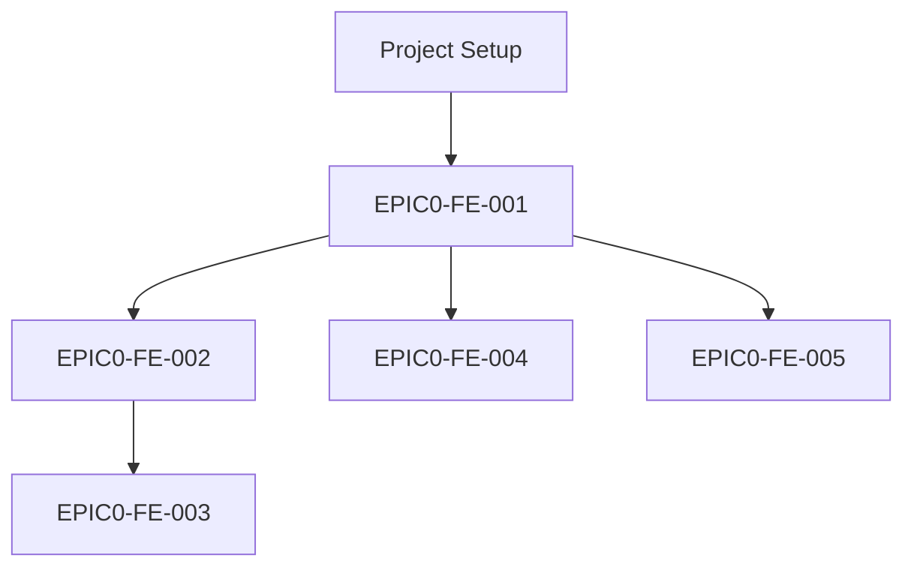
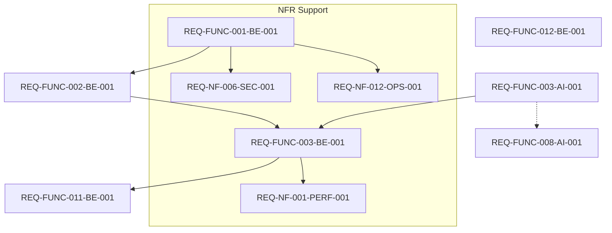

# Integrated Task Tree (WBS) & Dependency Graph (DAG)

## 1. Work Breakdown Structure (WBS)

### **EPIC 0: Frontend PoC Prototype (MVP UI/UX)**
- **Feature: Project & Wizard UI**
  - `EPIC0-FE-001`: 프로젝트 생성 및 Wizard 기본 레이아웃 PoC
  - `EPIC0-FE-002`: Wizard 입력 폼 및 자동저장 UI PoC
- **Feature: Document Generation & View**
  - `EPIC0-FE-003`: 사업계획서 초안 생성 및 뷰어 UI PoC
- **Feature: Financial & PMF UI**
  - `EPIC0-FE-004`: 재무 입력 및 유닛 이코노믹스 시각화 UI PoC
  - `EPIC0-FE-005`: PMF 진단 설문 및 리포트 UI PoC

### **EPIC 1: 과제 통과 Job (To pass the test)**
- **Feature: Core API & Data**
  - `REQ-FUNC-001-BE-001`: 프로젝트 생성 및 템플릿 목록 API
  - `REQ-FUNC-002-BE-001`: Wizard 단계별 답변 저장/조회 API
- **Feature: Document Generation Pipeline**
  - `REQ-FUNC-003-AI-001`: 사업계획서 생성 LLM 엔진 (FastAPI)
  - `REQ-FUNC-003-BE-001`: 사업계획서 생성 오케스트레이션 API (Spring Boot)
- **Feature: Export**
  - `REQ-FUNC-011-BE-001`: HWP/PDF 내보내기 기능

### **EPIC 2: 실패 회피 Job (To avoid failure)**
- **Feature: PMF Diagnosis**
  - `REQ-FUNC-008-AI-001`: PMF 진단 및 리포트 생성 LLM 엔진
- **Feature: Financial Engine**
  - `REQ-FUNC-012-BE-001`: 재무 추정 및 유닛 이코노믹스 계산 엔진

### **EPIC 3: Non-Functional & Operations**
- **Feature: Security & Ops**
  - `REQ-NF-006-SEC-001`: 데이터 저장/전송 암호화 및 보안 구성
  - `REQ-NF-012-OPS-001`: 구조화된 로깅 및 Prometheus/Grafana 모니터링
- **Feature: QA & Performance**
  - `REQ-NF-001-PERF-001`: API 성능 목표 검증을 위한 k6 부하 테스트

---

## 2. Dependency Graph (DAG)

### **Flow 1: Basic Setup & UI PoC**

### **Flow 2: Core Backend & AI Implementation**

### **Execution Strategy**
1. **Phase 1 (PoC)**: `EPIC0-FE-***` Task들을 병렬 실행하여 UI/UX 검증.
2. **Phase 2 (Core BE)**: `REQ-FUNC-001`, `002` 구현 후 DB 스키마 확정.
3. **Phase 3 (AI Pipeline)**: `REQ-FUNC-003-AI` 구현 후 `REQ-FUNC-003-BE` 연동.
4. **Phase 4 (Special Features)**: `PMF(008)`와 `Financial(012)` 병렬 개발.
5. **Phase 5 (NFR & QA)**: 보안, 로깅 적용 및 성능 테스트 수행.

