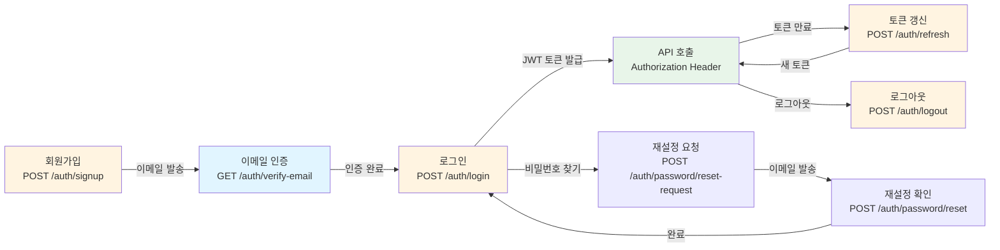
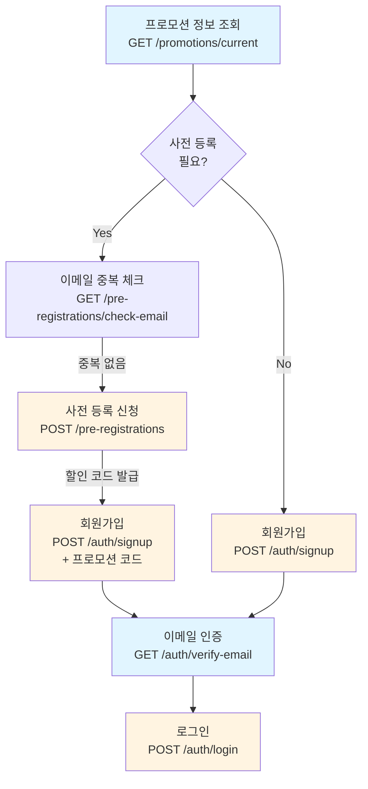
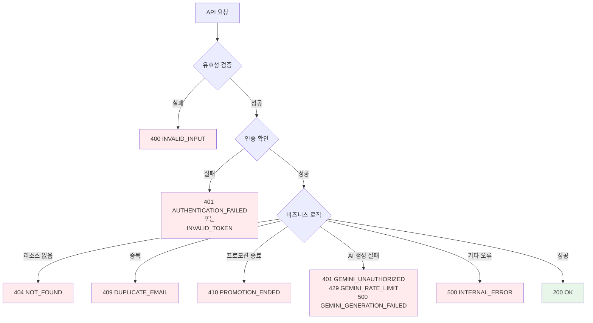

# 백엔드 API 명세서

> **작성일**: 2025년 1월 21일  
> **최종 업데이트**: 2025년 12월 30일 (로그인 기능 확인 및 문서화)  
> **프로젝트**: Makers Round - M.A.K.E.R.S AI 심사위원단  
> **목적**: 현재 구현된 백엔드 API 엔드포인트 현황 분석 및 호출 흐름도 정리

---

## 📋 목차

1. [개요](#개요)
2. [API 엔드포인트 목록](#api-엔드포인트-목록)
3. [컨트롤러별 상세 명세](#컨트롤러별-상세-명세)
4. [API 호출 흐름도](#api-호출-흐름도)
5. [인증 및 보안](#인증-및-보안)
6. [에러 처리](#에러-처리)
7. [구현 상태 요약](#구현-상태-요약)

---

## 개요

본 문서는 Makers Round 백엔드 애플리케이션의 현재 구현 상태를 분석하여 모든 API 엔드포인트를 나열하고, 순차 호출 흐름을 트리 형태로 정리한 명세서입니다.

### 기술 스택
- **프레임워크**: Spring Boot 4.0.0
- **언어**: Java 21 (LTS)
- **데이터베이스**: SQLite (개발/운영/테스트 모두 동일)
- **ORM**: Spring Data JPA (Hibernate) + SQLite Dialect
- **마이그레이션**: Flyway
- **인증**: JWT (Spring Security)
- **AI 통합**: Spring AI (Google Gemini 2.5 Flash Lite)
- **문서화**: Swagger/OpenAPI 3 (SpringDoc)

### API 기본 정보
- **Base URL**: `/api/v1`
- **인증 방식**: JWT Bearer Token
- **응답 형식**: JSON
- **표준 응답 구조**: `ApiResponse<T>`

```json
{
  "success": true,
  "data": { ... },
  "error": null
}
```

---

## API 엔드포인트 목록

### 총 엔드포인트 수: **35개**

| 컨트롤러 | 엔드포인트 수 | 경로 |
|---------|------------|------|
| **AuthController** | 9개 | `/api/v1/auth` |
| **ProjectController** | 6개 | `/api/v1/projects` |
| **WizardController** | 3개 | `/api/v1/projects/{projectId}/wizard` |
| **BusinessPlanController** | 2개 | `/api/v1/business-plan` |
| **EvaluationController** | 3개 | `/api/v1/evaluations` |
| **PreRegistrationController** | 5개 | `/api/v1` |
| **FinancialController** | 1개 | `/api/v1/projects/{projectId}/financial` |
| **ExportController** | 3개 | `/api/v1/projects/{projectId}/export`, `/api/v1/exports` |
| **HealthController** | 2개 | `/api/v1/health` |

---

## 컨트롤러별 상세 명세

### 1. 인증 API (`AuthController`)

**Base Path**: `/api/v1/auth`

| Method | Endpoint | 기능 | 인증 필요 | 상태 |
|--------|----------|------|----------|------|
| `POST` | `/signup` | 회원가입 | ❌ | ✅ |
| `POST` | `/login` | 로그인 | ❌ | ✅ |
| `POST` | `/social/{provider}` | 소셜 로그인 (Google, Kakao, Naver) | ❌ | ✅ |
| `POST` | `/refresh` | 토큰 갱신 | ❌ | ✅ |
| `POST` | `/logout` | 로그아웃 | ✅ | ✅ |
| `GET` | `/verify-email` | 이메일 인증 확인 | ❌ | ✅ |
| `POST` | `/verify-email/resend` | 이메일 인증 재발송 | ❌ | ✅ |
| `POST` | `/password/reset-request` | 비밀번호 재설정 요청 | ❌ | ✅ |
| `POST` | `/password/reset` | 비밀번호 재설정 확인 | ❌ | ✅ |

#### 주요 기능 설명

**회원가입 (`POST /signup`)**
- 이메일/비밀번호 기반 회원가입
- 프로모션 코드 적용 가능
- 요금제 선택 (기본, 플러스, 프로, 프리미엄)
- 응답: 사용자 정보 + JWT 토큰

**로그인 (`POST /login`)**
- 이메일/비밀번호 인증
- 요청: `{ email: string, password: string }`
- 응답: 사용자 정보 + 액세스 토큰 + 리프레시 토큰
- 인증 실패 시 401 에러 반환
- 프론트엔드 `/login` 페이지와 연동

**소셜 로그인 (`POST /social/{provider}`)**
- 지원 제공자: `google`, `kakao`, `naver`
- OAuth 토큰 기반 인증
- 요청: `{ accessToken: string, plan: string, termsAgreed: boolean, privacyAgreed: boolean, marketingConsent: boolean }`
- 신규 사용자 자동 회원가입 처리
- 응답: 사용자 정보 + 토큰 + `isNewUser` 플래그
- 프론트엔드 `/login`, `/signup` 페이지와 연동

**토큰 갱신 (`POST /refresh`)**
- 리프레시 토큰으로 새 액세스 토큰 발급

**이메일 인증 (`GET /verify-email`)**
- URL 파라미터 `token`으로 인증 처리

**비밀번호 재설정**
- 요청: 이메일로 재설정 링크 발송
- 확인: 토큰으로 새 비밀번호 설정

---

### 2. 프로젝트 관리 API (`ProjectController`)

**Base Path**: `/api/v1/projects`

| Method | Endpoint | 기능 | 인증 필요 | 상태 |
|--------|----------|------|----------|------|
| `GET` | `/templates` | 지원 템플릿 목록 조회 | ❌ | ✅ |
| `GET` | `/` | 프로젝트 목록 조회 (페이징) | ✅ | ✅ |
| `GET` | `/{projectId}` | 프로젝트 상세 조회 | ✅ | ✅ |
| `POST` | `/` | 새 프로젝트 생성 | ✅ | ✅ |
| `PUT` | `/{projectId}` | 프로젝트 수정 | ✅ | ✅ |
| `DELETE` | `/{projectId}` | 프로젝트 삭제 | ✅ | ✅ |

#### 주요 기능 설명

**템플릿 목록 조회 (`GET /templates`)**
- 예비창업패키지, 초기창업패키지, 정책자금 템플릿 목록
- 응답: 템플릿 코드, 이름, 설명

**프로젝트 목록 조회 (`GET /`)**
- 페이징 지원 (`page`, `limit`)
- 필터링: `status`, `templateId`
- 인증된 사용자의 프로젝트만 조회

**프로젝트 생성 (`POST /`)**
- 템플릿 선택 필수
- 프로젝트명은 마법사 1단계에서 입력 가능
- 응답: 생성된 프로젝트 정보

**프로젝트 수정 (`PUT /{projectId}`)**
- 이름, 상태, 설명 수정 가능

---

### 3. Wizard API (`WizardController`)

**Base Path**: `/api/v1/projects/{projectId}/wizard`

| Method | Endpoint | 기능 | 인증 필요 | 상태 |
|--------|----------|------|----------|------|
| `PUT` | `/` | Wizard 데이터 저장 (자동 저장) | ✅ | ✅ |
| `GET` | `/` | Wizard 전체 데이터 조회 | ✅ | ✅ |
| `POST` | `/budget/validate` | 자금 집행계획 검증 | ✅ | ✅ |

#### 주요 기능 설명

**Wizard 데이터 저장 (`PUT /`)**
- 단계별 사용자 입력 데이터 저장
- 자동 저장 기능에 사용
- 요청: `stepId`, `data` (JSON)
- 응답: 저장 완료 시간

**Wizard 데이터 조회 (`GET /`)**
- 프로젝트의 모든 단계 데이터 조회
- 응답: 6단계 전체 데이터

**자금 집행계획 검증 (`POST /budget/validate`)**
- 예비창업패키지/초기창업패키지 예산 검증
- 총액, 항목별 금액 검증
- 응답: 검증 결과 및 오류 메시지

---

### 4. 사업계획서 생성 API (`BusinessPlanController`)

**Base Path**: `/api/v1/business-plan`

| Method | Endpoint | 기능 | 인증 필요 | 상태 |
|--------|----------|------|----------|------|
| `POST` | `/generate` | AI 사업계획서 생성 | ✅ | ✅ |
| `GET` | `/{businessPlanId}` | 사업계획서 조회 | ✅ | ✅ |

#### 주요 기능 설명

**사업계획서 생성 (`POST /generate`)**
- Wizard 6단계 데이터 기반 AI 생성
- Google Gemini 2.5 Flash Lite 모델 사용 (Spring AI)
- 요청 구조:
  - `requestInfo`: 프로젝트/사용자 메타 정보
  - `businessPlanData`: 6단계 입력 데이터
  - `generationOptions`: 생성 옵션 (톤, 길이, 포맷, 언어, 섹션)
- 응답: 생성된 섹션 목록, 메타데이터 (토큰 수, 생성 시간 등), 내보내기 옵션
- 비동기 처리: 동기 방식으로 처리되며, Gemini API 호출 시간이 소요됨

**사업계획서 조회 (`GET /{businessPlanId}`)**
- 생성된 사업계획서 ID로 조회
- 응답: 섹션별 내용, 메타데이터

---

### 5. AI 평가 API (`EvaluationController`)

**Base Path**: `/api/v1/evaluations`

| Method | Endpoint | 기능 | 인증 필요 | 상태 |
|--------|----------|------|----------|------|
| `POST` | `/` | AI 평가 요청 | ✅ | ✅ |
| `GET` | `/{evaluationId}/status` | 평가 진행 상태 조회 | ✅ | ✅ |
| `GET` | `/{evaluationId}/result` | 평가 결과 조회 | ✅ | ✅ |

#### 주요 기능 설명

**평가 요청 (`POST /`)**
- 사업계획서에 대한 M.A.K.E.R.S 6대 영역 평가
- 비동기 처리 (202 Accepted)
- 응답: 평가 ID, 상태

**평가 상태 조회 (`GET /{evaluationId}/status`)**
- 진행 중인 평가의 상태 및 진행률
- 상태: `PENDING`, `PROCESSING`, `COMPLETED`, `FAILED`

**평가 결과 조회 (`GET /{evaluationId}/result`)**
- 완료된 평가의 상세 결과
- 6대 영역별 점수, 강점/약점, 개선 권장사항

---

### 6. 사전 등록 프로모션 API (`PreRegistrationController`)

**Base Path**: `/api/v1`

| Method | Endpoint | 기능 | 인증 필요 | 상태 |
|--------|----------|------|----------|------|
| `POST` | `/pre-registrations` | 사전 등록 신청 | ❌ | ✅ |
| `GET` | `/pre-registrations/check-email` | 이메일 중복 체크 | ❌ | ✅ |
| `GET` | `/pre-registrations/{id}` | 등록 정보 조회 | ❌ | ✅ |
| `GET` | `/pre-registrations/code/{discountCode}` | 할인 코드로 조회 | ❌ | ✅ |
| `GET` | `/promotions/current` | 현재 프로모션 정보 | ❌ | ✅ |

#### 주요 기능 설명

**사전 등록 신청 (`POST /pre-registrations`)**
- 프로모션 할인 코드 발급
- Phase A (30% 할인) / Phase B (10% 할인)
- 응답: 할인 코드, 할인율, 할인가

**이메일 중복 체크 (`GET /pre-registrations/check-email`)**
- 사전 등록 이메일 중복 확인
- 쿼리 파라미터: `email`

**프로모션 정보 조회 (`GET /promotions/current`)**
- 현재 활성화된 프로모션 정보
- Phase 정보, 카운트다운, 요금제별 할인가

---

### 7. 재무 시뮬레이션 API (`FinancialController`)

**Base Path**: `/api/v1/projects/{projectId}/financial`

| Method | Endpoint | 기능 | 인증 필요 | 상태 |
|--------|----------|------|----------|------|
| `POST` | `/simulate` | 재무 시뮬레이션 계산 | ✅ | ✅ |

#### 주요 기능 설명

**재무 시뮬레이션 (`POST /simulate`)**
- 3년 예측 재무제표 계산
- 손익분기점 분석
- LTV/CAC 계산
- 요청: 초기 고객 수, 가격, 비용 등
- 응답: 월별/연별 재무 예측, BEP 정보

---

### 8. 문서 내보내기 API (`ExportController`)

**Base Path**: `/api/v1/projects/{projectId}/export`, `/api/v1/exports`

| Method | Endpoint | 기능 | 인증 필요 | 상태 |
|--------|----------|------|----------|------|
| `POST` | `/api/v1/projects/{projectId}/export` | 문서 내보내기 요청 | ✅ | ✅ |
| `GET` | `/api/v1/exports/{exportId}/status` | 내보내기 상태 조회 | ✅ | ✅ |
| `GET` | `/api/v1/exports/{exportId}/download` | 파일 다운로드 | ✅ | ✅ |

#### 주요 기능 설명

**내보내기 요청 (`POST /api/v1/projects/{projectId}/export`)**
- HWP, PDF, DOCX 형식 지원
- 비동기 처리 (202 Accepted)
- 요청: 형식 선택
- 응답: 내보내기 ID, 상태

**내보내기 상태 조회 (`GET /api/v1/exports/{exportId}/status`)**
- 진행 상태 확인
- 상태: `PENDING`, `PROCESSING`, `COMPLETED`, `FAILED`

**파일 다운로드 (`GET /api/v1/exports/{exportId}/download`)**
- 완료된 파일 다운로드
- 한글 파일명 지원 (URL 인코딩)

---

### 9. 헬스체크 API (`HealthController`)

**Base Path**: `/api/v1/health`

| Method | Endpoint | 기능 | 인증 필요 | 상태 |
|--------|----------|------|----------|------|
| `GET` | `/` | 헬스체크 | ❌ | ✅ |
| `GET` | `/ping` | 간단한 헬스체크 | ❌ | ✅ |

#### 주요 기능 설명

**헬스체크 (`GET /`)**
- 서비스 상태 확인
- 응답: 상태, 타임스탬프, 애플리케이션 정보, 버전, 환경

**Ping (`GET /ping`)**
- 로드밸런서/모니터링용 간단한 체크
- 응답: `OK` 상태

---

## API 호출 흐름도

### 전체 사용자 여정 플로우

```mermaid
graph TD
    Start([시작]) --> PreReg[사전 등록<br/>POST /pre-registrations]
    PreReg --> CheckPromo[프로모션 정보 조회<br/>GET /promotions/current]
    
    CheckPromo --> Signup[회원가입<br/>POST /auth/signup]
    Signup --> VerifyEmail[이메일 인증<br/>GET /auth/verify-email]
    
    VerifyEmail --> Login[로그인<br/>POST /auth/login]
    Login --> GetTemplates[템플릿 목록<br/>GET /projects/templates]
    
    GetTemplates --> CreateProject[프로젝트 생성<br/>POST /projects]
    CreateProject --> WizardFlow[Wizard 작성 및 사업계획서 생성<br/>1-6단계 저장 → 예산 검증 → 재무 시뮬레이션 → AI 생성]
    
    WizardFlow --> GetBP[사업계획서 조회<br/>GET /business-plan/{id}]
    
    GetBP --> CreateEval[평가 요청<br/>POST /evaluations]
    CreateEval --> CheckEvalStatus[평가 상태 조회<br/>GET /evaluations/{id}/status]
    CheckEvalStatus -->|진행 중| CheckEvalStatus
    CheckEvalStatus -->|완료| GetEvalResult[평가 결과 조회<br/>GET /evaluations/{id}/result]
    
    GetEvalResult --> CreateExport[내보내기 요청<br/>POST /projects/{id}/export]
    CreateExport --> CheckExportStatus[내보내기 상태 조회<br/>GET /exports/{id}/status]
    CheckExportStatus -->|진행 중| CheckExportStatus
    CheckExportStatus -->|완료| DownloadExport[파일 다운로드<br/>GET /exports/{id}/download]
    
    style PreReg fill:#e1f5ff
    style Signup fill:#fff4e1
    style Login fill:#fff4e1
    style CreateProject fill:#e8f5e9
    style WizardFlow fill:#e8f5e9
    style GetBP fill:#f3e5f5
    style CreateEval fill:#f3e5f5
    style CreateExport fill:#f3e5f5
```

### 인증 플로우



### 사업계획서 작성 플로우

```mermaid
graph TD
    A[템플릿 선택<br/>GET /projects/templates] --> B[프로젝트 생성<br/>POST /projects]
    
    B --> C1[Wizard 1단계<br/>PUT /projects/{id}/wizard<br/>아이디어 개요]
    C1 --> C2[Wizard 2단계<br/>PUT /projects/{id}/wizard<br/>문제 인식]
    C2 --> C3[Wizard 3단계<br/>PUT /projects/{id}/wizard<br/>실현 가능성]
    C3 --> C4[Wizard 4단계<br/>PUT /projects/{id}/wizard<br/>성장 전략]
    C4 --> C5[Wizard 5단계<br/>PUT /projects/{id}/wizard<br/>팀 구성]
    C5 --> C6[Wizard 6단계<br/>PUT /projects/{id}/wizard<br/>재무 계획]
    
    C6 --> D[예산 검증<br/>POST /projects/{id}/wizard/budget/validate]
    D --> E[재무 시뮬레이션<br/>POST /projects/{id}/financial/simulate]
    
    E --> F[사업계획서 생성<br/>POST /business-plan/generate]
    F -->|Gemini API 호출| G[생성 완료]
    G --> H[사업계획서 조회<br/>GET /business-plan/{id}]
    
    H --> I[평가 요청<br/>POST /evaluations]
    I --> J[평가 상태 조회<br/>GET /evaluations/{id}/status]
    J -->|완료| K[평가 결과 조회<br/>GET /evaluations/{id}/result]
    
    K --> L[내보내기 요청<br/>POST /projects/{id}/export]
    L --> M[내보내기 상태 조회<br/>GET /exports/{id}/status]
    M -->|완료| N[파일 다운로드<br/>GET /exports/{id}/download]
    
    style A fill:#e8f5e9
    style B fill:#e8f5e9
    style C1 fill:#e8f5e9
    style C2 fill:#e8f5e9
    style C3 fill:#e8f5e9
    style C4 fill:#e8f5e9
    style C5 fill:#e8f5e9
    style C6 fill:#e8f5e9
    style F fill:#f3e5f5
    style I fill:#f3e5f5
    style L fill:#f3e5f5
```

### 프로모션 및 회원가입 플로우



### 비동기 작업 플로우 (평가/내보내기)

```mermaid
graph LR
    A[작업 요청<br/>POST /evaluations<br/>또는<br/>POST /projects/{id}/export] -->|202 Accepted| B[작업 ID 반환]
    
    B --> C[상태 조회<br/>GET /evaluations/{id}/status<br/>또는<br/>GET /exports/{id}/status]
    
    C -->|PENDING| D[대기 중]
    C -->|PROCESSING| E[처리 중]
    C -->|COMPLETED| F[완료]
    C -->|FAILED| G[실패]
    
    D -->|재조회| C
    E -->|재조회| C
    
    F -->|평가| H[결과 조회<br/>GET /evaluations/{id}/result]
    F -->|내보내기| I[파일 다운로드<br/>GET /exports/{id}/download]
    
    style A fill:#f3e5f5
    style B fill:#fff4e1
    style C fill:#e1f5ff
    style F fill:#e8f5e9
    style G fill:#ffebee
```

---

## 인증 및 보안

### JWT 토큰 기반 인증

1. **로그인** → 액세스 토큰 + 리프레시 토큰 발급
2. **API 호출** → `Authorization: Bearer {accessToken}` 헤더 포함
3. **토큰 만료** → 리프레시 토큰으로 갱신

### 인증 필요 API

**공개 엔드포인트 (인증 불필요):**
- `/api/v1/auth/**` - 모든 인증 관련 API (회원가입, 로그인 등)
- `/api/v1/promotions/**` - 프로모션 정보 조회
- `/api/v1/pre-registrations/**` - 사전 등록 관련 API
- `/api/v1/health/**` - 헬스체크
- `GET /api/v1/projects/templates` - 템플릿 목록 조회
- Swagger UI 관련 경로

**인증 필요 엔드포인트:**
- 나머지 모든 API는 인증이 필요합니다 (`anyRequest().authenticated()`)
- 주요 인증 필요 API:
  - 프로젝트 CRUD (생성, 조회, 수정, 삭제)
  - Wizard 데이터 저장/조회
  - 사업계획서 생성/조회
  - 평가 요청/조회
  - 재무 시뮬레이션
  - 문서 내보내기
  - 로그아웃

### 보안 고려사항

- **비밀번호**: BCrypt 해싱 (BCryptPasswordEncoder 사용)
- **JWT 토큰**: 
  - 액세스 토큰 + 리프레시 토큰 방식
  - JWT Secret은 환경 변수로 관리 (`JWT_SECRET`)
- **이메일 인증**: 토큰 기반 (만료 시간 적용)
- **비밀번호 재설정**: 토큰 기반 (보안을 위해 항상 성공 응답)
- **CORS**: 환경 변수로 허용 Origin 설정 (`CORS_ALLOWED_ORIGINS`)
  - 기본값: `http://localhost:3000,http://localhost:5173`
  - 프로덕션: `https://makersround.world,https://www.makersround.world`
- **세션 관리**: Stateless (JWT 사용으로 세션 미사용)
- **CSRF**: REST API이므로 비활성화

---

## 에러 처리

### 표준 에러 응답 형식

```json
{
  "success": false,
  "data": null,
  "error": {
    "code": "ERROR_CODE",
    "message": "에러 메시지"
  }
}
```

**참고**: 실제 구현에서는 `error.detail` 필드가 없으며, `code`와 `message`만 포함됩니다.

### 주요 예외 처리

| HTTP 상태 | 에러 코드 | 설명 | 예외 클래스 |
|----------|----------|------|------------|
| 400 | `INVALID_INPUT` | 유효성 검증 실패 | `MethodArgumentNotValidException` |
| 400 | `INVALID_TEMPLATE` | 유효하지 않은 템플릿 | `InvalidTemplateException` |
| 400 | `INVALID_ARGUMENT` | 잘못된 인자 | `IllegalArgumentException` |
| 401 | `AUTHENTICATION_FAILED` | 인증 실패 | `AuthenticationException` |
| 401 | `INVALID_TOKEN` | 유효하지 않은 토큰 | `InvalidTokenException` |
| 404 | `NOT_FOUND` | 리소스를 찾을 수 없음 | `ResourceNotFoundException` |
| 409 | `DUPLICATE_EMAIL` | 이메일 중복 | `DuplicateEmailException` |
| 410 | `PROMOTION_ENDED` | 프로모션 종료 | `PromotionEndedException` |
| 401 | `GEMINI_UNAUTHORIZED` | Gemini API 키 누락/만료 | `GeminiGenerationException` |
| 429 | `GEMINI_RATE_LIMIT` | Gemini API 토큰 한도 초과 | `GeminiGenerationException` |
| 500 | `GEMINI_GENERATION_FAILED` | Gemini API 생성 실패 | `GeminiGenerationException` |
| 500 | `INTERNAL_ERROR` | 서버 내부 오류 | `Exception` (기타) |

### 예외 처리 흐름



---

## 구현 상태 요약

### ✅ 완료된 API (35개)

| 컨트롤러 | 완료 | 비고 |
|---------|------|------|
| AuthController | 9/9 | 모든 인증 기능 구현 완료 |
| ProjectController | 6/6 | CRUD 및 템플릿 조회 완료 |
| WizardController | 3/3 | 저장, 조회, 검증 완료 |
| BusinessPlanController | 2/2 | 생성, 조회 완료 (Gemini 연동) |
| EvaluationController | 3/3 | 평가 요청, 상태, 결과 조회 완료 |
| PreRegistrationController | 5/5 | 사전 등록 및 프로모션 완료 |
| FinancialController | 1/1 | 재무 시뮬레이션 완료 |
| ExportController | 3/3 | 내보내기 요청, 상태, 다운로드 완료 |
| HealthController | 2/2 | 헬스체크 완료 |

### 🔄 개선 필요 사항

1. **인증 가드 강화**
   - 현재 대부분의 API가 인증 필요 (SecurityConfig에서 `anyRequest().authenticated()` 설정)
   - 프로젝트 관련 API에 소유자 확인 로직 추가 필요 (현재는 인증만 확인)

2. **에러 처리 일관성**
   - 일부 API의 에러 응답 형식 통일 필요
   - 상세 에러 메시지 제공

3. **비동기 작업 개선**
   - 평가/내보내기 작업의 진행률 표시
   - 타임아웃 처리

4. **API 문서화**
   - Swagger 예시 데이터 보완
   - 요청/응답 스키마 상세화

5. **성능 최적화**
   - 대용량 데이터 페이징 개선
   - 캐싱 전략 적용

### 📊 API별 기능 완성도

| API 그룹 | 기능 완성도 | 백엔드 연동 | 프런트엔드 연동 |
|---------|------------|------------|----------------|
| 인증 | 100% | ✅ | ✅ |
| 프로젝트 관리 | 95% | ✅ | ✅ |
| Wizard | 100% | ✅ | ✅ |
| 사업계획서 생성 | 90% | ✅ | ✅ |
| AI 평가 | 85% | ✅ | ⚠️ 부분 |
| 프로모션 | 100% | ✅ | ✅ |
| 재무 시뮬레이션 | 90% | ✅ | ✅ |
| 문서 내보내기 | 85% | ✅ | ⚠️ 부분 |
| 헬스체크 | 100% | ✅ | N/A |

**범례**:
- ✅ 완료
- ⚠️ 부분 완료
- ❌ 미구현

---

## 참고 자료

- [Spring Boot 공식 문서](https://spring.io/projects/spring-boot)
- [Spring Security 공식 문서](https://spring.io/projects/spring-security)
- [Swagger/OpenAPI 3 스펙](https://swagger.io/specification/)
- [프로젝트 README](../README.md)
- [API 스펙 문서](../API_SPECIFICATION.md)
- [AI 생성 API 스펙](../AI_GENERATION_BE_API_SUBMIT.md)

---

---

## 기술 스택 상세 정보

### 빌드 및 의존성

**Gradle 설정** (`build.gradle`):
- Spring Boot: 4.0.0
- Java: 21 (LTS)
- Spring AI BOM: 2.0.0-M1
- Google Gemini: `spring-ai-starter-model-google-genai`
- JWT: `jjwt-api:0.12.5`
- SpringDoc OpenAPI: 2.7.0
- SQLite JDBC: `org.xerial:sqlite-jdbc`
- Hibernate Community Dialects: SQLite Dialect 지원

### 데이터베이스 설정

**SQLite 사용** (`application.properties`):
- 데이터베이스 파일: `./data/bizplan.db`
- Dialect: `org.hibernate.community.dialect.SQLiteDialect`
- Hibernate DDL: `none` (Flyway가 스키마 관리)
- Connection Pool: HikariCP (최대 1개, SQLite 단일 쓰기 락 특성)
- 마이그레이션: Flyway (`classpath:db/migration/sqlite`)

### AI 설정

**Google Gemini**:
- 모델: `gemini-2.5-flash-lite`
- Temperature: 0.8
- Top-P: 0.9
- API Key: 환경 변수 `GEMINI_API_KEY`로 주입

### 메일 설정

**Resend SMTP**:
- Host: `smtp.resend.com`
- Port: 587
- From: `noreply@send.makersround.world`
- API Key: 환경 변수 `MAIL_PASSWORD` (Resend API Key)

---

**문서 버전**: 1.1  
**최종 업데이트**: 2025년 1월 21일  
**수정 사항**: 실제 구현 코드 기반으로 기술 스택, 인증 설정, 에러 처리 정보 정확히 반영
