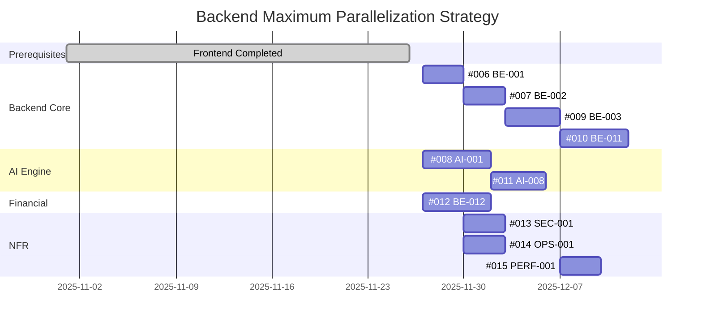

# GitHub Issues Execution Plan

## Overview
이 문서는 `docs/INTEGRATED_WBS_DAG.md`의 의존 관계를 기반으로 작성된 GitHub Issue들의 실행 순서와 병렬 개발 가능 정보를 명시합니다.

## ✅ Status Update (2025-11-26)
**Frontend PoC (EPIC 0) - COMPLETED**
- #001 ~ #005 이슈들은 별도 프로젝트에서 완료됨
- UI/UX 검증 완료로 Backend API 개발 즉시 착수 가능
- 완료된 이슈 파일들은 `completed/` 폴더로 이동됨

**Backend Issues (EPIC 1-3) - CREATED & SCHEDULED**
- GitHub Issues #2 ~ #11 생성 완료 (2025-11-26)
- GitHub Projects 로드맵에 일정 설정 완료
- 시작일: 2025-11-27 (수)
- 예상 완료일: 2025-12-11 (수)

## Issue Numbering Strategy
이슈 번호는 실행 가능 순서를 반영하여 할당되었습니다:
- #001 ~ #005: Frontend PoC (EPIC 0) ✅ **COMPLETED**
- #006 ~ #010: Core Backend & AI Implementation (EPIC 1) 🔄 **IN SCOPE**
- #011 ~ #012: Special Features (EPIC 2) 🔄 **IN SCOPE**
- #013 ~ #015: Non-Functional Requirements (EPIC 3) 🔄 **IN SCOPE**

---

## ✅ Phase 1: Frontend PoC (EPIC 0) - COMPLETED

**상태**: 별도 프로젝트에서 완료됨 (2025-11-26 이전)

완료된 작업:
- ✅ #001 - 프로젝트 생성 및 Wizard 기본 레이아웃 PoC
- ✅ #002 - Wizard 입력 폼 및 자동저장 UI PoC
- ✅ #003 - 사업계획서 초안 생성 및 뷰어 UI PoC
- ✅ #004 - 재무 입력 및 유닛 이코노믹스 시각화 UI PoC
- ✅ #005 - PMF 진단 설문 및 리포트 UI PoC

**결과**:
- Frontend UI/UX 검증 완료
- API Contract 확정
- Backend 개발 즉시 착수 가능

---

## Phase 2: Core Backend & AI Implementation (EPIC 1)
**목표**: 핵심 API 및 AI 파이프라인 구축

### Wave 2.1 (시작점: 2025-11-27)
**병렬 개발 가능한 작업들:**
- **#2 (006)** - 프로젝트 생성 및 템플릿 목록 API
  - GitHub Issue: https://github.com/wild-mental/bizplan-be-inclass/issues/2
  - 일정: 2025-11-27 ~ 2025-11-29 (3일)
  - 의존성: TASK-BE-INIT (프로젝트 초기 설정 완료 가정)
  - 병렬 가능: #4 (008), #8 (012)
  - 활성화: #3 (007), #9 (013), #10 (014)

- **#4 (008)** - 사업계획서 생성 LLM 엔진 구현
  - GitHub Issue: https://github.com/wild-mental/bizplan-be-inclass/issues/4
  - 일정: 2025-11-27 ~ 2025-12-01 (5일)
  - 의존성: 없음
  - 병렬 가능: #2 (006), #8 (012)
  - 활성화: #5 (009), #7 (011)

- **#8 (012)** - 재무 추정 및 유닛 이코노믹스 계산 엔진
  - GitHub Issue: https://github.com/wild-mental/bizplan-be-inclass/issues/8
  - 일정: 2025-11-27 ~ 2025-12-01 (5일)
  - 의존성: 없음 (Pure Logic)
  - 병렬 가능: #2 (006), #4 (008) (모든 작업과 병렬 가능)

### Wave 2.2 (Wave 2.1의 #2 완료 후: 2025-11-30)
- **#3 (007)** - Wizard 단계별 답변 저장/조회 API
  - GitHub Issue: https://github.com/wild-mental/bizplan-be-inclass/issues/3
  - 일정: 2025-11-30 ~ 2025-12-02 (3일)
  - 의존성: #2 (006)
  - 병렬 가능: #4 (008), #8 (012) (진행 중인 작업)
  - 활성화: #5 (009)

**병렬 작업 (NFR):**
- **#9 (013)** - 데이터 저장/전송 암호화 및 보안 구성
  - GitHub Issue: https://github.com/wild-mental/bizplan-be-inclass/issues/9
  - 일정: 2025-11-30 ~ 2025-12-02 (3일)
  - 의존성: #2 (006)
  - 병렬 가능: #10 (014)

- **#10 (014)** - 구조화된 로깅 및 Prometheus/Grafana 모니터링
  - GitHub Issue: https://github.com/wild-mental/bizplan-be-inclass/issues/10
  - 일정: 2025-11-30 ~ 2025-12-02 (3일)
  - 의존성: #2 (006)
  - 병렬 가능: #9 (013)

### Wave 2.3 (Wave 2.2의 #3 + Wave 2.1의 #4 완료 후: 2025-12-03)
- **#5 (009)** - 사업계획서 생성 오케스트레이션 API
  - GitHub Issue: https://github.com/wild-mental/bizplan-be-inclass/issues/5
  - 일정: 2025-12-03 ~ 2025-12-06 (4일)
  - 의존성: #3 (007), #4 (008)
  - 병렬 가능: #8 (012) (진행 중일 경우)
  - 활성화: #6 (010), #11 (015)

### Wave 2.4 (Wave 2.3의 #5 완료 후: 2025-12-07)
- **#6 (010)** - HWP/PDF 내보내기 기능
  - GitHub Issue: https://github.com/wild-mental/bizplan-be-inclass/issues/6
  - 일정: 2025-12-07 ~ 2025-12-11 (5일)
  - 의존성: #5 (009)
  - 병렬 가능: #7 (011) (AI 작업), #8 (012) (진행 중일 경우)

---

## Phase 3: Special Features (EPIC 2)
**목표**: PMF 진단 등 부가 기능 개발

### Wave 3.1 (Wave 2.1의 #4 완료 후: 2025-12-02)
- **#7 (011)** - PMF 진단 및 리포트 생성 LLM 엔진
  - GitHub Issue: https://github.com/wild-mental/bizplan-be-inclass/issues/7
  - 일정: 2025-12-02 ~ 2025-12-05 (4일)
  - 의존성: #4 (008) (FastAPI 환경 공유)
  - 병렬 가능: #5 (009), #6 (010), #8 (012)

---

## Phase 4: Non-Functional Requirements (EPIC 3)
**목표**: 보안, 모니터링, 성능 검증

### Wave 4.1 (Wave 2.1의 #2 완료 후: 2025-11-30)
**이미 Wave 2.2에서 병렬 처리됨** ✅
- #9 (013) - 보안 구성 (2025-11-30 ~ 2025-12-02)
- #10 (014) - 모니터링 구축 (2025-11-30 ~ 2025-12-02)

### Wave 4.2 (Wave 2.3의 #5 완료 후: 2025-12-07)
- **#11 (015)** - API 성능 목표 검증을 위한 k6 부하 테스트
  - GitHub Issue: https://github.com/wild-mental/bizplan-be-inclass/issues/11
  - 일정: 2025-12-07 ~ 2025-12-09 (3일)
  - 의존성: #5 (009) (주요 API 구현 완료 필요)
  - 병렬 가능: #6 (010), #7 (011), #8 (012)

---

## Execution Strategies

### Strategy 1: Maximum Parallelization (Backend)
**목표**: 최단 기간 내 Backend 개발 완료 (팀 리소스 충분 시)



**인력 배치 (최대 4-5명 병렬):**
- **Week 1 (Day 1-3):**
  - Developer 1: #006 (Backend Core)
  - Developer 2: #008 (AI Engine)
  - Developer 3: #012 (Financial)

- **Week 1 (Day 4-7):**
  - Developer 1: #007 → #013, #014 (병렬)
  - Developer 2: #009 준비 (AI와 협업)
  - Developer 3: #012 계속

- **Week 2:**
  - Developer 1: #013, #014 완료 → Frontend 통합 테스트
  - Developer 2: #009 → #010
  - Developer 3: #011 (PMF) → #015 (Performance Test)

### Strategy 2: Sequential with Limited Resources (Backend)
**목표**: 2-3명의 소규모 Backend 팀으로 안정적 개발

```
Week 1:
  Day 1-3: #006 (Backend Base)
  Day 4-7: #007 (Wizard API)

Week 2:
  Day 1-3: #008 (AI Engine)
  Day 4-7: #012 (Financial, 병렬 가능 시)

Week 3:
  Day 1-3: #009 (Orchestration)
  Day 4-7: #010 (Export)

Week 4:
  Day 1-3: #011 (PMF) + #013 (Security, 병렬)
  Day 4-7: #014 (Monitoring)

Week 5:
  Day 1-3: #015 (Performance Test)
  Day 4-7: Frontend 통합 테스트 & QA
```

### Strategy 3: Feature-First (Backend)
**목표**: 기능별 완결도 우선 (데모/통합 테스트 준비 시)

1. **Sprint 1 (Core Backend API):** #006 → #007
2. **Sprint 2 (Document Generation Pipeline):** #008 → #009 → #010
3. **Sprint 3 (Financial & PMF):** #012, #011 (병렬)
4. **Sprint 4 (NFR & Integration):** #013 → #014 → #015 → Frontend 통합 테스트

---

## Dependency Matrix (Backend Issues Only)

| GitHub Issue | Task ID | Depends On | Enables | Parallelizable With | Schedule |
|--------------|---------|------------|---------|---------------------|----------|
| #2 | 006 | BE-INIT | #3, #9, #10 | #4, #8 | 11/27-11/29 |
| #3 | 007 | #2 | #5 | #4, #8 | 11/30-12/02 |
| #4 | 008 | - | #5, #7 | #2, #3, #8 | 11/27-12/01 |
| #5 | 009 | #3, #4 | #6, #11 | #8 | 12/03-12/06 |
| #6 | 010 | #5 | - | #7, #8 | 12/07-12/11 |
| #7 | 011 | #4 | - | #5, #6, #8 | 12/02-12/05 |
| #8 | 012 | - | - | All | 11/27-12/01 |
| #9 | 013 | #2 | - | #10 | 11/30-12/02 |
| #10 | 014 | #2 | - | #9 | 11/30-12/02 |
| #11 | 015 | #5 | - | #6, #7, #8 | 12/07-12/09 |

**Notes**: 
- Frontend 이슈(#001-#005)는 이미 완료되어 의존성에서 제외됨
- GitHub Issue 번호는 실제 저장소의 Issue 번호
- Task ID는 문서상의 원래 번호
- Schedule은 GitHub Projects 로드맵에 설정된 실제 일정

---

## Critical Path Analysis

**최단 완료 경로 (Critical Path):**
```
#2 (006) → #3 (007) → #5 (009) → #6 (010)
11/27      11/30      12/03      12/07      → 12/11 완료
```

**실제 설정된 일정:**
- 시작일: 2025-11-27 (수)
- 완료일: 2025-12-11 (수)
- 총 기간: **15일 (약 3주)**
- 실 작업일: 약 10-12일 (주말 제외)

**예상 소요 기간 (순차 실행 시):**
- #2 (006): 3일
- #3 (007): 3일
- #5 (009): 4일 (AI #4(008)과 동기화 필요)
- #6 (010): 5일
- #11 (015): 3일
- **Total: 18일** (약 3.5주)

**병렬화를 통한 실제 일정 (확정):**
- Wave 1 (11/27-12/01): 5일 - #2, #4, #8 병렬
- Wave 2 (11/30-12/02): 3일 - #3, #9, #10 병렬
- Wave 3 (12/02-12/06): 5일 - #5, #7 병렬
- Wave 4 (12/07-12/11): 5일 - #6, #11 병렬
- **Total: 15일** (약 3주) - 병렬화로 3일 단축

---

## Recommended Execution Order (Backend Only)

### ✅ Prerequisites
Frontend PoC (#001-#005) 완료됨 → Backend 개발 즉시 시작 가능

### For Backend-Focused Team (Recommended)
1. **Phase 1**: #006 → #007 (Core Backend Setup)
2. **Phase 2**: #008 (AI Engine, 병렬 시작 가능)
3. **Phase 3**: #009 → #010 (Document Pipeline)
4. **Phase 4**: #012 (Financial, 병렬 가능)
5. **Phase 5**: #013, #014 (Security & Monitoring, 병렬)
6. **Phase 6**: #015 (Performance Test)

### For Small Backend Team (2-3명)
1. **Sprint 1**: #006 → #007 (Core Backend Setup)
2. **Sprint 2**: #008 (AI Engine) + #012 (Financial, 병렬)
3. **Sprint 3**: #009 → #010 (Document Pipeline)
4. **Sprint 4**: #011 (PMF) + #013, #014 (NFR, 병렬)
5. **Sprint 5**: #015 (Performance Test) + Frontend 통합 테스트

---

## Notes
- **병렬 개발 시 주의사항**:
  - API 인터페이스(Contract)를 사전에 정의 (#007 ↔ #009, #008 ↔ #009)
  - Mock/Stub을 활용하여 의존성 없이 개발 진행
  - 통합 테스트는 각 Wave 완료 후 수행

- **리스크 관리**:
  - #008 (AI Engine): LLM 연동 시 예상치 못한 이슈 가능 → 버퍼 2일 추가 권장
  - #010 (HWP Export): 라이브러리 호환성 이슈 → PoC 선행 권장
  - #012 (Financial): 복잡한 비즈니스 로직 → 단위 테스트 철저히

- **우선순위** (Backend):
  - Must: #006~#010, #013 (총 6개)
  - Should: #011, #014, #015 (총 3개)
  - MVP 최소 범위: #006, #007, #008, #009 (Core API + Document Generation)

---

## GitHub Project Integration

### Project Information
- **Project Name**: BizPlan-Backend-Project
- **Project ID**: `PVT_kwHOBWaOeM4BJJCo`
- **Roadmap View**: https://github.com/users/wild-mental/projects/10/views/4

### Created Issues
All 10 backend issues have been created and scheduled:
- Issues #2-#11 created on 2025-11-26
- Start/Target dates set in GitHub Projects
- Issues tracked in Project Roadmap view

### Issue Management
**Important**: Issue creation and management should be performed by AI Agent using GitHub CLI directly, not through shell scripts. See `.cursor/rules/202-github-issue-handling.mdc` for guidelines.

---

## Version History
- v1.2 (2025-11-26): Added actual schedule, GitHub Project integration, and confirmed dates
- v1.1 (2025-11-26): Updated to reflect EPIC0 (Frontend) completion - Backend focus only
- v1.0 (2025-11-26): Initial execution plan based on INTEGRATED_WBS_DAG.md

