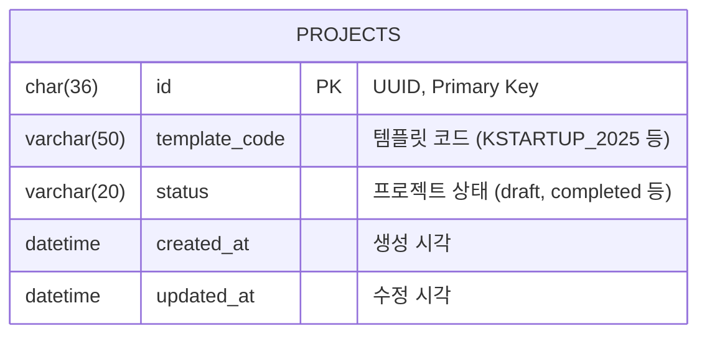
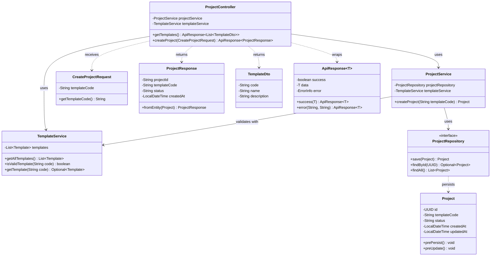
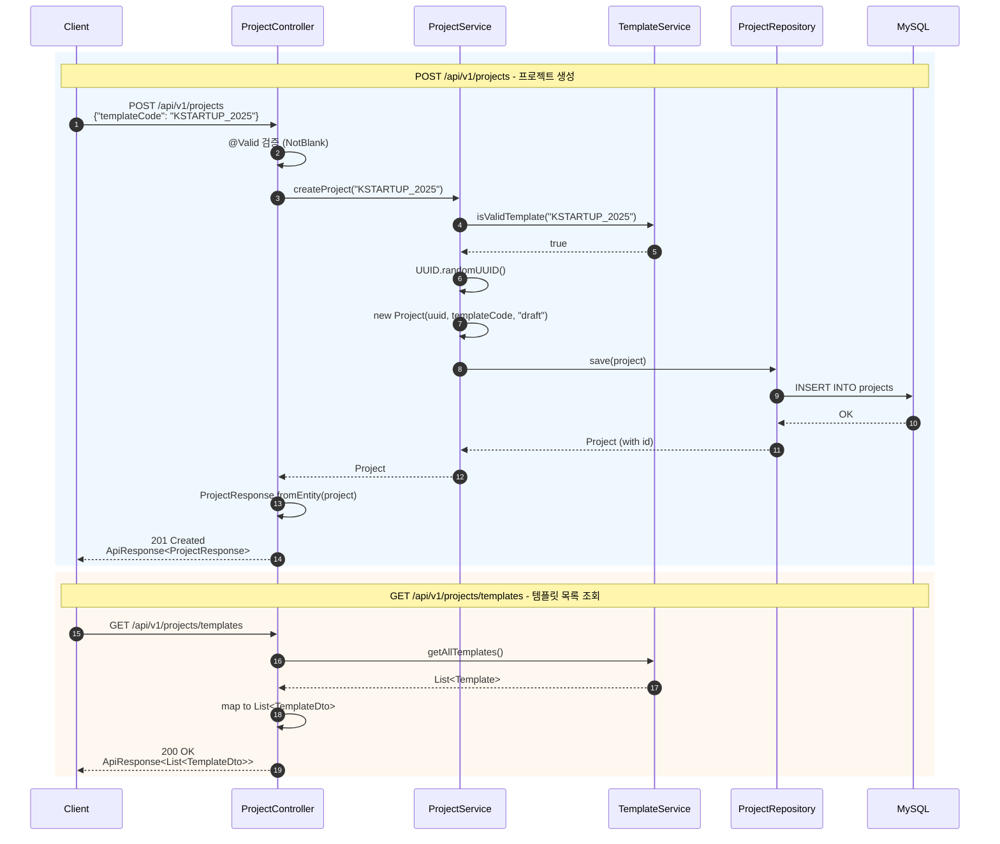

# [#006] 프로젝트 생성 및 템플릿 목록 API 구현

## Labels
`epic:EPIC_1_PASS_THE_TEST`, `type:backend`, `component:api`, `priority:Must`, `effort:M`

## Description
사용자가 프로젝트를 생성할 때 선택할 수 있는 템플릿 목록을 제공하고, 선택된 템플릿으로 프로젝트 엔티티를 생성하는 백엔드 API를 구현합니다.

## Scope
- `GET /api/v1/projects/templates`: 지원 템플릿 목록 반환
- `POST /api/v1/projects`: 프로젝트 생성 (Project 엔티티, 초기 메타데이터)

### Out of Scope
- 사용자 인증 로직(User ID는 토큰에서 추출 또는 Mocking)

## Requirements
- **템플릿 데이터**: 하드코딩된 목록 제공 ('KSTARTUP_2025', 'BANK_LOAN_2025' 등)
- **프로젝트 생성**: UUID 생성, `created_at` 설정, `status='draft'` 설정

## Technical Stack
- Java 21 + Spring Boot 4.0.0
- Spring Data JPA
- MySQL 8.x
- Lombok (Boilerplate 감소)
- Jakarta Validation (입력 검증)

---

## Architecture Design

### ERD (Entity Relationship Diagram)

데이터베이스 관점에서 데이터가 어떻게 저장되는지를 정의합니다.



**테이블 상세 정의:**

| Column | Type | Constraints | Description |
|--------|------|-------------|-------------|
| `id` | CHAR(36) | PK, NOT NULL | UUID 형식의 프로젝트 고유 식별자 |
| `template_code` | VARCHAR(50) | NOT NULL | 사용된 템플릿 코드 |
| `status` | VARCHAR(20) | NOT NULL, DEFAULT 'draft' | 프로젝트 상태 |
| `created_at` | DATETIME | NOT NULL | 레코드 생성 시각 |
| `updated_at` | DATETIME | NOT NULL | 레코드 수정 시각 |

**인덱스:**
- `PRIMARY KEY (id)`
- `INDEX idx_projects_status (status)` - 상태별 조회 최적화
- `INDEX idx_projects_created_at (created_at)` - 생성일 정렬 최적화

> **Note:** 템플릿은 하드코딩된 Enum으로 관리하므로 별도 테이블 없음 (MVP 단계)

---

### CLD (Class/Component Logic Diagram)

백엔드 서버 관점에서 데이터가 어떻게 가공되는지를 정의합니다.



**계층별 책임:**

| Layer | Component | Responsibility |
|-------|-----------|----------------|
| **Interface** | `ProjectController` | HTTP 요청/응답 처리, DTO 변환 |
| **Logic** | `ProjectService` | 비즈니스 로직, 트랜잭션 관리 |
| **Logic** | `TemplateService` | 템플릿 유효성 검증, 목록 제공 |
| **Data** | `ProjectRepository` | JPA 데이터 액세스 |
| **Entity** | `Project` | DB 테이블 매핑, Audit 필드 |

---

### Data Flow Diagram

요청부터 응답까지의 데이터 흐름을 시각화합니다.



---

## ORM Implementation (Object-Relational Mapping)

### 1. Entity Layer (데이터 저장 구조)

**파일: `src/main/java/vibe/bizplan/entity/Project.java`**

```java
package vibe.bizplan.entity;

import jakarta.persistence.*;
import lombok.*;
import org.hibernate.annotations.UuidGenerator;

import java.time.LocalDateTime;
import java.util.UUID;

/**
 * 프로젝트 엔티티
 * 사용자가 생성한 사업계획서 프로젝트를 나타냅니다.
 */
@Entity
@Table(name = "projects", indexes = {
    @Index(name = "idx_projects_status", columnList = "status"),
    @Index(name = "idx_projects_created_at", columnList = "created_at")
})
@Getter
@NoArgsConstructor(access = AccessLevel.PROTECTED)
@AllArgsConstructor
@Builder
public class Project {

    @Id
    @UuidGenerator
    @Column(name = "id", columnDefinition = "CHAR(36)")
    private UUID id;

    @Column(name = "template_code", nullable = false, length = 50)
    private String templateCode;

    @Column(name = "status", nullable = false, length = 20)
    @Builder.Default
    private String status = "draft";

    @Column(name = "created_at", nullable = false, updatable = false)
    private LocalDateTime createdAt;

    @Column(name = "updated_at", nullable = false)
    private LocalDateTime updatedAt;

    /**
     * 엔티티 저장 전 호출 - 생성/수정 시각 자동 설정
     */
    @PrePersist
    protected void onCreate() {
        this.createdAt = LocalDateTime.now();
        this.updatedAt = LocalDateTime.now();
    }

    /**
     * 엔티티 수정 전 호출 - 수정 시각 자동 갱신
     */
    @PreUpdate
    protected void onUpdate() {
        this.updatedAt = LocalDateTime.now();
    }

    /**
     * 프로젝트 생성을 위한 정적 팩토리 메서드
     */
    public static Project createWithTemplate(String templateCode) {
        return Project.builder()
                .templateCode(templateCode)
                .status("draft")
                .build();
    }
}
```

---

### 2. Repository Layer (데이터 액세스)

**파일: `src/main/java/vibe/bizplan/repository/ProjectRepository.java`**

```java
package vibe.bizplan.repository;

import org.springframework.data.jpa.repository.JpaRepository;
import org.springframework.stereotype.Repository;
import vibe.bizplan.entity.Project;

import java.util.List;
import java.util.UUID;

/**
 * 프로젝트 Repository
 * Spring Data JPA가 구현체를 자동 생성합니다.
 */
@Repository
public interface ProjectRepository extends JpaRepository<Project, UUID> {
    
    /**
     * 상태별 프로젝트 조회
     * @param status 프로젝트 상태 (draft, completed 등)
     * @return 해당 상태의 프로젝트 목록
     */
    List<Project> findByStatus(String status);
    
    /**
     * 템플릿 코드별 프로젝트 조회
     * @param templateCode 템플릿 코드
     * @return 해당 템플릿으로 생성된 프로젝트 목록
     */
    List<Project> findByTemplateCode(String templateCode);
}
```

---

### 3. Service Layer (비즈니스 로직)

**파일: `src/main/java/vibe/bizplan/service/TemplateService.java`**

```java
package vibe.bizplan.service;

import lombok.Getter;
import lombok.RequiredArgsConstructor;
import org.springframework.stereotype.Service;

import java.util.List;
import java.util.Optional;

/**
 * 템플릿 서비스
 * 하드코딩된 템플릿 목록을 관리합니다.
 */
@Service
public class TemplateService {

    /**
     * 지원되는 템플릿 목록 (하드코딩)
     */
    private static final List<Template> TEMPLATES = List.of(
        new Template("KSTARTUP_2025", "예비창업패키지", "중소벤처기업부 예비창업패키지 양식"),
        new Template("BANK_LOAN_2025", "은행 대출용 사업계획서", "시중은행 창업대출 심사용 양식"),
        new Template("IR_PITCH_2025", "투자유치용 IR 자료", "시드/시리즈 A 투자유치용 양식")
    );

    /**
     * 전체 템플릿 목록 조회
     */
    public List<Template> getAllTemplates() {
        return TEMPLATES;
    }

    /**
     * 템플릿 코드 유효성 검증
     */
    public boolean isValidTemplate(String code) {
        return TEMPLATES.stream()
                .anyMatch(t -> t.getCode().equals(code));
    }

    /**
     * 코드로 템플릿 조회
     */
    public Optional<Template> getTemplate(String code) {
        return TEMPLATES.stream()
                .filter(t -> t.getCode().equals(code))
                .findFirst();
    }

    /**
     * 템플릿 정보를 담는 내부 레코드
     */
    @Getter
    @RequiredArgsConstructor
    public static class Template {
        private final String code;
        private final String name;
        private final String description;
    }
}
```

**파일: `src/main/java/vibe/bizplan/service/ProjectService.java`**

```java
package vibe.bizplan.service;

import lombok.RequiredArgsConstructor;
import org.springframework.stereotype.Service;
import org.springframework.transaction.annotation.Transactional;
import vibe.bizplan.entity.Project;
import vibe.bizplan.exception.InvalidTemplateException;
import vibe.bizplan.repository.ProjectRepository;

import java.util.UUID;

/**
 * 프로젝트 서비스
 * 프로젝트 생성 및 관리 비즈니스 로직을 담당합니다.
 */
@Service
@RequiredArgsConstructor
@Transactional(readOnly = true)
public class ProjectService {

    private final ProjectRepository projectRepository;
    private final TemplateService templateService;

    /**
     * 새 프로젝트 생성
     * 
     * @param templateCode 사용할 템플릿 코드
     * @return 생성된 프로젝트 엔티티
     * @throws InvalidTemplateException 지원하지 않는 템플릿 코드인 경우
     */
    @Transactional
    public Project createProject(String templateCode) {
        // 1. 템플릿 유효성 검증
        if (!templateService.isValidTemplate(templateCode)) {
            throw new InvalidTemplateException(templateCode);
        }

        // 2. 프로젝트 엔티티 생성
        Project project = Project.createWithTemplate(templateCode);

        // 3. DB 저장 및 반환
        return projectRepository.save(project);
    }

    /**
     * 프로젝트 ID로 조회
     */
    public Project getProject(UUID projectId) {
        return projectRepository.findById(projectId)
                .orElseThrow(() -> new IllegalArgumentException(
                    "프로젝트를 찾을 수 없습니다: " + projectId));
    }
}
```

---

### 4. Controller Layer (인터페이스)

**파일: `src/main/java/vibe/bizplan/controller/ProjectController.java`**

```java
package vibe.bizplan.controller;

import jakarta.validation.Valid;
import lombok.RequiredArgsConstructor;
import org.springframework.http.HttpStatus;
import org.springframework.http.ResponseEntity;
import org.springframework.web.bind.annotation.*;
import vibe.bizplan.dto.ApiResponse;
import vibe.bizplan.dto.CreateProjectRequest;
import vibe.bizplan.dto.ProjectResponse;
import vibe.bizplan.dto.TemplateDto;
import vibe.bizplan.entity.Project;
import vibe.bizplan.service.ProjectService;
import vibe.bizplan.service.TemplateService;

import java.util.List;

/**
 * 프로젝트 컨트롤러
 * 프로젝트 생성 및 템플릿 조회 API를 제공합니다.
 */
@RestController
@RequestMapping("/api/v1/projects")
@RequiredArgsConstructor
public class ProjectController {

    private final ProjectService projectService;
    private final TemplateService templateService;

    /**
     * 지원 템플릿 목록 조회
     * GET /api/v1/projects/templates
     */
    @GetMapping("/templates")
    public ResponseEntity<ApiResponse<List<TemplateDto>>> getTemplates() {
        List<TemplateDto> templates = templateService.getAllTemplates().stream()
                .map(t -> new TemplateDto(t.getCode(), t.getName(), t.getDescription()))
                .toList();
        
        return ResponseEntity.ok(ApiResponse.success(templates));
    }

    /**
     * 새 프로젝트 생성
     * POST /api/v1/projects
     */
    @PostMapping
    public ResponseEntity<ApiResponse<ProjectResponse>> createProject(
            @Valid @RequestBody CreateProjectRequest request) {
        
        Project project = projectService.createProject(request.getTemplateCode());
        ProjectResponse response = ProjectResponse.fromEntity(project);
        
        return ResponseEntity
                .status(HttpStatus.CREATED)
                .body(ApiResponse.success(response));
    }
}
```

---

### 5. DTO Classes

**파일: `src/main/java/vibe/bizplan/dto/ApiResponse.java`**

```java
package vibe.bizplan.dto;

import com.fasterxml.jackson.annotation.JsonInclude;
import lombok.AllArgsConstructor;
import lombok.Getter;

/**
 * 표준 API 응답 래퍼
 * 모든 API 응답은 이 형식을 따릅니다.
 */
@Getter
@AllArgsConstructor
@JsonInclude(JsonInclude.Include.NON_NULL)
public class ApiResponse<T> {
    
    private final boolean success;
    private final T data;
    private final ErrorInfo error;

    /**
     * 성공 응답 생성
     */
    public static <T> ApiResponse<T> success(T data) {
        return new ApiResponse<>(true, data, null);
    }

    /**
     * 에러 응답 생성
     */
    public static <T> ApiResponse<T> error(String code, String message) {
        return new ApiResponse<>(false, null, new ErrorInfo(code, message));
    }

    @Getter
    @AllArgsConstructor
    public static class ErrorInfo {
        private final String code;
        private final String message;
    }
}
```

**파일: `src/main/java/vibe/bizplan/dto/CreateProjectRequest.java`**

```java
package vibe.bizplan.dto;

import jakarta.validation.constraints.NotBlank;
import lombok.Getter;
import lombok.NoArgsConstructor;

/**
 * 프로젝트 생성 요청 DTO
 */
@Getter
@NoArgsConstructor
public class CreateProjectRequest {
    
    @NotBlank(message = "templateCode는 필수 항목입니다.")
    private String templateCode;
}
```

**파일: `src/main/java/vibe/bizplan/dto/ProjectResponse.java`**

```java
package vibe.bizplan.dto;

import lombok.Builder;
import lombok.Getter;
import vibe.bizplan.entity.Project;

import java.time.LocalDateTime;

/**
 * 프로젝트 응답 DTO
 */
@Getter
@Builder
public class ProjectResponse {
    
    private final String projectId;
    private final String templateCode;
    private final String status;
    private final LocalDateTime createdAt;

    /**
     * Entity -> DTO 변환
     */
    public static ProjectResponse fromEntity(Project project) {
        return ProjectResponse.builder()
                .projectId(project.getId().toString())
                .templateCode(project.getTemplateCode())
                .status(project.getStatus())
                .createdAt(project.getCreatedAt())
                .build();
    }
}
```

**파일: `src/main/java/vibe/bizplan/dto/TemplateDto.java`**

```java
package vibe.bizplan.dto;

import lombok.AllArgsConstructor;
import lombok.Getter;

/**
 * 템플릿 응답 DTO
 */
@Getter
@AllArgsConstructor
public class TemplateDto {
    private final String code;
    private final String name;
    private final String description;
}
```

---

### 6. Exception Handling

**파일: `src/main/java/vibe/bizplan/exception/InvalidTemplateException.java`**

```java
package vibe.bizplan.exception;

/**
 * 유효하지 않은 템플릿 코드 예외
 */
public class InvalidTemplateException extends RuntimeException {
    
    public InvalidTemplateException(String templateCode) {
        super("지원하지 않는 템플릿 코드입니다: " + templateCode);
    }
}
```

**파일: `src/main/java/vibe/bizplan/exception/GlobalExceptionHandler.java`**

```java
package vibe.bizplan.exception;

import org.springframework.http.HttpStatus;
import org.springframework.http.ResponseEntity;
import org.springframework.web.bind.MethodArgumentNotValidException;
import org.springframework.web.bind.annotation.ExceptionHandler;
import org.springframework.web.bind.annotation.RestControllerAdvice;
import vibe.bizplan.dto.ApiResponse;

/**
 * 전역 예외 처리기
 */
@RestControllerAdvice
public class GlobalExceptionHandler {

    /**
     * Validation 에러 처리 (400 Bad Request)
     */
    @ExceptionHandler(MethodArgumentNotValidException.class)
    public ResponseEntity<ApiResponse<Void>> handleValidationException(
            MethodArgumentNotValidException ex) {
        
        String message = ex.getBindingResult().getFieldErrors().stream()
                .findFirst()
                .map(error -> error.getDefaultMessage())
                .orElse("유효성 검사 실패");
        
        return ResponseEntity
                .status(HttpStatus.BAD_REQUEST)
                .body(ApiResponse.error("INVALID_INPUT", message));
    }

    /**
     * 유효하지 않은 템플릿 예외 처리 (400 Bad Request)
     */
    @ExceptionHandler(InvalidTemplateException.class)
    public ResponseEntity<ApiResponse<Void>> handleInvalidTemplateException(
            InvalidTemplateException ex) {
        
        return ResponseEntity
                .status(HttpStatus.BAD_REQUEST)
                .body(ApiResponse.error("INVALID_TEMPLATE", ex.getMessage()));
    }
}
```

---

## API Specification

### GET /api/v1/projects/templates

**Description:** 지원되는 템플릿 목록을 조회합니다.

**Response (200 OK):**
```json
{
  "success": true,
  "data": [
    {
      "code": "KSTARTUP_2025",
      "name": "예비창업패키지",
      "description": "중소벤처기업부 예비창업패키지 양식"
    },
    {
      "code": "BANK_LOAN_2025",
      "name": "은행 대출용 사업계획서",
      "description": "시중은행 창업대출 심사용 양식"
    }
  ],
  "error": null
}
```

**Logic Steps:**
1. 요청 수신
2. 하드코딩된 템플릿 목록 조회 (TemplateService)
3. 응답 반환 (200 OK)

---

### POST /api/v1/projects

**Description:** 선택된 템플릿으로 새 프로젝트를 생성합니다.

#### Request Body

| Field | Type | Required | Validation |
|-------|------|----------|------------|
| `templateCode` | String | Yes | @NotBlank, 지원 템플릿 목록에 존재해야 함 |

**Request Example:**
```json
{
  "templateCode": "KSTARTUP_2025"
}
```

#### Response (201 Created)
```json
{
  "success": true,
  "data": {
    "projectId": "550e8400-e29b-41d4-a716-446655440000",
    "templateCode": "KSTARTUP_2025",
    "status": "draft",
    "createdAt": "2025-11-26T10:00:00Z"
  },
  "error": null
}
```

#### Error Responses

**400 Bad Request - Validation Error:**
```json
{
  "success": false,
  "data": null,
  "error": {
    "code": "INVALID_INPUT",
    "message": "templateCode는 필수 항목입니다."
  }
}
```

**400 Bad Request - Invalid Template:**
```json
{
  "success": false,
  "data": null,
  "error": {
    "code": "INVALID_TEMPLATE",
    "message": "지원하지 않는 템플릿 코드입니다: INVALID_CODE"
  }
}
```

**Logic Steps:**
1. 요청 수신 및 Request Body 파싱
2. Validation 수행 (`templateCode` @NotBlank 체크)
3. `templateCode` 유효성 검증 (지원 템플릿 목록에 존재 여부)
4. UUID 생성 (`UUID.randomUUID()`)
5. Project 엔티티 생성 (`status='draft'`, `createdAt=now`)
6. DB 저장 (`ProjectRepository.save()`)
7. 응답 반환 (201 Created + projectId)

---

## Implementation Steps (3-Tier 순서)

### Phase 1: Data Layer (Repository)
1. **의존성 추가**: `build.gradle`에 필요한 라이브러리 추가
2. **DB 설정**: `application.properties`에 MySQL 연결 정보 설정
3. **Project Entity**: JPA 엔티티 클래스 구현
4. **ProjectRepository**: Spring Data JPA Repository 인터페이스 생성

### Phase 2: Logic Layer (Service)
5. **TemplateService**: 템플릿 목록 관리 및 유효성 검증 로직
6. **ProjectService**: 프로젝트 생성 비즈니스 로직
7. **Exception Classes**: 커스텀 예외 클래스 구현

### Phase 3: Interface Layer (Controller)
8. **DTO Classes**: Request/Response DTO 구현
9. **ApiResponse**: 표준 응답 래퍼 클래스 구현
10. **ProjectController**: REST 엔드포인트 구현
11. **GlobalExceptionHandler**: 전역 예외 처리기 구현

### Phase 4: Testing & Verification
12. **단위 테스트**: Service 레이어 테스트
13. **통합 테스트**: Controller 레이어 API 테스트
14. **API 문서화**: Swagger/OpenAPI 연동 (선택)

---

## File Structure

```
src/main/java/vibe/bizplan/
├── BizplanBeInclassApplication.java
├── controller/
│   └── ProjectController.java
├── service/
│   ├── ProjectService.java
│   └── TemplateService.java
├── repository/
│   └── ProjectRepository.java
├── entity/
│   └── Project.java
├── dto/
│   ├── ApiResponse.java
│   ├── CreateProjectRequest.java
│   ├── ProjectResponse.java
│   └── TemplateDto.java
└── exception/
    ├── InvalidTemplateException.java
    └── GlobalExceptionHandler.java
```

---

## Difficulty Assessment
- **난이도**: 중 (Medium)
- **예상 소요 시간**: 3일
- **주요 작업량**:
  - Phase 1 (Data Layer): 0.5일
  - Phase 2 (Logic Layer): 0.5일
  - Phase 3 (Interface Layer): 0.5일
  - Phase 4 (Testing): 1.5일

## Acceptance Criteria
- [ ] 필요한 의존성이 `build.gradle`에 추가됨
- [ ] MySQL DB가 실행 중이고 연결 설정 완료
- [ ] `GET /api/v1/projects/templates` 호출 시 템플릿 목록 반환
- [ ] `POST /api/v1/projects` 호출 시 DB에 새 Project 레코드 생성
- [ ] API 호출 시 201 상태 코드와 함께 표준 응답 포맷으로 프로젝트 정보 반환
- [ ] 잘못된 `templateCode` 입력 시 400 에러 응답 반환
- [ ] 단위 테스트 통과율 80% 이상

## Dependencies
- TASK-BE-INIT (프로젝트 초기 설정 - 완료 가정)

## Enables
- #007, #013, #014

## Related Requirements
REQ-FUNC-001

